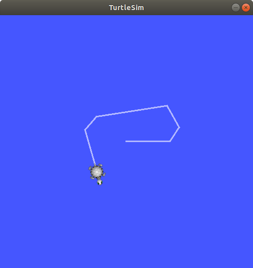

# Lab 1: Introduction to ROS and TurtleSim

Seneca Polytechnic 
AIG240 Robotics

## Introduction

In this course, you'll be using the [JetAuto Pro ROS Robot Car](https://www.hiwonder.com/products/jetauto-pro?variant=40040875229271&srsltid=AfmBOopGiD-7htdo9MYV2dDxaC_hu9xuS887mAu3p1SuU0YDl9iVj6Da) as the base platform for development. The JetAuto robot uses the NVIDIA Jetson Nano embedded computing board as its controller. The robot comes with various accessories and add-ons for robotics applications, all of which can be controlled using the [Robot Operating System (ROS)](https://www.ros.org/) as the core framework.

However, before working with the physical robot, we will first learn how to use ROS and [Gazebo](https://gazebosim.org/) to simulate the robot and its environment. During the design phase of any robotics project, testing your code and robot functionality in a simulated environment is a crucial part of the development cycle. In some industrial settings (such as robots deployed in remote locations), physical access to the robot may be limited or impossible. In such cases, simulating the robot's actions and performance is the only way to ensure mission success.

### What is ROS?

Per the ROS website:

> The Robot Operating System (ROS) is a set of software libraries and tools that help you build robot applications. From drivers to state-of-the-art algorithms, and with powerful developer tools, ROS has what you need for your next robotics project. And it's all open source.

The above description may sound abstract, so let’s look at a practical example.

***Figure 1.1** Robotics Arm (Source: Hiwonder)*

A robotics system usually consists of various sensors, actuators, and controllers. The system in Figure 1.1 includes the following:

1. A servo gripper at the end of the arm  
2. A servo revolute joint that rotates the gripper  
3. A servo revolute joint for link 3–2  
4. A servo revolute joint for link 4–3  
5. A servo revolute joint for link 5–4  
6. A servo revolute joint that rotates the base  
7. A stationary camera supervising the workspace  

To pick up an object, the robot might:

- Use the camera to determine the object's position  
- Command the arm to move to the object's location  
- Once in position, command the gripper to close around the object  

To achieve this, we break the process into smaller tasks. In robotics, this typically means having independent low-level control loops, each responsible for a single function:

- A control loop for each joint that, given a position or velocity command, controls the power applied to the joint motor based on position sensor measurements  
- A control loop for the gripper, which turns the gripper motor on and off and adjusts power to avoid crushing objects  
- A sensing loop that reads images from the camera  

These low-level loops are then coordinated via a high-level supervisory control module:

- Request an image from the camera sensing loop  
- Use a vision algorithm to calculate the target object's location  
- Calculate joint angles to move the arm to the location  
- Send commands to the joint control loops  
- Signal the gripper control loop to close  

An important feature of this architecture is modularity: the supervisor need not understand the implementation of any control loop. It communicates with each via simple control messages. This abstraction makes it easier to reuse code across platforms.

In ROS, each control loop is implemented as a **node**—a software process performing a specific task. Nodes communicate by publishing and subscribing to **topics** or using **services** (concepts covered later in this lab).

Nodes can be written in many languages (including Python and C++), and ROS handles data conversion and message passing seamlessly.

We can visualize this system using a **computation graph**:

***Figure 1.2** Example computation graph*

- Nodes are shown as ovals (e.g., `/usb_cam` or `/ar_track_alvar`)  
- Topics are shown as rectangles (e.g., `/usb_cam/camera_info`, `/usb_cam/image_raw`)  
- Arrows show the direction of data flow between nodes and topics. For example, `/usb_cam` publishes to `/usb_cam/camera_info` and `/usb_cam/image_raw`, which are subscribed to by `/ar_track_alvar`  
- Services, not shown here, are represented by dotted arrows

## Procedures

### Ubuntu Installation

For this course, we'll use **Ubuntu 18.04 LTS (Bionic Beaver)**. If you're using Windows or macOS, ensure Ubuntu 18.04 is running on a virtual machine, as this matches the JetAuto platform.

You can also refer to this [Installation Video](https://youtu.be/kZuOnZjDDss).

1. Install Ubuntu 18.04 on your computer or virtual machine (VirtualBox recommended).

    - OS Image: [ubuntu-18.04.6-desktop-amd64.iso](https://www.releases.ubuntu.com/bionic/ubuntu-18.04.6-desktop-amd64.iso)  
    - Allocate at least 4 CPU cores, 4 GB RAM, and 20 GB of storage to emulate a [Jetson Nano](https://developer.nvidia.com/embedded/jetson-nano)  
    - Use the username: **jetauto** to maintain code compatibility  

2. If using an ARM-based laptop, install the [ARM64 server image](https://cdimage.ubuntu.com/releases/18.04.6/release/) and then manually add a desktop interface

3. On Windows, some students have used `wsl` to run Ubuntu and ROS

### Add `jetauto` User as Sudoer and Install Desktop GUI

**Run in the Ubuntu Machine**

1. Depending on how the Ubuntu OS was installed, your active user ``jetauto`` may not have sudoer permission. If that's the case, you'll need to switch to the ``root`` user and add ``jetauto`` into the sudoer group

    Open a terminal and switch to the `root` user:

        su root

    Change the `jetauto` user into the sudoer group:

        usermod -a -G sudo jetauto

2. Log out then re-login (or restart) to the ``jetauto`` user. You may now verify if you have sudo permission by:

        sudo -v

    If it gives you a permission error, that means you are not a sudoer yet

3. Now that you are a sudoer, let's perform a system update and upgrade. **DO NOT upgrade to Ubuntu 20 or higher when prompted**—we need Ubuntu 18:

        sudo apt update && sudo apt upgrade

4. If you didn't install the desktop version of Ubuntu, install the Ubuntu GNOME desktop (or similar). We need the GUI:

        sudo apt install ubuntu-gnome-desktop

    After the install is complete, restart the system:

        reboot

    The Ubuntu GNOME desktop should run after the system restart

5. Lastly, ensure you can open a terminal from the GUI. If the terminal fails to start, go to Settings and change the language to "English (CA)" and save. You may switch it back afterward. It's a bug with a missing attribute in the Ubuntu desktop

### ROS Installation

**Run in the Ubuntu Machine**

**Note:** You may also follow the official [ROS Melodic Installation](https://wiki.ros.org/melodic/Installation/Ubuntu) instructions to install the ROS Desktop-Full package into your system. **You do NOT need to install the Bare Bones or Individual Package**

1. Set up your computer to accept software from packages.ros.org.

        sudo sh -c 'echo "deb http://packages.ros.org/ros/ubuntu $(lsb_release -sc) main" > /etc/apt/sources.list.d/ros-latest.list'

1. Set up your keys

    If you haven't already installed curl:

        sudo apt install curl

    Add the key:

        curl -s https://raw.githubusercontent.com/ros/rosdistro/master/ros.asc | sudo apt-key add -

1. Now, make sure your system package index is up-to-date:

        sudo apt update

1. Next, we'll install the full desktop version of ROS with rqt, rviz, robot-generic libraries, 2D/3D simulators and 2D/3D perception, etc.:

        sudo apt install ros-melodic-desktop-full

    Later, if you need to install other ROS packages, you can use the following command: ``sudo apt install ros-melodic-<PACKAGE>`` e.g. ``sudo apt install ros-melodic-slam-gmapping``. To find available packages, use: ``apt search ros-melodic``

1. Since we want our terminal to load the ROS source every time it starts, add the `source` command to `.bashrc` so the ROS environment variables are automatically added to your bash session every time a new shell is launched:

        echo "source /opt/ros/melodic/setup.bash" >> ~/.bashrc

    Or use `vi`, `vim`, or any editor to open `~/.bashrc` in your user's home directory then add the following code at the end.

        source /opt/ros/melodic/setup.bash

1. After ROS installation and setting up `.bashrc`, we'll also want to install a few tools to help build ROS packages.

    To install this tool and other dependencies for building ROS packages, run:

        sudo apt install python-rosdep python-rosinstall python-rosinstall-generator python-wstool build-essential

1. Before you can use many ROS tools, you will need to initialize `rosdep`. `rosdep` enables you to easily install system dependencies for source you want to compile and is required to run some core components in ROS. With the following, you can initialize `rosdep`.

        sudo rosdep init
        rosdep update

    Since Melodic is no longer a supported distro, we'll need to explicitly update it.

        rosdep update --rosdistro=melodic

### Turtlesim Test

Turtlesim is a lightweight simulator for learning ROS. It illustrates what ROS does at the most basic level to give you an idea of what you will do with a real robot or a robot simulation later on.

#### Using roscore

1. `roscore` is the first thing you should run when using ROS. It starts the ROS master node, the centralized server for managing nodes, topics, services, communication, and more. It is typically the main entry point and the first for running any ROS system. In a terminal, run:

        roscore

    You will see something similar to:

        ... logging to ~/.ros/log/9cf88ce4-b14d-11df-8a75-00251148e8cf/roslaunch-machine_name-13039.log
        Checking log directory for disk usage. This may take awhile.
        Press Ctrl-C to interrupt
        Done checking log file disk usage. Usage is <1GB.

        started roslaunch server http://machine_name:33919/
        ros_comm version 1.4.7

        SUMMARY
        ======

        PARAMETERS
        * /rosversion
        * /rosdistro

        NODES

        auto-starting new master
        process[master]: started with pid [13054]
        ROS_MASTER_URI=http://machine_name:11311/

        setting /run_id to 9cf88ce4-b14d-11df-8a75-00251148e8cf
        process[rosout-1]: started with pid [13067]
        started core service [/rosout]

#### Using rosrun

1. The command `rosrun` allows you to use the package name to directly run a node within a package (without having to know the package path). Usage: `rosrun [package_name] [node_name]`.  
   So now we can run the `turtlesim_node` in the turtlesim package. In a new terminal:

        rosrun turtlesim turtlesim_node

    The simulator window should appear, with a random turtle in the center.

    

    ***Figure 1.3** TurtleSim*

1. Open a new terminal to run a new node to control the turtle in the first node. If you didn't add the `source` code in `.bashrc`, you'll need to source ROS again.

        rosrun turtlesim turtle_teleop_key

    At this point you should have four windows open: a terminal running `roscore`, a terminal running `turtlesim_node`, a terminal running `turtle_teleop_key`, and the "turtlesim window". Arrange these windows so that you can see the turtlesim window but also have the terminal running `turtle_teleop_key` active so that you can control the turtle in turtlesim.

1. Use the arrow keys on your keyboard to control the turtle. It will move around the screen, using its attached “pen” to draw the path it followed so far.

    

    ***Figure 1.4** TurtleSim*

### Use rqt

rqt is a graphical user interface (GUI) tool for ROS. Everything done in rqt can be done on the command line, but rqt provides a more user-friendly way to manipulate ROS elements.

1. Open a new terminal and run rqt.

        rqt

1. When running rqt for the first time, the window will be blank. No worries; just select **Plugins > Services > Service Caller** from the menu bar at the top.

    

    ***Figure 1.5** rqt*

1. Use the refresh button to the left of the Service dropdown list to ensure all the services of your turtlesim node are available.

1. Click on the Service dropdown list to see turtlesim’s services and select the `/spawn` service to spawn another turtle.

    Give the new turtle a unique name, like `turtle2`, by double-clicking between the empty single quotes in the **Expression** column. You can see that this expression corresponds to the value of **name** and is of type **string**.

    Next, enter some valid coordinates at which to spawn the new turtle, like x = `1.0` and y = `1.0`.

    

    ***Figure 1.5** rqt spawn*

    If you try to spawn a new turtle with the same name as an existing turtle, you will get an error message in the terminal running `turtlesim_node`.

1. Call the `spawn` service by clicking the Call button on the upper right side of the rqt window. You should see a new turtle (with a random design) spawn at the coordinates you input for x and y.

1. Refresh the service list in rqt and you will also see that now there are services related to the new turtle, `/turtle2/...`, in addition to `/turtle1/...`.

1. Next, we'll give `turtle1` a unique pen using the `/set_pen` service and have `turtle1` draw with a distinct red line by changing the value of **r** to `255`, and the value of **width** to `5`. Don’t forget to call the service after updating the values.

    

    ***Figure 1.6** rqt set_pen*

1. Return to the terminal where `turtle_teleop_key` is running and press the arrow keys, you will see `turtle1`’s pen has changed.

    

    ***Figure 1.7** TurtleSim Turtles*

### Remapping `turtle_teleop_key`

1. To control `turtle2`, you need a second teleop node. However, if you try to run the same command as before, you will notice that this one also controls `turtle1`. The way to change this behavior is by remapping the `cmd_vel` topic and provide a new name for the node.

    In a new terminal, source ROS, and run:

        rosrun turtlesim turtle_teleop_key turtle1/cmd_vel:=turtle2/cmd_vel __name:=teleop_turtle2

    Now, you can move `turtle2` when this terminal is active, and `turtle1` when the other terminal running `turtle_teleop_key` is active.

    

    ***Figure 1.8** TurtleSim Turtles*

## Lab Exercise

1. Create a third turtle that you can control in turtlesim with green (g = 255) as the pen line colour.

## Reference

- [ROS Tutorials](https://wiki.ros.org/ROS/Tutorials)
- EECS 106A Labs