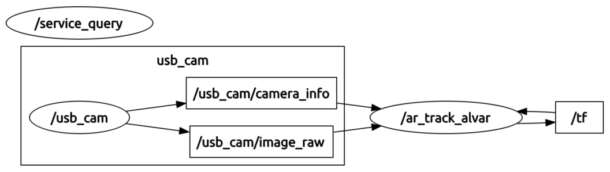

# Lab 1 : Intro to ROS and TurtleSim

Seneca Polytechnic 
AIG240 Robotics

## Introduction

In this course, you'll be using the [JetAuto Pro ROS Robot Car](https://www.hiwonder.com/products/jetauto-pro?variant=40040875229271&srsltid=AfmBOopGiD-7htdo9MYV2dDxaC_hu9xuS887mAu3p1SuU0YDl9iVj6Da) as the base platform for development. The JetAuto robot uses the NVIDIA Jetson Nano embedded computing boards as its controller. The robot comes with various accessories and add-ons for robotics applications and they can all be controlled using [Robot Operating System (ROS)](https://www.ros.org/) as the backbone application. However, before jumping into using the physical, we will be learning how to use ROS and [Gazebo](https://gazebosim.org/) to simulate the robot and it's environmental. During the design phase of any robotics project, testing the functionality of your code and the robot is a key step of project cycle. In some industrial settings (such as robot in remote location), physical access to the robot are limited or impossible. In such a case, simulating the robot's action and performance is the only way to ensure mission success.

### What is ROS?

Per the ROS website:

> The Robot Operating System (ROS) is a set of software libraries and tools that help you build robot applications. From drivers to state-of-the-art algorithms, and with powerful developer tools, ROS has what you need for your next robotics project. And it's all open source.

The above statement isn't exactly clear so let's take a look at an example.

***Figure 1.1** Robotics Arm (Source: Hiwonder)*

A robotics system usually consist of various sensors, actuators, and controllers. The system in Figure 1.1 have the following:

1. a servo gripper at the end of the arm
1. a servo revolute joint that rotate the gripper
1. a servo revolute joint for link 3-2
1. a servo revolute joint for link 4-3
1. a servo revolute joint for link 5-4
1. a servo revolute joint that rotate the base
1. a stationary camera supervise the workspace

To pick up an object, the robot might:

- Use the camera to measure the position of the object
- Command the arm to move toward the object's position
- Once in position, command the gripper to close around the object

To approach this problem, we'll need to break it down into smaller task. In robotics, that usually means having independent low-level control loops, each controlling a single task.

- A control loop for each joint that, given a position or velocity command, controls the power applied to the joint motor based on position sensor measurements at the joint.
- Another control loop that receives commands to open or close the gripper, then switches the gripper motor on and off while controlling the power applied to it to avoid crushing objects.
- A sensing loop that reads individual images from the camera

With the above structure, we then couple these low-level loops together via a single high-level module that performs supervisory control of the whole system:

- Query the camera sensing loop for a single image
- Use a vision algorithm to compute the location of the object to grasp
- Compute the joint angles necessary to move the manipulator arm to this location
- Sends position commands to each of the joint control loops telling them to move to this position
- Signal the gripper control loop to close the gripper to grab the object

An important feature of this design is that the supervisor need not know the implementation details of any of the low-level control loops: it interacts with each only through simple control messages. This encapsulation of functionality makes the system modular, making it easier to reuse code across robotic platforms.

In ROS, each individual control loop is known as a node, an individual software process that performs a specific task. Nodes exchange control messages, sensor readings, and other data by publishing or subscribing to topics or by sending requests to services offered by other nodes (these concepts will be discussed in detail later in the lab).

Nodes can be written in a variety of languages (including Python and C++), and ROS transparently handles the details of converting between different datatypes, exchanging messages between nodes, etc.

We can then visualize the communication and interaction between different software components via a computation graph, where:

***Figure 1.2** Example computation graph*

- Nodes are represented by ovals (ie. `/usb_cam` or `/ar_track_alvar`).
- Topics are represented by rectangles (ie. `/usb_cam/camera_info` and `/usb_cam/image_raw`).
- The flow of information to and from topics and represented by arrows. In the above example, `/usb_cam publishes`
to the topics `/usb_cam/camera_info` and `/usb_cam/image_raw`, which are subscribed to by `/ar_track_alvar`.
- While not shown here, services would be represented by dotted arrows.

## Procedures

### Ubuntu Installation

For this course, we'll be using the following software environment **Ubuntu 18.04 LTS (Bionic Beaver)**. If you are using Windows or macOS, ensure Ubuntu 18.04 LTS (Bionic Beaver) and ROS Melodic is installed as it is the version used by the JetAuto robot.

1. Install Ubuntu 18.04 LTS (Bionic Beaver) on your computer or virtual machine (VirtualBox recommended).

    - OS Image: [ubuntu-18.04.6-desktop-amd64.iso](https://www.releases.ubuntu.com/bionic/ubuntu-18.04.6-desktop-amd64.iso)
    - Ensure there are at least 2 processor core, 4GB of memory, and 20GB of disk drive
    - Ensure to use username: **jetauto** as this is the username used by the JetAuto robot to maximize compartibility of code

### ROS Installation

1. Follow the [ROS Melodic Installation](https://wiki.ros.org/melodic/Installation/Ubuntu) instruction to install the ROS Desktop-Full package into your system. **You do NOT need to install the Bare Bones or Individual Package**

1. Since we want our terminal to load the ROS source everytime it start, add the `source` command to `.bashrc`.

        echo "source /opt/ros/melodic/setup.bash" >> ~/.bashrc

    Or use `vi`, `vim` or any editor to open `~/.bashrc` in your user's home directory then add the following code at the end.

        source /opt/ros/melodic/setup.bash
        
1. After ROS installation and setting up `.bashrc`, we'll also want to install a few tools to help build ROS packages.

    To install this tool and other dependencies for building ROS packages, run:

        sudo apt install python-rosdep python-rosinstall python-rosinstall-generator python-wstool build-essential

1. Before you can use many ROS tools, you will need to initialize `rosdep`. `rosdep` enables you to easily install system dependencies for source you want to compile and is required to run some core components in ROS. With the following, you can initialize `rosdep`.

        sudo rosdep init
        rosdep update

    Since Melodic is not longer a support distro, we'll need to explicitly update it.

        rosdep update --rosdistro=melodic

### Turtlesim Test

Turtlesim is a lightweight simulator for learning ROS. It illustrates what ROS does at the most basic level to give you an idea of what you will do with a real robot or a robot simulation later on.

#### Using roscore

1. `roscore` is the first thing you should run when using ROS. It starts the ROS master node, the centralized server for managing nodes, topics, services, communication, and more. It is typically the main entry point and the first for running any ROS system. In a terminal, run:

        roscore

    You will see something similar to:

        ... logging to ~/.ros/log/9cf88ce4-b14d-11df-8a75-00251148e8cf/roslaunch-machine_name-13039.log
        Checking log directory for disk usage. This may take awhile.
        Press Ctrl-C to interrupt
        Done checking log file disk usage. Usage is <1GB.

        started roslaunch server http://machine_name:33919/
        ros_comm version 1.4.7

        SUMMARY
        ======

        PARAMETERS
        * /rosversion
        * /rosdistro

        NODES

        auto-starting new master
        process[master]: started with pid [13054]
        ROS_MASTER_URI=http://machine_name:11311/

        setting /run_id to 9cf88ce4-b14d-11df-8a75-00251148e8cf
        process[rosout-1]: started with pid [13067]
        started core service [/rosout]

#### Using rosrun

1. The command `rosrun` allows you to use the package name to directly run a node within a package (without having to know the package path). Usage: `rosrun [package_name] [node_name]`.

    So now we can run the `turtlesim_node` in the turtlesim package. In a new terminal:

        rosrun turtlesim turtlesim_node

    The simulator window should appear, with a random turtle in the center.

    

    ***Figure 1.3** TurtleSim*

1. Open a new terminal to run a new node to control the turtle in the first node. If you didn't add the `source` code in `.bashrc`, you'll need to source ROS again.

        rosrun turtlesim turtle_teleop_key

    At this point you should have four windows open: a terminal running `roscore`, a terminal running `turtlesim_node`, a terminal running `turtle_teleop_key` and the "turtlesim window". Arrange these windows so that you can see the turtlesim window, but also have the terminal running `turtle_teleop_key` active so that you can control the turtle in turtlesim.

1. Use the arrow keys on your keyboard to control the turtle. It will move around the screen, using its attached “pen” to draw the path it followed so far.

    

    ***Figure 1.4** TurtleSim*

### Use rqt

rqt is a graphical user interface (GUI) tool for ROS. Everything done in rqt can be done on the command line, but rqt provides a more user-friendly way to manipulate ROS elements.

1. Open a new terminal and run rqt.

        rqt

1. When running rqt for the first time, the window will be blank. No worries; just select **Plugins > Services > Service Caller** from the menu bar at the top.

    

    ***Figure 1.5** rqt*

1. Use the refresh button to the left of the Service dropdown list to ensure all the services of your turtlesim node are available.

1. Click on the Service dropdown list to see turtlesim’s services, and select the `/spawn` service to spawn another turtle.

    Give the new turtle a unique name, like `turtle2`, by double-clicking between the empty single quotes in the **Expression** column. You can see that this expression corresponds to the value of **name** and is of type **string**.

    Next enter some valid coordinates at which to spawn the new turtle, like x = `1.0` and y = `1.0`.

    

    ***Figure 1.5** rqt spawn*

    If you try to spawn a new turtle with the same name as an existing turtle, you will get an error message in the terminal running `turtlesim_node`.
    
1. Call the `spawn` service by clicking the Call button on the upper right side of the rqt window. You should see a new turtle (with a random design) spawn at the coordinates you input for x and y.

1. Refresh the service list in rqt and you will also see that now there are services related to the new turtle, `/turtle2/...`, in addition to `/turtle1/...`.

1. Next, we'll give `turtle1` an unique pen using the `/set_pen` service and have `turtle1` draw with a distinct red line by changing the value of **r** to `255`, and the value of **width** to `5`. Don’t forget to call the service after updating the values.

    

    ***Figure 1.6** rqt set_pen*

1. Return to the terminal where `turtle_teleop_key` is running and press the arrow keys, you will see `turtle1`’s pen has changed.

    

    ***Figure 1.7** TurtleSim Turtles*

### Remapping `turtle_teleop_key`

1. To control `turtle2`, you need a second teleop node. However, if you try to run the same command as before, you will notice that this one also controls turtle1. The way to change this behavior is by remapping the `cmd_vel` topic.

    In a new terminal, source ROS, and run:

        rosrun turtlesim turtle_teleop_key turtle1/cmd_vel:=turtle2/cmd_vel

    Now, you can move `turtle2` when this terminal is active, and `turtle1` when the other terminal running `turtle_teleop_key` is active.

    

    ***Figure 1.8** TurtleSim Turtles*

## Lab Exercise

1. Create a third turtle that you can control in turtlesim with green (g = 255) as the pen line colour.

## Reference

- [ROS Tutorials](https://wiki.ros.org/ROS/Tutorials)
- EECS 106A Labs