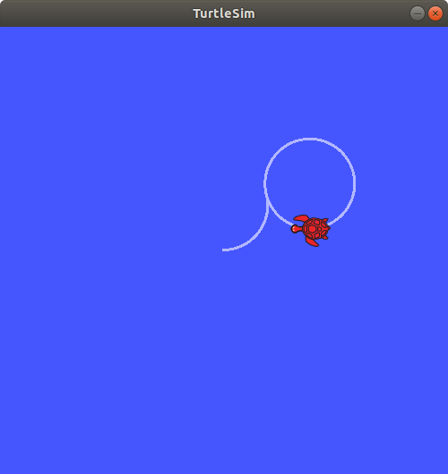

# Lab 2 : ROS Nodes, Topics, Services, Parameters, Actions

Seneca Polytechnic 
AIG240 Robotics

## Introduction

An overview of some computation graph concepts:

- **Node:** an executable representing an individual ROS software process
- **Topic:** nodes can publish messages to a topic and/or subscribe to a topic to receive messages
- **Message:** a ROS datatype used to exchange data between nodes

### Nodes in ROS

Each node in ROS should be responsible for a single, modular purpose, i.e., controlling the wheel motors or publishing the sensor data from a laser range-finder. Each node can send and receive data from other nodes via topics, services, actions, or parameters. A full robotic system is comprised of many nodes working in concert.

***Figure 2.1** ROS Nodes Graph*

### Topics in ROS

ROS breaks complex systems down into many modular nodes. Topics are a vital element of the ROS graph that act as a bus for nodes to exchange messages.

***Figure 2.2** ROS Topic Graph*

A node may publish data to any number of topics and simultaneously have subscriptions to any number of topics.

***Figure 2.3** ROS Topic Graph (One-to-Many)*

Topics are one of the main ways in which data is moved between nodes and therefore between different parts of the system.

### Service in ROS

Services are another method of communication for nodes in the ROS graph. Services are based on a call-and-response model versus the publisher-subscriber model of topics. While topics allow nodes to subscribe to data streams and get continual updates, services only provide data when they are specifically called by a client.

***Figure 2.4** ROS Service Single Node*

***Figure 2.5** ROS Service Multiple Node*

### Parameter in ROS

A parameter is a configuration value of a node. You can think of parameters as node settings. A node can store parameters as integers, floats, booleans, strings, and lists. In ROS, each node maintains its own parameters.

## Procedures

### Understanding ROS Nodes

1. Open a terminal to run ROS using `roscore` and another terminal to run turtlesim. The command `rosrun [package_name] [node_name]` launches an executable from a package. We need the package name to be `turtlesim` and the executable name to be `turtlesim_node`.

        roscore

    Then, in a new terminal:
    
        rosrun turtlesim turtlesim_node

1. To find the node names, the `rosnode list` can be used. `rosnode list` will show you the names of all running nodes. This is especially useful when you want to interact with a node, or when you have a system running many nodes and need to keep track of them.

    Open a new terminal while `/rosout` and `/turtlesim` is still running and enter the following command:

        rosnode list
    
    The terminal will return the node name:

        /rosout
        /turtlesim

1. Open another new terminal and start the teleop node with the command:

        rosrun turtlesim turtle_teleop_key

1. Return to the terminal where you ran `rosnode list` and run it again. You will now see the names of three active nodes:

        /rosout
        /turtlesim
        /teleop_turtle

1. [Remapping](https://wiki.ros.org/Remapping%20Arguments) allows you to reassign default node properties, like node name, topic names, service names, etc., to custom values. Let’s open another `/turtlesim` node and reassign the name to `/my_turtle`. In a new terminal, run the following command:

        rosrun turtlesim turtlesim_node __name:=my_turtle

1. Return to the terminal where you ran `rosnode list`, and run it again, you will see four node names:

        /my_turtle
        /rosout
        /turtlesim
        /teleop_turtle

1. To access more information about a node, use the following command: `rosnode info [node_name]`. To examine your latest node, `my_turtle`, run the following command:

        rosnode info /my_turtle

    `rosnode info` returns a list of subscribers, publishers, services, and actions. i.e. the ROS graph connections that interact with that node. The output should look like this:

        --------------------------------------------------------------------------------
        Node [/my_turtle]
        Publications:
         * /rosout [rosgraph_msgs/Log]
         * /turtle1/color_sensor [turtlesim/Color]
         * /turtle1/pose [turtlesim/Pose]

        Subscriptions:
         * /turtle1/cmd_vel [geometry_msgs/Twist]

        Services:
         * /clear
         * /kill
         * /my_turtle/get_loggers
         * /my_turtle/set_logger_level
         * /reset
         * /spawn
         * /turtle1/set_pen
         * /turtle1/teleport_absolute
         * /turtle1/teleport_relative

1. Run the same command on the `/teleop_turtle` node and see the difference.

### Understanding ROS Topics

1. Close the `/my_turtle` terminal so only the `/turtlesim` and `/teleop_turtle` are open.

1. We will use `rqt_graph` to visualize the changing nodes and topics, as well as the connections between them. Open a new terminal and enter the command:

        rqt_graph

    You can also open rqt_graph by opening `rqt` and selecting **Plugins > Introspection > Node Graph**.

    

    ***Figure 2.6** ROS rqt_graph*

    You should see the above nodes and topics, as well as two actions around the periphery of the graph (let’s ignore those for now). If you don't see the nodes and topics, click the refresh button. If you hover your mouse over the topic in the center, you’ll see the colour highlighting like in the image above.

    The graph shows how the `/turtlesim` node and the `/teleop_turtle` node are communicating with each other over a topic. The `/teleop_turtle` node is publishing data (the keystrokes you enter to move the turtle around) to the `/turtle1/cmd_vel` topic, and the `/turtlesim` node is subscribed to that topic to receive the data.

    The highlighting feature of `rqt_graph` is very helpful when examining more complex systems with many nodes and topics connected in many different ways.
    
    `rqt_graph` is a graphical introspection tool. Now we’ll look at some command line tools for introspecting topics.

1. Open another terminal and run the `rostopic list` command to return a list of all the topics currently active in the system:

        /rosout
        /rosout_agg
        /statistics
        /turtle1/cmd_vel
        /turtle1/color_sensor
        /turtle1/pose

1. Running the code with an additional argument `rostopic list -v` will return more details on the topics with the topic type appended in brackets:

        Published topics:
         * /turtle1/color_sensor [turtlesim/Color] 2 publishers
         * /turtle1/cmd_vel [geometry_msgs/Twist] 1 publisher
         * /rosout [rosgraph_msgs/Log] 4 publishers
         * /rosout_agg [rosgraph_msgs/Log] 1 publisher
         * /turtle1/pose [turtlesim/Pose] 2 publishers

        Subscribed topics:
         * /turtle1/cmd_vel [geometry_msgs/Twist] 2 subscribers
         * /rosout [rosgraph_msgs/Log] 1 subscriber
         * /statistics [rosgraph_msgs/TopicStatistics] 1 subscriber

    These attributes, particularly the type, are how nodes know they’re talking about the same information as it moves over topics.

    If you’re wondering where all these topics are in `rqt_graph`, you can uncheck all the boxes under **Hide**:

    

    ***Figure 2.7** ROS rqt_graph with everything unhidden*

1. To see the data being published on a topic, use: `rostopic echo [topic]`. Since we know that `/teleop_turtle` publishes data to `/turtlesim` over the `/turtle1/cmd_vel` topic, let’s use `echo` to introspect that topic:

        rostopic echo /turtle1/cmd_vel

    Return to the terminal where `turtle_teleop_key` is running and use the arrows to move the turtle around. Watch the terminal where your `echo` is running at the same time, and you’ll see position data being published for every movement you make:

        linear:
          x: 2.0
          y: 0.0
          z: 0.0
        angular:
          x: 0.0
          y: 0.0
          z: 0.0
        ---

1. Return to rqt_graph and unhide the **Debug** box, hide everything else, then refresh.

    

    ***Figure 2.8** ROS rqt_graph with debug node*

    A new node `/rostopic_XXXXX` is created by the `echo` command we just ran (the number might be different). Now you can see that the publisher is publishing data over the `cmd_vel` topic, and two subscribers are subscribed to it (the two arrows with `/turtle/cmd_vel`).

1. Nodes send data over topics using messages. Publishers and subscribers must send and receive the same type of message to communicate. The topic types we saw earlier after running `rostopic list -v` let us know what message type is used on each topic. Recall that the `cmd_vel` topic has the type `geometry_msgs/Twist`. This means that in the package `geometry_msgs` there is a type called `Twist`. Alternatively, We can run `rostopic type [topic]` to see the topic type. We can also run `rosmsg show [msg type]` on the type to learn its details. Specifically, what structure of data the message expects.

        rostopic type /turtle1/cmd_vel

    You should get:
        
        geometry_msgs/Twist

    Look at the details of the message using `rosmsg`:

        rosmsg show geometry_msgs/Twist

    For the message type from above, you should see:

        geometry_msgs/Vector3 linear
          float64 x
          float64 y
          float64 z
        geometry_msgs/Vector3 angular
          float64 x
          float64 y
          float64 z

    This tells you that the `/turtlesim` node is expecting a message with two vectors, `linear` and `angular`, of three elements each. If you recall the data we saw `/teleop_turtle` passing to `/turtlesim` with the echo command earlier.

1. Now that you have the message structure, you can publish data to a topic directly from the command line using: `rostopic pub [topic] [msg_type] [args]`. The `[args]` argument is the actual data you’ll pass to the topic, in the structure you just discovered in the previous section.

    It’s important to note that this argument needs to be input in YAML syntax. Input the full command like so:

        rostopic pub -1 /turtle1/cmd_vel geometry_msgs/Twist -- '[2.0, 0.0, 0.0]' '[0.0, 0.0, 1.8]'

    `--once` is an optional argument meaning “publish one message then exit”.

    You will see your turtle move like so:

    

    ***Figure 2.9** The turtle starts moving in a circle*

    This is a pretty complicated example, so lets look at each argument in detail.

    - This command will publish messages to a given topic:

            rostopic pub

    - This option (dash-one) causes `rostopic` to only publish one message then exit:

            -1

    - This is the name of the topic to publish to:

            /turtle1/cmd_vel
    
    - This is the message type to use when publishing to the topic:

            geometry_msgs/Twist
    
    - This option (double-dash) tells the option parser that none of the following arguments is an option. This is required in cases where your arguments have a leading dash -, like negative numbers.

            --
    
    - As noted before, a `geometry_msgs/Twist` msg has two vectors of three floating point elements each: `linear` and `angular`. In this case, `'[2.0, 0.0, 0.0]'` becomes the linear value with `x=2.0`, `y=0.0`, and `z=0.0`, and `'[0.0, 0.0, 1.8]'` is the angular value with `x=0.0`, `y=0.0`, and `z=1.8`. These arguments are actually in YAML syntax, which is described more in the [YAML command line documentation](https://wiki.ros.org/ROS/YAMLCommandLine).

            '[2.0, 0.0, 0.0]' '[0.0, 0.0, 1.8]' 

1. In order to continuously operate the turtle (and commonly a real robot which it is meant to emulate) require a steady stream of commands. So, to get the turtle to keep moving, you can run:

        rostopic pub /turtle1/cmd_vel geometry_msgs/Twist -r 1 -- '[2.0, 0.0, 0.0]' '[0.0, 0.0, -1.8]'

    The difference here is the removal of the `-1` (for `--once`) option and the addition of the `-r 1` (for `--rate 1`) option, which tells `rostopic pub` to publish the command in a steady stream at 1 Hz.

    

    ***Figure 2.10** The turtle moving in a circle*

1. Refresh `rqt_graph` to see what’s happening graphically. You will see a new `rostopic pub ...` node (`/rostopic_3330` in the figure) is publishing over the `/turtle1/cmd_vel` topic, which is being received by both the `rostopic echo ...` node (`/rostopic_3663` in the figure) and the `/turtlesim` node now.

    

    ***Figure 2.11** ROS rqt_graph of turtle moving in a circle*

1. Next, in a new terminal, run `echo` on the `pose` topic and recheck `rqt_graph`:

        rosopic echo /turtle1/pose

    

    ***Figure 2.12** ROS rqt_graph of turtle moving in a circle with pose*

    You can see that the `/turtlesim` node is also publishing to the `pose` topic, which the new echo node has subscribed to.

### Understanding ROS Services

1. Leave `roscore`, `rosrun turtlesim turtlesim_node` and `rosrun turtlesim turtle_teleop_key` open and close all the other terminal.

1. Open a new terminal and run the `rosservice list` command to return a list of all the services currently active in the system:

        /clear
        /kill
        /reset
        /rosout/get_loggers
        /rosout/set_logger_level
        /spawn
        /teleop_turtle/get_loggers
        /teleop_turtle/set_logger_level
        /turtle1/set_pen
        /turtle1/teleport_absolute
        /turtle1/teleport_relative
        /turtlesim/get_loggers
        /turtlesim/set_logger_level

    Let's look more closely at the turtlesim-specific services, `/clear`, `/kill`, `/reset`, `/spawn`, `/turtle1/set_pen`, `/turtle1/teleport_absolute`, and `/turtle1/teleport_relative`. You may recall interacting with some of these services using rqt.

1. Services have types that describe how the request and response data of a service is structured. Service types are defined similarly to topic types, except service types have two parts: one message for the request and another for the response. To find out the type of a service, use the command: `rosservice type [service]`

    Let’s take a look at turtlesim’s `/clear` service. In a new terminal, enter the command:

        rosservice type /clear

    Which should return:

        std_srvs/Empty

    The `std_srvs/Empty` type means the service call sends no data when making a request and receives no data when receiving a response.

1. If you want to find all the services of a specific type, you can use the command: `rosservice find [type_name]`. For example, you can find all the `Empty` typed services like this:

        rosservice find std_srvs/Empty

    Which will return:

        /clear
        /reset

1. You can call services from the command line, but first you need to know the structure of the input arguments by using `rossrv show [type_name]`. Try this on the `/clear` service’s type, `std_srvs/Empty`:

        rossrv show std_srvs/Empty

    Which will return:

        ---
    
    The `---` separates the request structure (above) from the response structure (below). But, as you learned earlier, the `std_srvs/Empty` type doesn’t send or receive any data. So, naturally, its structure is blank.

1. Let’s introspect a service with a type that sends and receives data, like `/spawn`. From the results of `rosservice type /spawn`, we know `/spawn`’s type is `turtlesim/Spawn`.

    To see the request and response arguments of the `/spawn` service, we can pass the return value of the `rosservice` command to the `rossrv` command by running the command:

        rosservice type /spawn | rossrv show

    Which will return:

        float32 x
        float32 y
        float32 theta
        string name
        ---
        string name

    The information above the `---` line tells us the arguments needed to call `/spawn`. `x`, `y` and `theta` determine the 2D pose of the spawned turtle, and `name` is optional.

    The information below the `---` line isn’t something you need to know in this case, but it can help you understand the data type of the response you get from the call.

1. Now that you know what a service type is, how to find a service’s type, and how to find the structure of that type’s arguments, you can call a service using: `rosservice call [service_name] [service_type] [arguments]`. The `[arguments]` part is optional. For example, you know that `Empty` typed services don’t have any arguments:

        rosservice call /clear

    This command will clear the turtlesim window of any lines your turtle has drawn.

    

    ***Figure 2.13** Turtlesim with line*

    

    ***Figure 2.14** Turtlesim cleared*

1. Now let’s spawn a new turtle by calling `/spawn` and setting arguments. Input `[arguments]` in a service call from the command-line need to be in [YAML](https://en.wikipedia.org/wiki/YAML) syntax. Enter the command:

        rosservice call /spawn 2 2 0.2 ""

    You will get this service response:

        name: turtle2

    Your turtlesim window will update with the newly spawned turtle right away:

    

    ***Figure 2.15** Turtlesim Spawn*

### Understanding ROS Parameters

1. `rosparam` allows you to store and manipulate data on the ROS [Parameter Server](https://wiki.ros.org/Parameter%20Server). The Parameter Server can store integers, floats, boolean, dictionaries, and lists. rosparam uses the YAML markup language for syntax. In simple cases, YAML looks very natural: 1 is an integer, 1.0 is a float, one is a string, true is a boolean, [1, 2, 3] is a list of integers, and {a: b, c: d} is a dictionary. rosparam has many commands that can be used on parameters, as shown below:

Usage:

        rosparam set            set parameter
        rosparam get            get parameter
        rosparam load           load parameters from file
        rosparam dump           dump parameters to file
        rosparam delete         delete parameter
        rosparam list           list parameter names

1. To see the parameters belonging to your nodes, enter the command:

        rosparam list

    You will see the node namespaces, `/teleop_turtle` and `/turtlesim`, followed by each node’s parameters:

        /rosdistro
        /roslaunch/uris/host_ubuntu_18__37467
        /rosversion
        /run_id
        /turtlesim/background_b
        /turtlesim/background_g
        /turtlesim/background_r
    
    Based on their names, it looks like `/turtlesim`’s parameters determine the background color of the turtlesim window using RGB color values.

1. To display the type and current value of a parameter, use the command: `rosparam get [param_name]`. Let’s find out the current value of `/turtlesim`’s parameter `background_g`:

        rosparam get /turtlesim/background_g

    Which will return the value:

        86

    Now you know `background_g` holds an integer value. If you run the same command on `background_r` and `background_b`, you will get the values `69` and `255`, respectively.

1. To change a parameter’s value at runtime, use the command: `rosparam set [param_name]`. Let’s change `/turtlesim`’s background color:

        rosparam set /turtlesim/background_r 150

    This changes the parameter value, now we have to call the clear service for the parameter change to take effect:

        rosservice call /clear

    And the background of your turtlesim window should change colors:

    

    ***Figure 2.16** Turtlesim Purple*

## Lab Exercise

1. Change the background of `turtlesim` to orange or cyan.
1. Create another turtle into `turtlesim`.
1. Command the first turtle to move in a large circle in the clockwise direction continuously.
1. At the same time as the first turtle is moving, command the second turtle to move in a smaller circle in the counter-clockwise direction for one full circle only.

## Reference

- [ROS Tutorials](https://wiki.ros.org/ROS/Tutorials)
- EECS 106A Labs