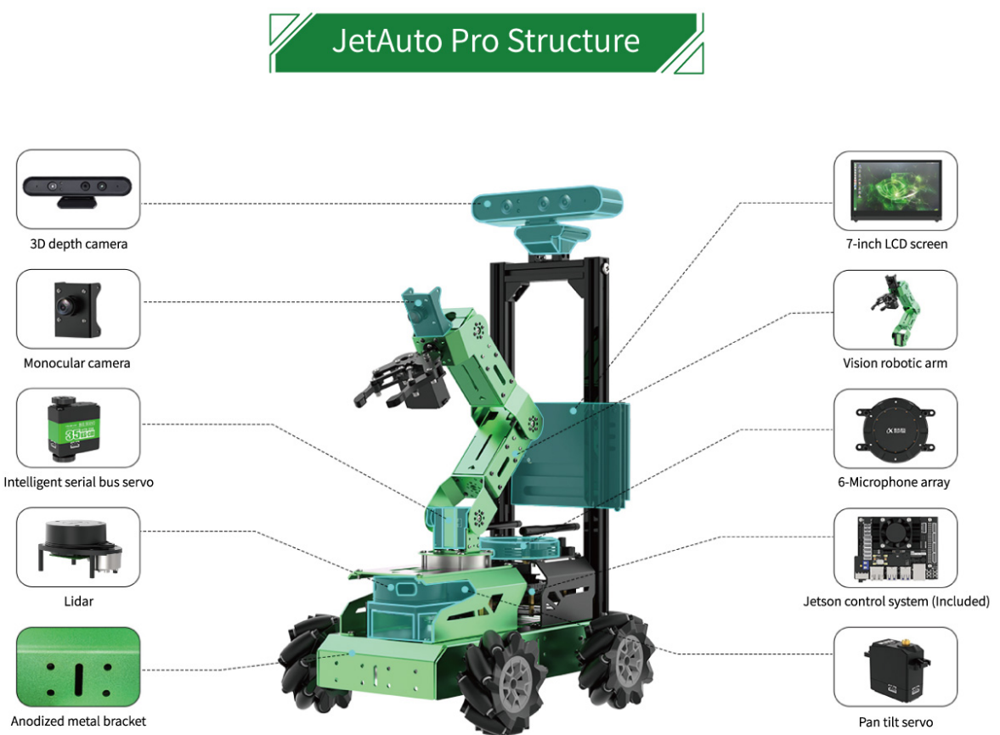

# Lab 5 : Robotic Arm and SLAM

Seneca Polytechnic 
SEA700 Robotics for Software Engineers

### JetAuto Robot Inspection

The robot we have for this course is the JetAuto Pro assembled in the configuration:

***Figure 4.2** JetAuto Pro*

1. Before using the JetAuto robot, read the following:

    - [JetAuto User Manual](JetAuto-User-Manual.pdf)
        - Page 01: Guide to Battery Safety
        - Page 03: JetAuto Pro Standard Kit Packing List
        - Page 04-09: Installation Instruction (except for 1.4 LCD)
            - Check all nuts and bolts to ensure confirm installation and security
        - Page 10-11: Charging and Starting the Robot

    We will NOT be using the smartphone app for controlling the robot.

### SSH Into the JetAuto Robot

**Copy this lab instruction somewhere on your computer as you'll lose connection to the internet!**

1. By default, the JetAuto is configured to be in Wifi AP mode. Power on the robot and connect to the robot's WiFi starting in "HW-". If you are unsure of which Wifi SSID is your robot broadcasting, open the "Tool" application on the robot and look for the AP name in the setting. Do NOT change any of the default settings.

    The password for the WiFi connection is: **hiwonder**.

1. Once connected, use terminal (or PuTTY) to SSH into the robot at "192.168.149.1".

        ssh jetauto@192.168.149.1

    The user is: **jetauto**, and the password is: **hiwonder**.

    #### USB connection with the robot

    1. It is also possible to connect with the robot via USB using the Jetson Nano's micro-B USB port.

    1. Use `screen` terminal application to connection with the robot.

            sudo apt-get install -y screen
            sudo screen /dev/ttyACM0 115200

    #### NoMachine (Use with caution)

    Only recommended to be used on within a virtual machine. For security, stop the NoMachine server after you installation. 

    1. NoMachine is another application that can be used to for remote connection with the JetNano board. Once you are connected with the robot, the credential is the same as above. 

### JetAuto Robot Movement

<ul>
<li>Ensure the battery charging cable is UNPLUGGED and all cables on the robot are secure.</li>
<li>Ensure all structures, nuts and bolts on the robot are tightly fastened.</li>
<li>Ensure the robot is on the ground and awy from any obstacles.</li>
</ul>

1. In a terminal that's connected to the JetAuto robot using SSH or in JetAuto's terminal using remote desktop, stop the app service then start the `jetauto_controller` service:

        sudo systemctl stop start_app_node.service
        roslaunch jetauto_controller jetauto_controller.launch

1. Now that the controller service has started, we can publish move command as Twist message to the motion controller. Before publish a command to the robot, remember you must issue a stop command for the robot to stop. Let's issue that first so you can recall it faster.

        rostopic pub -1 /jetauto_controller/cmd_vel geometry_msgs/Twist '{linear: {x: 0.0, y: 0.0, z: 0.0}, angular: {x: 0.0, y: 0.0, z: 0.0}}'

    Your robot should not do anything.

1. Issue a move in the x-direction (forward) at 0.3 m/s, `x: 0.3`:

        rostopic pub -1 /jetauto_controller/cmd_vel geometry_msgs/Twist '{linear: {x: 0.1, y: 0.0, z: 0.0}, angular: {x: 0.0, y: 0.0, z: 0.0}}'

    Your robot should now start moving. Be ready to stop the robot by issuing (or up arrow twice):

        rostopic pub -1 /jetauto_controller/cmd_vel geometry_msgs/Twist '{linear: {x: 0.0, y: 0.0, z: 0.0}, angular: {x: 0.0, y: 0.0, z: 0.0}}'

    

    <ul>
    <li>DO NOT set the movement value above 0.7 m/s to keep the robot within it control limit.</li>
    </ul>
    

    The linear values refer to the translation of the robot. Positive X is forward and positive Y is left. There is no Z-direction for this robot. Do not exceed 0.7 m/s.

    The angular values refer to the rotation of the robot. Only Z-rotation is considered with positive value as counter-clockwise. Do not exceed 3.5 rad/s.