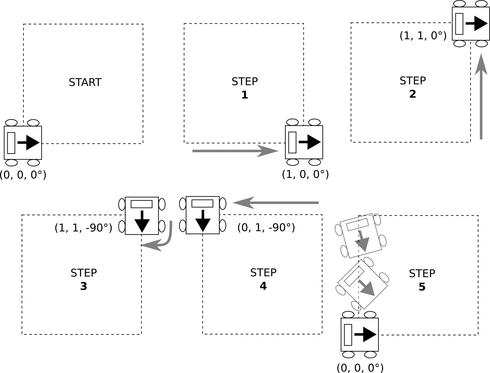

# Project 3 - Moving JetAuto in Real World

Seneca Polytechnic 
AIG240 Robotics

**Due:** Wednesday, July 9, 2025 at 11:59 PM on Blackboard 
**Weight:** 10%

## Introduction

In this project, you will demonstrate your achievement in programming a real robot to navigate a fixed pattern. This project will help you
understand how to communicate and program a real robot.

## Objectives

1. Set up the physical robot.
2. Create a simple ROS node to control a robot in real world.
3. Answer assessment questions.

**NOTE:** This project must be completed individually.

- [Seneca Academic Integrity Policy](https://www.senecapolytechnic.ca/about/policies/academic-integrity-policy.html)
- [Seneca Generative Artificial Intelligence (GenAI) Policy](https://www.senecapolytechnic.ca/about/policies/generative-ai-policy.html)

### Step 1: Set Up and Inspect JetAuto Robot

1. In groups of up to 3 students, set Up and Inspect JetAuto Robot.
2. Follow the instruction provided by the instructor.

### Step 2: Create and Run a Simple ROS Node

Use open-source code, AI-generated code, or your own code to create a control script as described below to make the physical JetAuto robot move according to a pattern.

Write code that will move the JetAuto robot in a roughly 1-meter square shape pattern as follows:

***Figure 1** Square Movement Pattern*

Start:

1. Move forward from (0, 0, 0°) to (1, 0, 0°) facing the direction of travel; then
2. Move left sideway from (1, 0, 0°) to (1, 1, 0°) without turning, so the robot is facing the outside of the square; then
3. Turn clockwise from (1, 1, 0°) to (1, 1, -90°) to face into the square; then
4. Move right sideway from (1, 1, -90°) to (0, 1, -90°) facing the inside of the square; then
5. Move forward and turn from (0, 1, -90°) to (0, 0, 0°) by rotating the robot while traveling.

Repeat this 2 times after a start command (such as a keyboard input) is given.

Run this on the real world robot.

## Assessment Questions

1. How did you establish communication with the robot?
2. How different is controlling the robot in Gazebo vs the real world?
3. How do you control that the robot moved roughly 1 meter in each of the steps?
4. What challenges did you face making the robot move in the real physical world?

## Submission

1. A link to your project folder (e.g., on GitHub (private) or Google Drive) containing all the necessary files and code.
2. A video showing your code running in Gazebo and the robot moving.
3. A text file containing the answers to the questions for every group member.

### Late Submission Penalty

1. A 25% reduction from the full mark will be applied for every 24 hours the submission is late after the deadline.