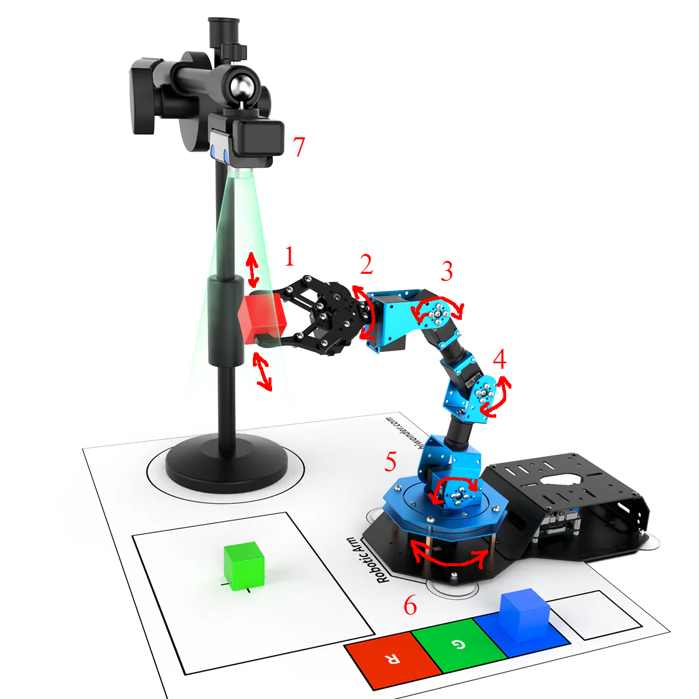

# Lab 1 : Setup

<font size="5">
Seneca Polytechnic</br>
SEA700 Robotics for Software Engineers
</font>

## Introduction

In this course, you'll be using the [JetAuto Pro ROS Robot Car](https://www.hiwonder.com/products/jetauto-pro?variant=40040875229271&srsltid=AfmBOopGiD-7htdo9MYV2dDxaC_hu9xuS887mAu3p1SuU0YDl9iVj6Da) as the base platform for development. The JetAuto robot uses the NVIDIA Jetson Nano embedded computing boards as its controller. The robot comes with various accessories and add-ons for robotics applications and they can all be controlled using [Robot Operating System (ROS)](https://www.ros.org/) as the backbone application. However, before jumping into using the physical, we will be learning how to use ROS and [Gazebo](https://gazebosim.org/) to simulate the robot and it's environmental. During the design phase of any robotics project, testing the functionality of your code and the robot is a key step of project cycle. In some industrial settings (such as robot in remote location), physical access to the robot are limited or impossible. In such a case, simulating the robot's action and performance is the only way to ensure mission success.

### What is ROS?

Per the ROS website:

> The Robot Operating System (ROS) is a set of software libraries and tools that help you build robot applications. From drivers to state-of-the-art algorithms, and with powerful developer tools, ROS has what you need for your next robotics project. And it's all open source.

The above statement isn't exactly clear so let's take a look at an example.



***Figure 1.1** Robotics Arm (Source: Hiwonder)*

A robotics system usually consist of various sensors, actuators, and controllers. The system in Figure 1.1 have the following:

1. a servo gripper at the end of the arm
1. a servo revolute joint that rotate the gripper
1. a servo revolute joint for link 3-2
1. a servo revolute joint for link 4-3
1. a servo revolute joint for link 5-4
1. a servo revolute joint that rotate the base
1. a stationary camera supervise the workspace

To pick up an object, the robot might:

- Use the camera to measure the position of the object
- Command the arm to move toward the object's position
- Once in position, command the gripper to close around the object

To approach this problem, we'll need to break it down into smaller task. In robotics, that usually means having independent low-level control loops, each controlling a single task.

- A control loop for each joint that, given a position or velocity command, controls the power applied to the joint motor based on position sensor measurements at the joint.
- Another control loop that receives commands to open or close the gripper, then switches the gripper motor on and off while controlling the power applied to it to avoid crushing objects.
- A sensing loop that reads individual images from the camera

With the above structure, we then couple these low-level loops together via a single high-level module that performs supervisory control of the whole system:

- Query the camera sensing loop for a single image
- Use a vision algorithm to compute the location of the object to grasp
- Compute the joint angles necessary to move the manipulator arm to this location
- Sends position commands to each of the joint control loops telling them to move to this position
- Signal the gripper control loop to close the gripper to grab the object

An important feature of this design is that the supervisor need not know the implementation details of any of the low-level control loops: it interacts with each only through simple control messages. This encapsulation of functionality makes the system modular, making it easier to reuse code across robotic platforms.

In ROS, each individual control loop is known as a node, an individual software process that performs a specific task. Nodes exchange control messages, sensor readings, and other data by publishing or subscribing to topics or by sending requests to services offered by other nodes (these concepts will be discussed in detail later in the lab).

Nodes can be written in a variety of languages (including Python and C++), and ROS transparently handles the details of converting between different datatypes, exchanging messages between nodes, etc.

We can then visualize the communication and interaction between different software components via a computation graph, where:


***Figure 1.2** Example computation graph*

- Nodes are represented by ovals (ie. `/usb_cam` or `/ar_track_alvar`)).
- Topics are represented by rectangles (ie. `/usb_cam/camera_info` and `/usb_cam/image_raw`).
- The flow of information to and from topics and represented by arrows. In the above example, `/usb_cam publishes`
to the topics `/usb_cam/camera_info` and `/usb_cam/image_raw`, which are subscribed to by `/ar_track_alvar`.
- While not shown here, services would be represented by dotted arrows.

## Procedures

The lab procedures assume a Ubuntu Jammy 22.04 enviornment. If you are using Windows or macOS, some modification to the steps might be required.

### ROS Installation

Follow the [ROS 2 Documentation Installation](https://docs.ros.org/en/humble/Installation/Ubuntu-Install-Debs.html) instruction to install the ROS desktop package into your system. **You do NOT need to install the Bare Bones or the Development tools**

Since we want our terminal to load the ROS source everytime it start, add the `source` command to `.bashrc`.

Use `vi`, `vim` or any editor to open `~/.bashrc` then add the following code at the end.

```
source /opt/ros/humble/setup.bash
```

After installation and setting up `.bashrc`, ensure you successfully tested the C++ talker and Python listener per the instruction by opening a NEW terminal.

### Turtlesim Test

Turtlesim is a lightweight simulator for learning ROS 2. It illustrates what ROS 2 does at the most basic level to give you an idea of what you will do with a real robot or a robot simulation later on.

The ros2 tool is how the user manages, introspects, and interacts with a ROS system. It supports multiple commands that target different aspects of the system and its operation. One might use it to start a node, set a parameter, listen to a topic, and many more. The ros2 tool is part of the core ROS 2 installation.

rqt is a graphical user interface (GUI) tool for ROS 2. Everything done in rqt can be done on the command line, but rqt provides a more user-friendly way to manipulate ROS 2 elements.

Check that the turtlesim package is installed.

```
ros2 pkg executables turtlesim
```

The above command should return a list of turtlesim’s executables.
    
```
turtlesim draw_square
turtlesim mimic
turtlesim turtle_teleop_key
turtlesim turtlesim_node
```

To start turtlesim, enter the following command in your terminal.

```
ros2 run turtlesim turtlesim_node
```

The simulator window should appear, with a random turtle in the center.


***Figure 1.3** TurtleSim*

In the terminal, under the command, you will see messages from the node:

```
[INFO] [1725638823.233052860] [turtlesim]: Starting turtlesim with node name /turtlesim
[INFO] [1725638823.245832389] [turtlesim]: Spawning turtle [turtle1] at x=[5.544445], y=[5.544445], theta=[0.000000]
```

Contiune finishing the ROS2 turtlesim tutorial from Step 3 here:
[https://docs.ros.org/en/humble/Tutorials/Beginner-CLI-Tools/Introducing-Turtlesim/Introducing-Turtlesim.html](https://docs.ros.org/en/humble/Tutorials/Beginner-CLI-Tools/Introducing-Turtlesim/Introducing-Turtlesim.html)

## Lab Question

1. Create a third turtle that you can control in turtlesim with green (g = 255) as the pen line colour.

Once you've completed all the above steps, ask the lab professor or instructor over and demostrate that you've completed the lab and written down all your observations. You might be asked to explain some of the concepts you've learned in this lab.

## Reference

- [ROS 2 Documentation: Humble](https://docs.ros.org/en/humble/index.html)
- EECS 206A Labs