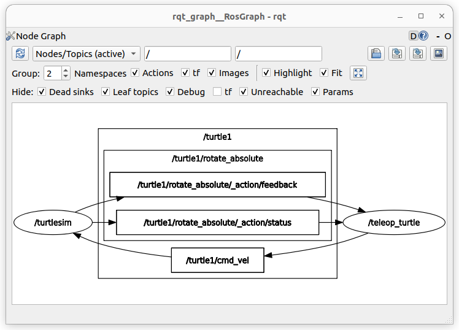
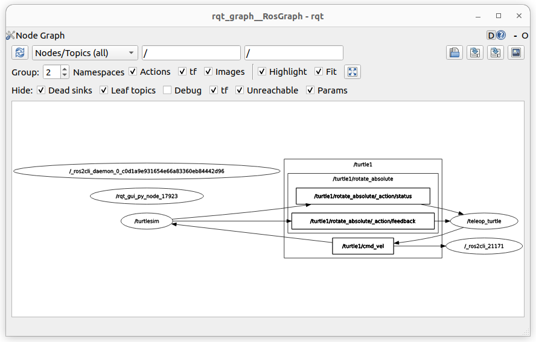
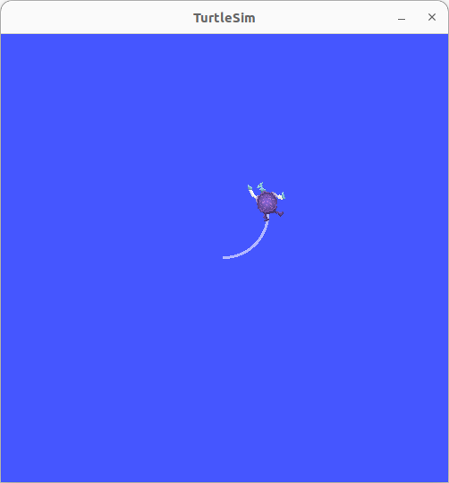
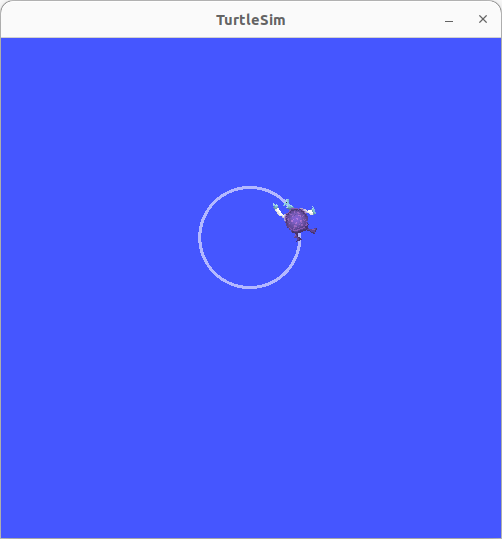
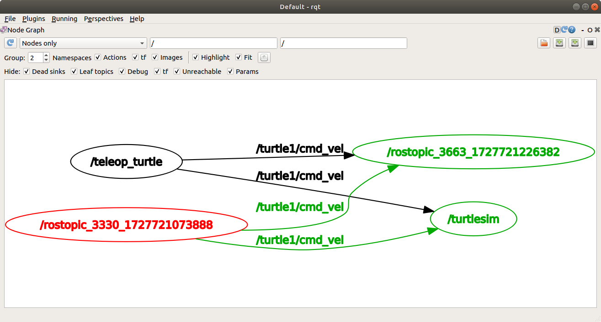
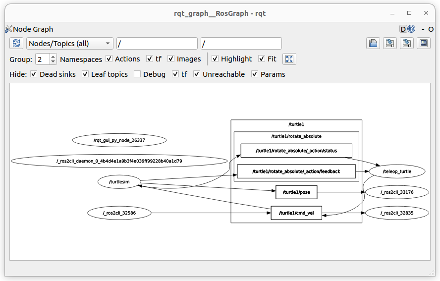
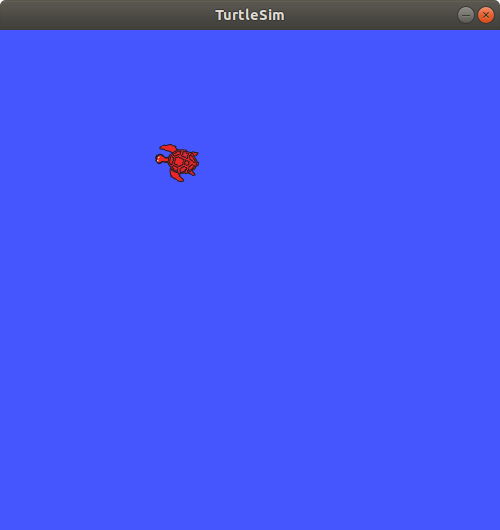
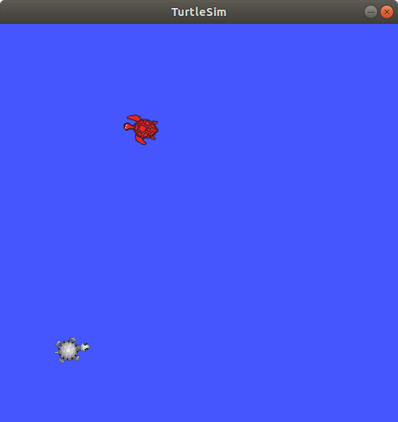
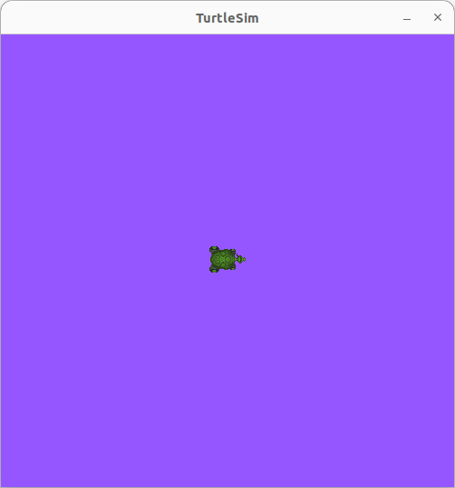
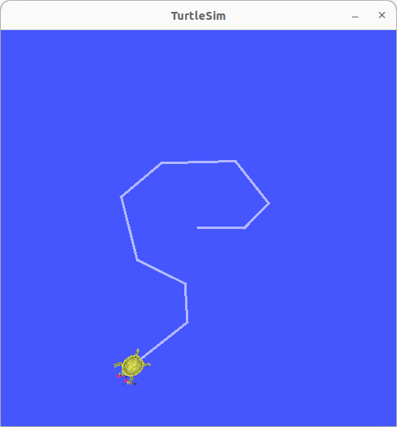

# Lab 2 : ROS Nodes, Topics, Services, Parameters, Actions

Seneca Polytechnic 
SEA700 Robotics for Software Engineers

## Introduction

A overview of some computation graph concepts:
- **Node:** an executable representing an individual ROS software process
- **Topic:** nodes can publish messages to a topic and/or subscribe to a topic to receive messages
- **Message:** a ROS datatype used to exchange data between nodes

### Nodes in ROS

Each node in ROS should be responsible for a single, modular purpose, ie. controlling the wheel motors or publishing the sensor data from a laser range-finder. Each node can send and receive data from other nodes via topics, services, actions, or parameters. A full robotic system is comprised of many nodes working in concert.

***Figure 2.1** ROS Nodes Graph*

### Topics in ROS

ROS 2 breaks complex systems down into many modular nodes. Topics are a vital element of the ROS graph that act as a bus for nodes to exchange messages.

***Figure 2.2** ROS Topic Graph*

A node may publish data to any number of topics and simultaneously have subscriptions to any number of topics.

***Figure 2.3** ROS Topic Graph (One-to-Many)*

Topics are one of the main ways in which data is moved between nodes and therefore between different parts of the system.

### Service in ROS

Services are another method of communication for nodes in the ROS graph. Services are based on a call-and-response model versus the publisher-subscriber model of topics. While topics allow nodes to subscribe to data streams and get continual updates, services only provide data when they are specifically called by a client.

***Figure 2.4** ROS Service Single Node*

***Figure 2.5** ROS Service Multiple Node*

### Parameter in ROS

A parameter is a configuration value of a node. You can think of parameters as node settings. A node can store parameters as integers, floats, booleans, strings, and lists. In ROS 2, each node maintains its own parameters.

### Actions in ROS

Actions are one of the communication types in ROS 2 and are intended for long running tasks. They consist of three parts: a goal, feedback, and a result.

Actions are built on topics and services. Their functionality is similar to services, except actions can be canceled. They also provide steady feedback, as opposed to services which return a single response.

Actions use a client-server model, similar to the publisher-subscriber model. An “action client” node sends a goal to an “action server” node that acknowledges the goal and returns a stream of feedback and a result.

***Figure 2.6** ROS Action*

## Procedures

### Understanding ROS Nodes

1. Open a terminal to run turtlesim. The command `ros2 run <package_name> <executable_name>` launches an executable from a package. We need the package name to be `turtlesim` and the executable name to be `turtlesim_node`.

        ros2 run turtlesim turtlesim_node

1. To find the node names, the `ros2 node list` can be used. `ros2 node list` will show you the names of all running nodes. This is especially useful when you want to interact with a node, or when you have a system running many nodes and need to keep track of them.

    Open a new terminal while `/turtlesim` is still running and enter the following command:

        ros2 node list
    
    The terminal will return the node name:

        /turtlesim

1. Open another new terminal and start the teleop node with the command:

        ros2 run turtlesim turtle_teleop_key

1. Return to the terminal where you ran `ros2 node list` and run it again. You will now see the names of two active nodes:

        /turtlesim
        /teleop_turtle

1. [Remapping](https://design.ros2.org/articles/ros_command_line_arguments.html#name-remapping-rules) allows you to reassign default node properties, like node name, topic names, service names, etc., to custom values. Let’s open another `/turtlesim` node and reassign the name to `/my_turtle`. In a new terminal, run the following command:

        ros2 run turtlesim turtlesim_node --ros-args --remap __node:=my_turtle

1. Return to the terminal where you ran `ros2 node list`, and run it again, you will see three node names:

        /my_turtle
        /turtlesim
        /teleop_turtle

1. To access more information about a node, use the following command: `ros2 node info <node_name>`. To examine your latest node, `my_turtle`, run the following command:

        ros2 node info /my_turtle

    `ros2 node info` returns a list of subscribers, publishers, services, and actions. i.e. the ROS graph connections that interact with that node. The output should look like this:

        /my_turtle
          Subscribers:
            /parameter_events: rcl_interfaces/msg/ParameterEvent
            /turtle1/cmd_vel: geometry_msgs/msg/Twist
          Publishers:
            /parameter_events: rcl_interfaces/msg/ParameterEvent
            /rosout: rcl_interfaces/msg/Log
            /turtle1/color_sensor: turtlesim/msg/Color
            /turtle1/pose: turtlesim/msg/Pose
          Service Servers:
            /clear: std_srvs/srv/Empty
            /kill: turtlesim/srv/Kill
            /my_turtle/describe_parameters: rcl_interfaces/srv/DescribeParameters
            /my_turtle/get_parameter_types: rcl_interfaces/srv/GetParameterTypes
            /my_turtle/get_parameters: rcl_interfaces/srv/GetParameters
            /my_turtle/list_parameters: rcl_interfaces/srv/ListParameters
            /my_turtle/set_parameters: rcl_interfaces/srv/SetParameters
            /my_turtle/set_parameters_atomically: rcl_interfaces/srv/SetParametersAtomically
            /reset: std_srvs/srv/Empty
            /spawn: turtlesim/srv/Spawn
            /turtle1/set_pen: turtlesim/srv/SetPen
            /turtle1/teleport_absolute: turtlesim/srv/TeleportAbsolute
            /turtle1/teleport_relative: turtlesim/srv/TeleportRelative
          Service Clients:

          Action Servers:
            /turtle1/rotate_absolute: turtlesim/action/RotateAbsolute
          Action Clients:

1. Run the same comand on the `/teleop_turtle` node and see the difference.

### Understanding ROS Topics

1. Close the `/my_turtle` terminal so only the `/turtlesim` and `/teleop_turtle` are open.

1. We will use `rqt_graph` to visualize the changing nodes and topics, as well as the connections between them. Open a new terminal and enter the command:

        rqt_graph

    You can also open rqt_graph by opening `rqt` and selecting **Plugins > Introspection > Node Graph**.

    

    ***Figure 2.7** ROS rqt_graph*

    You should see the above nodes and topics, as well as two actions around the periphery of the graph (let’s ignore those for now). If you don't see the the nodes and topics, change the setting to **Nodes/Topics (active)** and click the refresh button. If you hover your mouse over the topic in the center, you’ll see the color highlighting like in the image above.

    The graph shows how the `/turtlesim` node and the `/teleop_turtle` node are communicating with each other over a topic. The `/teleop_turtle` node is publishing data (the keystrokes you enter to move the turtle around) to the `/turtle1/cmd_vel` topic, and the `/turtlesim` node is subscribed to that topic to receive the data.

    The highlighting feature of rqt_graph is very helpful when examining more complex systems with many nodes and topics connected in many different ways.
    
    rqt_graph is a graphical introspection tool. Now we’ll look at some command line tools for introspecting topics.

1. Open another terminal and run the `ros2 topic list` command to return a list of all the topics currently active in the system:

        /parameter_events
        /rosout
        /turtle1/cmd_vel
        /turtle1/color_sensor
        /turtle1/pose

1. Running the code with an additional argument `ros2 topic list -t` will return the same list of topics, this time with the topic type appended in brackets:

        /parameter_events [rcl_interfaces/msg/ParameterEvent]
        /rosout [rcl_interfaces/msg/Log]
        /turtle1/cmd_vel [geometry_msgs/msg/Twist]
        /turtle1/color_sensor [turtlesim/msg/Color]
        /turtle1/pose [turtlesim/msg/Pose]

    These attributes, particularly the type, are how nodes know they’re talking about the same information as it moves over topics.

    If you’re wondering where all these topics are in rqt_graph, you can uncheck all the boxes under **Hide**:

    

    ***Figure 2.8** ROS rqt_graph with everything unhidden*

1. To see the data being published on a topic, use: `ros2 topic echo <topic_name>`. Since we know that `/teleop_turtle` publishes data to `/turtlesim` over the `/turtle1/cmd_vel` topic, let’s use `echo` to introspect that topic:

        ros2 topic echo /turtle1/cmd_vel

    Return to the terminal where `turtle_teleop_key` is running and use the arrows to move the turtle around. Watch the terminal where your `echo` is running at the same time, and you’ll see position data being published for every movement you make:

        linear:
          x: 2.0
          y: 0.0
          z: 0.0
        angular:
          x: 0.0
          y: 0.0
          z: 0.0
        ---

1. Return to rqt_graph and unhide the **Debug** box, hide everything else, then refresh.

    

    ***Figure 2.9** ROS rqt_graph with debug node*

    A new node `/_ros2cli_XXXXX` is created by the `echo` command we just ran (the number might be different). Now you can see that the publisher is publishing data over the `cmd_vel` topic, and two subscribers are subscribed to it.

1. Nodes send data over topics using messages. Publishers and subscribers must send and receive the same type of message to communicate. The topic types we saw earlier after running `ros2 topic list -t` let us know what message type is used on each topic. Recall that the `cmd_vel` topic has the type `geometry_msgs/msg/Twist`. This means that in the package `geometry_msgs` there is a `msg` called `Twist`. Now we can run `ros2 interface show <msg type>` on this type to learn its details. Specifically, what structure of data the message expects.

        ros2 interface show geometry_msgs/msg/Twist

    For the message type from above, you should see:

        # This expresses velocity in free space broken into its linear and angular parts.
                
        Vector3  linear
                float64 x
                float64 y
                float64 z
        Vector3  angular
                float64 x
                float64 y
                float64 z

    This tells you that the `/turtlesim` node is expecting a message with two vectors, `linear` and `angular`, of three elements each. If you recall the data we saw `/teleop_turtle` passing to `/turtlesim` with the echo command earlier.

1. Now that you have the message structure, you can publish data to a topic directly from the command line using: `ros2 topic pub <topic_name> <msg_type> '<args>'`. The '<args>' argument is the actual data you’ll pass to the topic, in the structure you just discovered in the previous section.

    It’s important to note that this argument needs to be input in YAML syntax. Input the full command like so:

        ros2 topic pub --once /turtle1/cmd_vel geometry_msgs/msg/Twist "{linear: {x: 2.0, y: 0.0, z: 0.0}, angular: {x: 0.0, y: 0.0, z: 1.8}}"

    `--once` is an optional argument meaning “publish one message then exit”.

    You will see the following output in the terminal:

        publisher: beginning loop
        publishing #1: geometry_msgs.msg.Twist(linear=geometry_msgs.msg.Vector3(x=2.0, y=0.0, z=0.0), angular=geometry_msgs.msg.Vector3(x=0.0, y=0.0, z=1.8))

    And you will see your turtle move like so:

    

    ***Figure 2.10** The turtle starts moving in a circle*

1. In order to continuously operate the turtle (and commonly the real robots which it is meant to emulate) require a steady stream of commands. So, to get the turtle to keep moving, you can run:

        ros2 topic pub --rate 1 /turtle1/cmd_vel geometry_msgs/msg/Twist "{linear: {x: 2.0, y: 0.0, z: 0.0}, angular: {x: 0.0, y: 0.0, z: 1.8}}"

    The difference here is the removal of the `--once` option and the addition of the `--rate 1` option, which tells `ros2 topic pub` to publish the command in a steady stream at 1 Hz.

    

    ***Figure 2.11** The turtle moving in a circle*

1. Refresh rqt_graph to see what’s happening graphically. You will see that the `ros2 topic pub ...` node (`/_ros2cli_32586` in the figure) is publishing over the `/turtle1/cmd_vel` topic, which is being received by both the `ros2 topic echo ...` node (`/_ros2cli_32835` in the figure) and the /turtlesim node now.

    

    ***Figure 2.12** ROS rqt_graph of turtle moving in a circle*

1. Next, in a new terminal, run `echo` on the `pose` topic and recheck rqt_graph:

        ros2 topic echo /turtle1/pose

    

    ***Figure 2.13** ROS rqt_graph of turtle moving in a circle with pose*

    You can see that the `/turtlesim` node is also publishing to the `pose` topic, which the new echo node has subscribed to.

### Understanding ROS Services

1. Leave `ros2 run turtlesim turtlesim_node` and `ros2 run turtlesim turtle_teleop_key` open and close all the other terminal.

1. Open a new terminal and run the `ros2 service list` command to return a list of all the services currently active in the system:

        /clear
        /kill
        /reset
        /spawn
        /teleop_turtle/describe_parameters
        /teleop_turtle/get_parameter_types
        /teleop_turtle/get_parameters
        /teleop_turtle/list_parameters
        /teleop_turtle/set_parameters
        /teleop_turtle/set_parameters_atomically
        /turtle1/set_pen
        /turtle1/teleport_absolute
        /turtle1/teleport_relative
        /turtlesim/describe_parameters
        /turtlesim/get_parameter_types
        /turtlesim/get_parameters
        /turtlesim/list_parameters
        /turtlesim/set_parameters
        /turtlesim/set_parameters_atomically

    You will see that both nodes have the same six services with `parameters` in their names. Nearly every node in ROS 2 has these infrastructure services that parameters are built off of.

    For now, let’s focus on the turtlesim-specific services, `/clear`, `/kill`, `/reset`, `/spawn`, `/turtle1/set_pen`, `/turtle1/teleport_absolute`, and `/turtle1/teleport_relative`. You may recall interacting with some of these services using rqt.

1. Services have types that describe how the request and response data of a service is structured. Service types are defined similarly to topic types, except service types have two parts: one message for the request and another for the response. To find out the type of a service, use the command: `ros2 service type <service_name>`

    Let’s take a look at turtlesim’s `/clear` service. In a new terminal, enter the command:

        ros2 service type /clear

    Which should return:

        std_srvs/srv/Empty

    The `Empty` type means the service call sends no data when making a request and receives no data when receiving a response.

1. To see the types of all the active services at the same time, you can append the `--show-types` option, abbreviated as `-t`, to the `list` command:

        ros2 service list -t

    Which will return:

        /clear [std_srvs/srv/Empty]
        /kill [turtlesim/srv/Kill]
        /reset [std_srvs/srv/Empty]
        /spawn [turtlesim/srv/Spawn]
        ...
        /turtle1/set_pen [turtlesim/srv/SetPen]
        /turtle1/teleport_absolute [turtlesim/srv/TeleportAbsolute]
        /turtle1/teleport_relative [turtlesim/srv/TeleportRelative]
        ...

1. If you want to find all the services of a specific type, you can use the command: `ros2 service find <type_name>`. For example, you can find all the `Empty` typed services like this:

        ros2 service find std_srvs/srv/Empty

    Which will return:

        /clear
        /reset

1. You can call services from the command line, but first you need to know the structure of the input arguments by using `ros2 interface show <type_name>`. Try this on the `/clear` service’s type, `Empty`:

        ros2 interface show std_srvs/srv/Empty

    Which will return:

        ---
    
    The `---` separates the request structure (above) from the response structure (below). But, as you learned earlier, the `Empty` type doesn’t send or receive any data. So, naturally, its structure is blank.

1. Let’s introspect a service with a type that sends and receives data, like `/spawn`. From the results of `ros2 service list -t`, we know `/spawn`’s type is `turtlesim/srv/Spawn`.

    To see the request and response arguments of the `/spawn` service, run the command:

        ros2 interface show turtlesim/srv/Spawn

    Which will return:

        float32 x
        float32 y
        float32 theta
        string name # Optional.  A unique name will be created and returned if this is empty
        ---
        string name

    The information above the `---` line tells us the arguments needed to call `/spawn`.` `x`, `y` and `theta` determine the 2D pose of the spawned turtle, and `name` is clearly optional.

    The information below the `---` line isn’t something you need to know in this case, but it can help you understand the data type of the response you get from the call.

1. Now that you know what a service type is, how to find a service’s type, and how to find the structure of that type’s arguments, you can call a service using: `ros2 service call <service_name> <service_type> <arguments>`. The `<arguments>` part is optional. For example, you know that `Empty` typed services don’t have any arguments:

        ros2 service call /clear std_srvs/srv/Empty

    This command will clear the turtlesim window of any lines your turtle has drawn.

    
    

    ***Figure 2.14** Turtlesim with line and cleared*

1. Now let’s spawn a new turtle by calling `/spawn` and setting arguments. Input `<arguments>` in a service call from the command-line need to be in [YAML](https://en.wikipedia.org/wiki/YAML) syntax. Enter the command:

        ros2 service call /spawn turtlesim/srv/Spawn "{x: 2, y: 2, theta: 0.2, name: ''}"

    You will get this method-style view of what’s happening, and then the service response:

        requester: making request: turtlesim.srv.Spawn_Request(x=2.0, y=2.0, theta=0.2, name='')

        response:
        turtlesim.srv.Spawn_Response(name='turtle2')

    Your turtlesim window will update with the newly spawned turtle right away:

    

    ***Figure 2.15** Turtlesim Spawn*

### Understanding ROS Parameters

1. Restart `ros2 run turtlesim turtlesim_node` and `ros2 run turtlesim turtle_teleop_key` open and close all the other terminal.

1. To see the parameters belonging to your nodes, open a new terminal and enter the command:

        ros2 param list

    You will see the node namespaces, `/teleop_turtle` and `/turtlesim`, followed by each node’s parameters:

        /teleop_turtle:
        qos_overrides./parameter_events.publisher.depth
        qos_overrides./parameter_events.publisher.durability
        qos_overrides./parameter_events.publisher.history
        qos_overrides./parameter_events.publisher.reliability
        scale_angular
        scale_linear
        use_sim_time
        /turtlesim:
        background_b
        background_g
        background_r
        qos_overrides./parameter_events.publisher.depth
        qos_overrides./parameter_events.publisher.durability
        qos_overrides./parameter_events.publisher.history
        qos_overrides./parameter_events.publisher.reliability
        use_sim_time

    Every node has the parameter `use_sim_time`; it’s not unique to turtlesim.
    
    Based on their names, it looks like `/turtlesim`’s parameters determine the background color of the turtlesim window using RGB color values.

1. To display the type and current value of a parameter, use the command: `ros2 param get <node_name> <parameter_name>`. Let’s find out the current value of `/turtlesim`’s parameter `background_g`:

        ros2 param get /turtlesim background_g

    Which will return the value:

        Integer value is: 86

    Now you know `background_g` holds an integer value. If you run the same command on `background_r` and `background_b`, you will get the values `69` and `255`, respectively.

1. To change a parameter’s value at runtime, use the command: `ros2 param set <node_name> <parameter_name> <value>`. Let’s change `/turtlesim`’s background color:

        ros2 param set /turtlesim background_r 150

    Your terminal should return the message:

        Set parameter successful

    And the background of your turtlesim window should change colors:

    

    ***Figure 2.16** Turtlesim Purple*

### Understanding ROS Actions

1. Restart `ros2 run turtlesim turtlesim_node` and `ros2 run turtlesim turtle_teleop_key` open and close all the other terminal.

1. When you launch the `/teleop_turtle` node, you will see the following message in your terminal:

        Use arrow keys to move the turtle.
        Use G|B|V|C|D|E|R|T keys to rotate to absolute orientations. 'F' to cancel a rotation.

    Let’s focus on the second line, which corresponds to an action.

    Notice that the letter keys `G|B|V|C|D|E|R|T` form a “box” around the F key on a US QWERTY keyboard. Each key’s position around `F` corresponds to that orientation in turtlesim. For example, the `E` will rotate the turtle’s orientation to the upper left corner.

1. Press `E` and pay attention to the terminal where the `/turtlesim` node is running. Each time you press one of these keys, you are sending a goal to an action server that is part of the `/turtlesim` node. The goal is to rotate the turtle to face a particular direction. A message relaying the result of the goal should display once the turtle completes its rotation:

        [INFO] [turtlesim]: Rotation goal completed successfully

1. Try pressing the `C` key, and then pressing the `F` key before the turtle can complete its rotation. In the terminal where the `/turtlesim` node is running, you will see the message:

        [INFO] [turtlesim]: Rotation goal canceled

1. Not only can the client-side (your input in the teleop) stop a goal, but the server-side (the `/turtlesim` node) can as well. When the server-side chooses to stop processing a goal, it is said to “abort” the goal.

    Try hitting the `D` key, then the `G` key before the first rotation can complete. In the terminal where the `/turtlesim` node is running, you will see the message:

        [WARN] [turtlesim]: Rotation goal received before a previous goal finished. Aborting previous goal

    This action server chose to abort the first goal because it got a new one. It could have chosen something else, like reject the new goal or execute the second goal after the first one finished. Don’t assume every action server will choose to abort the current goal when it gets a new one.

1. To see the list of actions a node provides, `/turtlesim` in this case, open a new terminal and run the command:

        ros2 node info /turtlesim

    Which will return a list of `/turtlesim`’s subscribers, publishers, services, action servers and action clients:

        /turtlesim
        Subscribers:
        /parameter_events: rcl_interfaces/msg/ParameterEvent
        /turtle1/cmd_vel: geometry_msgs/msg/Twist
        Publishers:
        /parameter_events: rcl_interfaces/msg/ParameterEvent
        /rosout: rcl_interfaces/msg/Log
        /turtle1/color_sensor: turtlesim/msg/Color
        /turtle1/pose: turtlesim/msg/Pose
        Service Servers:
        /clear: std_srvs/srv/Empty
        /kill: turtlesim/srv/Kill
        /reset: std_srvs/srv/Empty
        /spawn: turtlesim/srv/Spawn
        /turtle1/set_pen: turtlesim/srv/SetPen
        /turtle1/teleport_absolute: turtlesim/srv/TeleportAbsolute
        /turtle1/teleport_relative: turtlesim/srv/TeleportRelative
        /turtlesim/describe_parameters: rcl_interfaces/srv/DescribeParameters
        /turtlesim/get_parameter_types: rcl_interfaces/srv/GetParameterTypes
        /turtlesim/get_parameters: rcl_interfaces/srv/GetParameters
        /turtlesim/list_parameters: rcl_interfaces/srv/ListParameters
        /turtlesim/set_parameters: rcl_interfaces/srv/SetParameters
        /turtlesim/set_parameters_atomically: rcl_interfaces/srv/SetParametersAtomically
        Service Clients:

        Action Servers:
        /turtle1/rotate_absolute: turtlesim/action/RotateAbsolute
        Action Clients:

    Notice that the `/turtle1/rotate_absolute` action for `/turtlesim` is under `Action Servers`. This means `/turtlesim` responds to and provides feedback for the `/turtle1/rotate_absolute` action.

1. On the other hand, the `/teleop_turtle` node has the name `/turtle1/rotate_absolute` under `Action Clients` meaning that it sends goals for that action name. To see that, run:

        ros2 node info /teleop_turtle

    Which will return:

        /teleop_turtle
        Subscribers:
        /parameter_events: rcl_interfaces/msg/ParameterEvent
        Publishers:
        /parameter_events: rcl_interfaces/msg/ParameterEvent
        /rosout: rcl_interfaces/msg/Log
        /turtle1/cmd_vel: geometry_msgs/msg/Twist
        Service Servers:
        /teleop_turtle/describe_parameters: rcl_interfaces/srv/DescribeParameters
        /teleop_turtle/get_parameter_types: rcl_interfaces/srv/GetParameterTypes
        /teleop_turtle/get_parameters: rcl_interfaces/srv/GetParameters
        /teleop_turtle/list_parameters: rcl_interfaces/srv/ListParameters
        /teleop_turtle/set_parameters: rcl_interfaces/srv/SetParameters
        /teleop_turtle/set_parameters_atomically: rcl_interfaces/srv/SetParametersAtomically
        Service Clients:

        Action Servers:

        Action Clients:
        /turtle1/rotate_absolute: turtlesim/action/RotateAbsolute

1. To identify all the actions in the ROS graph, run the command:

        ros2 action list

    Which will return:

        /turtle1/rotate_absolute

    This is the only action in the ROS graph right now. It controls the turtle’s rotation, as you saw earlier. You also already know that there is one action client (part of `/teleop_turtle`) and one action server (part of /turtlesim) for this action from using the `ros2 node info <node_name>` command.

1. Actions have types, similar to topics and services. To find `/turtle1/rotate_absolute`’s type, run the command:

        ros2 action list -t

    Which will return:

        /turtle1/rotate_absolute [turtlesim/action/RotateAbsolute]

    In brackets to the right of each action name (in this case only `/turtle1/rotate_absolute`) is the action type, `turtlesim/action/RotateAbsolute`. You will need this when you want to execute an action from the command line or from code.

1. You can further introspect the `/turtle1/rotate_absolute` action with the command:

        ros2 action info /turtle1/rotate_absolute

    Which will return

        Action: /turtle1/rotate_absolute
        Action clients: 1
            /teleop_turtle
        Action servers: 1
            /turtlesim

    This tells us what we learned earlier from running `ros2 node info` on each node: The `/teleop_turtle` node has an action client and the `/turtlesim` node has an action server for the `/turtle1/rotate_absolute` action.

1. One more piece of information you will need before sending or executing an action goal yourself is the structure of the action type.

    Recall that you identified `/turtle1/rotate_absolute`’s type when running the command `ros2 action list -t`. Enter the following command with the action type in your terminal:

        ros2 interface show turtlesim/action/RotateAbsolute

    Which will return:

        # The desired heading in radians
        float32 theta
        ---
        # The angular displacement in radians to the starting position
        float32 delta
        ---
        # The remaining rotation in radians
        float32 remaining

    The section of this message above the first --- is the structure (data type and name) of the goal request. The next section is the structure of the result. The last section is the structure of the feedback.

1. Now let’s send an action goal from the command line with the following syntax: `ros2 action send_goal <action_name> <action_type> <values>`. `<values>` need to be in YAML format. Keep an eye on the turtlesim window, and enter the following command into your terminal:

        ros2 action send_goal /turtle1/rotate_absolute turtlesim/action/RotateAbsolute "{theta: 1.57}"

    You should see the turtle rotating, as well as the following message in your terminal:

        Waiting for an action server to become available...
        Sending goal:
            theta: 1.57

        Goal accepted with ID: f8db8f44410849eaa93d3feb747dd444

        Result:
            delta: -1.568000316619873

        Goal finished with status: SUCCEEDED

    All goals have a unique ID, shown in the return message. You can also see the result, a field with the name `delta`, which is the displacement to the starting position.

1. To see the feedback of this goal, add `--feedback` to the `ros2 action send_goal` command:

        ros2 action send_goal /turtle1/rotate_absolute turtlesim/action/RotateAbsolute "{theta: -1.57}" --feedback

    Your terminal will return the message:

        Sending goal:
            theta: -1.57

        Goal accepted with ID: e6092c831f994afda92f0086f220da27

        Feedback:
            remaining: -3.1268222332000732

        Feedback:
            remaining: -3.1108222007751465

        ...

        Result:
            delta: 3.1200008392333984

        Goal finished with status: SUCCEEDED

    You will continue to receive feedback, the remaining radians, until the goal is complete.

### Understanding Recording and Playback

`ros2 bag` is a command line tool for recording data published on topics in your system. It accumulates the data passed on any number of topics and saves it in a database. You can then replay the data to reproduce the results of your tests and experiments. Recording topics is also a great way to share your work and allow others to recreate it.

`ros2 bag` can only record data from published messages in topics. Earlier in the lab, you learned that the `/turtle_teleop` node publishes commands on the `/turtle1/cmd_vel` topic to make the turtle move in `turtlesim`.

1. Restart `ros2 run turtlesim turtlesim_node` and `ros2 run turtlesim turtle_teleop_key` open and close all the other terminal.

1. Let’s also make a new directory to store our saved recordings, just as good practice:

        mkdir bag_files
        cd bag_files

1. To record the data published to a topic use the command syntax: `ros2 bag record <topic_name>`. Before running this command on your chosen topic, open a new terminal and move into the `bag_files` directory you created earlier, because the rosbag file will save in the directory where you run it. Run the command:

        ros2 bag record /turtle1/cmd_vel

    You will see the following messages in the terminal (the date and time will be different):

        [INFO] [rosbag2_storage]: Opened database 'rosbag2_2019_10_11-05_18_45'.
        [INFO] [rosbag2_transport]: Listening for topics...
        [INFO] [rosbag2_transport]: Subscribed to topic '/turtle1/cmd_vel'
        [INFO] [rosbag2_transport]: All requested topics are subscribed. Stopping discovery...

1. Now `ros2 bag` is recording the data published on the `/turtle1/cmd_vel` topic. Return to the teleop terminal and move the turtle around again. The movements don’t matter, but try to make a recognizable pattern to see when you replay the data later.

    

    ***Figure 2.17** Turtlesim Recording*

1. Press `Ctrl+C` to stop recording.

    The data will be accumulated in a new bag directory with a name in the pattern of `rosbag2_year_month_day-hour_minute_second`. This directory will contain a `metadata.yaml` along with the bag file in the recorded format.

1. You can also record multiple topics, as well as change the name of the file `ros2 bag` saves to. Run the following command:

        ros2 bag record -o subset /turtle1/cmd_vel /turtle1/pose

    The `-o` option allows you to choose a unique name for your bag file. The following string, in this case `subset`, is the file name.

    To record more than one topic at a time, simply list each topic separated by a space.

    You will see the following message, confirming that both topics are being recorded.

        [INFO] [rosbag2_storage]: Opened database 'subset'.
        [INFO] [rosbag2_transport]: Listening for topics...
        [INFO] [rosbag2_transport]: Subscribed to topic '/turtle1/cmd_vel'
        [INFO] [rosbag2_transport]: Subscribed to topic '/turtle1/pose'
        [INFO] [rosbag2_transport]: All requested topics are subscribed. Stopping discovery...
        
    You can move the turtle around and press `Ctrl+C` when you’re finished.

1. You can see details about your recording by running: `ros2 bag info <bag_file_name>`. Running this command on the subset bag file will return a list of information on the file:

        ros2 bag info subset

        Files:             subset.db3
        Bag size:          228.5 KiB
        Storage id:        sqlite3
        Duration:          48.47s
        Start:             Oct 11 2019 06:09:09.12 (1570799349.12)
        End                Oct 11 2019 06:09:57.60 (1570799397.60)
        Messages:          3013
        Topic information: Topic: /turtle1/cmd_vel | Type: geometry_msgs/msg/Twist | Count: 9 | Serialization Format: cdr
                        Topic: /turtle1/pose | Type: turtlesim/msg/Pose | Count: 3004 | Serialization Format: cdr

1. Before replaying the bag file, enter `Ctrl+C` in the terminal where the teleop is running. Then make sure your turtlesim window is visible so you can see the bag file in action.

    Enter the command:

        ros2 bag play subset

    The terminal will return the message:

        [INFO] [rosbag2_storage]: Opened database 'subset'.

    Your turtle will follow the same path you entered while recording (though not 100% exactly; turtlesim is sensitive to small changes in the system’s timing).

    

    ***Figure 2.18** Turtlesim Recording*

    Because the `subset` file recorded the `/turtle1/pose topic`, the `ros2 bag` play command won’t quit for as long as you had turtlesim running, even if you weren’t moving.
    
    This is because as long as the `/turtlesim` node is active, it publishes data on the `/turtle1/pose` topic at regular intervals. You may have noticed in the `ros2 bag info` example result above that the `/turtle1/cmd_vel` topic’s `Count` information was only 9; that’s how many times we pressed the arrow keys while recording.
    
    Notice that `/turtle1/pose` has a `Count` value of over 3000; while we were recording, data was published on that topic 3000 times.

## Lab Question

1. Create a recording of a turtle performing a "Figure 8" path and play it back.

Once you've completed all the above steps, ask the lab professor or instructor over and demostrate that you've completed the lab and written down all your observations. You might be asked to explain some of the concepts you've learned in this lab.

## Reference

- [ROS 2 Documentation: Humble](https://docs.ros.org/en/humble/index.html)
- EECS 106A Labs