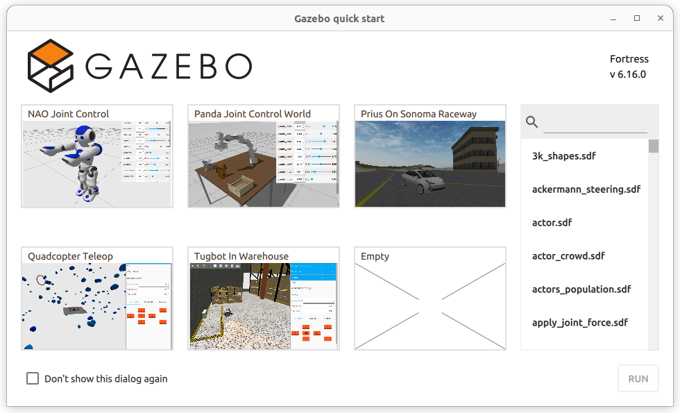

# Lab 3 : ROS Workspace, Package, Publisher and Subscriber

Seneca Polytechnic 
SEA700 Robotics for Software Engineers

## Introduction

### ROS Workspace

A workspace is a directory containing ROS 2 packages. Before using ROS 2, it’s necessary to source your ROS 2 installation workspace in the terminal you plan to work in. This makes ROS 2’s packages available for you to use in that terminal.

You also have the option of sourcing an “overlay” - a secondary workspace where you can add new packages without interfering with the existing ROS 2 workspace that you’re extending, or “underlay”. Your underlay must contain the dependencies of all the packages in your overlay. Packages in your overlay will override packages in the underlay. It’s also possible to have several layers of underlays and overlays, with each successive overlay using the packages of its parent underlays.

### ROS Package

A package is an organizational unit for your ROS 2 code. If you want to be able to install your code or share it with others, then you’ll need it organized in a package. With packages, you can release your ROS 2 work and allow others to build and use it easily.

Package creation in ROS 2 uses ament as its build system and colcon as its build tool. You can create a package using either CMake or Python, which are officially supported, though other build types do exist.

ROS 2 Python and CMake packages each have their own minimum required contents:

#### CMake

- `CMakeLists.txt` file that describes how to build the code within the package
- `include/<package_name>` directory containing the public headers for the package
- `package.xml` file containing meta information about the package
- `src` directory containing the source code for the package

The simplest possible package may have a file structure that looks like:

    my_package/
        CMakeLists.txt
        include/my_package/
        package.xml
        src/

#### Python

- `package.xml` file containing meta information about the package
- `resource/<package_name>` marker file for the package
- `setup.cfg` is required when a package has executables, so `ros2` run can find them
- `setup.py` containing instructions for how to install the package
- `<package_name>` - a directory with the same name as your package, used by ROS 2 tools to find your package, contains `__init__.py`

The simplest possible package may have a file structure that looks like:

    my_package/
        package.xml
        resource/my_package
        setup.cfg
        setup.py
        my_package/

A single workspace can contain as many packages as you want, each in their own folder. You can also have packages of different build types in one workspace (CMake, Python, etc.). You cannot have nested packages.

Best practice is to have a `src` folder within your workspace, and to create your packages in there. This keeps the top level of the workspace “clean”.

A trivial workspace might look like:

    workspace_folder/
        src/
            cpp_package_1/
                CMakeLists.txt
                include/cpp_package_1/
                package.xml
                src/

            py_package_1/
                package.xml
                resource/py_package_1
                setup.cfg
                setup.py
                py_package_1/
            ...
            cpp_package_n/
                CMakeLists.txt
                include/cpp_package_n/
                package.xml
                src/

## Procedures

### Install Colcon

`colcon` is an iteration on the ROS build tools `catkin_make`, `catkin_make_isolated`, `catkin_tools` and `ament_tools`. 

1. Run: `sudo apt install python3-colcon-common-extensions`

### Create a Workspace directory

1. Best practice is to create a new directory for every new workspace. The name doesn’t matter, but it is helpful to have it indicate the purpose of the workspace. Let’s choose the directory name `ros2_ws`, for “development workspace”. Open a new terminal and run:

        mkdir -p ~/ros2_ws/src
    
    Another best practice is to put any packages in your workspace into the `src` directory. The above code creates a `src` directory inside `ros2_ws`.

### Create a C++ Package

1. Navigate into `ros2_ws/src`, and run the package creation command to create a simple C++ publisher and subscriber:

        cd ~/ros2_ws/src

        ros2 pkg create --build-type ament_cmake --license Apache-2.0 cpp_pubsub

    Your terminal will return a message verifying the creation of your package `cpp_pubsub` and all its necessary files and folders.

    #### Write the publisher node

1. Navigate into `ros2_ws/src/cpp_pubsub/src`. This is the directory in any CMake package where the source files containing executables belong.

1. Download the example talker code by entering the following command:

        wget -O publisher_member_function.cpp https://raw.githubusercontent.com/ros2/examples/humble/rclcpp/topics/minimal_publisher/member_function.cpp
    
1. Now there will be a new file named `publisher_member_function.cpp`. Open the file using your preferred text editor. Alternatively, create a `.cpp` file with the following:

        #include <chrono>
        #include <functional>
        #include <memory>
        #include <string>

        #include "rclcpp/rclcpp.hpp"
        #include "std_msgs/msg/string.hpp"

        using namespace std::chrono_literals;

        /* This example creates a subclass of Node and uses std::bind() to register a
        * member function as a callback from the timer. */

        class MinimalPublisher : public rclcpp::Node
        {
        public:
            MinimalPublisher()
            : Node("minimal_publisher"), count_(0)
            {
                publisher_ = this->create_publisher<std_msgs::msg::String>("topic", 10);
                timer_ = this->create_wall_timer(
                500ms, std::bind(&MinimalPublisher::timer_callback, this));
            }

        private:
            void timer_callback()
            {
                auto message = std_msgs::msg::String();
                message.data = "Hello, world! " + std::to_string(count_++);
                RCLCPP_INFO(this->get_logger(), "Publishing: '%s'", message.data.c_str());
                publisher_->publish(message);
            }
            rclcpp::TimerBase::SharedPtr timer_;
            rclcpp::Publisher<std_msgs::msg::String>::SharedPtr publisher_;
            size_t count_;
        };

        int main(int argc, char * argv[])
        {
            rclcpp::init(argc, argv);
            rclcpp::spin(std::make_shared<MinimalPublisher>());
            rclcpp::shutdown();
            return 0;
        }
    
    The top of the code includes the standard C++ headers you will be using. After the standard C++ headers is the `rclcpp/rclcpp.hpp` include which allows you to use the most common pieces of the ROS 2 system. Last is `std_msgs/msg/string.hpp`, which includes the built-in message type you will use to publish data.

        #include <chrono>
        #include <functional>
        #include <memory>
        #include <string>

        #include "rclcpp/rclcpp.hpp"
        #include "std_msgs/msg/string.hpp"

        using namespace std::chrono_literals;

    These lines represent the node’s dependencies. Recall that dependencies have to be added to `package.xml` and `CMakeLists.txt`, which you’ll do in the next section.

    The next line creates the node class `MinimalPublisher` by inheriting from `rclcpp::Node`. Every `this` in the code is referring to the node.

        class MinimalPublisher : public rclcpp::Node

    The public constructor names the node `minimal_publisher` and initializes `count_` to 0. Inside the constructor, the publisher is initialized with the `String` message type, the topic name `topic`, and the required queue size to limit messages in the event of a backup. Next, `timer_` is initialized, which causes the `timer_callback` function to be executed twice a second.

        public:
            MinimalPublisher()
            : Node("minimal_publisher"), count_(0)
            {
                publisher_ = this->create_publisher<std_msgs::msg::String>("topic", 10);
                timer_ = this->create_wall_timer(
                500ms, std::bind(&MinimalPublisher::timer_callback, this));
            }

    The `timer_callback` function is where the message data is set and the messages are actually published. The `RCLCPP_INFO` macro ensures every published message is printed to the console.

        private:
            void timer_callback()
            {
                auto message = std_msgs::msg::String();
                message.data = "Hello, world! " + std::to_string(count_++);
                RCLCPP_INFO(this->get_logger(), "Publishing: '%s'", message.data.c_str());
                publisher_->publish(message);
            }

    Last is the declaration of the timer, publisher, and counter fields.

        rclcpp::TimerBase::SharedPtr timer_;
        rclcpp::Publisher<std_msgs::msg::String>::SharedPtr publisher_;
        size_t count_;

    Following the `MinimalPublisher` class is `main`, where the node actually executes. `rclcpp::init` initializes ROS 2, and `rclcpp::spin` starts processing data from the node, including callbacks from the timer.

        int main(int argc, char * argv[])
        {
            rclcpp::init(argc, argv);
            rclcpp::spin(std::make_shared<MinimalPublisher>());
            rclcpp::shutdown();
            return 0;
        }

    #### Add dependencies

1. Navigate one level back to the `ros2_ws/src/cpp_pubsub` directory, where the `CMakeLists.txt` and `package.xml` files have been created for you. Open `package.xml` with your text editor and make sure to fill in the `<description>`, `<maintainer>` and `<license>` tags:

        <description>Examples of minimal publisher/subscriber using rclcpp</description>
        <maintainer email="you@email.com">Your Name</maintainer>
        <license>Apache License 2.0</license>

1. Add a new line after the `ament_cmake` buildtool dependency and paste the following dependencies corresponding to your node’s include statements:

        <depend>rclcpp</depend>
        <depend>std_msgs</depend>

    This declares the package needs rclcpp and std_msgs when its code is built and executed.

    Make sure to save the file.

    #### CMakeLists.txt

1. Now open the `CMakeLists.txt` file. Below the existing dependency `find_package(ament_cmake REQUIRED)`, add the lines:

        find_package(rclcpp REQUIRED)
        find_package(std_msgs REQUIRED)

1. After that, add the executable and name it `talker` so you can run your node using `ros2 run`:

        add_executable(talker src/publisher_member_function.cpp)
        ament_target_dependencies(talker rclcpp std_msgs)

1. Finally, add the `install(TARGETS...)` section under the lines above so `ros2 run` can find your executable:

        install(TARGETS
            talker
            DESTINATION lib/${PROJECT_NAME})

    You could build your package now, source the local setup files, and run it, but let’s create the subscriber node first so you can see the full system at work.

    #### Write the subscriber node

1. Return to `ros2_ws/src/cpp_pubsub/src` to create the next node. Enter the following code in your terminal to download the subscriber:

        wget -O subscriber_member_function.cpp https://raw.githubusercontent.com/ros2/examples/humble/rclcpp/topics/minimal_subscriber/member_function.cpp

    Check to ensure that these files exist:

        publisher_member_function.cpp  subscriber_member_function.cpp

1. Open the `subscriber_member_function.cpp` with your text editor. Alternatively, create a `.cpp` file with the following:

        #include <memory>

        #include "rclcpp/rclcpp.hpp"
        #include "std_msgs/msg/string.hpp"
        using std::placeholders::_1;

        class MinimalSubscriber : public rclcpp::Node
        {
        public:
            MinimalSubscriber()
            : Node("minimal_subscriber")
            {
                subscription_ = this->create_subscription<std_msgs::msg::String>(
                "topic", 10, std::bind(&MinimalSubscriber::topic_callback, this, _1));
            }

        private:
            void topic_callback(const std_msgs::msg::String & msg) const
            {
                RCLCPP_INFO(this->get_logger(), "I heard: '%s'", msg.data.c_str());
            }
            rclcpp::Subscription<std_msgs::msg::String>::SharedPtr subscription_;
        };

        int main(int argc, char * argv[])
        {
            rclcpp::init(argc, argv);
            rclcpp::spin(std::make_shared<MinimalSubscriber>());
            rclcpp::shutdown();
            return 0;
        }

    The subscriber node’s code is nearly identical to the publisher’s. Now the node is named `minimal_subscriber`, and the constructor uses the node’s `create_subscription` class to execute the callback.

    There is no timer because the subscriber simply responds whenever data is published to the topic `topic`.

        public:
            MinimalSubscriber()
            : Node("minimal_subscriber")
            {
                subscription_ = this->create_subscription<std_msgs::msg::String>(
                "topic", 10, std::bind(&MinimalSubscriber::topic_callback, this, _1));
            }

    Recall from earlier lab that the topic name and message type used by the publisher and subscriber must match to allow them to communicate.

    The `topic_callback` function receives the string message data published over the topic, and simply writes it to the console using the `RCLCPP_INFO` macro.

    The only field declaration in this class is the subscription.

        private:
            void topic_callback(const std_msgs::msg::String & msg) const
            {
                RCLCPP_INFO(this->get_logger(), "I heard: '%s'", msg.data.c_str());
            }
            rclcpp::Subscription<std_msgs::msg::String>::SharedPtr subscription_;

    The `main` function is exactly the same, except now it spins the `MinimalSubscriber` node. For the publisher node, spinning meant starting the timer, but for the subscriber it simply means preparing to receive messages whenever they come.

    Since this node has the same dependencies as the publisher node, there’s nothing new to add to `package.xml`.

    #### CMakeLists.txt

1. Reopen `CMakeLists.txt` and add the executable and target for the subscriber node below the publisher’s entries.

        add_executable(listener src/subscriber_member_function.cpp)
        ament_target_dependencies(listener rclcpp std_msgs)

        install(TARGETS
            talker
            listener
            DESTINATION lib/${PROJECT_NAME})

    Make sure to save the file, and then your pub/sub system should be ready.

### Build and Run C++ Package

1. You likely already have the `rclcpp` and `std_msgs` packages installed as part of your ROS 2 system. It’s good practice to run `rosdep` in the root of your workspace (`ros2_ws`) to check for missing dependencies before building:

        cd ~/ros2_ws

        rosdep install -i --from-path src --rosdistro humble -y

    If the `rosdep` command is not found, run the following to install, init, and update `rosdep`:

        pip install -U rosdep
        rosdep init
        rosdep update

    If you get a permission denied error, use `sudo`.

    When all dependencies are met, `rosdep` will return a success message:

        #All required rosdeps installed successfully

1. Still in the root of your workspace, `ros2_ws`, build your new package:

        colcon build --packages-select cpp_pubsub

1. Source the setup files:

        . install/setup.bash

1. Now run the talker node from `ros2_ws`:

        ros2 run cpp_pubsub talker

    The terminal should start publishing info messages every 0.5 seconds, like so:

        [INFO] [minimal_publisher]: Publishing: "Hello World: 0"
        [INFO] [minimal_publisher]: Publishing: "Hello World: 1"
        [INFO] [minimal_publisher]: Publishing: "Hello World: 2"
        [INFO] [minimal_publisher]: Publishing: "Hello World: 3"
        [INFO] [minimal_publisher]: Publishing: "Hello World: 4"

1. Open another terminal, source the setup files from inside `ros2_ws` again, and then start the listener node:

        . install/setup.bash

        ros2 run cpp_pubsub listener

    The listener will start printing messages to the console, starting at whatever message count the publisher is on at that time, like so:

        [INFO] [minimal_subscriber]: I heard: "Hello World: 10"
        [INFO] [minimal_subscriber]: I heard: "Hello World: 11"
        [INFO] [minimal_subscriber]: I heard: "Hello World: 12"
        [INFO] [minimal_subscriber]: I heard: "Hello World: 13"
        [INFO] [minimal_subscriber]: I heard: "Hello World: 14"

1. Enter Ctrl+C in each terminal to stop the nodes from spinning.

### Create a Python Package

1. Navigate into `ros2_ws/src`, and run the package creation command to create a simple Python publisher and subscriber:

        ros2 pkg create --build-type ament_python --license Apache-2.0 py_pubsub

    Your terminal will return a message verifying the creation of your package `py_pubsub` and all its necessary files and folders.

    #### Write the publisher node

1. Navigate into `ros2_ws/src/py_pubsub/py_pubsub`. This directory is a Python package with the same name as the ROS 2 package it’s nested in.

1. Download the example talker code by entering the following command:

        wget https://raw.githubusercontent.com/ros2/examples/humble/rclpy/topics/minimal_publisher/examples_rclpy_minimal_publisher/publisher_member_function.py

1. Now there will be a new file named `publisher_member_function.py` adjacent to `__init__.py`. Open the file using your preferred text editor. Alternatively, create a .py file with the following:

        import rclpy
        from rclpy.node import Node

        from std_msgs.msg import String

        class MinimalPublisher(Node):

            def __init__(self):
                super().__init__('minimal_publisher')
                self.publisher_ = self.create_publisher(String, 'topic', 10)
                timer_period = 0.5  # seconds
                self.timer = self.create_timer(timer_period, self.timer_callback)
                self.i = 0

            def timer_callback(self):
                msg = String()
                msg.data = 'Hello World: %d' % self.i
                self.publisher_.publish(msg)
                self.get_logger().info('Publishing: "%s"' % msg.data)
                self.i += 1

        def main(args=None):
            rclpy.init(args=args)

            minimal_publisher = MinimalPublisher()

            rclpy.spin(minimal_publisher)

            # Destroy the node explicitly
            # (optional - otherwise it will be done automatically
            # when the garbage collector destroys the node object)
            minimal_publisher.destroy_node()
            rclpy.shutdown()

        if __name__ == '__main__':
            main()

    The first lines of code after the comments import `rclpy` so its `Node` class can be used.

        import rclpy
        from rclpy.node import Node

    The next statement imports the built-in string message type that the node uses to structure the data that it passes on the topic.

        from std_msgs.msg import String

    These lines represent the node’s dependencies. Recall that dependencies have to be added to `package.xml`, which you’ll do in the next section.

    Next, the `MinimalPublisher` class is created, which inherits from (or is a subclass of) `Node`.

        class MinimalPublisher(Node):

    Following is the definition of the class’s constructor. `super().__init__` calls the `Node` class’s constructor and gives it your node name, in this case `minimal_publisher`.

    `create_publisher` declares that the node publishes messages of type `String` (imported from the std_msgs.msg module), over a topic named `topic`, and that the “queue size” is 10. Queue size is a required QoS (quality of service) setting that limits the amount of queued messages if a subscriber is not receiving them fast enough.

    Next, a timer is created with a callback to execute every 0.5 seconds. `self.i` is a counter used in the callback.

        def __init__(self):
            super().__init__('minimal_publisher')
            self.publisher_ = self.create_publisher(String, 'topic', 10)
            timer_period = 0.5  # seconds
            self.timer = self.create_timer(timer_period, self.timer_callback)
            self.i = 0

    `timer_callback` creates a message with the counter value appended, and publishes it to the console with `get_logger().info`.

        def timer_callback(self):
            msg = String()
            msg.data = 'Hello World: %d' % self.i
            self.publisher_.publish(msg)
            self.get_logger().info('Publishing: "%s"' % msg.data)
            self.i += 1

    Lastly, the main function is defined.

        def main(args=None):
            rclpy.init(args=args)

            minimal_publisher = MinimalPublisher()

            rclpy.spin(minimal_publisher)

            # Destroy the node explicitly
            # (optional - otherwise it will be done automatically
            # when the garbage collector destroys the node object)
            minimal_publisher.destroy_node()
            rclpy.shutdown()

    First the `rclpy` library is initialized, then the node is created, and then it “spins” the node so its callbacks are called.

    #### Add dependencies

1. Navigate one level back to the `ros2_ws/src/py_pubsub` directory, where the `setup.py`, `setup.cfg`, and `package.xml` files have been created for you. Open `package.xml` with your text editor and make sure to fill in the `<description>`, `<maintainer>` and `<license>` tags:

        <description>Examples of minimal publisher/subscriber using rclpy</description>
        <maintainer email="you@email.com">Your Name</maintainer>
        <license>Apache License 2.0</license>

1. After the lines above, add the following dependencies corresponding to your node’s import statements:

        <exec_depend>rclpy</exec_depend>
        <exec_depend>std_msgs</exec_depend>

    This declares the package needs `rclpy` and `std_msgs` when its code is executed.

    Make sure to save the file.

    #### Add an entry point

1. Open the `setup.py` file. Again, match the `maintainer`, `maintainer_email`, `description` and `license` fields to your `package.xml`:

        maintainer='YourName',
        maintainer_email='you@email.com',
        description='Examples of minimal publisher/subscriber using rclpy',
        license='Apache License 2.0',

1. Add the following line within the `console_scripts` brackets of the `entry_points` field:

        entry_points={
                'console_scripts': [
                        'talker = py_pubsub.publisher_member_function:main',
                ],
        },

    Don’t forget to save.

    #### Check setup.cfg

1. The contents of the `setup.cfg` file should be correctly populated automatically, like so:

        [develop]
        script_dir=$base/lib/py_pubsub
        [install]
        install_scripts=$base/lib/py_pubsub

    This is simply telling setuptools to put your executables in `lib`, because `ros2 run` will look for them there.

    You could build your package now, source the local setup files, and run it, but let’s create the subscriber node first so you can see the full system at work.

    #### Write the subscriber node

1. Return to `ros2_ws/src/py_pubsub/py_pubsub` to create the next node. Enter the following code in your terminal:

        wget https://raw.githubusercontent.com/ros2/examples/humble/rclpy/topics/minimal_subscriber/examples_rclpy_minimal_subscriber/subscriber_member_function.py

    Now the directory should have these files:

        __init__.py  publisher_member_function.py  subscriber_member_function.py

1. Open the `subscriber_member_function.py` with your text editor. Alternatively, create a .py file with the following:

        import rclpy
        from rclpy.node import Node

        from std_msgs.msg import String

        class MinimalSubscriber(Node):

            def __init__(self):
                super().__init__('minimal_subscriber')
                self.subscription = self.create_subscription(
                    String,
                    'topic',
                    self.listener_callback,
                    10)
                self.subscription  # prevent unused variable warning

            def listener_callback(self, msg):
                self.get_logger().info('I heard: "%s"' % msg.data)

        def main(args=None):
            rclpy.init(args=args)

            minimal_subscriber = MinimalSubscriber()

            rclpy.spin(minimal_subscriber)

            # Destroy the node explicitly
            # (optional - otherwise it will be done automatically
            # when the garbage collector destroys the node object)
            minimal_subscriber.destroy_node()
            rclpy.shutdown()

        if __name__ == '__main__':
            main()

    The subscriber node’s code is nearly identical to the publisher’s. The constructor creates a subscriber with the same arguments as the publisher. Recall from earlier lab that the topic name and message type used by the publisher and subscriber must match to allow them to communicate.

        self.subscription = self.create_subscription(
            String,
            'topic',
            self.listener_callback,
            10)

    The subscriber’s constructor and callback don’t include any timer definition, because it doesn’t need one. Its callback gets called as soon as it receives a message.

    The callback definition simply prints an info message to the console, along with the data it received. Recall that the publisher defines `msg.data = 'Hello World: %d' % self.i`

        def listener_callback(self, msg):
            self.get_logger().info('I heard: "%s"' % msg.data)

    The `main` definition is almost exactly the same, replacing the creation and spinning of the publisher with the subscriber.

        minimal_subscriber = MinimalSubscriber()

        rclpy.spin(minimal_subscriber)

    Since this node has the same dependencies as the publisher, there’s nothing new to add to `package.xml`. The `setup.cfg` file can also remain untouched.

    #### Add an entry point

1. Reopen `setup.py` and add the entry point for the subscriber node below the publisher’s entry point. The `entry_points` field should now look like this:

        entry_points={
                'console_scripts': [
                        'talker = py_pubsub.publisher_member_function:main',
                        'listener = py_pubsub.subscriber_member_function:main',
                ],
        },

    Make sure to save the file, and then your pub/sub system should be ready.

### Build and run Python Package

1. It’s good practice to run rosdep in the root of your workspace (`ros2_ws`) to check for missing dependencies before building:

        rosdep install -i --from-path src --rosdistro humble -y

    If the `rosdep` command is not found, run the following to install, init, and update `rosdep`:

        pip install -U rosdep
        rosdep init
        rosdep update

    If you get a permission denied error, use `sudo`.

    When all dependencies are met, `rosdep` will return a success message:

        #All required rosdeps installed successfully

1. Still in the root of your workspace, `ros2_ws`, build your new package:

        colcon build --packages-select py_pubsub

    If you want to build all the packages, just run `colcon build` without the option.

1. Open a new terminal, navigate to `ros2_ws`, and source the setup files:

        source install/setup.bash

1. Now run the talker node:

        ros2 run py_pubsub talker

    The terminal should start publishing info messages every 0.5 seconds, like so:

        [INFO] [minimal_publisher]: Publishing: "Hello World: 0"
        [INFO] [minimal_publisher]: Publishing: "Hello World: 1"
        [INFO] [minimal_publisher]: Publishing: "Hello World: 2"
        [INFO] [minimal_publisher]: Publishing: "Hello World: 3"
        [INFO] [minimal_publisher]: Publishing: "Hello World: 4"
        ...

1. Open another terminal, source the setup files from inside `ros2_ws` again, and then start the listener node:

        ros2 run py_pubsub listener

    The listener will start printing messages to the console, starting at whatever message count the publisher is on at that time, like so:

        [INFO] [minimal_subscriber]: I heard: "Hello World: 10"
        [INFO] [minimal_subscriber]: I heard: "Hello World: 11"
        [INFO] [minimal_subscriber]: I heard: "Hello World: 12"
        [INFO] [minimal_subscriber]: I heard: "Hello World: 13"
        [INFO] [minimal_subscriber]: I heard: "Hello World: 14"

1. Stop the listener and try to run the C++ listener from earlier:

        ros2 run cpp_pubsub listener

    You should see a similar same output.

1. Enter `Ctrl+C` in each terminal to stop the nodes from spinning.

### Install Gazebo

After being familiar with ROS, we'll now install the Gazebo simulation environment.

1. Following the instruction to [install Gazebo Fortress](https://gazebosim.org/docs/fortress/install_ubuntu/). Each Gazebo version works with a specific version of ROS.

1. Once installed, start Gazebo with the following command to ensure it's functional:

        ign gazebo

    

    ***Figure 3.1** Gazebo Quick Start*

1. Try to start one of the senario from the quick start screen.

1. Afterward, open another terminal and run the following command to see all the topics:

        ign topic -l

    Do you notice any similarity?

    We won't be able to connect ROS directly with Gazebo yet. That will be the topic of Lab 4 and 5.

## Lab Question

1. Write a new controller (C++ or Python) for turtlesim that replace `turtle_teleop_key`. Since the turtlesim node is the subscriber in this example, you’ll only need
to write a single publisher node.

    Create a new package called `lab3_turtlesim`. You can create a new workspace called `lab3_ws` or use your existing workspace.

        ros2 pkg create --build-type ament_cmake --license Apache-2.0 lab3_turtlesim --dependencies rclcpp geometry_msgs
    or

        ros2 pkg create --build-type ament_python --license Apache-2.0 lab3_turtlesim --dependencies rclpy geometry_msgs

    Your node should do the following:

    - Accept a command line argument specifying the name of the turtle it should control.
        - Running `ros2 run lab3_turtlesim turtle_controller turtle1` will start a controller node that controls turtle1.
    - Use `w`, `a`, `s`, `d` to control the turtle by publish velocity control messages on the appropriate topic whenever the user presses those keys on the keyboard, as in the original `turtle_teleop_key`. Capturing individual keystrokes from the terminal is slightly complicated, so feel free to use keyboard input such as `scanf()` or `input()` instead.

    **Hint:** You'll need to use the `Twist` message type in the `geometry_msgs` package.
    
    To test, spawn multiple turtles and open multiple instances of your new turtle controller node, each linked to a different turtle.

Once you've completed all the above steps, ask the lab professor or instructor over and demostrate that you've completed the lab and written down all your observations. You might be asked to explain some of the concepts you've learned in this lab.

## Reference

- [ROS 2 Documentation: Humble](https://docs.ros.org/en/humble/index.html)
- EECS 106A Labs