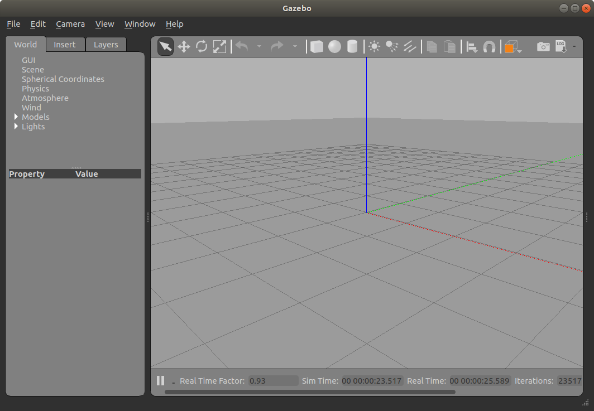
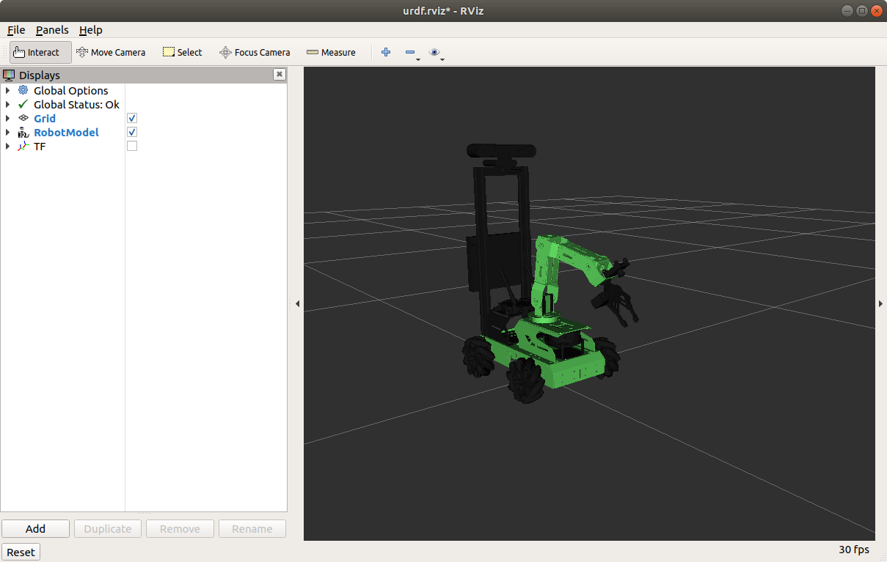
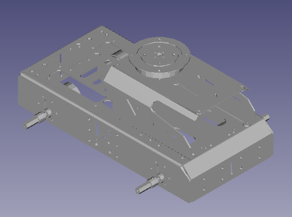
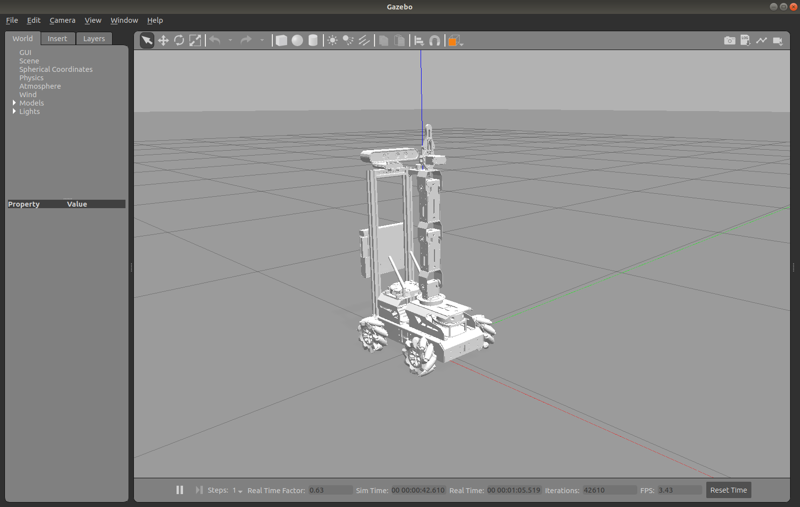
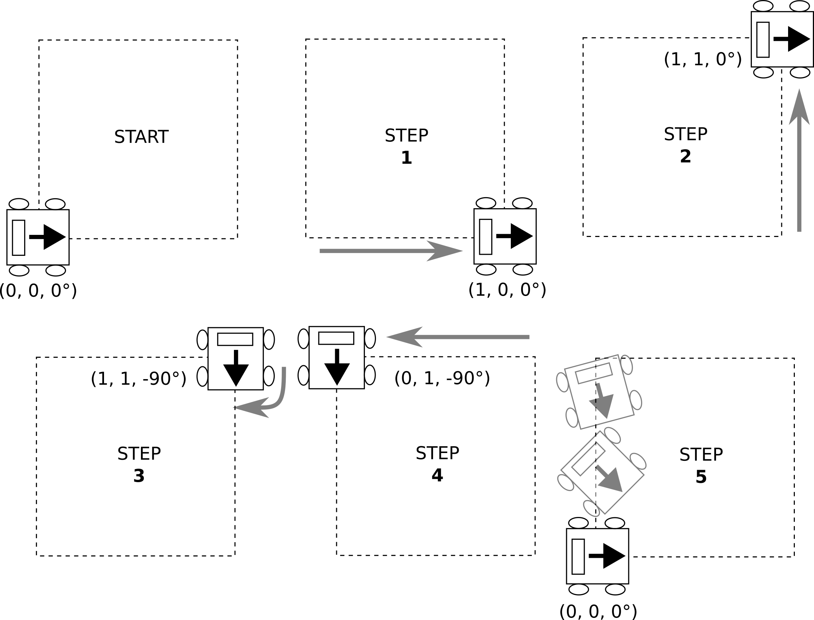
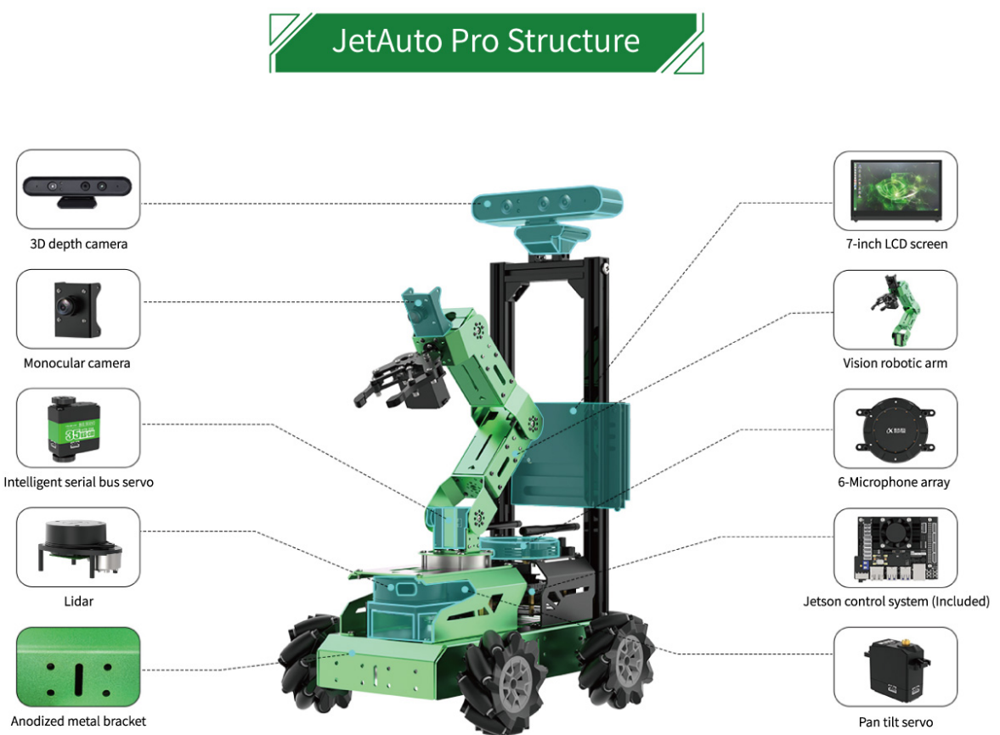

# Lab 4 : Robot Model, Gazebo and JetAuto

Seneca Polytechnic 
SEA700 Robotics for Software Engineers

## Introduction

### URDF

URDF (Unified Robot Description Format) is an XML format for representing a robot model. URDF is commonly used in Robot Operating System (ROS) tools such as RViz (ROS Visualization tool) and Gazebo simulator. It is essentially a 3D model with information about joints, motors, mass, etc. The files are then run through the Robot Operating System (ROS). The data from the file informs the human operator what the robot looks like and is capable of before they begin operating the robot.

More details on the URDF specification can be found [here](http://wiki.ros.org/urdf/XML).

Many robotic manufacturers have URDF models of their devices available for download. These include the [Segway RMP](https://stanleyinnovation.com/rmp-urdf-3d-files/), [TurtleBot](http://wiki.ros.org/turtlebot_description), and [AR10](https://github.com/Active8Robots/AR10/blob/master/ar10_description/urdf/ar10.urdf).

More Models:

- [Agility Robotics Digit](https://github.com/adubredu/DigitRobot.jl)
- [ANYbotics Anymal](https://github.com/ANYbotics/anymal_b_simple_description)
- [Boston Dynamics Spot (via Clearpath ROS Driver)](https://github.com/clearpathrobotics/spot_ros)
- [Clearpath Jackal](https://www.clearpathrobotics.com/assets/guides/kinetic/jackal/description.html)
- [Clearpath Dingo](https://www.clearpathrobotics.com/assets/guides/melodic/dingo/description.html)
- [Clearpath Husky](https://github.com/husky/husky)
- [Clearpath TurtleBot](http://wiki.ros.org/turtlebot_description)
- [Unitree Go1](https://github.com/unitreerobotics/unitree_ros)
- [Universal Robots](https://github.com/UniversalRobots/Universal_Robots_ROS2_Description)

### URDF vs XACRO

URDF (Unified Robot Description Format) and XACRO (XML Macros) are both used in ROS (Robot Operating System) for robot modeling, but they have distinct roles. URDF is a straightforward XML format that describes the physical structure of a robot, detailing its links and joints, as well as their properties like geometry and dynamics. It is ideal for simpler robot designs where the model's complexity is limited. In contrast, XACRO is an extension of URDF that incorporates macros, allowing for parameterization and reducing redundancy in model descriptions. This makes XACRO particularly useful for complex robots or those with interchangeable components, as it facilitates easier maintenance and enhances readability. Typically, XACRO files are processed into URDF files before they are utilized in simulations or applications, combining the flexibility of XACRO with the straightforwardness of URDF.

### RViz

RViz, or Robot Visualization, is a powerful 3D visualization tool used primarily in robotics and the Robot Operating System (ROS). It enables developers to visualize and interpret a wide array of sensor data, such as point clouds, maps, and robot models, in real-time. With its interactive features, users can manipulate objects and adjust visual settings to enhance understanding of robot behavior and performance. RViz's plugin architecture allows for extensibility, accommodating various data types and visualization needs. This makes it an invaluable resource for debugging algorithms, simulating scenarios, and gaining insights into robotic systems, ultimately aiding in the development and refinement of robotics applications.

### Gazebo

Gazebo is an open-source robotics simulation tool that provides a highly realistic environment for testing and developing robotic systems. It allows users to simulate robots in complex 3D environments, complete with detailed physics interactions, which include gravity, collisions, and friction. Gazebo supports a variety of sensors, such as cameras and LIDAR, enabling the generation of realistic sensor data for developing perception algorithms. Its seamless integration with the Robot Operating System (ROS) enhances its functionality, allowing developers to leverage ROS tools and libraries for robot control and communication. With a flexible plugin architecture, Gazebo can be customized to meet specific simulation needs, making it an essential platform for researchers and engineers in the field of robotics.

## Preparation

### JetAuto Robot

In preparation for using the JetAuto robot, please be familiar with the user manual and the basic lesson provided by the manufacturer found here:

- [JetAuto User Manual](JetAuto-User-Manual.pdf)
- [JetAuto & JetAuto Pro Resources](https://drive.google.com/drive/folders/16pwHYO8rK-22oAzStc7-olP9Weq7AbzY)

## Procedures

### Install Gazebo and other ROS packages

After becoming familiar with ROS, we'll now install the Gazebo simulation environment.

1. Install Gazebo version 9.X to be used with ROS Melodic. Each Gazebo version works with a specific version of ROS. More details about the installation can be found [here](https://classic.gazebosim.org/tutorials?tut=install_ubuntu&cat=install).

        sudo apt install gazebo9 libgazebo9-dev

1. Once installed, start Gazebo with the following command to ensure it is functional:

        gazebo

    

    ***Figure 4.1** Gazebo Running*

1. Lastly, ensure the following ROS Gazebo packages are installed:

        sudo apt install ros-melodic-gazebo-dev ros-melodic-gazebo-msgs ros-melodic-gazebo-plugins ros-melodic-gazebo-ros ros-melodic-gazebo-ros-control ros-melodic-gazebo-ros-pkgs ros-melodic-joint-state-publisher ros-melodic-joint-state-publisher-gui ros-melodic-joint-trajectory-controller ros-melodic-moveit ros-melodic-trac-ik-kinematics-plugin ros-melodic-slam-gmapping

### Download the JetAuto Workspace to Local Machine for Simulation

1. For this lab, we'll use the JetAuto workspace `jetauto_ws` on our local virtual machine so we can test the robot locally in a simulation before programming the actual robot.

    [Download jetauto_ws.zip](https://drive.google.com/file/d/1SSaqoji_3H5vm9ZKAljeWPFmDUGfCc_u/view?usp=drive_link) and unzip it to the `jetauto` user's directory: `/home/jetauto/`

    If you downloaded the file on your host machine instead of your virtual machine, you may use WinSCP to transfer the file over to your virtual machine.

    **On your virtual machine:** Open a terminal and ensure `openssh-server` is installed.

        sudo apt-get install openssh-server

    Enable and start SSH as necessary:

        sudo systemctl enable ssh
        sudo systemctl start ssh
    
    **On your host machine:** Open WinSCP and connect to: 127.0.0.1 port 22.

    Copy the `jetauto_ws` folder from `jetauto_ws.zip` into `/home/jetauto/`.

1. Once `jetauto_ws` is on your virtual machine's `jetauto` user directory, let's add it as a source in `~/.bashrc`.

    First, we need to change the workspace setup script to be an executable:
    
        sudo chmod +x /home/jetauto/jetauto_ws/devel/_setup_util.py

    Then:

        echo "source /home/jetauto/jetauto_ws/devel/setup.bash" >> ~/.bashrc

    Use `nano` to check if the `source` line got added to the end of `~/.bashrc`

        nano ~/.bashrc

### JetAuto Robot Model

Now that the JetAuto robot workspace is on the virtual machine, let's try to simulate it in Gazebo. A robot model in URDF consists of links that are joined together to form a robot assembly. Each link has its given geometry, mass, and collision parameters. The geometry can be provided as a simple shape or a complex shape using a solid model.

1. Before we start, let's ensure (double-check) we have the required packages installed (if you haven't installed them from the beginning of this lab) to view and test our robot model:

        sudo apt install ros-melodic-joint-state-publisher ros-melodic-joint-state-publisher-gui ros-melodic-joint-trajectory-controller

1. Next, we need to set some environment variables that our launch script will look for. Edit the system's environment variables:

        sudo gedit /etc/environment

    We'll add the following in the environment:

        LIDAR_TYPE="A1"
        DEPTH_CAMERA_TYPE="AstraProPlus"
        MACHINE_TYPE="JetAutoPro"
        HOST="/"
        MASTER="/"

    **Restart your virtual machine in order for the changes to take effect.**

1. Now, let's have a quick view of the URDF model. We can use RViz for visualization. A launch file allows us to start multiple nodes at once as well as define other attributes.

        roslaunch jetauto_description display.launch model:=urdf/jetauto.urdf

    You may inspect this particular launch file at the following location:

    **~/jetauto_ws/src/jetauto_simulations/jetauto_description/launch/display.launch**

    In it, you'll find it starts three nodes:

    - joint_state_publisher_gui
    - robot_state_publisher
    - rviz

    You can find more information about `roslaunch` and `.launch` files in the official ROS tutorials: [roslaunch](https://wiki.ros.org/roslaunch) and [Roslaunch tips for large projects](https://wiki.ros.org/ROS/Tutorials/Roslaunch%20tips%20for%20larger%20projects).

1. Once RViz is started, you can use the `joint_state_publisher_gui` to adjust the arm angle.

    

    ***Figure 4.3** JetAuto in RViz* *(Note: The original image caption said "JetAuto in Gazebo", but the context and image refer to RViz)*

1. Let's open up the JetAuto URDF model file to take a closer look at it.

    **~/jetauto_ws/src/jetauto_simulations/jetauto_description/urdf/jetauto_car.urdf.xacro**

    Here, we see a file in XML format:

        <robot name="jetauto" xmlns:xacro="http://ros.org/wiki/xacro" >
            <xacro:property name="M_PI"               value="3.1415926535897931"/>
            <xacro:property name="base_link_mass"     value="1.6" /> 
            <xacro:property name="base_link_w"        value="0.297"/>
            <xacro:property name="base_link_h"        value="0.145"/>
            <xacro:property name="base_link_d"        value="0.11255"/>

            <xacro:property name="wheel_link_mass"    value="0.1" />
            <xacro:property name="wheel_link_radius"  value="0.049"/>
            <xacro:property name="wheel_link_length"  value="0.04167"/>

    The first few lines define the robot's name and the basic parameters of the JetAuto's body.
    
    - `M_PI` defines the value of π.
    - `base_link_mass` defines the mass of the JetAuto’s body model.
    - `base_link_w` defines the width of the JetAuto’s body model.
    - `base_link_h` defines the height of the JetAuto’s body model.
    - `base_link_d` defines the length of the JetAuto’s body model.
    - `wheel_link_mass` defines the mass of each Mecanum wheel.
    - `wheel_link_radius` defines the radius of each Mecanum wheel.

    The name of the robot is also defined as `jetauto`.
    
        <link name="base_footprint"/>

        <joint name="base_joint" type="fixed">
            <parent link="base_footprint"/>
            <child link="base_link"/>
            <origin xyz="0.0 0.0 0.0" rpy="0 0 0"/>
        </joint>

    `base_footprint` is defined as the top parent link (part) of the JetAuto model to create an overall envelope that sits at the origin. `base_link` is the base part of the robot that houses the battery and motor. In the URDF model, it is connected to `base_footprint` as a child link. This envelope configuration ensures the wheels of the robot will always be above the origin (ground).

        <link
            name="base_link">
            <xacro:box_inertial m="${base_link_mass}" w="${base_link_w}" h="${base_link_h}" d="${base_link_d}"/>
            <visual>
                <origin
                    xyz="0 0 0"
                    rpy="0 0 0" />
                <geometry>
                    <mesh
                        filename="package://jetauto_description/meshes/base_link.stl" />
                </geometry>
                <material name="green"/>
            </visual>
            <collision>
                <origin
                    xyz="${base_link_w/2.0 - 0.14810} 0 ${0.126437/2 + 0.02362364}"
                    rpy="0 0 0" />
                <geometry>
                    <box size="${base_link_w} ${base_link_h} ${base_link_d}" />
                </geometry>
            </collision>
        </link>

    Next is the link/part `base_link` along with its elements. The mass and inertial information of the part is defined as an XACRO element. The `geometry` sub-element in the `visual` element is provided by an `stl` mesh file from the `jetauto_description` package. The `collision` element is also defined as a box relative to the specified XYZ coordinate.

    

    ***Figure 4.4** JetAuto base_link STL*

        <link
            name="back_shell_link">
            <inertial>
            <origin
                xyz="-1.22838595456587E-05 0.00218574826309681 -0.0500522861933898"
                rpy="0 0 0" />
            <mass
                value="0.0663478534899862" />
            <inertia
                ixx="5.65277934912267E-05"
                ixy="-5.13394387877366E-11"
                ixz="-4.07561372273553E-11"
                iyy="4.33740893441632E-05"
                iyz="-5.43059341238134E-06"
                izz="6.86642544694324E-05" />
            </inertial>
            <visual>
                <origin
                    xyz="0 0 0"
                    rpy="0 0 0" />
                <geometry>
                    <mesh
                    filename="package://jetauto_description/meshes/back_shell_link.stl" />
                </geometry>
                <material name="black">
                </material>
            </visual>
            <collision>
                <origin
                    xyz="0 0 0"
                    rpy="0 0 0" />
                <geometry>
                    <mesh
                    filename="package://jetauto_description/meshes/back_shell_link.stl" />
                </geometry>
            </collision>
        </link>
        <joint
            name="back_shell_joint"
            type="fixed">
            <origin
                xyz="-0.076481 0 0.082796"
                rpy="-3.1416 0 1.5708" />
            <parent
                link="base_link" />
            <child
                link="back_shell_link" />
            <axis
                xyz="0 0 0" />
        </joint>

    The `back_shell_link` is the part that houses the Jetson Nano, the expansion board, and mounts the antenna. All the elements are defined in a similar manner as `base_link`, and it is defined as a child link of `base_link` with its relative position defined in `joint`.

    The `wheel_XXX_link` are all defined in a similar manner.

1. The JetAuto URDF model file above only defines the mechanical structure of the robot. If we take a look at the URDF file for simulating the robot in Gazebo, we will find more links that are used and defined in other URDF files within the same package.

    **~/jetauto_ws/src/jetauto_simulations/jetauto_description/urdf/jetauto.xacro**

1. If you are interested in building a URDF from scratch, visit the ROS tutorial [here](https://wiki.ros.org/urdf/Tutorials).

1. Close all terminals.

### Running JetAuto robot in Gazebo

1. In a terminal, launch:

        roslaunch jetauto_gazebo worlds.launch

    Gazebo should run, and you should see the JetAuto robot in the simulation environment.

    

    ***Figure 4.5** JetAuto in Gazebo*

1. With Gazebo and ROS running, we can now control the virtual robot the same way as the physical robot.

    Let's try publishing to the `cmd_vel` topic. Open a new terminal and run:

        rostopic pub -1 /jetauto_controller/cmd_vel geometry_msgs/Twist '{linear: {x: 0.1, y: 0.0, z: 0.0}, angular: {x: 0.0, y: 0.0, z: 0.0}}'

    Stop the robot:

        rostopic pub -1 /jetauto_controller/cmd_vel geometry_msgs/Twist '{linear: {x: 0.0, y: 0.0, z: 0.0}, angular: {x: 0.0, y: 0.0, z: 0.0}}'

    Do you notice the JetAuto robot listens to the same `cmd_vel` topics and uses the same `Twist` message as `TurtleSim`?

1. Let's inspect the source code of the motion controller to take a closer look. Open the file at the following path:

    **~/jetauto_ws/src/jetauto_driver/jetauto_controller/scripts/jetauto_controller_main.py**

    As we can see in the controller code:

        linear_x = self.go_factor*msg.linear.x
        linear_y = self.go_factor*msg.linear.y
        angular_z = self.turn_factor*msg.angular.z
        
        speed_up = False
        if abs(self.last_linear_x - linear_x) > 0.2 or abs(self.last_linear_y - linear_y) > 0.2 or abs(self.last_angular_z - angular_z) > 1:
            speed_up = True
        
        self.last_linear_x = linear_x
        self.last_linear_y = linear_y
        self.last_angular_z = angular_z

        linear_x_, linear_y_ = linear_x * 1000.0, linear_y * 1000.0 #mm to m
        speed = math.sqrt(linear_x_ ** 2 + linear_y_ ** 2)
        direction =  math.atan2(linear_y_, linear_x_)
        direction = math.pi * 2 + direction if direction < 0 else direction
        self.mecanum.set_velocity(speed, direction, angular_z, speed_up=speed_up)

    The `Twist` message from `cmd_vel` provides the necessary information to calculate `speed`, `direction`, and `angular_z` for controlling the Mecanum wheels using the `MecanumChassis` object.

    Refer to [JetAuto & JetAuto Pro Resources](https://drive.google.com/drive/folders/16pwHYO8rK-22oAzStc7-olP9Weq7AbzY) chapter 7.3 for the working principle of the Mecanum wheel.

1. Try other various combinations of motion commands to gain a better understanding of the robot's movement, such as changing the linear values for both `x` and `y` as well as the angular values.

1. Next, we'll try controlling the JetAuto robot using keyboard input. In a new/other terminal, run:

        roslaunch jetauto_peripherals teleop_key_control.launch robot_name:="/"

    Use w, a, s, d to control the robot.

    **Troubleshooting:** If you get a `No module named 'rospkg'` error, it means there are some errors with the python interpretor and the ROS package. First, ensure `rospkg` is installed:

        sudo apt install python-rospkg

    **Troubleshooting:** If the problem presist, try removing `python-rospkg` which will also remove a long list of `ros` modules. Then re-install ROS.

        sudo apt remove python-rospkg
        sudo apt install ros-melodic-desktop-full

    **Make sure you re-install all the dependency at the start of this lab as well.**
    
1. Inspect the source code of the teleop controller to understand its operation by opening the file at:

    **~/jetauto_ws/src/jetauto_peripherals/scripts/teleop_key_control.py**

### Lab Exercise - Part 1

1. Modify the controller you created from [lab3](lab3.md) (or create a new one) so it will publish to the `/jetauto_controller/cmd_vel` topic for controlling the JetAuto robot in Gazebo.

    **Hint:** You can follow the same approach as Lab 3 by creating a new package called `lab4_jetauto_control` in your `ros_ws`.

        catkin_create_pkg lab4_jetauto_controller rospy geometry_msgs

    Refer to the `teleop_key_control.py` controller you used in this lab on how to publish to the JetAuto nodes.

1. Write your own code (or use open-source code, AI-generated code but becareful as they might not understand the movement description) to create a control script as described below to make the JetAuto robot move according to a pattern in Gazebo.

    Write code that will move the JetAuto robot in a roughly 1-meter square shape pattern as follows:

    

    ***Figure 1** Square Movement Pattern*

    Start:

    1. Move forward from (0, 0, 0°) to (1, 0, 0°) facing the direction of travel; then
    2. Move left sideway from (1, 0, 0°) to (1, 1, 0°) without turning, so the robot is facing the outside of the square; then
    3. Turn clockwise from (1, 1, 0°) to (1, 1, -90°) to face into the square; then
    4. Move right sideway from (1, 1, -90°) to (0, 1, -90°) facing the inside of the square; then
    5. Move forward and turn from (0, 1, -90°) to (0, 0, 0°) by rotating the robot while traveling.

    Repeat this 2 times after a start command (such as a keyboard input) is given.

    For example: after launching the JetAuto in Gazebo, when you run `rosrun lab4_jetauto_movement jetauto_movement`, it will ask for input before performing the above action.

    **Hint:** You can follow the same approach as Lab 3 by creating a new package called `lab4_jetauto_movement` in your `ros_ws`.

            catkin_create_pkg lab4_jetauto_movement rospy geometry_msgs

    Refer to the `teleop_key_control.py` controller you used in this lab on how to publish to the JetAuto nodes.

### JetAuto Robot Inspection (Only after completion of Lab Question - Part 1)

The robot we are using for this course is the JetAuto Pro assembled in the configuration:

***Figure 4.2** JetAuto Pro*

1. Before using the JetAuto robot, read the following:

    - [JetAuto User Manual](JetAuto-User-Manual.pdf)
        - Page 01: Guide to Battery Safety
        - Page 03: JetAuto Pro Standard Kit Packing List
        - Page 04-09: Installation Instruction (except for 1.4 LCD)
            - Check all nuts and bolts to ensure confirm installation and security
        - Page 10-11: Charging and Starting the Robot

    We will NOT be using the smartphone app for controlling the robot.

1. Go through "1.2 Install 3D Depth Camera" on Page 4 to "2. Start the Robot" on Page 10-11. We will NOT be using the smartphone app for controlling the robot.

    **NOTE:** All the cables, nuts, and bolts are already installed. You are to validate that they are not missing or loose.

### SSH into the JetAuto Robot

**Copy this lab instruction somewhere on your computer as you'll lose connection to the internet!**

1. By default, the JetAuto is configured to be in Wifi AP mode. Power on the robot and connect to the robot's WiFi starting in "HW-". If you are unsure of which Wifi SSID is your robot broadcasting, open the "Tool" application on the robot and look for the AP name in the setting. Do NOT change any of the default settings.

    The password for the WiFi connection is: **hiwonder**

    Remember, the Wifi AP from the JetAuto have no access to the internet so it's alright to see "No Internet" or similar warning when connecting to it.

1. If your robot is making a high pitch beeping sound, that means the battery voltage is low. Plugging the robot into it's charger should solve the problem but if the battery haven't been charged for a while, you might need to leave the robot off and charge it for 10-15 minutes before powering it on.

1. Once connected, use terminal (or PuTTY) to SSH into the robot at "192.168.149.1".

        ssh jetauto@192.168.149.1

    The user is: **jetauto**, and the password is: **hiwonder**

    #### Option 2: USB connection with the robot

    1. It is also possible to connect with the robot via USB using the Jetson Nano's micro-B USB port if you do not want to loose internet connection. However, you'll only be aable to use the command line interface with this method.

    1. Use `screen` or similar serial terminal application to connection with the robot.

            sudo apt-get install -y screen
            sudo screen /dev/ttyACM0 115200

        **NOTE:** The port name may vary.

### Remote Desktop into the JetAuto Robot

1. **Only recommended to be used on within your virtual machine.** For security, do not install NoMachine on your host computer and stop the NoMachine server after your installation.

    NoMachine is a tool that allows for remote desktop and access. It is a powerful tool that is pre-installed on the JetAuto image but use with caution as it will also automatically create a start a remote access server after installaion open up your machine for remote connection.

    Disconnect your computer from the JetAuto robot and re-connect to the internet to [Download and Install NoMachine](https://downloads.nomachine.com/everybody/).

1. After installing NoMachine, reconnect to JetAuto's Wifi AP and you should be able to search for the JetAuto robot from NoMachine.
    
    Once you are connected with the robot, the credential is the same as above.

1. Now that you have two methods in connecting with the JetAuto robot, you may use either one to control the robot. Keep in mind, the SSH method is running off your virtual machine and connecting to JetAuto using command line where the NoMachine is connecting to JetAuto robot's actual desktop (remote desktop). GUI tools such as RViz will not work on command line interface.

1. To conserve battery life, once you've connected to your robot, you may unplug the LCD screen but remember that the LCD screen must be plugged in during power on in order for the robot to detect it for displaying the desktop.

### JetAuto Robot Movement

<ul>
<li>Ensure the battery charging cable is UNPLUGGED and all cables on the robot are secure.</li>
<li>Ensure all structures, nuts and bolts on the robot are tightly fastened.</li>
<li>Ensure the robot is on the ground and awy from any obstacles.</li>
</ul>

1. In a terminal that's connected to the JetAuto robot using SSH or in JetAuto's terminal using remote desktop, stop the app service then start the `jetauto_controller` service:

    You must stop this service everytime you want to control the robot using your own script through ROS because the JetAuto robot automatically start an App service to allow for control using an Android or iOS application.

        sudo systemctl stop start_app_node.service

    Launch the robot controller for controlling the robot's hardware.

        roslaunch jetauto_controller jetauto_controller.launch

1. Now that the controller service has started, we can publish move command as Twist message to the motion controller (similar to what we did in lab 4). Before publishing a command to the robot, remember you must issue a stop command for the robot to stop. Let's issue the stop command first so you can recall it faster.

        rostopic pub -1 /jetauto_controller/cmd_vel geometry_msgs/Twist '{linear: {x: 0.0, y: 0.0, z: 0.0}, angular: {x: 0.0, y: 0.0, z: 0.0}}'

    Your robot should not do anything.

1. Place the robot on the ground and be ready to issue the stop command immediately after. Issue a move command to the robot in the x-direction (forward) at 0.3 m/s, `x: 0.3`:

        rostopic pub -1 /jetauto_controller/cmd_vel geometry_msgs/Twist '{linear: {x: 0.1, y: 0.0, z: 0.0}, angular: {x: 0.0, y: 0.0, z: 0.0}}'

    Your robot should now start moving. Be ready to stop the robot by issuing (or up arrow twice):

        rostopic pub -1 /jetauto_controller/cmd_vel geometry_msgs/Twist '{linear: {x: 0.0, y: 0.0, z: 0.0}, angular: {x: 0.0, y: 0.0, z: 0.0}}'

    

    <ul>
    <li>DO NOT set the movement value above 0.7 m/s to keep the robot within its control limit.</li>
    </ul>
    

    The linear values refer to the translation of the robot. Positive X is forward and positive Y is left. There is no Z-direction for this robot. Do not exceed 0.7 m/s.

    The angular values refer to the rotation of the robot. Only Z-rotation is considered with positive value as counter-clockwise. Do not exceed 3.5 rad/s.

1. Next, try using the controller you created in Lab 4 to control the robot by copying you Lab 4 workspace over to the home directory on the JetAuto robot. You do not need to copy the `jetauto_ws` workspace as it's already on the JetAuto robot. You may use ssh, sftp, winscp, or any file transfer method.

1. Once your new workspace is on the JetAuto robot, source it the same way as how you've done it in Lab 3 and Lab 4. Afterward, you'll be able to run the script just like how you've run it on Gazebo.

## Lab Exercise - Part 2

1. Modify your code from Part 1 so you can control your robot using the new controller script as well as movement pattern script so the JetAuto robot will move in a real-world roughly 1-meter square shape pattern as shown below. Remember, you'll be implementing it on the physical JetAuto robot so the dyanmics will not be the same. ie. You robot will most likely under or overshoot the movement.

## Reference

- [ROS Tutorials](https://wiki.ros.org/ROS/Tutorials)
- [What is the Unified Robotics Description Format (URDF)?](https://formant.io/resources/glossary/urdf/)
- EECS 106A Labs