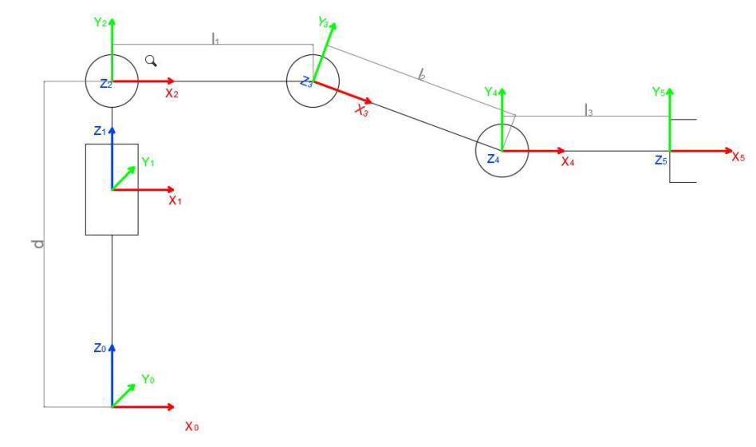
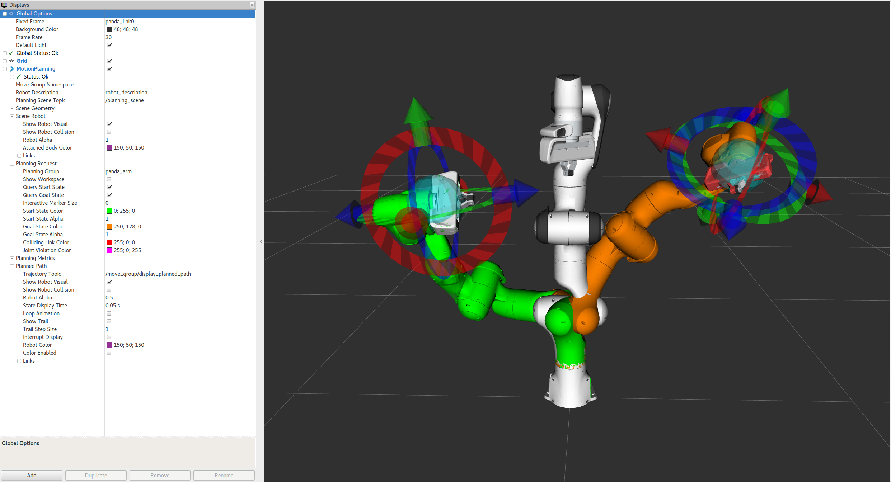
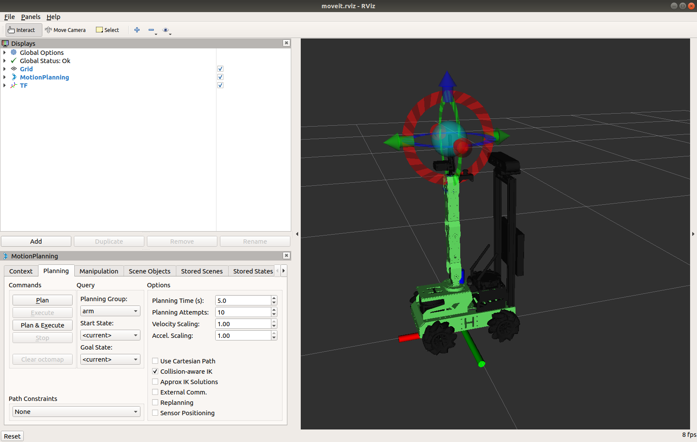
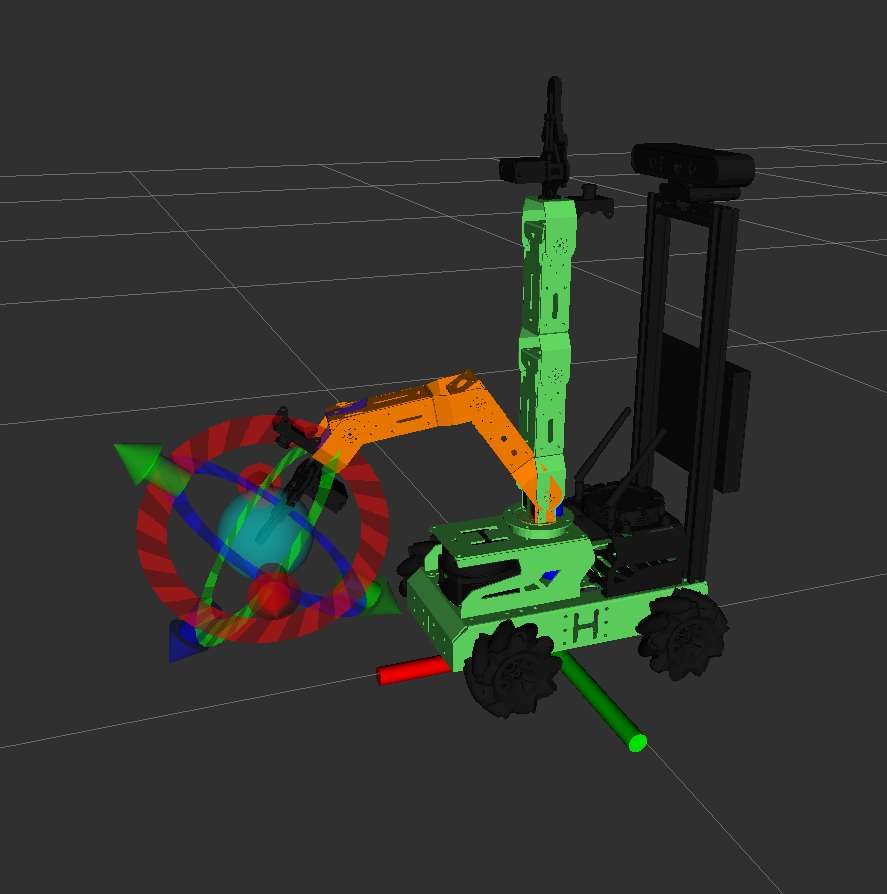
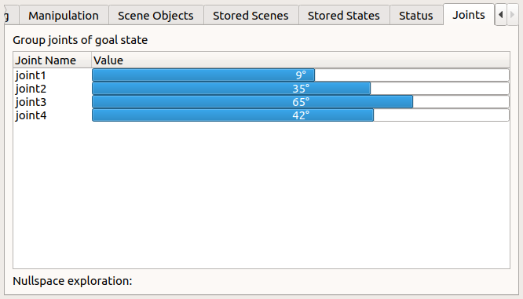
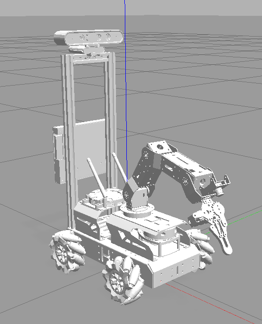
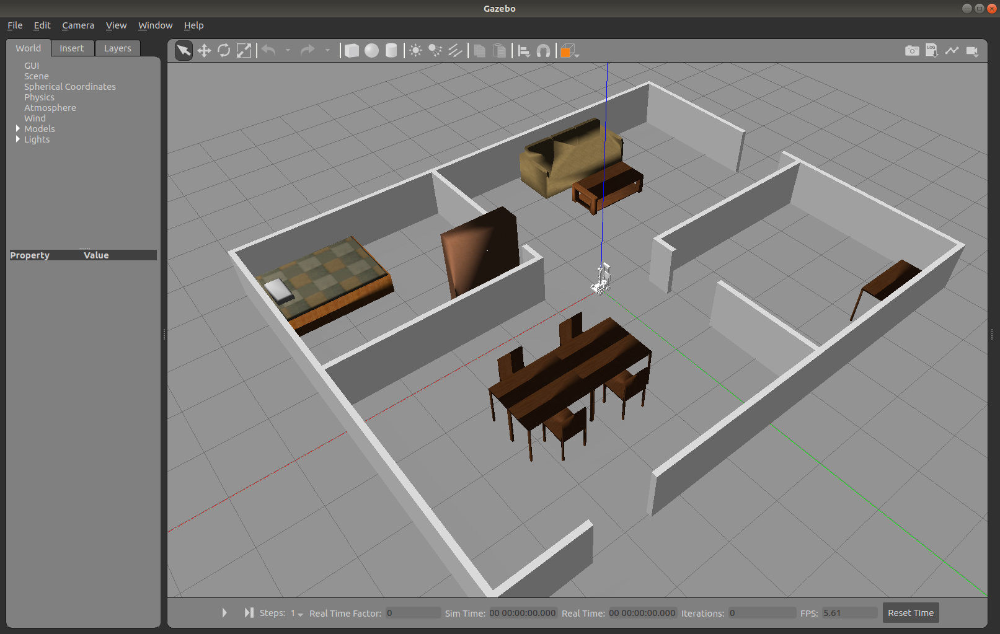
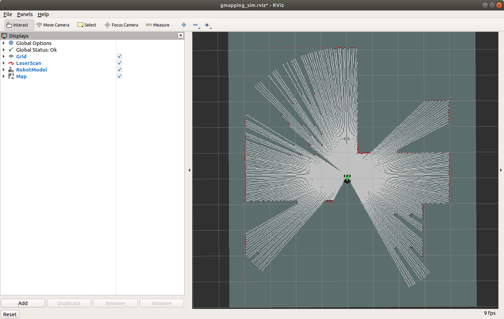

# Lab 5 : Robotic Arm and SLAM

Seneca Polytechnic 
SEA700 Robotics for Software Engineers

## Forward Kinematics

As discussed in lecture, the forward kinematics problem involves fnding the confguration of a specifed link in a
robotic manipulator relative to some other reference frame, given the angles of each of the joints in the manipulator.

### Denavit–Hartenberg (DH) Parameters

In mechanical engineering, the Denavit–Hartenberg parameters (also called DH parameters) are the four parameters associated with a particular convention for attaching reference frames to the links of a spatial kinematic chain, or robot manipulator. In this convention, coordinate frames are attached to the joints between two links such that one transformation is associated with the joint \([Z]\), and the second is associated with the link \([X]\). The coordinate transformations along a serial robot consisting of n links form the kinematics equations of the robot:

$$
[T] = [Z_1][X_1][Z_2][X_2]...[Z_{n-1}][X_{n-1}][Z_n][X_n]
$$

where \([T]\) is the transformation that characterizes the location and orientation of the end-link.

***Figure 5.1** DH Kinematics Links*

As shown in the figure above, each joints (i-1, i, and i+1) has a unique line \(S\) (shown as dotted line in the figure above) in space that forms the joint axis and define the relative movement of its two links. For each sequence of lines \(S_i\) and \(S_{i+1}\), there is a common normal line \(A_{i, i+1}\).

By convention:

- \(z\)-direction is the joint axes \(S\). \(z_i\) describe the joint attached to the end of \(\textrm{Link}_i\).
- \(x\)-direction is the common normal \(A\). \(x_i = z_{i} \times z_{i-1}\) is the common normal \(A_{i, i+1}\). If there are no unqiue common normal, \(d_i\) below become a free parameter and can be defined by joint configuration.
- \(y\)-direction is third direction using right-hand rule.

> #### Four Parameters

> The following four transformation parameters (labelled in red text in the figure above) are known as the DH parameters:
>
> **Descriptions of the Joint**
>
>   - \(d_i\): sliding / offset along the joint axis \(S_i\) (\(z_{i-1}\)) from the old common normal \(A_{i-1, i}\) (\(x_{x-1}\)) to the common normal \(A_{i, i+1}\) (\(x_i\))
>   - \(\theta_i\): rotation about joint axis \(S_i\) (\(z_{i-1}\)) from the old common normal \(A_{i-1, i}\) (\(x_{x-1}\)) to the common normal \(A_{i, i+1}\) (\(x_i\))
>
> **Physical Dimensions of the Link**
>
>   - \(a_i\) (or \(r_i\)): arm length / length along the common normal \(A_{i, i+1}\) (\(x_i\)) from the joint axis \(S_i\) (\(z_{i-1}\)) to the next joint axis \(S_{i+1}\) (\(z_i\)) at the end of \(\textrm{Link}_i\)
>   - \(\alpha_i\): rotation about the common normal \(A_{i, i+1}\) (\(x_i\)) from the joint axis \(S_i\) (\(z_{i-1}\)) to the next joint axis \(S_{i+1}\) (\(z_i\)) at the end of \(\textrm{Link}_i\)

This convention allows the definition of the movement of links around a common joint axis \(S_i\) by the screw displacement:

$$
[Z_i] =
\begin{bmatrix}
    cos \theta_i & -sin \theta_i & 0 & 0 \\
    sin \theta_i & cos \theta_i & 0 & 0 \\
    0 & 0 & 1 & d_i \\
    0 & 0 & 0 & 1
\end{bmatrix}
$$

Each of these parameters could be a constant depending on the structure of the robot. Under this convention the dimensions of each link in the serial chain are defined by the screw displacement around the common normal \(A_{i, i+1}\) from the joint \(S_i\) to \(S_{i+1}\), which is given by:

$$
[X_i] =
\begin{bmatrix}
    1 & 0 & 0 & a_{i, i+1} \\
    0 & cos \alpha_{i, i+1} & -sin \alpha_{i, i+1} & 0 \\
    0 & sin \alpha_{i, i+1} & cos \alpha_{i, i+1} & 0 \\
    0 & 0 & 0 & 1
\end{bmatrix}
$$

where \(\alpha_{i, i+1}\) and \(a_{i, i+1}\) define the physical dimensions of the link in terms of the angle measured around and distance measured along the x-axis.

### JetAuto Arm Forward Kinematics

***Figure 5.2** JetAuto Arm Links*

The figure above shows the kinematic link diagram of the JetAuto arm. Let's create the DH parameters table for the first two joints:

- Joint-0 is the base platform and will be used as the global reference.
- Joint-1 is the rotation platform of the robotics arm. It's a rotary joint about the joint axis (\(\z_0\)). Therefore, only \(\theta_1\) (angle between \(\x_0\) and \(\x_1\)) is non-zero. We can assume that Joint-1 is at the same position as Joint-0.
- Joint-2 is the rotation of the first segment of the robotics arm. It is a rotary joint with a distance, \(d\), offset from Joint-1 (Joint-0). There is a 90° change between the Joint-1 (z_1) and Joint-2 axis (z_2). Therefore, \(\alpha_2 = 90°\) (angle between z_1 and z_2 about x_2). It will also have a rotation about the Joint-2 axis (z_2), \(\theta_2\) (angle between x_1 and x_2).

Putting this all together yield the following DH parameters table:

***Table 5.1** JetAuto DH Parameters Table*

| DH# | d | θ | a | α |
|---|---|---|---|---|
| 1 | 0 | \(\theta_1\) | 0 | 0 |
| 2 | \(d\) | 0 | 0 | -\(\pi / 2\) |
| 3 | | | | |
| 4 | | | | |

## ROS MoveIt

ROS MoveIt is a powerful software framework designed for robot motion planning and manipulation within the Robot Operating System (ROS) ecosystem. It provides a robust set of tools and libraries that enable developers to implement complex motion planning algorithms, manage robot kinematics, and execute real-time motion tasks. With features such as collision detection, trajectory optimization, and support for various robotic platforms, MoveIt simplifies the process of programming robots to perform intricate movements. Its flexibility and extensibility make it a popular choice for both research and industrial applications, allowing users to create sophisticated robotic solutions tailored to specific needs.

***Figure 5.3** ROS MoveIt*

More details on MoveIt can be found [here](https://docs.ros.org/en/melodic/api/moveit_tutorials/html/index.html).

## Simultaneous Localization and Mapping (SLAM)

Simultaneous localization and mapping (SLAM) is the computational problem of constructing or updating a map of an unknown environment while simultaneously keeping track of an agent's location within it.Popular approximate solution methods include the particle filter, extended Kalman filter, covariance intersection, and GraphSLAM. SLAM algorithms are based on concepts in computational geometry and computer vision, and are used in robot navigation, robotic mapping and odometry for virtual reality or augmented reality.

SLAM algorithms are tailored to the available resources and are not aimed at perfection but at operational compliance. Published approaches are employed in self-driving cars, unmanned aerial vehicles, autonomous underwater vehicles, planetary rovers, newer domestic robots and even inside the human body.

### JetAuto Robot Arm Control

1. Before controlling JetAuto's robot arm, let make sure we have all the package necessary installed. We'll also install the GMapping package for the second part of this Lab. Open a terminal and run the following command:

        sudo apt install ros-melodic-moveit ros-melodic-trac-ik-kinematics-plugin ros-melodic-slam-gmapping ros-melodic-map-server ros-melodic-amcl ros-melodic-move-base ros-melodic-global-planner

1. First, we'll try simulating JetAuto's robot arm in ROS using MoveIt along with a gazebo model. Open terminal and run:

        roslaunch jetauto_moveit_config demo_gazebo.launch fake_execution:=false

    This should load a RViz and a Gazebo windows. By provide the `false` to the `fake_execution` argument, we'll be able to move the robot arm in the Gazebo model as well.

    

    ***Figure 5.4** JetAuto MoveIt*

    The top left Panel labelled "Displays" is the RViz Tool Bar, the bottom left Panel labelled "MotionPlanning" is the MoveIt Tool Area, the right Panel is the Simulation view. In the Simulation view, you can use your mouse (rigth click, left click, middle click, and wheel) to adjust the view.

1. Select the **"Planning"** tab in MoveIt and ensure the **"Planning Group"** is "arm". Move the model in the Simulation view around to set the joint goal of the arm:

    - The Blue ball control the position of the end effector in 3d space
    - The Red Arrow control the y-axis of the end effector
    - The Green Arrow control the x-axis of the end effector
    - The Blue Arrow control the z-axis of the end effector

    Remember, once the arm is moved, the axis refer to the end effector's frame of reference.

    

    ***Figure 5.5** JetAuto MoveIt Planning*

    When you set the goal for the robot arm, MoveIt performs inverse kinematics (IK) to determine the configuration for each joint to reach the goal. When calculating the IK, collisions with other parts of the robot are already taken into consideration. If there are any anticipated collisions, they are indicated in red.

1. You can also also perform forward kinematics by scrolling over to the **"Joints"** tab in MoveIt to view and adjust the goal rotation angle of each joint.

    

    ***Figure 5.6** JetAuto MoveIt Planning Joints*

1. Once you are ready with the position for the arm to move to, go back to the **"Planning"** tab and click **"Plan & Execute"**. You should see the model move from the current state to the goal state. The gazebo model should move as well.

    

    ***Figure 5.7** JetAuto MoveIt Planning Gazebo View*

1. (Optional) If you want, you can go through the demo videos and lessions provided by the manufacturer to gain a better understanding on the robot arm.

    [JetAuto & JetAuto Pro Resources](https://drive.google.com/drive/folders/16pwHYO8rK-22oAzStc7-olP9Weq7AbzY)
    
    - Chapter 15.1 All Lesson
    - Chapter 15.2
        - Lesson 2 - [Demo Video](https://youtu.be/OQAjGv3DnG4)
        - Lesson 3 - [Demo Video](https://youtu.be/99P79cR54tE)
        - Lesson 4
        - Lesson 5 - [Demo Video](https://youtu.be/e-AjB7BJyoo)
        - Lesson 6 - [Demo Video](https://youtu.be/vNk_7Xl6QTw)
        - Lesson 7 - [Demo Video](https://youtu.be/TChFPe_zgd8)
        - Lesson 8 - [Demo Video](https://youtu.be/n7zQQqZfCtU)

    #### MoveIt Python Interface

1. Next, let's use a Python interface to work with MoveIt. Build a new ROS package in your `ros_ws` workspace and put the following script into your package and call it **move_group_python_interface_tutorial.py**.

    This script is from the [MoveIt Tutorial](https://docs.ros.org/en/melodic/api/moveit_tutorials/html/doc/move_group_python_interface/move_group_python_interface_tutorial.html) using the Panda robot but changed to work with the JetAuto robot.

        #!/usr/bin/env python

        import sys
        import copy
        import rospy
        import moveit_commander
        import moveit_msgs.msg
        import geometry_msgs.msg
        from math import pi
        from std_msgs.msg import String
        from moveit_commander.conversions import pose_to_list
        ## END_SUB_TUTORIAL

        def all_close(goal, actual, tolerance):
            """
            Convenience method for testing if a list of values are within a tolerance of their counterparts in another list
            @param: goal       A list of floats, a Pose or a PoseStamped
            @param: actual     A list of floats, a Pose or a PoseStamped
            @param: tolerance  A float
            @returns: bool
            """
            all_equal = True
            if type(goal) is list:
                for index in range(len(goal)):
                    if abs(actual[index] - goal[index]) > tolerance:
                        return False

            elif type(goal) is geometry_msgs.msg.PoseStamped:
                return all_close(goal.pose, actual.pose, tolerance)

            elif type(goal) is geometry_msgs.msg.Pose:
                return all_close(pose_to_list(goal), pose_to_list(actual), tolerance)

            return True

        class MoveGroupPythonIntefaceTutorial(object):
            """MoveGroupPythonIntefaceTutorial"""
            def __init__(self):
                super(MoveGroupPythonIntefaceTutorial, self).__init__()

                ## BEGIN_SUB_TUTORIAL setup
                ##
                ## First initialize `moveit_commander`_ and a `rospy`_ node:
                moveit_commander.roscpp_initialize(sys.argv)
                rospy.init_node('move_group_python_interface_tutorial', anonymous=True)

                ## Instantiate a `RobotCommander`_ object. Provides information such as the robot's
                ## kinematic model and the robot's current joint states
                robot = moveit_commander.RobotCommander()

                ## Instantiate a `PlanningSceneInterface`_ object.  This provides a remote interface
                ## for getting, setting, and updating the robot's internal understanding of the
                ## surrounding world:
                scene = moveit_commander.PlanningSceneInterface()

                ## Instantiate a `MoveGroupCommander`_ object.  This object is an interface
                ## to a planning group (group of joints).  In this tutorial the group is the primary
                ## arm joints in the Panda robot, so we set the group's name to "panda_arm".
                ## If you are using a different robot, change this value to the name of your robot
                ## arm planning group.
                ## This interface can be used to plan and execute motions:
                ##group_name = "panda_arm"
                group_name = "arm"
                move_group = moveit_commander.MoveGroupCommander(group_name)

                ## Create a `DisplayTrajectory`_ ROS publisher which is used to display
                ## trajectories in Rviz:
                display_trajectory_publisher = rospy.Publisher('/move_group/display_planned_path',
                                                                moveit_msgs.msg.DisplayTrajectory,
                                                                queue_size=20)

                ## END_SUB_TUTORIAL

                ## BEGIN_SUB_TUTORIAL basic_info
                ##
                ## Getting Basic Information
                ## ^^^^^^^^^^^^^^^^^^^^^^^^^
                # We can get the name of the reference frame for this robot:
                planning_frame = move_group.get_planning_frame()
                print "============ Planning frame: %s" % planning_frame

                # We can also print the name of the end-effector link for this group:
                eef_link = move_group.get_end_effector_link()
                print "============ End effector link: %s" % eef_link

                # We can get a list of all the groups in the robot:
                group_names = robot.get_group_names()
                print "============ Available Planning Groups:", robot.get_group_names()

                # Sometimes for debugging it is useful to print the entire state of the
                # robot:
                print "============ Printing robot state"
                print robot.get_current_state()
                print ""
                ## END_SUB_TUTORIAL

                # Misc variables
                self.box_name = ''
                self.robot = robot
                self.scene = scene
                self.move_group = move_group
                self.display_trajectory_publisher = display_trajectory_publisher
                self.planning_frame = planning_frame
                self.eef_link = eef_link
                self.group_names = group_names

            def go_to_joint_state(self):
                # Copy class variables to local variables to make the web tutorials more clear.
                # In practice, you should use the class variables directly unless you have a good
                # reason not to.
                move_group = self.move_group

                ## BEGIN_SUB_TUTORIAL plan_to_joint_state
                ##
                ## Planning to a Joint Goal
                ## ^^^^^^^^^^^^^^^^^^^^^^^^
                ## The Panda's zero configuration is at a `singularity <https://www.quora.com/Robotics-What-is-meant-by-kinematic-singularity>`_ so the first
                ## thing we want to do is move it to a slightly better configuration.
                # We can get the joint values from the group and adjust some of the values:
                joint_goal = move_group.get_current_joint_values()

                joint_goal[0] = pi/4
                joint_goal[1] = pi/4
                joint_goal[2] = pi/4
                joint_goal[3] = pi/4

                # The go command can be called with joint values, poses, or without any
                # parameters if you have already set the pose or joint target for the group
                move_group.go(joint_goal, wait=True)

                # Calling ``stop()`` ensures that there is no residual movement
                move_group.stop()

                ## END_SUB_TUTORIAL

                # For testing:
                current_joints = move_group.get_current_joint_values()
                return all_close(joint_goal, current_joints, 0.01)

        def main():
            try:
                print ""
                print "----------------------------------------------------------"
                print "Welcome to the MoveIt MoveGroup Python Interface Tutorial"
                print "----------------------------------------------------------"
                print "Press Ctrl-D to exit at any time"
                print ""
                print "============ Press `Enter` to begin the tutorial by setting up the moveit_commander ..."
                raw_input()
                tutorial = MoveGroupPythonIntefaceTutorial()
                print "============ Press `Enter` to execute a movement using a joint state goal ..."
                raw_input()
                tutorial.go_to_joint_state()
                print "============ Python tutorial demo complete!"
            except rospy.ROSInterruptException:
                return
            except KeyboardInterrupt:
                return

        if __name__ == '__main__':
            main()

    To use the Python MoveIt interfaces, we will import the `moveit_commander` namespace. This namespace provides us with a `MoveGroupCommander` class, a `PlanningSceneInterface` class, and a `RobotCommander` class. More on these below. We also import `rospy` and some messages that we will use:

        import sys
        import copy
        import rospy
        import moveit_commander
        import moveit_msgs.msg
        import geometry_msgs.msg
        from math import pi
        from std_msgs.msg import String
        from moveit_commander.conversions import pose_to_list

    First initialize `moveit_commander` and a `rospy` node:

        moveit_commander.roscpp_initialize(sys.argv)
        rospy.init_node('move_group_python_interface_tutorial', anonymous=True)

    Instantiate a `RobotCommander` object. Provides information such as the robot’s kinematic model and the robot’s current joint states

        robot = moveit_commander.RobotCommander()

    Instantiate a `PlanningSceneInterface` object. This provides a remote interface for getting, setting, and updating the robot’s internal understanding of the surrounding world:

        scene = moveit_commander.PlanningSceneInterface()

    Instantiate a `MoveGroupCommander` object. This object is an interface to a planning group (group of joints). In this tutorial the group is the primary arm joints in the JetAuto robot, so we set the group’s name to `arm`. If you are using a different robot, change this value to the name of your robot arm planning group. This interface can be used to plan and execute motions:

        group_name = "arm"
        move_group = moveit_commander.MoveGroupCommander(group_name)
    
    Create a `DisplayTrajectory` ROS publisher which is used to display trajectories in Rviz:

        display_trajectory_publisher = rospy.Publisher('/move_group/display_planned_path',
                                                    moveit_msgs.msg.DisplayTrajectory,
                                                    queue_size=20)

    Getting Basic Information:

        # We can get the name of the reference frame for this robot:
        planning_frame = move_group.get_planning_frame()
        print "============ Planning frame: %s" % planning_frame

        # We can also print the name of the end-effector link for this group:
        eef_link = move_group.get_end_effector_link()
        print "============ End effector link: %s" % eef_link

        # We can get a list of all the groups in the robot:
        group_names = robot.get_group_names()
        print "============ Available Planning Groups:", robot.get_group_names()

        # Sometimes for debugging it is useful to print the entire state of the
        # robot:
        print "============ Printing robot state"
        print robot.get_current_state()
        print ""

    Planning to a Joint Goal:

        # We can get the joint values from the group and adjust some of the values:
        joint_goal = move_group.get_current_joint_values()
        joint_goal[0] = pi/4
        joint_goal[1] = pi/4
        joint_goal[2] = pi/4
        joint_goal[3] = pi/4

        # The go command can be called with joint values, poses, or without any
        # parameters if you have already set the pose or joint target for the group
        move_group.go(joint_goal, wait=True)

        # Calling ``stop()`` ensures that there is no residual movement
        move_group.stop()

1. Make sure you made the file executeable using `chmod +x`.

1. Build the package and run the script. You should see the robot arm in RViz and Gazebo move to the new configuration you defined.

1. Lastly, let's try everything out on the physical robot. Copy your workspace to the JetAuto then SSH into the JetAuto.

1. Stop the APP service on the robot:

        sudo systemctl stop start_app_node.service

1. For the robot arm on the JetAuto to work, we need to start the servo controller service:

        roslaunch hiwonder_servo_controllers start.launch

1. Next, start MoveIt on the JetAuto. This time, we won't be using Gazebo simulation:

        roslaunch jetauto_moveit_config demo.launch fake_execution:=false

1. You can now move the robot arm using MoveIt interface as well as the script in your package.

### JetAuto Robot Arm Control (Without MoveIt)

1. Although MoveIt is a good tool for simulating and moving the robot arm, but you can control the robot arm without using MoveIt. Create another python script in your package with the following:

        #!/usr/bin/env python3

        import rospy
        import signal
        from hiwonder_servo_msgs.msg import MultiRawIdPosDur
        from hiwonder_servo_controllers.bus_servo_control import set_servos
        from kinematics.search_kinematics_solutions import SearchKinematicsSolutions

        class MoveServoNode:
            def __init__(self, name):
                rospy.init_node(name, anonymous=True)
                self.z_dis = 0.4
                self.y_init = 0.15
                signal.signal(signal.SIGINT, self.shutdown)
                
                self.joints_pub = rospy.Publisher('servo_controllers/port_id_1/multi_id_pos_dur', MultiRawIdPosDur, queue_size=1)
                rospy.sleep(0.2)        
                self.search_kinemactis_solutions = SearchKinematicsSolutions()
                while not rospy.is_shutdown():
                    try:
                        if rospy.get_param('/hiwonder_servo_manager/running') and rospy.get_param('/joint_states_publisher/running'):
                            break
                    except:
                        rospy.sleep(0.1)
                self.move_servo()

            def shutdown(self, signum, frame):
                rospy.loginfo('shutdown')

            def move_servo(self):
                if self.z_dis > 0.43:
                    self.z_dis = 0.43
                if self.z_dis < 0.33:
                    self.z_dis = 0.33

                res = self.search_kinemactis_solutions.solveIK((0, self.y_init, self.z_dis), 0, -90, 90)
                if res:
                    joint_data = res[1]
                    rospy.sleep(0.5)
                    set_servos(self.joints_pub, 1500, ((1, 500), (2, joint_data['joint4']), (3, joint_data['joint3']), (4, joint_data['joint2']), (5, joint_data['joint1'])))
                    rospy.sleep(1.8)

                rospy.signal_shutdown('shutdown')

        if __name__ == '__main__':
            MoveServoNode('move_servo')

1. The above code is extracted from example code found in:

    ~/jetauto_ws/src/jetauto_example/scripts/

    It allows you to control the position of the robot arm end effector through inverse kinematics. Controlling the arm's servo directly is **NOT** recommended as you'll need to manually define collision limits.

    Run the script and the robot arm should move to the given position.

### JetAuto SLAM (Simulation)

1. Open a terminal your computer (not the robot) and run the following:

        roslaunch jetauto_gazebo room_worlds.launch

    This will open up a JetAuto model in a room populated with furnitures.

    

    ***Figure 5.8** Gazebo Room*

1. Press the **"Play"** buttons at the button of the Gazebo simulator.

1. Start the SLAM node. Open a new terminal and start:

        roslaunch jetauto_slam slam.launch sim:=true

    You can ignore the "No module named 'smbus2'" error because we don't have a joystick connected.

1. Start RViz to visualize the map. Open a new terminal and start:

        roslaunch jetauto_slam rviz_slam.launch sim:=true

    If RViz does not load with the proper config, go to **File > Open Config** and open the follow config file:

    **~/jetauto_ws/src/jetauto_slam/rviz/without_namespace/gmapping_sim.rviz**

    You can close the default.rviz without saving.

    

    ***Figure 5.8** Gazebo Room Mapping*

1. Start the keyboard controller and move the robot around to map the entire room.

1. Once you are satisfied, open a new terminal and navigate to the slam map directory:

        roscd jetauto_slam/maps

1. We'll save the map as `map_01`:

        rosrun map_server map_saver -f map_01 map:=/map

    You should see something similar to this output from the terminal:

        [ INFO] [1729620059.595167203]: Waiting for the map
        [ INFO] [1729620060.388306846]: Received a 1248 X 384 map @ 0.025 m/pix
        [ INFO] [1729620060.388618676]: Writing map occupancy data to map_01.pgm
        [ INFO] [1729620060.400554480, 1407.036000000]: Writing map occupancy data to map_01.yaml
        [ INFO] [1729620060.400909179, 1407.036000000]: Done

    Your map has now been saved.

1. Close the SLAM and RViz terminals. You can keep the Gazebo room open.

1. With the map saved, we'll now use it for navigation. Open a new terminal and run:

        roslaunch jetauto_navigation navigation.launch sim:=true map:=map_01

1. Open a new terminal and run:

        roslaunch jetauto_navigation rviz_navigation.launch sim:=true

<ul>
<li>There's an error with the above code that still needs to be solved. We will need to perform the SLAM step using a phsyical robot for now.</li>
</ul>

### JetAuto SLAM (Physical Robot)

1. Let's try everything out on the physical robot. Connect into the JetAuto using NoMachine or any remote Desktop software and stop the APP service on the robot:

        sudo systemctl stop start_app_node.service

1. Start the SLAM node and use `gmapping` as the mapping method:

        roslaunch jetauto_slam slam.launch slam_methods:=gmapping

1. Open a new terminal and start RViz to visualize the map. Open a new terminal and start:

        roslaunch jetauto_slam rviz_slam.launch slam_methods:=gmapping

1. Open a new terminal and start the keyboard controller and move the robot around to map the entire room.

1. Once you are satisfied, open a new terminal and navigate to the slam map directory:

        roscd jetauto_slam/maps

1. We'll save the map as `map_01`:

        rosrun map_server map_saver -f map_01 map:=/jetauto_1/map

    You should see something similar to this output from the terminal:

        [ INFO] [1729620059.595167203]: Waiting for the map
        [ INFO] [1729620060.388306846]: Received a 1248 X 384 map @ 0.025 m/pix
        [ INFO] [1729620060.388618676]: Writing map occupancy data to map_01.pgm
        [ INFO] [1729620060.400554480, 1407.036000000]: Writing map occupancy data to map_01.yaml
        [ INFO] [1729620060.400909179, 1407.036000000]: Done

    Your map has now been saved.

1. Close the SLAM and RViz terminals.

1. With the map saved, we'll now use it for navigation. Open a new terminal and run:

        roslaunch jetauto_navigation navigation.launch map:=map_01

1. Open a new terminal and run:

        roslaunch jetauto_navigation rviz_navigation.launch

    Now you can use the **2D Pose Estimate**, **2D Nav Goal** and **Publish Point** to help you navigate.

    - **2D Pose Estimate** is used to set the initial position of JetAuto,
    - **2D Nav Goal** is used to set a target point
    - **Publish Point** is used to set multiple target points

## Lab Question

1. Find the approximate artesian coordinate of the end effector (tip of the gripper) of the JetAuto if:

    - \(\theta_1 = 45\)
    - \(\theta_2 = -30\)
    - \(\theta_3 = 85\)
    - \(\theta_4 = 25\)

    You'll need to measure the dimension of each link and construct the foward kinematics using DH parameters. You can perform the calculation by hand or using software (such as Python). You are not allowed to just read the position from ROS.

1. Write a program that will move the robot arm to the position in question 1.

1. Use SLAM to create and save a map of the class room. Afterward, demostrate navigating from one corner of the class to another.

## Reference

- [Denavit–Hartenberg parameters](https://en.wikipedia.org/wiki/Denavit%E2%80%93Hartenberg_parameters)
- [ROS Tutorials](https://wiki.ros.org/ROS/Tutorials)
- EECS 106A Labs