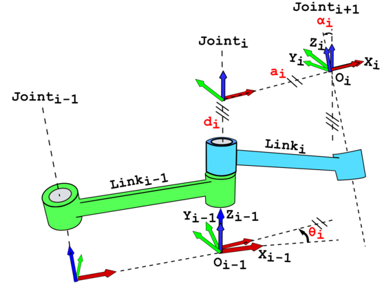

# Lab 5 : Robotic Arm and SLAM

Seneca Polytechnic 
SEA700 Robotics for Software Engineers

## Forward Kinematics

As discussed in lecture, the forward kinematics problem involves fnding the confguration of a specifed link in a
robotic manipulator relative to some other reference frame, given the angles of each of the joints in the manipulator.

### Denavit–Hartenberg (DH) Parameters

In mechanical engineering, the Denavit–Hartenberg parameters (also called DH parameters) are the four parameters associated with a particular convention for attaching reference frames to the links of a spatial kinematic chain, or robot manipulator. In this convention, coordinate frames are attached to the joints between two links such that one transformation is associated with the joint \([Z]\), and the second is associated with the link \([X]\). The coordinate transformations along a serial robot consisting of n links form the kinematics equations of the robot:

$$
[T] = [Z_1][X_1][Z_2][X_2]...[Z_{n-1}][X_{n-1}][Z_n][X_n]
$$

where \([T]\) is the transformation that characterizes the location and orientation of the end-link.

***Figure 5.1** DH Kinematics Links*

As shown in the figure above, each joints (i-1, i, and i+1) has a unique line \(S\) (shown as dotted line in the figure above) in space that forms the joint axis and define the relative movement of its two links. For each sequence of lines \(S_i\) and \(S+{i+1}\), there is a common normal line \(A_{i, i+1}\). By convention, z-coordinate axes are assigned to the joint axes \(S_i\) and x-coordinate axes are assigned to the common normals \(A_{i, i+1}\).

> #### Four Parameters

> The following four transformation parameters (labelled in red text in the figure above) are known as the DH parameters:

>   - d: offset along \(S_i\) (z-direciton) to the next common normal \(A_{i, i+1}\) (x-direction)
>   - θ: angle about \(S_i\) from old common normal \(A_{i-1, i}\) to the new common normal \(A_{i, i+1}\)
>   - a (or r): length of the common normal from \(S_i\) to \(S_{i+1}\)
>   - α: angle about common normal \(A_{i-1, i}\), from old axis \(S_i\) to new axis \(S_{i+1}\)

This convention allows the definition of the movement of links around a common joint axis \(S_i\) by the screw displacement:

$$
[Z_i] =
\begin{bmatrix}
   cos \theta_i & -sin \theta_i & 0 & 0 \\
   sin \theta_i & cos \theta_i & 0 & 0 \\
   0 & 0 & 1 & d_i \\
   0 & 0 & 0 & 1
\end{bmatrix}
$$

Each of these parameters could be a constant depending on the structure of the robot. Under this convention the dimensions of each link in the serial chain are defined by the screw displacement around the common normal \(A_{i, i+1}\) from the joint \(S_i\) to \(S_{i+1}\), which is given by:

$$
[X_i] =
\begin{bmatrix}
   1 & 0 & 0 & a_{i, i+1} \\
   0 & cos \alpha_{i, i+1} & -sin \alpha_{i, i+1} & 0 \\
   0 & sin \alpha_{i, i+1} & cos \alpha_{i, i+1} & 0 \\
   0 & 0 & 0 & 1
\end{bmatrix}
$$

where \(\alpha_{i, i+1}\) and \(a_{i, i+1}\) define the physical dimensions of the link in terms of the angle measured around and distance measured along the x-axis.

### JetAuto Arm Forward Kinematics

***Figure 5.2** JetAuto Arm Links*

The figure above shows the kinematic link diagram of the JetAuto arm. Joint-1 is a rotary joint about the global z-axis and Joints 2-4 are rotary joint about their respective joint axis. Let's create the DH parameters table for the first two joints:

- Joint-1 is a rotation joint about the joint axis (global z-axis). Therefore, only \(\theta_1\) is non-zero. We can assume that Joint-1 is at the same position as Joint-0.
- Joint-2 is a rotation joint with a distance, \(d\), from Joint-1 and 90° between the Joint-2 and Joint-1 axis. Therefore, \(\alpha_2 = 90°\). It will also have a rotation about the Joint-2 axis, \(\theta_2\).

Putting this all together yield the following DH parameters table:

***Table 5.1** JetAuto DH Parameters Table*

| DH# | d | θ | a | α |
|---|---|---|---|---|
| 1 | 0 | \(\theta_1\) | 0 | 0 |
| 2 | \(d\) | \(\theta_2\) | 0 | \(\pi / 2\) |
| 3 | | | | |
| 4 | | | | |

# ROS MoveIt

ROS MoveIt is a powerful software framework designed for robot motion planning and manipulation within the Robot Operating System (ROS) ecosystem. It provides a robust set of tools and libraries that enable developers to implement complex motion planning algorithms, manage robot kinematics, and execute real-time motion tasks. With features such as collision detection, trajectory optimization, and support for various robotic platforms, MoveIt simplifies the process of programming robots to perform intricate movements. Its flexibility and extensibility make it a popular choice for both research and industrial applications, allowing users to create sophisticated robotic solutions tailored to specific needs.

***Figure 5.3** ROS MoveIt*

More details on MoveIt can be found [here](https://docs.ros.org/en/melodic/api/moveit_tutorials/html/index.html).

### JetAuto Robot Arm Control

1. Before controlling JetAuto's robot arm, let make sure we have all the package necessary installed. We'll also install the GMapping package for the second part of this Lab. Open a terminal and run the following command:

      sudo apt install ros-melodic-moveit ros-melodic-trac-ik-kinematics-plugin ros-melodic-slam-gmapping ros-melodic-map-server ros-melodic-amcl  ros-melodic-move-base

1. Following Chapter 15.2 Lesson 2, 3, 5, 6, 7, 8 in [JetAuto & JetAuto Pro Resources](https://drive.google.com/drive/folders/16pwHYO8rK-22oAzStc7-olP9Weq7AbzY). Use the following command to start MoveIt with Gazebo instead of the instruction provided.

      roslaunch jetauto_moveit_config demo_gazebo.launch false_execution:=false

### JetAuto SLAM

1. Following Chapter 7.2 Lesson 6, 7 in [JetAuto & JetAuto Pro Resources](https://drive.google.com/drive/folders/16pwHYO8rK-22oAzStc7-olP9Weq7AbzY). Use the following command to start MoveIt with Gazebo instead of the instruction provided. You might need to manually open the config file from

## Lab Question

1. Find the Cartesian coordinate of the end effector if:

- \(\theta_1 = 45\)
- \(\theta_2 = -30\)
- \(\theta_3 = 85\)
- \(\theta_4 = 25\)

1. Write a program that will move the robot arm to the above position.

1. Use SLAM to create and save a map of the class room. Afterward, demostrate navigating from one corner of the class to another.

## Reference

- [Denavit–Hartenberg parameters](https://en.wikipedia.org/wiki/Denavit%E2%80%93Hartenberg_parameters)
- [ROS Tutorials](https://wiki.ros.org/ROS/Tutorials)
- EECS 106A Labs