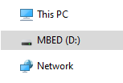

# Lab 1 : Setup

Seneca College 
SEH500 Microprocessors and Computer Architecture

## Introduction

The Freedom-K64F and Freedom-K66F are both low-cost development platform using the NXP Kinetis series of microcontroller.

|Features|[K64F](https://www.nxp.com/design/development-boards/freedom-development-boards/mcu-boards/freedom-development-platform-for-kinetis-k64-k63-and-k24-mcus:FRDM-K64F)|[K66F](https://www.nxp.com/design/development-boards/freedom-development-boards/mcu-boards/freedom-development-platform-for-kinetis-k66-k65-and-k26-mcus:FRDM-K66F)|
|---|---|---|
|**Microcontroller**|MK64FN1M0VLL12|MK66FN2M0VMD18|
|**Speed**|120 MHz|180 MHz|
|**RAM**|256 kB|256 kB|
|**External Memory**|N/A|microSD socket|
|**Connectivity**|USB, Ethernet, Add-on Bluetooth|USB, Ethernet, Add-on Bluetooth|
|**Audio**|N/A|Audio codec and Jacks|
|**Sensors**|Accelerometer and Magnetometer (FXOS8700CQ)|Accelerometer and Magnetometer (FXOS8700CQ) Gyroscope (FXAS21002)|
|**Debug**|OpenSDAv2 Virtual Serial Port|OpenSDAv2 Virtual Serial Port|
|**User Components**|RGB LED|RGB LED Two user push buttons|

## Procedures

### Firmware Update

1. If you are using the Freedom-K64F, you might need to update it's firmware before using it with Windows 10.
    - When you plug your board into the USB and see "MBED (X:)" as a dirve, [follow the steps found here](https://www.nxp.com/document/guide/getting-started-with-the-frdm-k64f:NGS-FRDM-K64F?section=plug-it-in_plug-it-in-1) to update the bootloader.

    

    ***Figure 1.1** Showing MBED drive*

### Install IDE

1. Install the [MCUXpresso IDE from NXP](https://www.nxp.com/design/software/mcuxpresso-software-and-tools-/mcuxpresso-integrated-development-environment-ide:MCUXpresso-IDE?#design-resources) (account creation required) or using [Seneca MyApps](https://myapps.senecacollege.ca/). **NOTE:** Download and install the necessary driver from the [NXP page]((https://www.nxp.com/design/software/mcuxpresso-software-and-tools-/mcuxpresso-integrated-development-environment-ide:MCUXpresso-IDE?#design-resources)) if you are using Windows OS.

    

    ***Figure 1.2** Seneca MyApps*

1. Select an approtiate location to save your workspace. It must be a directory you have write premission.

    

    ***Figure 1.3** Select Workspace Directory*

### Install SDK

1. Once MCUXpresso open, click "Download and Install SDK" from the quick-start menu.

    

    ***Figure 1.4** Download and Install SDK*

1. Filter for "K64" or "K66" depending on the version of the board you are using then install the SDK.

    

    ***Figure 1.5** Filter SDK*

    

    ***Figure 1.6** Select SDK*

    

    ***Figure 1.7** Install SDK*

### Import SDK Example

1. After downloading and installing the SDK, close the welcome screen. At the bottom left Quickstart Panel, click "Import SDK example(s)...".

    

    ***Figure 1.8** Install SDK*

1. Select the appropiate example library.

    

    ***Figure 1.9** Select Example Library*

1. Find the "hello_world" example from "demo_apps".

    

    ***Figure 1.10** Select Hello World Demo*

1. Ensure "SDK Debug Console" under Project Options is selected as UART then click "Next".

    

    ***Figure 1.11** SDK Debug Console UART*

1. In the project Advanced Settings page, ensure to CLEAR the "Redirect SDK PRINTF to C library printf" option then click "Finish".

    

    ***Figure 1.12** Clear Redirect SDK PRINTF to C library printf*

### Code, Build and Debug Project

1. By now, you should be able to see a familiar interface with a project tree on the left and a code in the middle. Take a look at the code and get an idea of what it is performing. Afterward, click "Build" at the lower left Quickstart Panel to compile the code.

    

    ***Figure 1.13** Demo Project Code*

    

    ***Figure 1.14** Build Project*

1. Once the project is built, click "Debug" to run the project in debug mode.

    

    ***Figure 1.15** Run in Debug Mode*

1. The IDE should automatically probe for and connect to the target microcontroller board. Click "OK".

    

    ***Figure 1.16** Connect to target*

### Serial Terminal

1. Open a Serial terminal in the IDE by clicking on the "Terminal" tab beside the "Console" tab at the bottom of the screen. Select the appropiate COM port that the microcontroller board is connected to (check the device manager of your computer). Ensure the settings are 115200 baud rate with 8 bit data size, no parity bit, and 1 stop bit.

    

    ***Figure 1.17** Start a Serial Terminal*

1. Once the terminal is connected, press "Resume" from the debug menu and you should see "Hello World" in the serial terminal.

    

    ***Figure 1.18** Press Resume*

    

    ***Figure 1.19** Hello World in Serial Terminal*

### View Assembly Code

1. Lastly, let's take a look at the assembly language code. From the project tree on the left, find the "Debug" directory. Within the directory, right click on the .axf file then click Binary Utilities > Disassemble.

    

    ***Figure 1.20** View Disassembled Code*

1. A new .dis file should be created. Open the file to see the disassembled code.

    

    ***Figure 1.21** Disassembled Code*

## Post-Lab

1. Using the skills and knowledge acquired from this lab, answer the post-lab question(s) on blackboard. Due one week after the lab.