# Lab 1 : Setup

Seneca College 
SEH500 Microprocessors and Computer Architecture

## Introduction

The Freedom-K64F and Freedom-K66F are both low-cost development platforms using the NXP Kinetis series of microcontrollers that is based on the ARM Cortex-M4 processor.

|Features|[K64F](https://www.nxp.com/design/development-boards/freedom-development-boards/mcu-boards/freedom-development-platform-for-kinetis-k64-k63-and-k24-mcus:FRDM-K64F)|[K66F](https://www.nxp.com/design/development-boards/freedom-development-boards/mcu-boards/freedom-development-platform-for-kinetis-k66-k65-and-k26-mcus:FRDM-K66F)|
|---|---|---|
|**Microcontroller**|MK64FN1M0VLL12|MK66FN2M0VMD18|
|**Speed**|120 MHz|180 MHz|
|**RAM**|256 kB|256 kB|
|**External Memory**|N/A|microSD socket|
|**Connectivity**|USB, Ethernet, Add-on Bluetooth|USB, Ethernet, Add-on Bluetooth|
|**Audio**|N/A|Audio codec and Jacks|
|**Sensors**|Accelerometer and Magnetometer (FXOS8700CQ) **No longer populated!**|Accelerometer and Magnetometer (FXOS8700CQ) Gyroscope (FXAS21002)|
|**Debug**|OpenSDAv2 Virtual Serial Port|OpenSDAv2 Virtual Serial Port|
|**User Components**|RGB LED|RGB LED Two user push buttons|

## Preparation

Read over the lab manual for this lab. Acquire the Freedom microcontroller board and install the necessary IDE as described in the lab manual.

Documentation of the Cortex-M4 instruction set, board user's guide, and the microcontroller reference manual can be found here:

- [Arm Cortex-M4 Processor Technical Reference Manual Revision](https://developer.arm.com/documentation/100166/0001)
- [ARMv7-M Architecture Reference Manual](https://developer.arm.com/documentation/ddi0403/latest/)
- [FRDM-K64F Freedom Module User’s Guide](https://www.nxp.com/webapp/Download?colCode=FRDMK64FUG)
- [Kinetis K64 Reference Manual](https://www.nxp.com/webapp/Download?colCode=K64P144M120SF5RM)
- [FRDM-K66F Freedom Module User’s Guide](https://www.nxp.com/webapp/Download?colCode=FRDMK66FUG)
- [Kinetis K66 Reference Manual](https://www.nxp.com/webapp/Download?colCode=K66P144M180SF5RMV2)
- [The Definitive Guide to ARM® Cortex®-M3 and Cortex®-M4 Processors](https://senecacollege.primo.exlibrisgroup.com/permalink/01SENC_INST/goqo0g/alma997565899003226) by Joseph Yiu

<!--
> ### Lab Preparation Question
>
> Answer the following questions on Blackboard once the pre-load quiz becomes available 24 hours before the lab session.
> 
> 1. Referring to the Memory map shown in class or from Figure 4.18 of Yiu, what is the starting address and ending address of the instruction code region?
> 1. Referring to the Memory map shown in class or from Figure 4.18 of Yiu, what is the starting address and ending address of the general purpose data memory region?
> 1. How many bytes (exact whole number) of memory are available for each of the regions above?
> 1. Referring to Yiu or the Cortex-M4 Technical Reference, what is the instruction for loading data from memory into a register?
> 1. Referring to Yiu or the Cortex-M4 Technical Reference, what is the instruction for storing data from a register in memory?
-->

## Procedures

### Firmware Update

1. If you are using the Freedom-K64F, you might need to update its firmware before using it with Windows 10. Even if you are not using Windows 10, updating the firmware might be a good idea.
    1. Unplug the Freedom board then hold down the "RESET SW1" button as you plug the board into your computer to enter bootloader mode.
    
        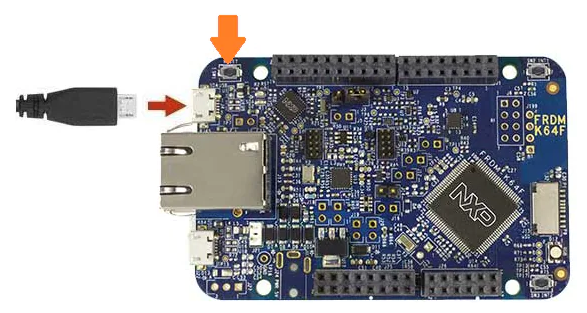
        
        ***Figure 1.1** Start in Bootloader Mode*
    
    1. Once plugged in, if you see anything else but "MAINTENANCE" (such as seeing "BOOTLOADER"), then we need to update the firmware.
    1. Follow only step 1-10 on the [Getting Started with the FRDM-K64F](https://www.nxp.com/document/guide/getting-started-with-the-frdm-k64f:NGS-FRDM-K64F?section=plug-it-in_plug-it-in-1) BUT USE THE FILES BELOW.
        - For K64F: here are the files:
            - [0244_k20dx_bootloader_update_0x5000.bin](0244_k20dx_bootloader_update_0x5000.bin) for updating the OpenSDA bootloader  
            (Reference: [DAPLink bootloader update](https://os.mbed.com/blog/entry/DAPLink-bootloader-update/))
            - [k20dx_frdmk64f_if_crc_legacy_0x5000](k20dx_frdmk64f_if_crc_legacy_0x5000.bin) for loading the CMSIS-DAP application back onto the board  
            (Reference: [OpenSDA Serial and Debug Adapter](https://www.nxp.com/design/software/sensor-toolbox/opensda-serial-and-debug-adapter:OPENSDA?tid=vanOpenSDA#FRDM-K66F))
        - For K66F: here are the files:
            - [0244_k20dx_bootloader_update_0x8000.bin](0244_k20dx_bootloader_update_0x8000.bin) for updating the OpenSDA bootloader  
            (Reference: [DAPLink bootloader update](https://os.mbed.com/blog/entry/DAPLink-bootloader-update/))
            - [k20dx_frdmk66f_if_crc](k20dx_frdmk66f_if_crc.bin) for loading the CMSIS-DAP application back onto the board  
            (Reference: [OpenSDA Serial and Debug Adapter](https://www.nxp.com/design/software/sensor-toolbox/opensda-serial-and-debug-adapter:OPENSDA?tid=vanOpenSDA#FRDM-K66F))
        - If the bootloader drive is not showing, try updating the bootloader using non-Windows 10 computer. If it is still not showing up, the board might be in a bricked state. In this case, an external device must be used to flash a new bootloader. [Follow the instruction here](https://os.mbed.com/blog/entry/DAPLink-bootloader-updates-with-external/).

### Install IDE

1. Install the [MCUXpresso IDE from NXP](https://www.nxp.com/design/software/mcuxpresso-software-and-tools-/mcuxpresso-integrated-development-environment-ide:MCUXpresso-IDE?#design-resources) (account creation required) or using [Seneca MyApps](https://myapps.senecacollege.ca/). **NOTE:** If the board is not recognized by Windows, [download latest driver](https://os.mbed.com/media/downloads/drivers/mbedWinSerial_16466.exe) for Windows. Links to other drivers such as P&E Micro and Segger Jlink can be found here: [OpenSDA Serial and Debug Adapter](https://www.nxp.com/design/software/sensor-toolbox/opensda-serial-and-debug-adapter:OPENSDA?tid=vanOpenSDA#FRDM-K64F).

    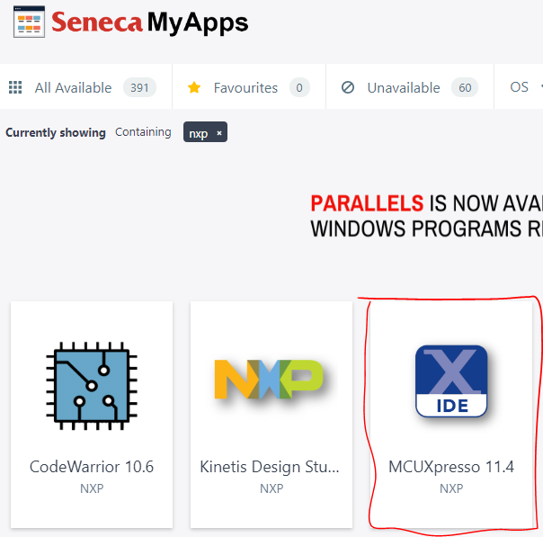

    ***Figure 1.2** Seneca MyApps*

1. Select an appropriate location to save your workspace. It must be a directory to which you have write permission.

    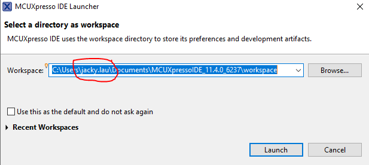

    ***Figure 1.3** Select Workspace Directory*

### Install SDK

1. Once MCUXpresso opens, click "Download and Install SDK" from the quick-start menu.

    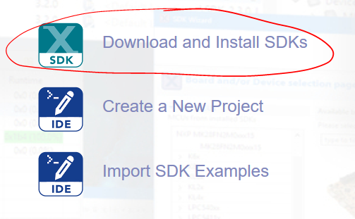

    ***Figure 1.4** Download and Install SDK*

1. Filter for "K64" or "K66" depending on the version of the board you are using then install the SDK.

    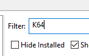

    ***Figure 1.5** Filter SDK*

    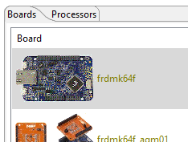

    ***Figure 1.6** Select SDK*

    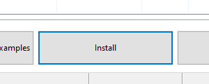

    ***Figure 1.7** Install SDK*

### Import SDK Example

1. After downloading and installing the SDK, close the welcome screen. At the bottom left Quickstart Panel, click "Import SDK example(s)...".

    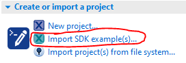

    ***Figure 1.8** Install SDK*

1. Select the appropriate example library.

    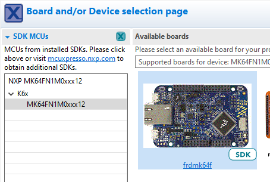

    ***Figure 1.9** Select Example Library*

1. Find the "hello_world" example from "demo_apps".

    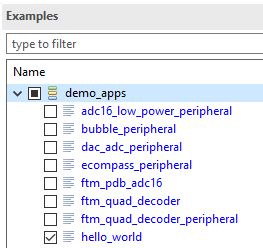

    ***Figure 1.10** Select Hello World Demo*

1. Ensure "SDK Debug Console" under Project Options is selected as UART then click "Next".

    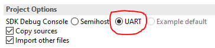

    ***Figure 1.11** SDK Debug Console UART*

1. In the project Advanced Settings page, ensure to CLEAR the "Redirect SDK PRINTF to C library printf" option then click "Finish".

    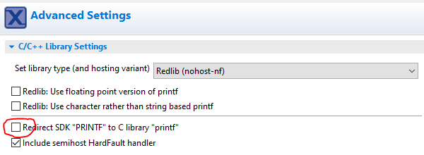

    ***Figure 1.12** Clear Redirect SDK PRINTF to C library printf*

### Code, Build and Debug Project

1. By now, you should be able to see a familiar interface with a project tree on the left and a code in the middle. Take a look at the code and get an idea of what it is performing. Afterward, click "Build" at the lower left Quickstart Panel to compile the code.

    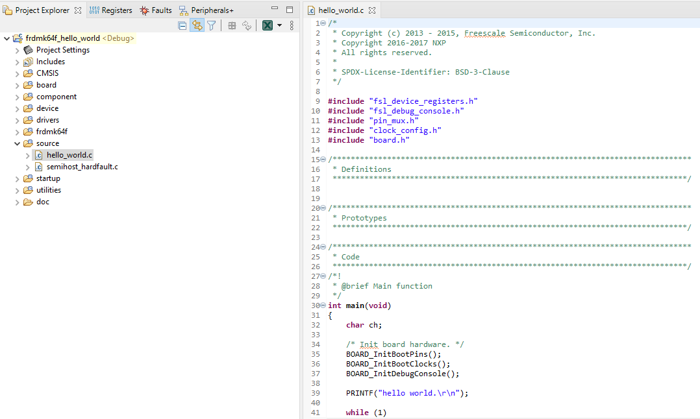

    ***Figure 1.13** Demo Project Code*

    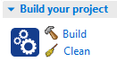

    ***Figure 1.14** Build Project*

1. Once the project is built, click "Debug" to run the project in debug mode.

    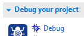

    ***Figure 1.15** Run in Debug Mode*

1. The IDE should automatically probe for and connect to the target microcontroller board. Click "OK".

    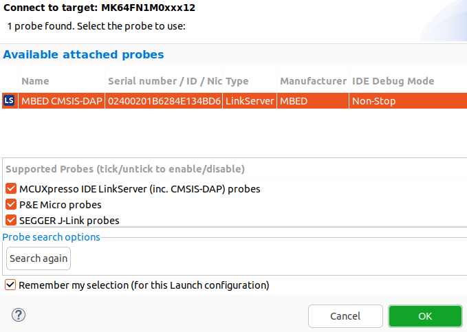

    ***Figure 1.16** Connect to target*

### Serial Terminal

1. Open a Serial terminal in the IDE by clicking on the "Terminal" tab beside the "Console" tab at the bottom of the screen. Select the appropriate COM port that the microcontroller board is connected to (check the device manager of your computer). Ensure the settings are 115200 baud rate with 8-bit data size, no parity bit, and 1 stop bit.

    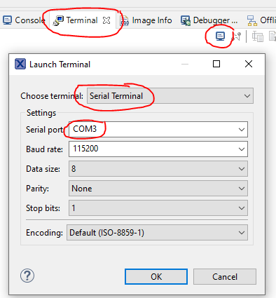

    ***Figure 1.17** Start a Serial Terminal*

1. Once the terminal is connected, press "Resume" from the debug menu and you should see "Hello World" in the serial terminal.

    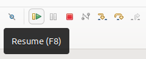

    ***Figure 1.18** Press Resume*

    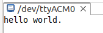

    ***Figure 1.19** Hello World in Serial Terminal*

### View Assembly Code

1. Lastly, let's take a look at the assembly language code. From the project tree on the left, find the "Debug" directory. Within the directory, right-click on the .axf file then click Binary Utilities > Disassemble.

    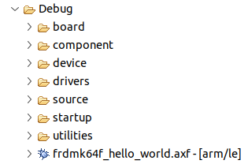

    ***Figure 1.20** View Disassembled Code*

1. A new .dis file should be created. Open the file to see the disassembled code.

    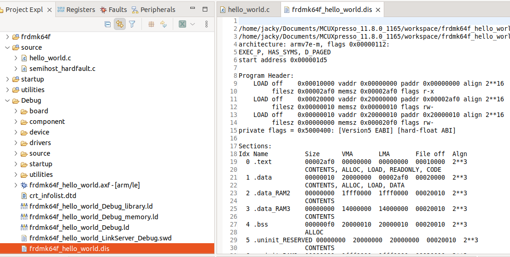

    ***Figure 1.21** Disassembled Code*

### View the Registers Value and Memory Data during Debug

This step can only be done with a microcontroller board running during debugging.

1. To view the register values during debugging, select the "Registers" tab beside the Project Explorer tab on the left-hand side. You should now see the register from r0-r12, sp, lr, pc, ...

1. To view memory data, at the bottom right, select the "Memory" tab. Click the plus (+) symbol then type in the memory address you want to view. Usually, the memory area you want to view will be somewhere between 0x20000000 to 0x3FFFFFFF.

## Lab Questions

Using the skills and knowledge acquired from this lab, answer the following post-lab question(s) on Blackboard.

1. Refer to the Memory map shown in class or from Figure 4.18 of Yiu, what is the starting address and ending address of the instruction code region?

1. In the hello_world.c example, what is the instruction address of the first line of code that it halts on once you start debugging?

    **Note:** The instruction is at a hex address within the instruction region. You can find it in the disabled code or the Disassembly view during debug.

    **Hint:** The main function starts at address 0x00000924.

1. Look at the register tab, what is the value of the Program Counter (PC) when you first start debugging? Refer back to the memory map in question 1 and see if it correspond to the proper memory region.

1. What is the value of the Stack Pointer (SP)? Refer back to the memory map in question 1 and see if it correspond to the proper memory region.

1. Change the C-code to also display your name and student number within the print statement. Copy your main function onto blackboard.

1. Run your modified code and view the result using the serial terminal. Your name and student number should now be displayed in the serial terminal. Take a screenshot of the printout and place it onto Blackboard.