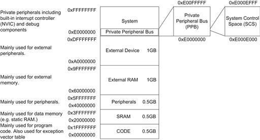

# Lab 2 : Writing in Assembly

Seneca College 
SEH500 Microprocessors and Computer Architecture

## Introduction

### Cortex-M4 Memory Map

The 4GB address space of the Cortex®-M processors is partitioned into a number of memory regions (Figure 2.1). The partitioning is based on typical usages so that different areas are designed to be used primarily for:

- Program code accesses (e.g., CODE region)
- Data accesses (e.g., SRAM region)
- Peripherals (e.g., Peripheral region)
- Processor’s internal control and debug components (e.g., Private Peripheral Bus)

The architecture also allows high flexibility to allow memory regions to be used for other purposes. For example, programs can be executed from the CODE as well as the SRAM region, and a microcontroller can also integrate SRAM blocks in CODE region.

***Figure 2.1** Memory map*

In practice, many microcontroller devices only use a small portion of each region for program flash, SRAM, and peripherals. Some of the regions can be unused. Different microcontrollers have different memory sizes and peripheral address locations. This information is usually outlined in user manuals or datasheets from microcontroller vendors.

### Cortex-M4 Registers

The register bank in the Cortex-M3 and Cortex-M4 processors has 16 registers. Thirteen of them are general-purpose 32-bit registers, and the other three have special uses, as can be seen in Figure 2.2.

***Figure 2.2** Registers in the register bank*

#### R0 – R12
Registers R0 to R12 are general-purpose registers. The first eight (R0 – R7) are also called low registers. Due to the limited available space in the instruction set, many 16-bit instructions can only access the low registers. The high registers (R8 – R12) can be used with 32-bit instructions, and a few with 16-bit instructions, like MOV (move). The initial values of R0 to R12 are undefined.

#### R13, stack pointer (SP)
R13 is the Stack Pointer. It is used for accessing the stack memory via PUSH and POP operations. 

#### R14, link register (LR)
R14 is also called the Link Register (LR). This is used for holding the return address when calling a function or subroutine. At the end of the function or subroutine, the program control can return to the calling program and resume by loading the value of LR into the Program Counter (PC). When a function or subroutine call is made, the value of LR is updated automatically. If a function needs to call another function or subroutine, it needs to save the value of LR in the stack first. Otherwise, the current value in LR will be lost when the function call is made.

#### R15, program counter (PC)
R15 is the Program Counter (PC). It is readable and writeable: a read returns the current instruction address plus 4 (this is due to the pipeline nature of the design, and compatibility requirement with the ARM7TDMI™ processor). Writing to PC (e.g., using data transfer/processing instructions) causes a branch operation.

#### Program status registers
The Program Status Register is composed of three status registers:

- Application PSR (APSR)
- Execution PSR (EPSR)
- Interrupt PSR (IPSR)

These three registers can be accessed as one combined register, referred to as xPSR in some documentation. In ARM® assembler, when accessing xPSR (Figure 2.3), the symbol PSR is used.

***Figure 2.3** Combined xPSR*

The main 4 status bits of interest are:

- **N**: Negative flag
- **Z**: Zero flag
- **C**: Carry (or NOT borrow) flag
- **V**: Overflow flag

Reference: Yiu, Ch 4

### Assembly Instruction

Documentation of the Cortex-M4 instruction set can be found here:

- [Arm Cortex-M4 Processor Technical Reference Manual Revision](https://developer.arm.com/documentation/100166/0001)
- [ARMv7-M Architecture Reference Manual](https://developer.arm.com/documentation/ddi0403/latest/)

## Preparation

> ### Lab Preparation Question
>
> Answer the following questions on Blackboard once the pre-load quiz becomes available 24 hours before the lab session.
> 
> 1. Referring to the Cortex-M4 technical manual, how many "Add" instruction are there and what are they?
> 1. Write the instruction that load the address 0x20000010 into register R0?
> 1. What is the difference between mov, movw, and movt?
> 1. Refer to the Cortex-M4 manual, define the following four flags of the Program Status Register and how they will be triggered.
    >
    >   - N: Negative flag
    >   - Z: Zero flag
    >   - C: Carry (or NOT borrow) flag
    >   - V: Overflow flag

## Procedures

1. Open MCUXpresso then start a new C/C++ project based on the Freedom board model that you have.

    

    ***Figure 2.3** New Project*

1. In the new project configuration, rename the project then leave all other settings as default. Even though we will be programming in assembly language, we'll still like the IDE to use the SDK template to set up the Freedom board so we don't have to bother with the startup configuration (ie. vector table, ISR, stack address, heap address, etc.)

    
    

    ***Figure 2.4** New Project Name and Settings*

1. Once the project is created, rename the C-code file from ".c" to ".s". If the IDE is not allowing you to rename, delete the C-code file and create a new file of the same name but with the extension ".s".

    

    ***Figure 2.5** Rename File*

1. Replace the code within the file with the following:

    
<pre>
        .global main                @ declare main as a global variable
        .type main, %function       @ set main to function type

    main:                           @ start of main code with an label
        ldr     r0, =0x20000000     @ load 0x20000000 to R0
        mov     r1, #8              @ move #8 to R1
        add     r1, r1, #4          @ add #4 to R1 and write to R1
        str     r1, [r0]            @ store value of R1 to address of R0

    stop:                           @ define a new label called stop
        nop                         @ do nothing
        b       stop                @ jump back label stop to form a loop
    </pre>

    Your code should now look like this.

    

    ***Figure 2.6** Assembly Code*

5. Build and run the code using the debug option. Open both the register view and the memory view to address 0x20000000.

    
    
    
    ***Figure 2.7** Register and Memory View*

1. Step through the code and pay attention to the changes in the registers and memory. Step until you reach the stop label. Your code should not go any further as it will loop between the nop and b instructions. You can also see the program counter jumping back and forward. Answer question 1 of the post-lab.

1. Next, re-run the code but this time, expand the program status register and notice the flags that change especially after an arithmetics instruction.

    
    
    ***Figure 2.8** Program Status Register Flags*

1. Now, to test your skills, write an assembly code that performs Exercise #2 from the module 3 lecture: Perform the calculation: A + B – C = D.
    - Use 0x20000010 for variable A = first 2 digits of your student #
    - Use 0x20000014 for variable B = next 2 digits of your student #
    - Use 0x20000018 for variable C = next 2 digits of your student #
    - Use 0x2000001C for variable D = 0

    Is your answer correct? Copy your code into the post-lab assignment on Blackboard.

## Post-Lab Questions

Using the skills and knowledge acquired from this lab, answer the following post-lab question(s) on Blackboard. Due one week after the lab.

1. In step 6 of the first program example, what value got saved to which address at the end of the str instruction?

1. Paste your assembly code in step 8 here.

1. Fill in the blank as necessary and run the following code. Comment out with "@" any line that becomes invalid and explain why. Put your answer into your code and copy it into Blackboard for submission.

<pre>
    mov R2, #           @ use the first 2 digits of your student ID
    mov R3, #           @ use the last 2 digits of your student ID
        
    @Other examples to move immediate values
    mov     R5, #0x1234         @ R5 = ?
    movt    R5, #0x8765         @ R5 = ?
    movt    R5, #0x5678         @ R5 = ?
    movw    R6, #0x12345678     @ R6 = ?
    movw    R5, #0x5678         @ R6 = ?

    ldr     R7, =0x87654321     @ R7 = ?

    add     R1, R2, R3          @ R1 = ?
    movt    R3, #0xFFFF         @ R3 = ?
    add     R1, R2, R3          @ R1 = ?   

    sub     R1,R2,R3            @ R1 = ?   

    movw    R4, #0xFFFF         @ R4 = ?
    add     R1, R2, R4          @ R1 = ?   
                    @ How are the PSR flags affected?

    add     R1, R2, R4          @ R1 = ?  
                    @ What happened to the PSR flags now?

    mov     R2, #0x00000002     @ R2 = ?
    add     R1, R2, R4          @ R1 = ?
                    @ again, what happened to the PSR flags?

    mov     R2, #0x00000001     @ R2 = ?
    mov     R3, #0x00000002     @ R3 = ?
    add     R1, R2, R3          @ R1 = ?   
                    @ Add some small numbers again
                    @ and check the PSR flags again......

    @ Add numbers that will create an overflow
    movw    R2, #0x7FFF         @ R2 = ?
    movw    R3, #0x7FFF         @ R3 = ?

    adds    R1, R2, R3          @ R1 = ?
                    @ Check and see what happened to the PSR flags.
</pre>

## Reference

[1] Yiu, J. (2013). The Definitive Guide to ARM® Cortex®-M3 and Cortex®-M4 Processors. (3rd ed.). Elsevier Science & Technology.