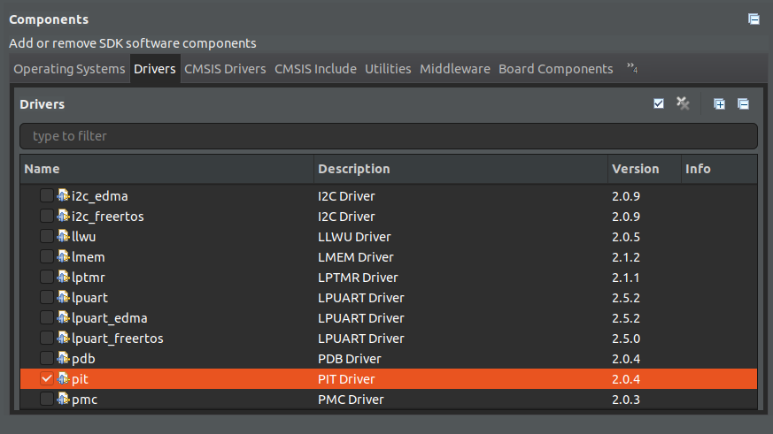
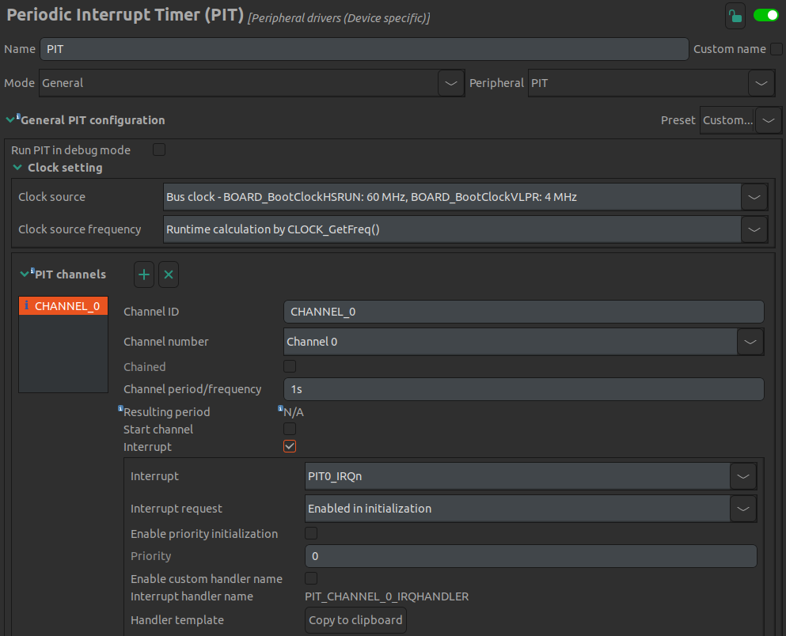

# Lab 6 : Timer Interrupt and C Code

Seneca College 
SEH500 Microprocessors and Computer Architecture

## Introduction

Documentation of the Cortex-M4 instruction set and FRDM-K64F user's guide can be found here:

- [Arm Cortex-M4 Processor Technical Reference Manual Revision](https://developer.arm.com/documentation/100166/0001)
- [ARMv7-M Architecture Reference Manual](https://developer.arm.com/documentation/ddi0403/latest/)
- [FRDMK64FUG, FRDM-K64F Freedom Module User’s Guide](https://www.nxp.com/webapp/Download?colCode=FRDMK64FUG)

In the previous lab, we explored how to use basic branching to control the flow of a program. In this lab, we'll further explore branching and use the stack point to create subroutine and function call procedure.

## Preparation

> ### Lab Preparation Question
> 1. Read over the lab and write a pseudocode for the post-lab exercise 4. It should just be a small modification from the one your did in the previous lab. Submission on Blackboard is not required.

## Procedures

Similar to the previous lab.

1. Open MCUXpresso then start a new C/C++ project based on the Freedom board model that you have.

1. In the new project configuration, this time, also select "pit" as one of the rename the project then leave all other settings as default.

    

    ***Figure 6.1** Seneca MyApps*

1. In previous labs, we wrote all of our code in assembly language using the .s file extension. In this lab, we are going to explore how to integrate C-code together with assembly code in a single project. The first way of integrating assembly code into a C-program is by using the inline assembler method.

    <pre>
    __asm volatile (" <Assembly Code Here> ");
    </pre>

    Replace (or comment out) the PRINTF "Hello World" line with the following:

    <pre>
    __asm volatile (" mov r1, #0x75 ");
    </pre>

1. Build and create the dissambly code (or from the dissambly view window during debug). Find the inline assembly code that you wrote. Take a screenshot of it and confirm that the C-code and the assembly code are the same. Paste your result into the Post-Lab question on blackboard.

1. You can also write multi-line inline assembly code as below. As the __asm function is direct replicate of what you wrote into assembly, you'll need to use newline character to specify a newline in assembly. You can also align your C-code to make it more readable.

    <pre>
    __asm volatile (" mov r1, #0x75 \n"
                    " mov r3, #10 ");
    </pre>

1. Open up [Lab 5](lab5.md) and transfer the code from the main label (up to but not including the code within the loop) into inline assembly code and include it into the inline code you have.

1. Another method is to include the assembly code in a .s file into the project. Create a function.s file in the source folder and paste the following extract from Lab 5 into it.

    
<pre>
    .syntax unified             @ unified syntax used
    .cpu cortex-m4              @ cpu is cortex-m4
    .thumb                      @ use thumb encoding

    .text                       @ put code in the code section

    .global function1           @ declare as a global variable
    .type function1, %function  @ set to function type

    function1:
        push    {r5, lr}        @ Save values in the stack
        mov     r5, #8          @ Set initial value for the delay loop
    delay:
        subs	r5, r5, #1      
        bne     delay
        pop     {r5, pc}        @ pop out the saved value from the stack
    </pre>

1. Next, place a function prototype at the top of your code and a function call after your inline assembly code and before the while loop into your main function. Set a breakpoint at the asm function then debug your code. Once the program started, hit resume until it reach the breakpoint then "Step Into (F5)" the code and see what happens. You program should jump to the code in your assembly file when it hit the function call.

1. Your task now is to translate the assembly code in the loop portion of Lab5 to C-code without using any assembly code. You can use a for loop or a while loop. After you are done and get the desired result, compare the compiled assembly code with the one we have from Lab5 and comment on the difference. The code that you write should still be on top of the while(1) loop. Copy or take a screenshot of your loop and it's assembly code and paste it into Blackboard.

1. Lastly, we are going to include a periodic interrupt timer (PIT) into our code to generate an interrupt once every second. We'll use the built-in ConfigTools in MCUXpresso for ease of implementation. The ConfigTools allow us to setup components of the processor and the microcontroller board in a quick and fast manner instead of manually coding all the necessary settings. Go to "ConfigTools > Peripherals" from the top menu. Under "Peripheral drivers (Device specific)" add the "PIT" configuration components.

1. Under the PIT settings, **uncheck** "start channel". Leave everything default so the setting page should look like this:

    

    ***Figure 6.2** Seneca MyApps*

1. Once confirmed, click "Update Code" at the top menu button bar and click yes when prompted. The peripherals.c and peripherals.h will not be updated accordingly to include the timer interrupt settings.

1. Next, we'll need to add some code for the interrupt handler and to start the interrupt.
    
    Paste the following handler code into your program.

    <pre>
    void PIT_CHANNEL_0_IRQHANDLER(void) /*ISR to process PIT channel 0 interrupts*/
    {
        PIT_ClearStatusFlags(PIT, PIT_CHANNEL_0, kPIT_TimerFlag);
        /*clear PIT channel 0 interrupt status flag*/
        PRINTF("*\r\n");
    }
    </pre>

    Then use the following code to start the PIT in your main function. You can put it at the beginning of main after all the initialization or just before the empty while loop.

    <pre>
    PIT_StartTimer(PIT_PERIPHERAL, PIT_CHANNEL_0);
    </pre>

1. Build and debug. Open a serial monitor to see the serial output. Let the program run and you should see an "*" being printed every second. Verify with a watch that the output is once per second. Take a screenshot of your serial monitor output and paste it into blackboard.

## Post-Lab Questions

Using the skills and knowledge acquired from this lab, answer the following post-lab question(s) on Blackboard. Due one week after the lab.

1. Answer all the questions in the lab in Blackboard.

1. Modify your code so instead of printing "*" every second, print a statement that display the number of minutes and seconds since the timer started. Paste your code into blackboard.

## Reference

[1] Yiu, J. (2013). The Definitive Guide to ARM® Cortex®-M3 and Cortex®-M4 Processors. (3rd ed.). Elsevier Science & Technology.