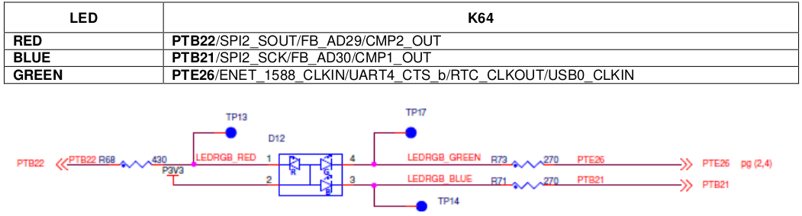
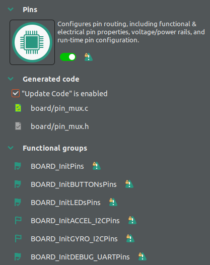
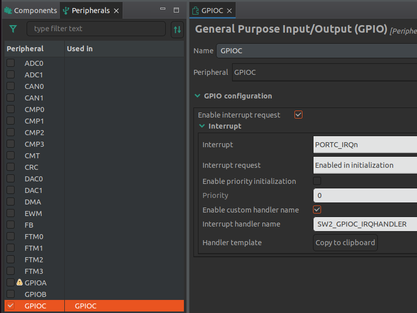

# Lab 7 : GPIO and Interrupt

Seneca College 
SEH500 Microprocessors and Computer Architecture

## Introduction

Documentation of the Cortex-M4 instruction set, board user's guide, and the microcontroller reference manual can be found here:

- [Arm Cortex-M4 Processor Technical Reference Manual Revision](https://developer.arm.com/documentation/100166/0001)
- [ARMv7-M Architecture Reference Manual](https://developer.arm.com/documentation/ddi0403/latest/)
- [FRDM-K64F Freedom Module User’s Guide](https://www.nxp.com/webapp/Download?colCode=FRDMK64FUG)
- [Kinetis K64 Reference Manual](https://www.nxp.com/webapp/Download?colCode=K64P144M120SF5RM)
- [FRDM-K66F Freedom Module User’s Guide](https://www.nxp.com/webapp/Download?colCode=FRDMK66FUG)
- [Kinetis K66 Reference Manual](https://www.nxp.com/webapp/Download?colCode=K66P144M180SF5RMV2)

In the previous lab, we explored the use of the built-in ConfigTools in MCUXpresso IDE to help with setting up interrupts. In this lab, we'll explore how to use assembly instruction to setup GPIO as well as using the ConfigTools to do the same.

### Freedom Board Tricolour LED

The Tricolour LED on the Freedom K64 board is connected to:
- **Red**: Port B Pin 22
- **Blue**: Port B Pin 21
- **Green**: Port E Pin 26

***Figure 7.1** Tricolour LED connection and schematics*

If you are using the Freedom K66F board, the pin configurations is difference. Refer to the Freedom K66F board manual for the correct pin number.

### Freedom Board Buttons

The Tricolour LED on the Freedom K64 board is connected to:
- **SW2**: Port C Pin 6
- **SW3**: Port A Pin 4

***Figure 7.2** Buttons connection*

If you are using the Freedom K66F board, the pin configurations is difference. Refer to the Freedom K66F board manual for the correct pin number.

## Preparation

> ### Lab Preparation Question
> 1. Read over the lab and understand the procedures.

## Procedures

Similar to the previous lab.

1. Open MCUXpresso then start a new C/C++ project based on the Freedom board model that you have.

1. In the new project configuration, we can keep everything to default as we won't be using the timer interrupt.

1. First, we'll setup the GPIO for the LED output using assembly code. Create a file called function.s in the source folder. Write the following code to it. In the code, we created two functions, one for setting up the pins as GPIO output and another for turning the LED on and off.

    

    If you are using the Freedom K66F board, the pin configurations is difference. Refer to the Freedom K66F board manual for the correct pin number.
    

    
<pre>
    .syntax unified             @ unified syntax used
    .cpu cortex-m4              @ cpu is cortex-m4
    .thumb                      @ use thumb encoding

    .text                       @ put code in the code section

    .global setup               @ declare as a global variable
    .type setup, %function      @ set to function type

    setup:
        ldr r1, =0x4004A058		@ PTB22 PCR register address
        mov r0, #0x00000100		@ set to GPIO mode
        str r0, [r1]			@ apply setting
        ldr r1, =0x400FF054		@ GPIOB PDDR register address
        mov r0, #0x00400000		@ set to output mode
        str r0, [r1]			@ apply setting
        bx	lr

    .global function1           @ declare as a global variable
    .type function1, %function  @ set to function type

    function1:
        ldr r1, =0x400FF040     @ GPIOB PDOR register address
    led_off:
        mov r0, #0x00400000     @ set output to HIGH, LED off
        str r0, [r1]			@ apply setting
    led_on:
        mov r0, #0x00000000     @ set output to LOW, LED on
        str r0, [r1]			@ apply setting
        b 	led_off
    </pre>

    

    If you are using the Freedom K66F board, the pin configurations is difference. Refer to the Freedom K66F board manual for the correct pin number.
    

1. Next, place a "setup" and "function1" function prototype at the top of your code and function calls before the while loop in your main function. You can also comment out or remove the print statement.

1. Build and run your code in debug mode. Step Over (F6) the initial functions until you get to the setup function. Then Step Into (F5) the led_setup and the function1 function. While you are stepping through the code, the RED led should turn on and off. Take a photo of your led turning on and paste it into Blackboard.

1. Next, we'll setup an interrupt with the onboard switch to control the LED. To do that, we'll use the ConfigTools to help setup the interrupt as setting it up using assembly require knowledge of the vector table (a more lengthy process). Open the ConfigTools > Config Tools Overview windows. Under Pins Functional groups, enable BOARD_InitPins, BOARD_InitBUTTONsPins, BOARD_InitLEDsPins, and BOARD_InitDEBUG_UARTPins. Under Peripherals Functional groups, enable BOARD_InitPeripherals. Close and Update Code.

    

    ***Figure 7.3***

1. Next, open the ConfigTools > Peripherals Windows. On the left hand side, go to the Peripherals tab. Check GPIOC and check Enable interrupt request. Afterward, click Enable custom handler name and we'll name it: SW2_GPIOC_IRQHANDLER. Update code.

    

    ***Figure 7.4***

1. Repeat the same for switch 3 in GPIOA. Name the handler as SW3_GPIOA_IRQHANDLER.

1. Lastly, add the following code at the end of your program and comment out or remove the function call to the assembly code. Run your code and the LED should turn on and off as you press the buttons.

    <pre>
    void SW2_GPIOC_IRQHANDLER(void) /*Interrupt Service Routine for SW2*/
    {
        /* clear interrupt flag set by button SW2 connected to pin PTC6 */
        GPIO_PortClearInterruptFlags(GPIOC, 1U << 6U);
        LED_RED_ON();
        /* turn ON RED LED */
    }
    void SW3_GPIOA_IRQHANDLER(void) /*Interrupt Service Routine for SW3*/
    {
        /* clear interrupt flag set by button SW3 connected to pin PTA4 */
        GPIO_PortClearInterruptFlags(GPIOA, 1U << 4U);
        LED_RED_OFF();
        /* turn OFF RED LED */
    }
    </pre>

## Post-Lab Questions

Using the skills and knowledge acquired from this lab, answer the following post-lab question(s) on Blackboard. Due one week after the lab.

1. Answer all the questions in the lab in Blackboard.

1. Modify your code so all three colours of the LED will turn on and off for the two examples done in the lab.

## Reference

[1] Yiu, J. (2013). The Definitive Guide to ARM® Cortex®-M3 and Cortex®-M4 Processors. (3rd ed.). Elsevier Science & Technology.