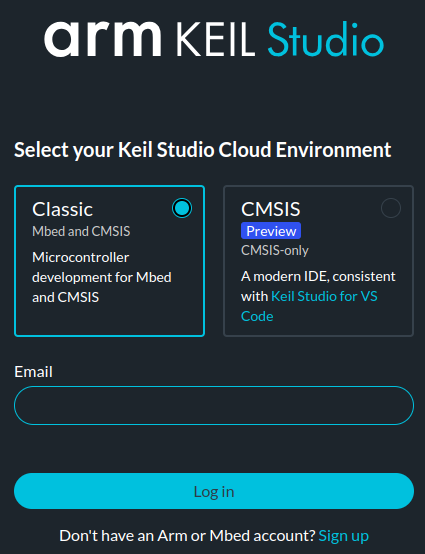
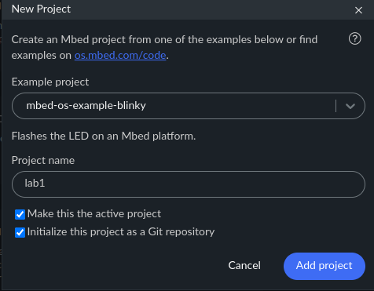
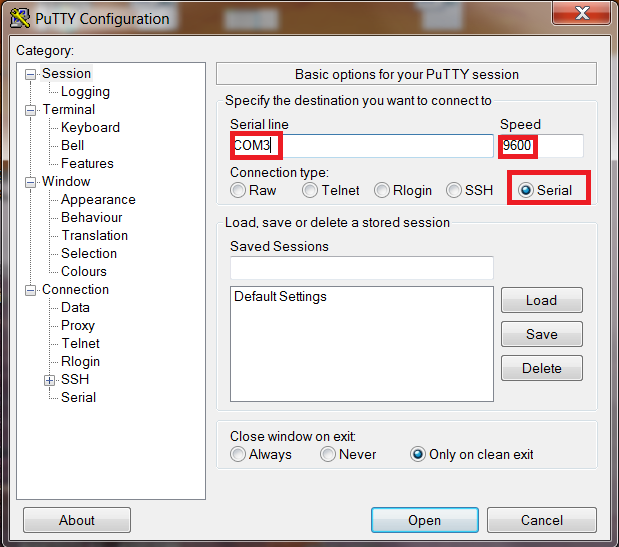

# Lab 1: Mbed OS and IDE

Seneca Polytechnic 
SEP600 Embedded Systems

## Introduction

Documentation of the Cortex-M4 instruction set, board user’s guide, and the microcontroller reference manual can be found here:

Documentation of the Freedom K64 and K66 boards and their microcontrollers can be found here:

- [FRDM-K64F Freedom Module User’s Guide](https://www.nxp.com/webapp/Download?colCode=FRDMK64FUG) ([PDF](FRDMK64FUG.pdf))
- [Kinetis K64 Reference Manual](https://www.nxp.com/webapp/Download?colCode=K64P144M120SF5RM) ([PDF](K64P144M120SF5RM.pdf))
- [FRDM-K66F Freedom Module User’s Guide](https://www.nxp.com/webapp/Download?colCode=FRDMK66FUG) ([PDF](FRDMK66FUG.pdf))
- [Kinetis K66 Reference Manual](https://www.nxp.com/webapp/Download?colCode=K66P144M180SF5RMV2) ([PDF](K66P144M180SF5RMV2.pdf))

Documentation of the Cortex-M4 instruction set can be found here:

- [Arm Cortex-M4 Processor Technical Reference Manual Revision](https://developer.arm.com/documentation/100166/0001) ([PDF](Cortex-M4-Proc-Tech-Ref-Manual.pdf))
    - [Table of Processor Instructions](https://developer.arm.com/documentation/100166/0001/Programmers-Model/Instruction-set-summary/Table-of-processor-instructions)
- [ARMv7-M Architecture Reference Manual](https://developer.arm.com/documentation/ddi0403/latest/) ([PDF](DDI0403E_e_armv7m_arm.pdf))

## Mbed OS and Library

Mbed OS is an open-source, real-time operating system designed for embedded systems and Internet of Things (IoT) devices. Developed by Arm, it provides a robust platform for building applications that require low power, high performance, and real-time capabilities. Mbed OS offers a rich set of libraries and middleware that simplify the development process, including device drivers, networking stacks, security features, and cloud connectivity. It supports a wide range of microcontrollers and hardware platforms, making it easier for developers to create scalable and reliable solutions for connected devices. With its focus on ease of use and efficiency, Mbed OS helps streamline development for embedded systems in industries like automotive, healthcare, and industrial automation.

The Mbed OS `mbed.h` includes helper functions, objects, and keywords to simplify the development process. Although using Mbed OS is not required for the Freedom K64F and K66F microcontroller boards, taking advantage of it will greatly speed up the development cycle.

## Preparation

1. Read through the lab manual for this lab.
2. Acquire a Freedom (K64F or K66F) microcontroller board and install the necessary IDE as described in the lab manual.

## Procedures

Recently, ARM made the [announcement](https://os.mbed.com/blog/entry/Important-Update-on-Mbed/) regarding the retirement of the Mbed platform and OS. However, the Mbed codebase will still be usable for simplifying embedded system development. The retirement of Mbed OS also means limited support for Mbed Cloud and Mbed Studio IDE. However, ARM is still actively maintaining its [Keil Studio Cloud](https://studio.keil.arm.com/) and related IDE products, allowing continued use of Mbed OS in embedded system development.

1. [Keil Studio Cloud](https://studio.keil.arm.com/) will be the preferred IDE we will use for this course.
    - [Mbed Studio](https://os.mbed.com/studio/) can still be used but is no longer preferred.

2. **Using the Chrome Browser**, log in to [Keil Studio Cloud](https://studio.keil.arm.com/). Create a Mbed account as necessary using your school email, as using a personal email will require additional verification from ARM. Chrome is the most popular browser for use with Keil Studio Cloud.

    

    ***Figure 1.1:** Keil Studio Cloud Login*

3. After logging in, you will see a familiar interface based on Visual Studio Code. Click "+ New project" and select "mbed-os-example-blinky" under "Mbed OS 6" from the Example project menu. Rename the project to "lab1" and then **Add project**.

    

    ***Figure 1.2:** Add Project*

4. Open `main.cpp` from the project tree, and you should see a very simple LED blinking code in the IDE. At this point, the code will not compile because we have not defined the "Build target." Select "FRDM-K64F" or "FRDM-K66F" depending on your hardware. All errors should go away now.

    

    ***Figure 1.3:** Keil Studio Cloud IDE with Blinky project*

5. Keil Studio Cloud uses the web USB interface to connect with your microcontroller board. The interface will only work if the Chrome browser has full permission to use your computer's USB port. Plug your microcontroller board into your computer. Once plugged in, under "Connected device," you should see your microcontroller board appear. If your board is not showing up, don’t worry; you can still upload your code onto your microcontroller using an alternative method.

6. Mbed OS is an embedded real-time operating system (RTOS) that we will discuss later in the term. An RTOS, compared to a non-RTOS (or bare metal), allows the operating system to manage priority and resources to ensure the timely execution of each task or thread.

    In the example code:

        int main()
        {
            // Initialise the digital pin LED1 as an output
            DigitalOut led(LED1);

            while (true) {
                led = !led;
                ThisThread::sleep_for(BLINKING_RATE);
            }
        }

    `DigitalOut` defines an object called `led` using the `LED1` keyword. This is the pin connected to the red LED.

    The `led` object can then be used directly as a variable to toggle the ON/OFF state of the LED.

    `ThisThread::sleep_for();` puts the current `main` thread to sleep for 500 ms as defined by `BLINKING_RATE`. In a later lab, you'll be able to define additional threads.

    Below are references to learn more about the code:

    - [Mbed API list](https://os.mbed.com/docs/mbed-os/v6.16/apis/index.html)
    - [FRDM-K64F Mbed Reference](https://os.mbed.com/platforms/FRDM-K64F/)
    - [FRDM-K64F Mbed Pin Names](https://os.mbed.com/teams/Freescale/wiki/frdm-k64f-pinnames)
    - [FRDM-K66F Mbed Reference](https://os.mbed.com/platforms/FRDM-K66F/)
    - [FRDM-K66F Mbed Pin Names](https://os.mbed.com/teams/NXP/wiki/FRDM-K66F-Pinnames)

7. At this point, there are two ways to upload the code onto your microcontroller board.

    - **Method 1: (the lucky few)** If your browser has full permission to the web USB interface, you'll be able to click the "Run project" (Play) button to build and upload the code in a single step. The "Flashing" status will go to 100%, and the code will be uploaded to your board.
    - **Method 2: (the majority)** If you cannot upload directly from your browser (i.e., the Flashing status does not advance when you click "Run"), refresh the page and click the "Build Project" (Hammer) button to compile the code. After the code build is complete, you will be prompted to save the `.bin` file. Save and copy that file into the "K64F" or "K66F" directory (from your computer's file explorer) to flash your microcontroller board. This process may take a few seconds to a few minutes depending on your setup. Be patient and wait until the board restarts after the file is uploaded.

8. Your board should start blinking at 1 Hz. If it's not blinking, you may need to reset your board.

9. Next, we'll output something through a USB serial port so we can read it using our computer's serial port. Depending on your browser permissions, the Keil Studio Cloud online serial monitor interface may work. However, to increase robustness, use terminal software from your computer to read the serial port. Here are some options:

    - Windows: [PuTTY](https://www.chiark.greenend.org.uk/~sgtatham/putty/latest.html) or [TeraTerm](https://teratermproject.github.io/index-en.html)
    - Mac/Linux: `screen` or `putty`

10. Add the following line to your code with logic so that every time the LED turns ON (and *only when* it turns ON), the message is printed to the serial port. You can be creative with your message.

        printf("SEP600 is Cool!\n");

    Remember, print *only when (immediately after) the LED turns ON*.

11. Open the serial port that your microcontroller is connected to (e.g., COM4 or `/dev/tty.usb...` or `/dev/ttyACM0`, depending on your platform) at a baud rate of 9600 using PuTTY, screen, or any terminal program of your choice. You should see the following being printed:

        SEP600 is Cool!
        SEP600 is Cool!
        SEP600 is Cool!
        ...

    To find which port your microcontroller board is connected to:

    - Windows: Open Device Manager and look under COM Ports. Unplug and re-plug your board to find the COM port.
    - Mac/Linux: Use `ls /dev/tty*` then unplug and re-plug your board to find the device port.

    If you don't see the output, check your code and ensure you are opening the proper port. If the problem persists, be resourceful and troubleshoot the issue.

    Typical setting for PuTTY:

    

    ***Figure 1.4:** Open COM Port with PuTTY*

    Typical command for `screen`:

        screen /dev/ttyXXXXXXXXXXXX 9600

    Replace the above command with the name of your port. To exit the `screen` interface, use `Ctrl + A` then `\`. See the `screen` documentation.

12. Lastly, add an input logic using `scanf`, `getchar`, or any input function so that the blinking will only start after a serial input (such as pressing "Enter") from the user.

    Initial Output:

        Press Enter to Start!

    After the Enter key is pressed:

        Press Enter to Start!
        SEP600 is Cool!
        SEP600 is Cool!
        SEP600 is Cool!
        ...

Once you've completed all the steps above (and ONLY when you are ready, as you'll only have one opportunity to demo), ask the lab professor or instructor to demonstrate that you've completed the lab. You may be asked to explain some of the concepts you've learned in this lab.

## References

- [Keil Studio Cloud](https://studio.keil.arm.com/)
- [Mbed API List](https://os.mbed.com/docs/mbed-os/v6.16/apis/index.html)
- [FRDM-K64F Mbed Reference](https://os.mbed.com/platforms/FRDM-K64F/)
- [FRDM-K64F Mbed Pin Names](https://os.mbed.com/teams/Freescale/wiki/frdm-k64f-pinnames)
- [FRDM-K66F Mbed Reference](https://os.mbed.com/platforms/FRDM-K66F/)
- [FRDM-K66F Mbed Pin Names](https://os.mbed.com/teams/NXP/wiki/FRDM-K66F-Pinnames)