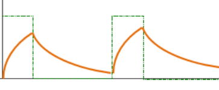

# Lab 2 : Digital I/O

Seneca College 
SEP600 Embedded Systems

## Introduction

Documentation of the Cortex-M4 instruction set, board user's guide, and the microcontroller reference manual can be found here:

- [Arm Cortex-M4 Processor Technical Reference Manual Revision](https://developer.arm.com/documentation/100166/0001)
- [ARMv7-M Architecture Reference Manual](https://developer.arm.com/documentation/ddi0403/latest/)
- [FRDM-K64F Freedom Module User’s Guide](FRDMK64FUG.pdf) (From [nxp.com](https://www.nxp.com/webapp/Download?colCode=FRDMK64FUG))
- [Kinetis K64 Reference Manual](K64P144M120SF5RM.pdf) (From [nxp.com](https://www.nxp.com/webapp/Download?colCode=K64P144M120SF5RM))
- [FRDM-K66F Freedom Module User’s Guide](FRDMK66FUG.pdf) (From [nxp.com](https://www.nxp.com/webapp/Download?colCode=FRDMK66FUG))
- [Kinetis K66 Reference Manual](K66P144M180SF5RMV2.pdf) (From [nxp.com](https://www.nxp.com/webapp/Download?colCode=K66P144M180SF5RMV2))

## Materials
- Safety glasses (PPE)
- Breadboard
- Jumper Wires
- (1x) 1kΩ-10kΩ Resistor
- (1x) Button (optional)
- (1x) 0.1-10µF Capacitor (ceramic or electrolytic)

## Preparation

Read over the lab manual for this lab. Acquire the Freedom microcontroller board and install the necessary IDE as described in the lab manual.

> ### Lab Preparation Question
> 1. Read over the lab and understand the procedures.

## Procedures

### IDE Option 1: MCUXpresso

1. Go to the following link to download the code for a simple blink LED program. This is the code you'll base your lab exercise with. [https://github.com/Seneca-BSA/bsa-sep600](https://github.com/Seneca-BSA/bsa-sep600)
1. Once you've downloaded the code above, unzip it locally.
1. Open MCUXpresso then import the project by File > Import Project from File System or Archive. Find the folder that you've unzipped the code from above then select the folder "lab" for import.
1. Click Finish to import the project.

### IDE Option 2: Mbed Studio

1. Go to the following link to download Mbed Studio. [https://os.mbed.com/studio/](https://os.mbed.com/studio/)
1. You'll need to sign up for an Mbed account.
1. Install Mbed Studio and sign in to Mbed Studio using the account you just created.
1. Follow the instructions [here](https://os.mbed.com/docs/mbed-studio/current/getting-started/index.html) to load the LED blink program to test your setup.
1. Select the appropriate board then replace the default code with the following:

<pre>
int main()
{
    // Initialise the digital pin LED1 as an output
    DigitalOut led(LED1);
    // remove ifdef from the default code

    printf("Program started!\r\n"); // added to test serial

    while (true) {
        led = !led;
        printf("Blinking!\r\n"); // added to test serial
        ThisThread::sleep_for(BLINKING_RATE);
    }
}
</pre>

### Part 1: Pull-Up and Pull-Down

***Figure 2.1** (A) Pull-Up Input. (B) Pull-Down Input.*

1. Acquire a breadboard, a 1kΩ (or higher resistor), a button (or using jumper wires as a switch), and jumper wires.
1. Assemble a Pull-Up circuit as given above and attach the signal to one of the digital input pins of your microcontroller. Refer to the microcontroller board manual for details on pin assignment.
    > **Lab Question:** What is the current passing through the resistor when the switch is closed? Is this a safe current for the resistor? (Hint: what is the maximum power the resistor can handle?)
    > **Lab Question:** What can we modify to reduce the energy consumption of this circuit?
1. Modify the code provided to you earlier to include a DigitalIn object for accepting digital input. Remember, you'll need to set up a digital pin for input first.
    
<pre>
    int main()
    {
        // Initialise the digital pin LED1 as an output
        DigitalOut led(LED1);
        DigitalIn button(PTXX); // Replace XX with your input pin
        ...
    }
    </pre>
1. Since the input is pull-up, the normal state will be HIGH. To detect a button press, we need to check for a LOW state. Replace the while loop with the following:
    
<pre>
    while (true)
    {
        if (!button)
        {
            led = 0; // LED ON
        } else
        {
            led = 1; // LED OFF
        }
    }
    </pre>
1. Run and test your program.
1. Without taking apart your Pull-up circuit, assemble another Pull-Down circuit as given above and attach the signal to another of the digital input pins of your microcontroller. Refer to the microcontroller board manual for details on pin assignment.
1. Modify your code so the second switch you assembled will trigger the second LED (LED2) to turn on.
1. Run and test your program.

### Part 2: PWM Out and RC

***Figure 2.2** RC Circuit.*

1. Without removing your pull-up and pull-down circuit, assemble an RC circuit as given above and attach the input PWM signal to a PWM-capable pin of your microcontroller. Refer to the microcontroller board manual for details on pin assignment.
    > **Lab Question:** What is the RC time constant for your circuit? You'll need this for your program.
1. Modify your code to set up a PWM pin.
    
<pre>
    int main()
    {
        ...
        PwmOut pwm(PTXX); // Replace XX with your pwm pin
        ...
    }
    </pre>
1. Add the following code to start PWM. Use a period that is at least twice your RC time constant.
    
<pre>
    int main()
    {
        ...
        pwm.period(XXXf); // period in s
        pwm.write(0.50f); // duty cycle 0.5f = 50%
        ...
    }
    </pre>
1. Turn on the DSO and connect CH1 to the output pin and CH2 to the RC circuit output.
1. Run and test your program.
1. Adjust the DSO so both CH1 and CH2 are in view. Your signal should look like the graph below.

    

    ***Figure 2.2** PWM signal after RC smoothing.*
1. Adjust your PWM settings so there's less than 10% fluctuation between the high and low voltage after the RC filter (CH2).
    > **Lab Question:** What is the PWM frequency to achieve this?

## Reference

- [mbed I/O API](https://os.mbed.com/docs/mbed-os/v6.16/apis/i-o-apis.html)
- [DigitalIn](https://os.mbed.com/handbook/DigitalIn)
- [DigitalOut](https://os.mbed.com/handbook/DigitalOut)
- [PwmOut](https://os.mbed.com/handbook/PwmOut)