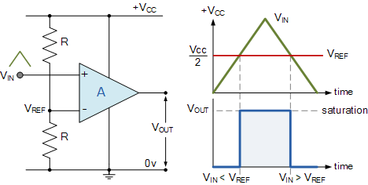
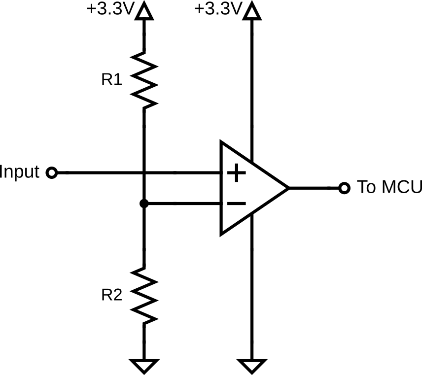
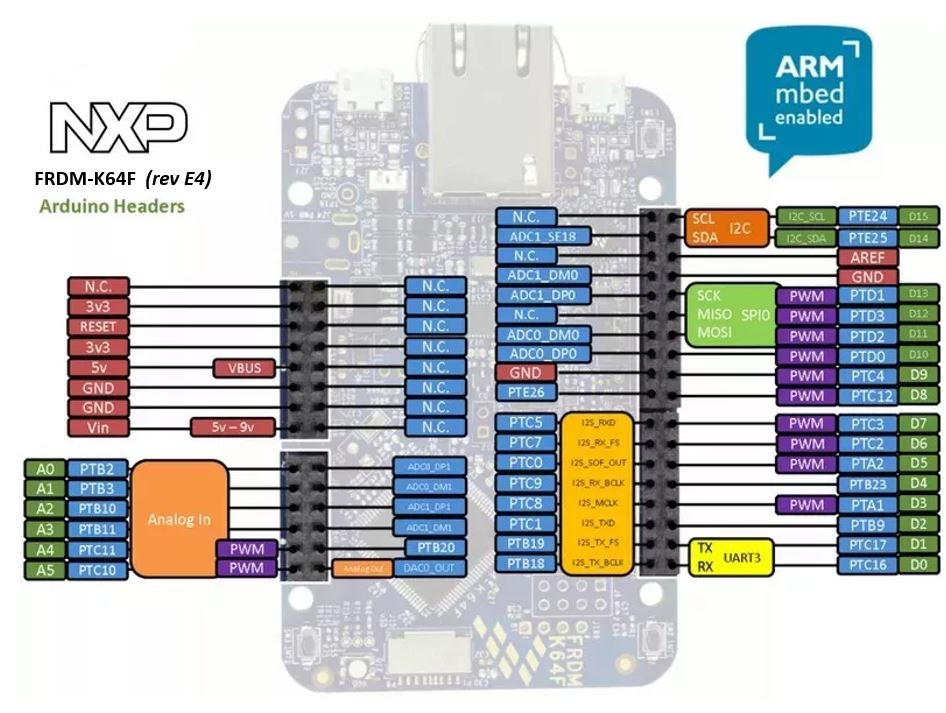
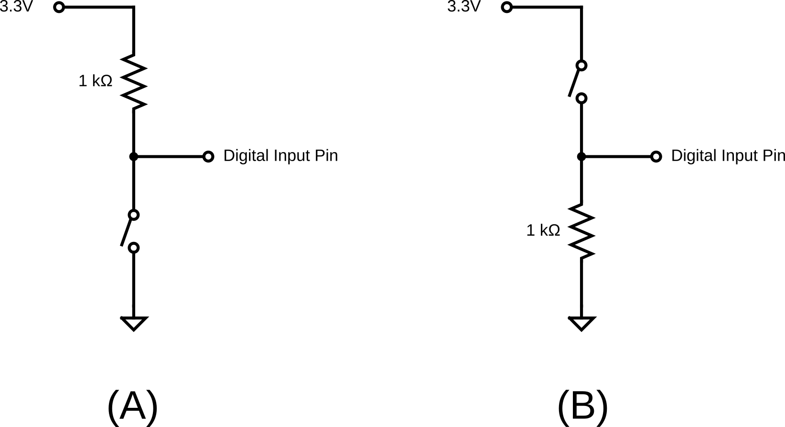

# Lab 2: Comparator and Digital I/O

Seneca Polytechnic 
SEP600 Embedded Systems

## Introduction

Documentation for the Cortex-M4 instruction set, board user's guide, and the microcontroller reference manual can be found here:

Documentation for the Freedom K64 and K66 boards and their microcontrollers can be found here:

- [FRDM-K64F Freedom Module User’s Guide](https://www.nxp.com/webapp/Download?colCode=FRDMK64FUG) ([PDF](FRDMK64FUG.pdf))
- [Kinetis K64 Reference Manual](https://www.nxp.com/webapp/Download?colCode=K64P144M120SF5RM) ([PDF](K64P144M120SF5RM.pdf))
- [FRDM-K64F Mbed Reference](https://os.mbed.com/platforms/FRDM-K64F/)
- [FRDM-K64F Mbed Pin Names](https://os.mbed.com/teams/Freescale/wiki/frdm-k64f-pinnames)
- [FRDM-K66F Freedom Module User’s Guide](https://www.nxp.com/webapp/Download?colCode=FRDMK66FUG) ([PDF](FRDMK66FUG.pdf))
- [Kinetis K66 Reference Manual](https://www.nxp.com/webapp/Download?colCode=K66P144M180SF5RMV2) ([PDF](K66P144M180SF5RMV2.pdf))
- [FRDM-K66F Mbed Reference](https://os.mbed.com/platforms/FRDM-K66F/)
- [FRDM-K66F Mbed Pin Names](https://os.mbed.com/teams/NXP/wiki/FRDM-K66F-Pinnames)

Documentation for the Cortex-M4 instruction set can be found here:

- [Arm Cortex-M4 Processor Technical Reference Manual Revision](https://developer.arm.com/documentation/100166/0001) ([PDF](Cortex-M4-Proc-Tech-Ref-Manual.pdf))
    - [Table of Processor Instructions](https://developer.arm.com/documentation/100166/0001/Programmers-Model/Instruction-set-summary/Table-of-processor-instructions)
- [ARMv7-M Architecture Reference Manual](https://developer.arm.com/documentation/ddi0403/latest/) ([PDF](DDI0403E_e_armv7m_arm.pdf))

### Comparator

An operational amplifier (op-amp) can be used as a comparator, a device that compares two input voltages and outputs a signal based on which input is higher. In this configuration, the op-amp operates in open-loop mode, meaning there is no feedback loop, allowing it to function as a high-gain amplifier. When the non-inverting input voltage exceeds the inverting input voltage, the output swings to one extreme (positive saturation). Conversely, when the inverting input voltage exceeds the non-inverting input, the output swings to the other extreme (negative saturation). This sharp transition between high and low states makes op-amp comparators ideal for digital signal processing, threshold detection, and square wave generation. They are widely used in applications such as zero-crossing detectors, overcurrent protection circuits, and pulse-width modulation.

***Figure 2.1***

## Materials
- Safety glasses (PPE)
- Freedom K64F or K66F Board
- Breadboard
- Jumper wires
- (1x) Op-Amp (LM358, LM324, or similar)
- Various 1kΩ-10kΩ resistors
- (2x) Buttons or switches
- (1x) Potentiometer (Optional)

## Preparation

Read over the lab manual for this lab and acquire the necessary materials.

## Procedures

### Part 1: Comparator and Digital Input

***Figure 2.2***

1. Acquire a breadboard, an op-amp, jumper wires, and the necessary resistors to assemble the circuit shown above. Use your microcontroller board as the 3.3V power source for the comparator, and refer to your op-amp's datasheet for its pinout.

2. Choose R1 and R2 so that the reference voltage (inverting input) for the comparator is **2V**. Keep in mind that the maximum power for a typical through-hole resistor is 1/4W. Double-check the maximum power rating of the resistor you are using to select the appropriate resistance value.

3. Connect the output of the variable power supply to the non-inverting input of the comparator. Alternatively, you may use the output of a potentiometer instead of a power supply.

    **Recommendation:** It is always a good idea to validate your circuit's output before connecting it to a microcontroller.

4. Connect the output of the comparator to any PTXXX pin on the FRDM-K64F. All numbered pins (PTXXX) can be used as DigitalIn and DigitalOut interfaces. For the FRDM-K66F, refer to the [FRDM-K66F Mbed Reference](https://os.mbed.com/platforms/FRDM-K66F/).

    

    ***Figure 2.3***: FRDM-K64F Header Pinout from [FRDM-K64F Mbed Reference](https://os.mbed.com/platforms/FRDM-K64F/).

5. Ensure that the negative connector of the power supply, your comparator, and your microcontroller all share a common ground reference voltage.

6. Program the following code into your microcontroller:

        int main()
        {
            DigitalOut led(LED1); // Initialize the digital pin LED1 as an output
            DigitalIn comparator(PTXXX); // Initialize a digital input object
            // Replace PTXXX with your input pin
            
            while (true)
            {
                if (comparator)
                {
                    led = 0; // LED ON
                } else
                {
                    led = 1; // LED OFF
                }
            }
        }

    Replace PTXXX with the pin you connected the comparator output to.

7. Once the code has been uploaded, set the power supply output to 1V and turn on the power supply. Did the red LED turn ON or OFF?

8. Raise the power supply voltage to 3V. Did the red LED turn ON or OFF now?
    
Do not raise the power supply voltage higher than 5V

9. Ensure you fully understand how the power supply voltage is affecting the comparator's output and how the signal is being read by the microcontroller as a digital input.

### Part 2: Pull-Up and Pull-Down

***Figure 2.4***: (A) Pull-Up Input. (B) Pull-Down Input.

1. Without disassembling the Part 1 circuit, acquire a 1kΩ (or higher resistance value) resistor, a button (or use jumper wires as a switch), and jumper wires to assemble a Pull-Up circuit as shown above. Attach the output signal to one of the digital input pins of your microcontroller.

    **Recommendation:** It is always a good idea to validate your circuit's output before connecting it to a microcontroller.

2. What is the current passing through the resistor when the switch is closed? Is this a safe current for the resistor? How can you modify the circuit to reduce its energy consumption?

3. Modify the code from Part 1 to include an additional DigitalIn object for reading the button input. The new logic will be as follows:

    - Only if the input to the comparator is above 2V, the red LED will turn ON only if the button is pressed. That is, the comparator input acts as the master switch.
    
    Remember, you'll need to set up a digital pin input object for the button input first. Use serial print statements for debugging or information as necessary.

4. Run and test your program.

5. Without taking apart your Pull-Up circuit, assemble another Pull-Down circuit as shown above and attach the signal to another digital input pin of your microcontroller.

6. Modify your code so the second switch you assembled will trigger the second LED (LED2) to turn ON only if the button is pressed. As before, the LED will only turn on if the input to the comparator is above 2V. Keep in mind that you are now using a Pull-Down circuit as input.

7. Run and test your program.

8. Ensure you fully understand digital input and output, as well as Pull-Up and Pull-Down circuits. Experiment with the code or circuit as necessary to deepen your understanding.

### Part 3: PWM Output

1. Without removing your comparator, Pull-Up, and Pull-Down circuits, connect a PWM-capable pin of your microcontroller (those with a purple PWM label in the pinout diagram) to CH1 of the DSO. Refer to the microcontroller board manual for details on pin assignments. Connect the DSO ground to the common ground of your circuit.

    **NOTE:** In order for microcontroller to reliablilty read from external signal (such as from a power supply), **they must all share the same reference (common ground).**

2. Modify your code to set up a PWM pin:

        int main()
        {
            ...
            PwmOut pwm(PTXXX); // Replace PTXXX with your PWM pin
            ...
        }

3. Add the following code to start the PWM output. Use a period that is at least twice your RC time constant:

        int main()
        {
            ...
            pwm.period(0.001f); // Set PWM period in seconds
            pwm.write(0.50f); // Set PWM duty cycle, 0.5f = 50%
            ...
        }

4. Run and test your program. Turn on the DSO and adjust the settings to see CH1 as a stable square wave. What do you notice about the ratio between the ON time and OFF time of the square wave? What is the PWM frequency?

5. Modify your code so that one of the buttons will also increment the PWM duty cycle by 10% (i.e., +0.10f), and the other button will decrement the duty cycle by 10% (i.e., -0.10f). All other comparator and LED logic should remain in the code. The increase and decrease should happen in real-time right after the button press. Use serial print statements for debugging or information as necessary.

    Hint: You only need to change the duty cycle. You do not have to redefine the PWM object or the PWM period.

6. Ensure you fully understand the concept of PWM.

Once you've completed all the steps above (and ONLY when you are ready, as you'll only have one opportunity to demo), ask the lab professor or instructor to come over and demonstrate that you've completed the lab. You might be asked to explain some of the concepts you've learned in this lab.

## References

- [mbed I/O APIs](https://os.mbed.com/docs/mbed-os/v6.16/apis/i-o-apis.html)
- [DigitalIn](https://os.mbed.com/handbook/DigitalIn)
- [DigitalOut](https://os.mbed.com/handbook/DigitalOut)
- [PwmOut](https://os.mbed.com/docs/mbed-os/v6.16/apis/pwmout.html)
