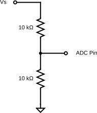
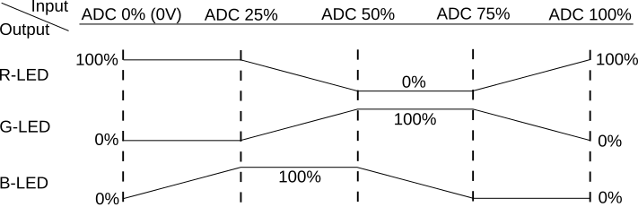

# Lab 3 : DAC and ADC

Seneca College 
SEP600 Embedded Systems

## Introduction

Documentation of the Cortex-M4 instruction set, board user's guide, and the microcontroller reference manual can be found here:

### Cortex M4

- [Arm Cortex-M4 Processor Technical Reference Manual Revision](https://developer.arm.com/documentation/100166/0001)
- [ARMv7-M Architecture Reference Manual](https://developer.arm.com/documentation/ddi0403/latest/)

### FRDM-K64F

- [FRDM-K64F Freedom Module User’s Guide](FRDMK64FUG.pdf) (From [nxp.com](https://www.nxp.com/webapp/Download?colCode=FRDMK64FUG))
- [Kinetis K64 Reference Manual](K64P144M120SF5RM.pdf) (From [nxp.com](https://www.nxp.com/webapp/Download?colCode=K64P144M120SF5RM))
- [FRDM-K64F mbed](https://os.mbed.com/platforms/FRDM-K64F/)

### FRDM-K66F

- [FRDM-K66F Freedom Module User’s Guide](FRDMK66FUG.pdf) (From [nxp.com](https://www.nxp.com/webapp/Download?colCode=FRDMK66FUG))
- [Kinetis K66 Reference Manual](K66P144M180SF5RMV2.pdf) (From [nxp.com](https://www.nxp.com/webapp/Download?colCode=K66P144M180SF5RMV2))
- [FRDM-K66F mbed](https://os.mbed.com/platforms/FRDM-K66F/)

## Materials
- Safety glasses (PPE)
- Breadboard
- Jumper Wires
- (1x) 1kΩ-10kΩ Resistor
- (1x) Potentiometer (Optional)

## Preparation

> ### Lab Preparation Question
> 1. Read over the lab and understand the procedures.

## Procedures

### Part 1: PWM Output vs DAC Output

In Part 1, we'll set up a PWM and a DAC to compare the difference between the output.

1. Connect a PWM output pin to CH1 of the DSO. Refer to the mbed board pages to identify which pin is a PWM pin.
1. Connect a DAC output pin to CH2 of the DSO. Refer to the mbed board pages to identify which pin is a DAC pin.
1. Upload the following code to generate a PWM and a DAC output. Remember, you'll need to replace PTXX with the PWM pin that you are using.
    <pre>
    
        int main()
        {
            // setup pins
            PwmOut pwm(PTXX); // replace with a PWM pin
            AnalogOut aout(DAC0_OUT);
            
            // pwm settings
            pwm.period(0.02f); // 50Hz pwm, 0.02s period

            printf("Program started!\r\n"); // added to test serial

            while (true) 
            {
                // loop to cycle from 0% to 100%
                for (float i = 0.0f; i < 1.0f; i += 0.01f)
                {
                    aout = i; // set DAC out %
                    pwm = i; // set PWM duty cycle %

                    // delay for 10ms, 1000ms for each ramp up
                    ThisThread::sleep_for(10);
                }
                
                // loop to cycle from 100% to 0%
                for (float i = 1.0f; i > 0.0f; i -= 0.01f)
                {
                    aout = i; // set DAC out %
                    pwm = i; // set PWM duty cycle %

                    // delay for 10ms, 1000ms for each ramp down
                    ThisThread::sleep_for(10);
                }
            }
        }
    </pre>

1. Turn on the DSO and run the program. You should see something similar to the figure below on your DSO except it'll be a triangular wave instead of a sine wave.

    

    ***Figure 3.1** DAC and PWM output*

    > **Lab Question:** What circuit should you apply to the PWM output if you want to see the same waveform as the DAC output?

1. Keep the DSO connected.

### Part 2: ADC Input

Next, we'll connect the ADC to an analog voltage input so it can be read into the microcontroller. The voltage signal will come from the bench power supply. To prevent damaging the ADC, we'll first use a voltage division to halve the signal. **Never connect the power supply directly to the ADC without a resistor.**

***Figure 3.2** Voltage division circuit for ADC input*

1. Assemble the voltage division circuit above on your breadboard and connect the voltage divider output to an analog input pin. Vs will be provided by the bench power supply. Ensure the power supply output is OFF. Optionally, you can use a potentiometer to achieve the same.
1. As a precaution, we only want to supply a maximum of 3.3V to the ADC pin, this means the power supply output should never to above 6.6V. Set the power supply output to 1V.
1. Add the following code in the main function of your code but before the while loop to set up an analog input pin. Remember, you'll need to replace PTXX with the PWM pin that you are using.
    <pre>
    
        int main()
        {
            ...
            AnalogIn ain(PTXX); // replace with a ADC pin
            ...
        }
    </pre>

1. Next, replace the while loop with the following code so we are controlling the DAC output and the PWM duty cycle with the analog input.
    <pre>
    
        while (true)
        {
            i = ain; // read ADC
            aout = i; // set DAC out %
            pwm = i; // set PWM duty cycle %

            // delay for 10ms, 1000ms for each ramp up
            ThisThread::sleep_for(100);
        }
    </pre>

1. Next, let's also use the ADC reading to control the LED and print the reading out as well. Modify your code to include the following respectively.
    <pre>
    
        int main()
        {
            ...
            PwmOut led(LED1); // set LED
            ...
            led.period(0.02f); // 50Hz pwm, 0.02s period
            ...
        }
    </pre>

    <pre>
    
        while (true)
        {
            ...
            pwm = i; // set PWM duty cycle %
            ...
        }
    </pre>

1. Lastly, let's also print out the ADC value in serial so we can take a look at the input.
    <pre>
    
        while (true)
        {
            ...
            // print the percentage, 16 bit normalized values, and something we understand
            printf("percentage: %3.3f%% ", ain.read() * 100.0f);
            printf("normalized: 0x%04X ", ain.read_u16());
            printf("normalized: %3.3fV \n", ain * 3.3); // % * 3.3V
            ...
        }
    </pre>

1. Turn on the power supply output and run the program. You should see a constant 0.5V on the DSO, a about 15% duty cycle PWM wave, the Red LED light at 15% on, and a serial output state of about 15% and 0.5V.

    > **Lab Question:** What do you think can be done to reduce reading fluctuation? How do you think that can be achieved?

### Part 3: LED Colour Mixing

Consider the figure below for a framework on how to achieve LED colour mixing. When the ADC input is 0%, the R-LED should output 100% and the others at 0%. As the ADC input goes up to 25%, the B-LED output will increase proportionally to 100% to get the colour purple.

***Figure 3.3** Colour Mixing*

> **Lab Question:** Write a program that will achieve the colour mixing effect described above using the ADC as input and all three colour channels as output. Keep the DSO connected and serial output for the demo.

## Reference

- [mbed I/O API](https://os.mbed.com/docs/mbed-os/v6.16/apis/i-o-apis.html)
- [PwmOut](https://os.mbed.com/docs/mbed-os/v6.16/apis/pwmout.html)
- [AnalogOut](https://os.mbed.com/docs/mbed-os/v6.16/apis/analogout.html)
- [AnalogIn](https://os.mbed.com/docs/mbed-os/v6.16/apis/i-o-apis.html)