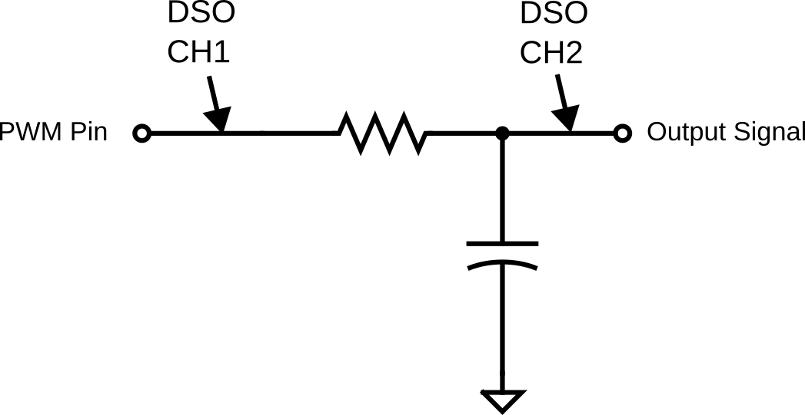

# Lab 3: PWM and DAC

Seneca Polytechnic 
SEP600 Embedded Systems

## Introduction

Documentation for the Cortex-M4 instruction set, the board user's guide, and the microcontroller reference manual can be found here:

Documentation for the Freedom K64 and K66 boards and their microcontrollers can be found here:

- [FRDM-K64F Freedom Module User’s Guide](https://www.nxp.com/webapp/Download?colCode=FRDMK64FUG) ([PDF](FRDMK64FUG.pdf))
- [Kinetis K64 Reference Manual](https://www.nxp.com/webapp/Download?colCode=K64P144M120SF5RM) ([PDF](K64P144M120SF5RM.pdf))
- [FRDM-K64F Mbed Reference](https://os.mbed.com/platforms/FRDM-K64F/)
- [FRDM-K64F Mbed Pin Names](https://os.mbed.com/teams/Freescale/wiki/frdm-k64f-pinnames)
- [FRDM-K66F Freedom Module User’s Guide](https://www.nxp.com/webapp/Download?colCode=FRDMK66FUG) ([PDF](FRDMK66FUG.pdf))
- [Kinetis K66 Reference Manual](https://www.nxp.com/webapp/Download?colCode=K66P144M180SF5RMV2) ([PDF](K66P144M180SF5RMV2.pdf))
- [FRDM-K66F Mbed Reference](https://os.mbed.com/platforms/FRDM-K66F/)
- [FRDM-K66F Mbed Pin Names](https://os.mbed.com/teams/NXP/wiki/FRDM-K66F-Pinnames)

Documentation for the Cortex-M4 instruction set can be found here:

- [Arm Cortex-M4 Processor Technical Reference Manual Revision](https://developer.arm.com/documentation/100166/0001) ([PDF](Cortex-M4-Proc-Tech-Ref-Manual.pdf))
    - [Table of Processor Instructions](https://developer.arm.com/documentation/100166/0001/Programmers-Model/Instruction-set-summary/Table-of-processor-instructions)
- [ARMv7-M Architecture Reference Manual](https://developer.arm.com/documentation/ddi0403/latest/) ([PDF](DDI0403E_e_armv7m_arm.pdf))

### Pulse Width Modulation (PWM)

As discussed in class and tested in Lab 2, Pulse Width Modulation (PWM) is a technique used to control the amount of power delivered to an electrical device by varying the width of the pulses in a signal. It involves turning a signal on and off at a high frequency, with the proportion of time the signal is "on" (the duty cycle) determining the average voltage or power delivered. A higher duty cycle means more power, while a lower duty cycle reduces power. PWM is widely used in applications such as motor control, light dimming, and power regulation because it allows for efficient energy use and precise control of the output. It is favored for its simplicity, cost-effectiveness, and ability to operate with minimal heat generation compared to traditional methods of voltage regulation.

***Figure 3.1** PWM*

### Digital-to-Analog Converter (DAC)

A Digital-to-Analog Converter (DAC) is an essential component in modern electronic systems that converts digital data, usually in binary form, into an analog signal. This process is crucial for applications like audio playback, where the digital data stored in devices like smartphones or computers must be transformed into analog signals to drive speakers or headphones. The quality of a DAC can significantly influence sound fidelity, as it directly impacts the smoothness and accuracy of the analog signal. DACs are used in a wide variety of devices, from audio equipment and televisions to medical devices and instrumentation, playing a key role in bridging the digital world with the analog one.

***Figure 3.2** DAC Output*

## Materials
- Safety glasses (PPE)
- Freedom K64F or K66F Board
- Breadboard
- Jumper wires
- Various 1kΩ–10kΩ resistors
- Various 0.1µF–10µF capacitors
- (2x) NPN Transistors (2N2222, 2N3904, or similar)
- (2x) LEDs

## Preparation

Read over the lab manual for this lab and acquire the necessary materials.

## Procedures

### Part 1: PWM Output as Analog Output

***Figure 3.3** PWM Output with RC Smoothing Circuit.*

1. Acquire a breadboard, a resistor, a capacitor, and jumper wires to assemble the circuit shown above. Attach the PWM signal to a PWM-capable pin of your microcontroller (pins with a purple PWM label in the pinout diagram from [Lab 2](lab2.md)). Refer to the microcontroller board manual for details on pin assignment.

    
If you are using a polarized capacitor, ensure the polarity of your connection is correct.

2. Calculate the RC time constant for your circuit, as you will need this for your program.

    $$ \tau = RC $$

3. Write code to set up the PWM output pin.

        int main()
        {
            ...
            PwmOut pwm(PTXXX); // Replace PTXXX with your PWM pin
            ...
        }

4. Add the following code to start the PWM output. Use a period that is at least twice the value of your RC time constant.

        int main()
        {
            ...
            pwm.period(XXXf); // period in s
            pwm.write(0.50f); // duty cycle 0.5f = 50%
            ...
        }

5. Turn on the DSO and connect CH1 to your PWM output pin and CH2 to the RC circuit output signal. The DSO ground should be common with your circuit ground.

6. Run and test your program, then adjust the DSO so that both CH1 and CH2 are visible on the display. Your signal should look similar to the graph below.

    

    ***Figure 3.3** PWM Signal after RC Smoothing.*

7. What you have now is a poorly filtered analog output. Adjust your PWM settings (e.g., period) so that there is less than 10% fluctuation between the high and low voltages after the RC filter (CH2). (The peak-to-peak voltage of the output should be less than 0.33V.)

    **Hint:** Think about the discharging and transient response of the capacitor.

    > **Lab Question:** What is the PWM period (and frequency) needed to achieve this?

    > **Lab Question:** Can the same result be achieved by modifying the circuit instead of modifying the PWM settings?

8. Do NOT disassemble this circuit. Be prepared to demonstrate its output at the end of the lab.

### Part 2: PWM vs DAC as Current Driver

Next, we'll set up a PWM and a DAC to compare the difference between the outputs.

***Figure 3.4** DAC and PWM Output*

1. Set up **two** current driver circuits as shown above. Connect a PWM output pin to the input signal of the first current driver and a DAC output pin to the input signal of the second current driver. Connect CH1 and CH2 of the DSO to the points of the first and second current driver circuits, respectively. Refer to the microcontroller board manual for details on pin assignment.

2. Use your microcontroller's 3.3V output and GND connection for the current driver circuit. Select \(R_B\) and \(R_L\) appropriately.

    - \(R_L\) should allow only 20mA of current to pass through the LED.
    - \(R_B\) should allow the NPN transistor to drive at least 20mA of current when it's fully ON at saturation.
    
    Refer to the NPN transistor's datasheet for the gain value. It is often refered to as \(h_{FE}\) by maunfacturer. The following formula from lecture slides might be useful for your calculation.

    $$ I_C = \beta I_B $$
    $$ V_{IN} - V_{BE} = I_B R_B $$

3. Modify your code to add a DAC output and a second PWM output. Since there's only one DAC available, the DAC pin name is fixed.

        int main()
        {
            ...
            AnalogOut aout(DAC0_OUT); // Set up DAC
            PwmOut pwm2(PTXXX); // Replace PTXXX with your PWM pin
            ...
            ...
            aout = 0.5f; // Use the same output setting as PWM
            pwm2.period(0.01f); // Period in s
            pwm2.write(0.50f); // Duty cycle 0.5f = 50%
            ...
        }

4. Turn on the DSO and run the program. You should also see a PWM square wave on the channel connected to the PWM circuit and a 1.65V flat line on the channel connected to the DAC. Did both LEDs turn on? If not, try increasing the output value until the LED turn on.

5. Modify your code so the two LEDs both start from 0% brightness and then gradually (at least 10 steps) increase to 100% brightness over a period of 1 second. Afterward, gradually (at least 10 steps) decrease to 0% brightness over a period of 1 second.

    At the end, you should see something similar to the figure below on your DSO.

    

    ***Figure 3.5** DAC and PWM Output*

    > **Lab Question:** What difference do you notice between the two LEDs? Which method is better?

    > **Lab Question:** After the LED reaches full brightness, at what PWM duty cycle do you start noticing a decrease in LED brightness?

6. Ensure you fully understand the concepts of PWM, the RC circuit, DAC, and the current driver.

Once you've completed all the steps above (and ONLY when you are ready, as you'll only have one opportunity to demo), ask the lab professor or instructor to come over and demonstrate that you've completed the lab. You may be asked to explain some of the concepts you've learned in this lab.

## References

- [mbed I/O APIs](https://os.mbed.com/docs/mbed-os/v6.16/apis/i-o-apis.html)
- [PwmOut](https://os.mbed.com/docs/mbed-os/v6.16/apis/pwmout.html)
- [AnalogOut](https://os.mbed.com/docs/mbed-os/v6.16/apis/analogout.html)