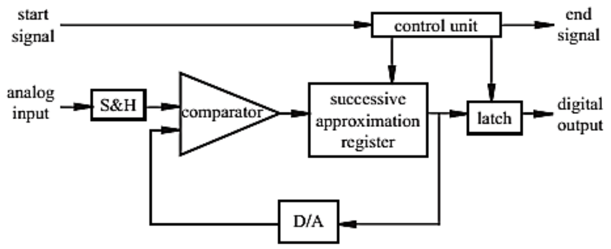
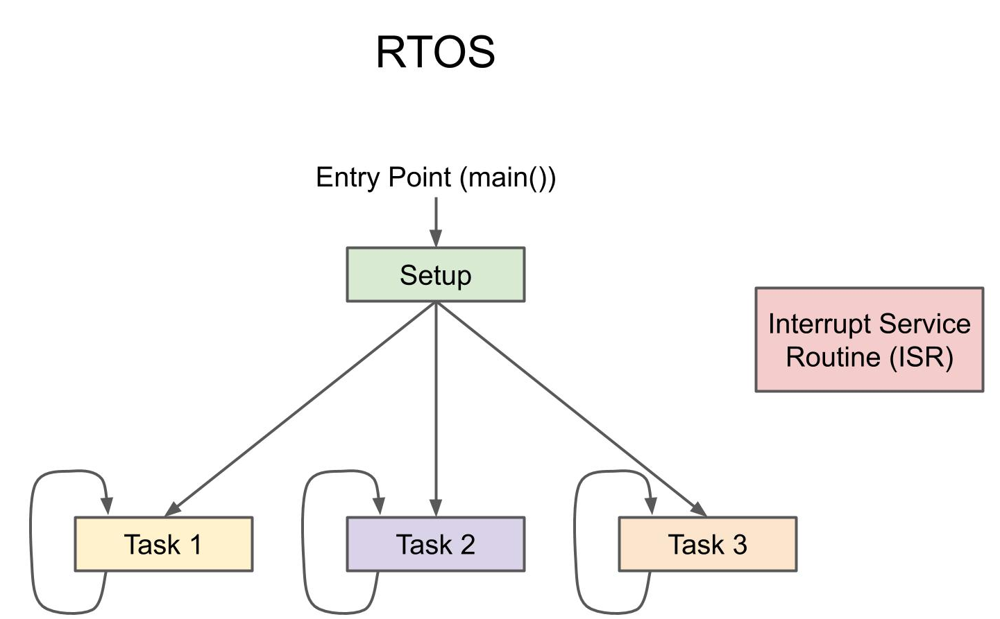
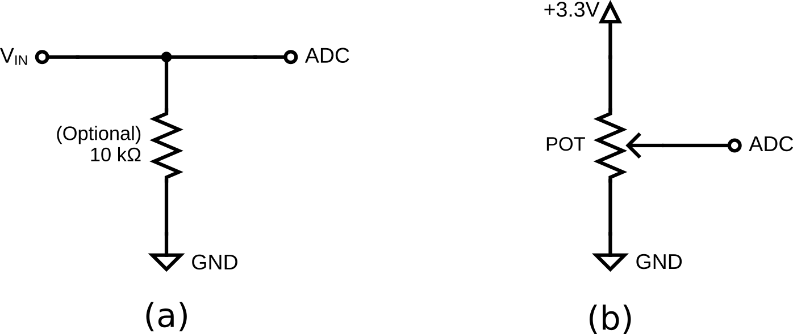

# Lab 4: ADC and RTOS

Seneca Polytechnic 
SEP600 Embedded Systems

## Introduction

Documentation for the Cortex-M4 instruction set, the board user's guide, and the microcontroller reference manual can be found here:

Documentation for the Freedom K64 and K66 boards and their microcontrollers can be found here:

- [FRDM-K64F Freedom Module User’s Guide](https://www.nxp.com/webapp/Download?colCode=FRDMK64FUG) ([PDF](FRDMK64FUG.pdf))
- [Kinetis K64 Reference Manual](https://www.nxp.com/webapp/Download?colCode=K64P144M120SF5RM) ([PDF](K64P144M120SF5RM.pdf))
- [FRDM-K64F Mbed Reference](https://os.mbed.com/platforms/FRDM-K64F/)
- [FRDM-K64F Mbed Pin Names](https://os.mbed.com/teams/Freescale/wiki/frdm-k64f-pinnames)
- [FRDM-K66F Freedom Module User’s Guide](https://www.nxp.com/webapp/Download?colCode=FRDMK66FUG) ([PDF](FRDMK66FUG.pdf))
- [Kinetis K66 Reference Manual](https://www.nxp.com/webapp/Download?colCode=K66P144M180SF5RMV2) ([PDF](K66P144M180SF5RMV2.pdf))
- [FRDM-K66F Mbed Reference](https://os.mbed.com/platforms/FRDM-K66F/)
- [FRDM-K66F Mbed Pin Names](https://os.mbed.com/teams/NXP/wiki/FRDM-K66F-Pinnames)

Documentation for the Cortex-M4 instruction set can be found here:

- [Arm Cortex-M4 Processor Technical Reference Manual Revision](https://developer.arm.com/documentation/100166/0001) ([PDF](Cortex-M4-Proc-Tech-Ref-Manual.pdf))
    - [Table of Processor Instructions](https://developer.arm.com/documentation/100166/0001/Programmers-Model/Instruction-set-summary/Table-of-processor-instructions)
- [ARMv7-M Architecture Reference Manual](https://developer.arm.com/documentation/ddi0403/latest/) ([PDF](DDI0403E_e_armv7m_arm.pdf))

### Analog-to-Digital Converter (ADC)

An ADC is a crucial component in modern electronics that converts continuous analog signals into discrete digital values. This conversion allows electronic systems to process real-world analog signals, such as sound, temperature, or light, which are inherently continuous, by transforming them into a format that digital devices like microcontrollers or computers can understand. ADCs are commonly used in applications like audio processing, signal sampling, sensor interfacing, and communications. The quality and accuracy of an ADC are determined by factors such as its resolution (the number of bits used in the conversion) and its sampling rate (how frequently it captures data).

***Figure 4.1** ADC Output*

### Real-Time Operating System (RTOS)

An RTOS in an embedded system is a specialized operating system designed to manage hardware resources and execute tasks within strict timing constraints. Unlike general-purpose operating systems, an RTOS prioritizes real-time performance, ensuring that critical tasks execute within a predictable time frame. It typically uses a scheduler (such as preemptive, cooperative, or hybrid) to manage multiple tasks efficiently, balancing system responsiveness and resource utilization. RTOSs like FreeRTOS, VxWorks, and QNX are widely used in applications such as automotive systems, medical devices, industrial automation, and IoT devices, where deterministic behavior is crucial for reliability and safety. By providing features like task prioritization, inter-task communication, and real-time scheduling, an RTOS enhances the performance and stability of embedded systems, making them suitable for time-sensitive applications.

***Figure 4.2** RTOS Program Flowchart*

## Materials

- Safety glasses (PPE)
- Freedom K64F or K66F Board
- Breadboard
- Jumper wires
- (1×) 10kΩ Resistor
- (1×) 1kΩ–10kΩ Potentiometer (Optional)

## Preparation

Read through the lab manual and acquire the necessary materials.

## Procedures

### Part 1: Analog Input

***Figure 4.3** ADC Input Circuit.*

1. Acquire a breadboard, a 10kΩ resistor or a 10kΩ potentiometer, and jumper wires to assemble the circuit shown above. You may use the workbench power supply as \(V_{IN}\) and assemble circuit (a) or use a potentiometer to generate the output signal and assemble circuit (b). Attach the output signal to an ADC-capable (Analog Input) pin on your microcontroller (pins with an orange Analog In label in the pinout diagram from [Lab 2](lab2.md)). Refer to the microcontroller board manual for details on pin assignment. Ensure all devices share a common ground.

    
DO NOT set the power supply voltage above 3.3V.

2. Ensure the power supply output is OFF and set it to less than 3.3V.

3. Start a new program and insert the following code into the main function before the while loop to set up an analog input pin. Replace PTXX with the ADC pin you are using.
  
        int main()
        {
            ...
            AnalogIn ain(PTXX); // Replace with an ADC pin
            ...
        }

4. Insert the following code in the main while loop to read the analog input every 500ms:
    
        while (true)
        {
            ...
            reading = ain; // Read ADC

            // Delay for 500ms
            ThisThread::sleep_for(500ms);
            ...
        }

5. Modify your code to print the reading values as follows:
    
        while (true)
        {
            ...
            // Print the percentage, 16-bit normalized values, and human-readable format
            printf("Percentage: %-3d ", reading * 100);
            printf("Normalized: %-4dmV ", reading * 3.3 * 1000);
            printf("Raw HEX: 0x%04X\n", ain.read_u16());
            ...
        }

    Since **mbed OS 6** no longer enables floating-point printing by default, you can enable it by creating a file called `mbed_app.json` in the root project folder and adding:

        {
            "target_overrides": {
                "*": {
                    "target.printf_lib": "std"
                }
            }
        }

6. Set the power supply output to 1V, then turn it on and run the program. If using a potentiometer, set it to a middle position.

7. Open a terminal to read the serial output from your microcontroller, which should display the voltage of the output signal.

8. Modify the serial output to show the **raw ADC output in binary** instead of HEX.

    > **Lab Question:** How many bits does the ADC on your microcontroller have, and what is its resolution?

### Part 2: RTOS Multi-Threading

1. Instead of printing data directly in the `while` loop of `main()`, we'll utilize **multi-threading** in mbed OS by running the printing function in a separate thread.

2. Move the two `printf` statements for `reading` into a new function called `print_data()`, using a pointer to pass variables. Add the following above `main()`:

        void print_data(float *reading) {
            while (true) {
                printf("Percentage: %-3d ", *reading * 100);
                printf("Normalized: %-4dmV ", *reading * 3.3 * 1000);
                // Delay for 1s
                ThisThread::sleep_for(1000ms);
            }
        }

3. Define a new thread above `print_data()`:

        Thread print_data_thread;

4. Start the thread in `main()`:

        print_data_thread.start(callback(print_data, &reading));

5. Run the updated code.

    > **Lab Question:** Why is the RAW reading printed out twice?

6. Modify your code so the output is the same as Part 1, then use **Mutex or Semaphore** to prevent race conditions and ensure thread safety. Refer to class notes for implementation. For example, the variable "reading" should be guaranteed as unchanged between the printf statements. **Note:** All analog readings must occur in the main thread.

    > **Lab Question:** What shared resource(s) are you protecting, and what could happen if it's not protected?

Once you've completed all the steps above (and ONLY when you are ready, as you'll only have one opportunity to demo), ask the lab professor or instructor to come over and demonstrate that you've completed the lab. You may be asked to explain some of the concepts you've learned in this lab.

## References

- [mbed I/O APIs](https://os.mbed.com/docs/mbed-os/v6.16/apis/i-o-apis.html)
- [AnalogIn](https://os.mbed.com/docs/mbed-os/v6.16/apis/i-o-apis.html)
- [mbed RTOS APIs](https://os.mbed.com/docs/mbed-os/v6.16/apis/scheduling-rtos-and-event-handling.html)