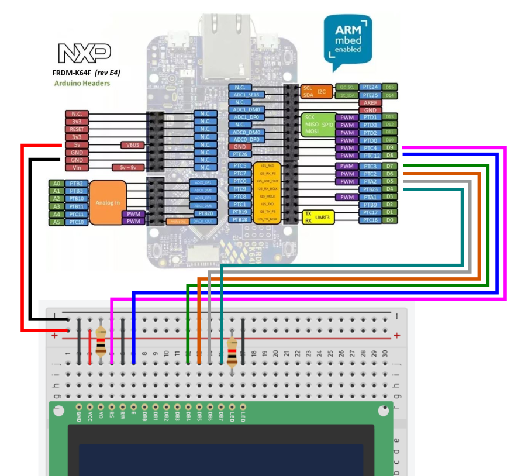

# Lab 5 : Parallel LCD and Interrupt

Seneca College 
SEP600 Embedded Systems

## Introduction

Documentation of the Cortex-M4 instruction set, board user's guide, and the microcontroller reference manual can be found here:

### Cortex M4

- [Arm Cortex-M4 Processor Technical Reference Manual Revision](https://developer.arm.com/documentation/100166/0001)
- [ARMv7-M Architecture Reference Manual](https://developer.arm.com/documentation/ddi0403/latest/)

### FRDM-K64F

- [FRDM-K64F Freedom Module User’s Guide](FRDMK64FUG.pdf) (From [nxp.com](https://www.nxp.com/webapp/Download?colCode=FRDMK64FUG))
- [Kinetis K64 Reference Manual](K64P144M120SF5RM.pdf) (From [nxp.com](https://www.nxp.com/webapp/Download?colCode=K64P144M120SF5RM))
- [FRDM-K64F mbed](https://os.mbed.com/platforms/FRDM-K64F/)

### FRDM-K66F

- [FRDM-K66F Freedom Module User’s Guide](FRDMK66FUG.pdf) (From [nxp.com](https://www.nxp.com/webapp/Download?colCode=FRDMK66FUG))
- [Kinetis K66 Reference Manual](K66P144M180SF5RMV2.pdf) (From [nxp.com](https://www.nxp.com/webapp/Download?colCode=K66P144M180SF5RMV2))
- [FRDM-K66F mbed](https://os.mbed.com/platforms/FRDM-K66F/)

## Materials
- Safety glasses (PPE)
- Breadboard
- LCD Display (Parallel**)
- 1kΩ Resistors
- Jumper Wires

** If you are using an I2C LCD, connect the LCD to the I2C pins and use the I2C library instead of the parallel LCD library.

## Preparation

> ### Lab Preparation Question
> 1. Read over the lab and understand the procedures.

## Procedures

### Part 1: Parallel LCD

In Part 1, we'll take a look at how to connect and display characters to a parallel LCD.

A parallel 16x2 LCD shown in Figure 5.1 usually uses 4-wire for parallel data transfer plus 2-wire for enable and register select. A 8-wire data configuration is sometimes used but normally not required.

***Figure 5.1** 16x2 LCD*

The typical pinout and connection for a 16x2 LCD are given below. Please keep in mind that depending on the manufacturer, some labels and configurations may vary.

| LCD Pin # | LCD label | K64F/K66F Pin |
|---|---|---|
| 1 | GND / VSS | GND / 0V |
| 2 | VDD / VCC | 5V |
| 3 | VO | 1kΩ to GND / 0V |
| 4 | RS | D9 |
| 5 | R/W | GND / 0V |
| 6 | E | D8 |
| 7 | DB0 | N/C |
| 8 | DB1 | N/C |
| 9 | DB2 | N/C |
| 10 | DB3 | N/C |
| 11 | DB4 | D4 |
| 12 | DB5 | D5 |
| 13 | DB6 | D6 |
| 14 | DB7 | D7 |
| 15 | LED+ | 1kΩ to 5V |
| 16 | LED- | N/C |

- Some models work with 3.3V instead of 5V
- VO pin configuration varies depending on the manufacturer. A potentiometer can be used instead of a 1kΩ Resistor for adjustable contrast

You may change the pin to use on the K64F/K66F board depending on your application and pin availability.

1. Acquire an LCD and resistor then connect them to the Freedom K64F/K66F board as per the connection table given above and the diagram below. If you are using an I2C LCD, connect the LCD to an I2C pin.

    

    ***Figure 5.2** LCD connection with Freedom board*

1. Open mbed Studio and install the following library to your project depending if you are using the Parallel or I2C version of the LCD.

    - Parallel LCD: https://os.mbed.com/users/sstaub/code/mbedLCD/
    - I2C LCD: https://os.mbed.com/users/sstaub/code/mbedLCDi2c/

1. Use the following code to output some message on the display.
    <pre>

        #include "mbed.h"
        #include "LCD.h"

        LCD lcd(D9, D8, D4, D5, D6, D7, LCD16x2); // RS, EN, D4-D7, Type
 
        int main() {

            lcd.cls(); // clear display
            lcd.locate(0, 0); // set cursor location
            lcd.printf("START\n"); // display text
            ThisThread::sleep_for(2s);
            lcd.cls(); // clear display
            lcd.locate(0, 0); // set cursor location
            lcd.printf("Hello World!\n"); // display text

        }
    </pre>

1. After uploading your code, the LCD should show "START" for 2 seconds then "Hello World!".

    > **Lab Question:** Modify your code to display your name and student number on row 1 and your lab partner's name and student name on row 2 (or be creative like "SEP600 Embedded System is Awesome"). Since the message will be too wide for the LCD, display the text as a horizontal scrolling message at a reasonable rate. 
    >
    > **Hint:** There are many ways to do this. Refer to the library documentation on how to move the print cursor.

### Part 2: Interrupt

Interrupt is a way for the microcontroller to listen to events without continuously polling from the input.

1. Connect a pull-up or pull-down button to any digital pin of your choosing.

1. Add the following code before ``main()`` to create an interrupt object.
    <pre>

        InterruptIn button(PTXX);

    </pre>

1. Add the following interrupt routine before ``main()`` and add the appropriate code for displaying a message on the LCD.
    <pre>

        void button_isr(){
            // display an interrupt messages on the LCD
            // USE wait_us for delay
            // DO NOT use ThisThread::sleep_for
        }

    </pre>

1. Within ``main()`` Attach the interrupt routine with the button and adjust for rise or fall edge depending on your circuit configuration.
    <pre>

        button.rise(&button_isr);

    </pre>

1. Upload and test your interrupt.

## Reference

- [InterruptIn](https://os.mbed.com/docs/mbed-os/v6.16/apis/interruptin.html)