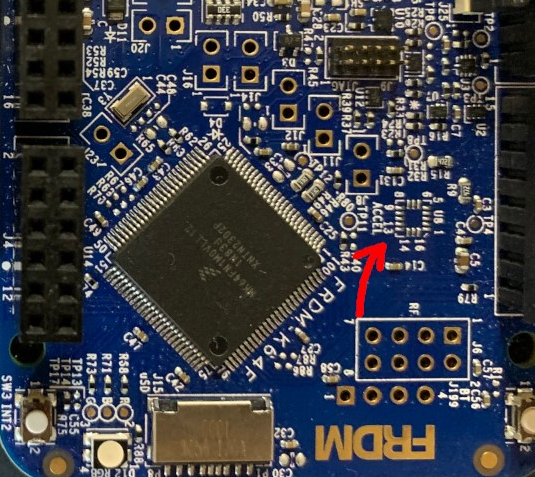

# Lab 5 : Serial UART and I2C Communication

Seneca Polytechnic 
SEP600 Embedded Systems

## Introduction

Documentation for the Cortex-M4 instruction set, the board user's guide, and the microcontroller reference manual can be found here:

Documentation for the Freedom K64 and K66 boards and their microcontrollers can be found here:

- [FRDM-K64F Freedom Module User’s Guide](https://www.nxp.com/webapp/Download?colCode=FRDMK64FUG) ([PDF](FRDMK64FUG.pdf))
- [Kinetis K64 Reference Manual](https://www.nxp.com/webapp/Download?colCode=K64P144M120SF5RM) ([PDF](K64P144M120SF5RM.pdf))
- [FRDM-K64F Mbed Reference](https://os.mbed.com/platforms/FRDM-K64F/)
- [FRDM-K64F Mbed Pin Names](https://os.mbed.com/teams/Freescale/wiki/frdm-k64f-pinnames)
- [FRDM-K66F Freedom Module User’s Guide](https://www.nxp.com/webapp/Download?colCode=FRDMK66FUG) ([PDF](FRDMK66FUG.pdf))
- [Kinetis K66 Reference Manual](https://www.nxp.com/webapp/Download?colCode=K66P144M180SF5RMV2) ([PDF](K66P144M180SF5RMV2.pdf))
- [FRDM-K66F Mbed Reference](https://os.mbed.com/platforms/FRDM-K66F/)
- [FRDM-K66F Mbed Pin Names](https://os.mbed.com/teams/NXP/wiki/FRDM-K66F-Pinnames)

Documentation for the Cortex-M4 instruction set can be found here:

- [Arm Cortex-M4 Processor Technical Reference Manual Revision](https://developer.arm.com/documentation/100166/0001) ([PDF](Cortex-M4-Proc-Tech-Ref-Manual.pdf))
    - [Table of Processor Instructions](https://developer.arm.com/documentation/100166/0001/Programmers-Model/Instruction-set-summary/Table-of-processor-instructions)
- [ARMv7-M Architecture Reference Manual](https://developer.arm.com/documentation/ddi0403/latest/) ([PDF](DDI0403E_e_armv7m_arm.pdf))

### Serial Universal Asynchronous Receiver/Transmitter (UART)

Serial UART is a communication protocol commonly used for transmitting and receiving data between devices over a serial interface. It operates asynchronously, meaning that data is sent without needing a clock signal, using start bits, data bits, optional parity bits, and stop bits to structure each data frame. UART is widely used in embedded systems, microcontrollers, and computer communication for its simplicity, low cost, and reliability. Devices communicate by converting parallel data into a serial stream for transmission and converting it back on the receiving end. Typical use cases include connecting peripherals like sensors, GPS modules, and Bluetooth devices to a microcontroller or computer. It typically requires only two wires—one for transmitting data (TX) and one for receiving data (RX)—making it efficient for many small-scale applications.

### Inter-Integrated Circuit (I2C)

I2C is a synchronous, multi-master, multi-slave communication protocol commonly used to connect low-speed peripheral devices like sensors, displays, and memory chips to microcontrollers. It uses only two wires for communication: a serial data line (SDA) and a serial clock line (SCL), allowing multiple devices to share the same bus. I2C operates in a master-slave configuration, where the master device controls the clock and initiates communication with the slave devices. Each device on the bus is assigned a unique address, and data is transferred in packets, which include the address and the data to be sent. I2C is favored for its simplicity, ease of use, and ability to connect multiple devices with minimal wiring, making it ideal for embedded systems and applications where space and resources are limited.

## Materials
- Safety glasses (PPE)
- Freedom K64F or K66F Board
- Breadboard
- Jumper Wires
- (2×) 1kΩ Resistors
- LCD Display (Parallel or I2C) (Optional)

## Preparation

> ### Lab Preparation Question
> 1. Read over the lab and understand the procedures.

## Procedures

### Part 1: Onboard I2C Accelerometer and Magnetometer (Or any I2C Sensor or I2C LCD)

In Part 1, we'll take a look at how to get reading from the onboard accelerometer and magnetometer (or any I2C sensor or send message to a I2C LCD).

Check to see if the accelerometer is assembled on your board. NXP had a production change in 2023 and no longer assembles the FXOS8700CQ onto the Freedom board. If your board is missing the accelerometer chip (as shown in Figure 4.1 below), this part of the Lab will not work.

The location U8 on the Freedom Board should be assembled with the FXOS8700CQ accelerometer chip.

***Figure 5.1** Freedom Board with missing FXOS8700CQ accelerometer chip*

1. To use the FXOS8700CQ, you'll need to add the FXOS8700CQ library to your project. Start Kiel Studio then go to File > Add Mbed Library to Active Program. When prompted, provide the following link [https://os.mbed.com/teams/NXP/code/FXOS8700Q/](https://os.mbed.com/teams/NXP/code/FXOS8700Q/).

    - If you are using another sensor, find the library for your sensor in the mbed library repository.
    - If you are using an I2C LCD, use this library: [https://os.mbed.com/users/sstaub/code/mbedLCDi2c/](I2C LCD: https://os.mbed.com/users/sstaub/code/mbedLCDi2c/)

1. The following code depend on the I2C device that you are using. The pins used for connection to the accelerometer on the Freedom board are as follows:

    | | K64F | K66F |
    |---|---|---|
    |SDA|PTE25|PTD9|
    |SCL|PTE24|PTD8|

    The Freedom have multiple I2Cs. For the K66F, the I2C pins you see on the pinout map are not on the same I2C network as the onboard sensor.

    Start your program with the following code to include the proper library and set up I2C.

        #include "mbed.h"
        #include "FXOS8700Q.h"

        I2C i2c(I2C_SDA, I2C_SCL); // replace with I2C pins

1. Next, we'll create the accelerometer and magnetometer objects using the I2C object we created and the accelerometer's address. You can find the address in the header file.

        FXOS8700QAccelerometer acc(i2c, FXOS8700CQ_SLAVE_ADDR1);
        FXOS8700QMagnetometer mag(i2c, FXOS8700CQ_SLAVE_ADDR1);

    > **Lab Question:** Look into the header file for the FXOS8700Q (or the one for your I2C device) to find the slave address in HEX?

1. Declare the variables for the sensor data within the `main` function then enable the sensor. This varies depending on your I2C devices.

        motion_data_units_t acc_data, mag_data;
        float faX, faY, faZ, fmX, fmY, fmZ, tmp_float;

        acc.enable();
        mag.enable();

1. Add a `while` loop to get accelerometer readings and print it out. You may change the print statement to just integer if you don't want to setup float.

        while (true) {
            acc.getAxis(acc_data);
            mag.getAxis(mag_data);
            printf("%3.3f %3.3f\r\n", acc_data.x, mag_data.x);
            ThisThread::sleep_for(500ms);
        }

1. (Optional) Per [Minimal printf and snprintf](https://github.com/ARMmbed/mbed-os/blob/master/platform/source/minimal-printf/README.md), as of mbed OS 6, printf no longer prints floating point by default to save memory. To enable printing of floating point value, enable it by creating a file called `mbed_app.json` in the root project folder and adding the following code to it.

        {
            "target_overrides": {
                "*": {
                    "target.printf_lib": "std"
                }
            }
        }

1. If you are using an I2C LCD, you may use the following code to output some message on the display.

        #include "mbed.h"
        #include "LCD.h"

        LCD lcd(D9, D8, D4, D5, D6, D7, LCD16x2); // RS, EN, D4-D7, Type
 
        int main() {

            lcd.cls(); // clear display
            lcd.locate(0, 0); // set cursor location
            lcd.printf("START\n"); // display text
            ThisThread::sleep_for(2s);
            lcd.cls(); // clear display
            lcd.locate(0, 0); // set cursor location
            lcd.printf("Hello World!\n"); // display text

        }

1. Run your program and you should now see accelerometer and magnetometer readings (or the LCD displaying a message). Refer to the FXOS8700Q libraries for other library functions and reading you can get.
    
    > **Lab Question:** Try getting readings from different axes to figure out which direction is X, Y, and Z? When there is acceleration in an axis, you'll get acceleration reading on that axis (including gravity).

### Part 2: Visualize I2C Signal

1. Power off the Freedom board and connect the SDA pin to CH1 and the SCL pin to CH2 of the oscilloscope. If you are using the K66F board, use I2C1 at PTC11 and PTC10 for this part of the lab.

1. Power the board back on With the I2C code running, adjust the oscilloscope to see the full I2C data frame. Use the "Serial" option under Measure on the right of the face plate to align the I2C signal. If Serial measurement is not available or cannot lock into the I2C signal, you might need to do this manually. If you cannot see the I2C signal, decrease the delay in each loop so data are sent more often and use "Single" reading instead of continuous readings.
    
    > **Lab Question:** Using the figure below as a reference, identify the start condition, the address, ACK, data, and stop condition of your I2C signal. You should be able to identify the HEX address you are sending from Part 1.

    

    ***Figure 5.2** I2C data frame [1]*

### Part 3: UART Communication

In this part of the lab, you'll be working with the group beside you to communicate between processor board.

1. Add the following code to your program to create an unbuffered serial object for UART.

    | | K64F | K66F |
    |---|---|---|
    |UART TX|PTC17|PTC4|
    |UART RX|PTC16|PTC3|

    
        static BufferedSerial serial_port(UART_TX, UART_RX, 9600); // replace with UART pins

1. Create a new thread then add a loop with the following to send some data.

        static char c = 'a';
        static int x = 1;
        serial_port.write(&c, 1);
        c += x;
        if (c >= 'z' || c <= 'a')
            x *= -1;
        ThisThread::sleep_for(1s);

1. Create a new thread or add the following code in the main `while` loop to read incoming UART data and print it to terminal.

        if (serial_port.read(&c, 1)) {
            // Echo the input back to the terminal.
            ThisThread::sleep_for(100ms); // allow reading to finish
            printf("%c\n", c);
        }

1. Connect the UART TX pin from one Freedom board to the UART RX pin on another board with an inline 1kΩ Resistor as well as a common ground. Once you run the program, the TX board will start sending a char per loop to the RX board and the received data will be displayed on the serial console. Do the same in reverse so you have two-ways communication between the boards.

    > **Lab Question:** Change your code to send multiple characters at a time (ie. "ABC123\n") through UART.

Once you've completed all the steps above (and ONLY when you are ready, as you'll only have one opportunity to demo), ask the lab professor or instructor to come over and demonstrate that you've completed the lab. You may be asked to explain some of the concepts you've learned in this lab.

## Reference

- [AnalogIn](https://os.mbed.com/docs/mbed-os/v6.16/apis/i-o-apis.html)
- [1] [https://learn.sparkfun.com/tutorials/i2c/all](https://learn.sparkfun.com/tutorials/i2c/all)
- [UnbufferedSerial](https://os.mbed.com/docs/mbed-os/v6.16/apis/unbufferedserial.html)