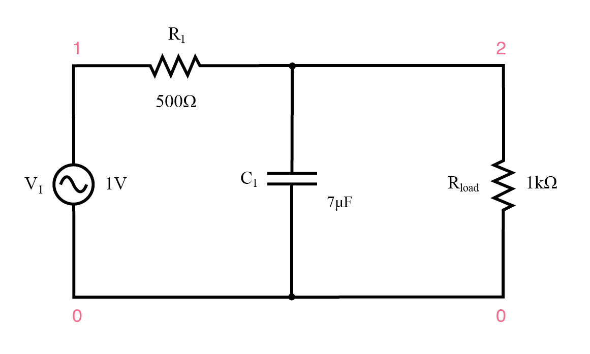
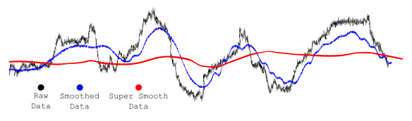
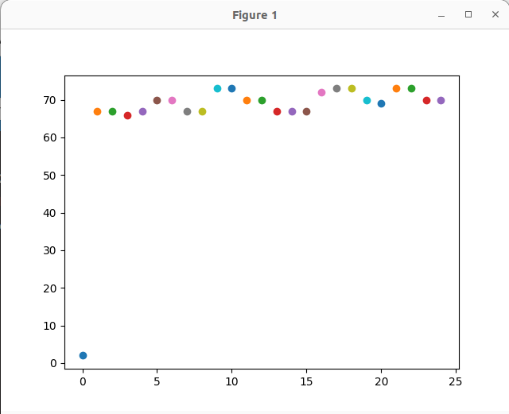

# Lab 7

Seneca Polytechnic 
SEP600 Embedded Systems

## Introduction

Documentation for the Cortex-M4 instruction set, the board user's guide, and the microcontroller reference manual can be found here:

Documentation for the Freedom K64 and K66 boards and their microcontrollers can be found here:

- [FRDM-K64F Freedom Module User’s Guide](https://www.nxp.com/webapp/Download?colCode=FRDMK64FUG) ([PDF](FRDMK64FUG.pdf))
- [Kinetis K64 Reference Manual](https://www.nxp.com/webapp/Download?colCode=K64P144M120SF5RM) ([PDF](K64P144M120SF5RM.pdf))
- [FRDM-K64F Mbed Reference](https://os.mbed.com/platforms/FRDM-K64F/)
- [FRDM-K64F Mbed Pin Names](https://os.mbed.com/teams/Freescale/wiki/frdm-k64f-pinnames)
- [FRDM-K66F Freedom Module User’s Guide](https://www.nxp.com/webapp/Download?colCode=FRDMK66FUG) ([PDF](FRDMK66FUG.pdf))
- [Kinetis K66 Reference Manual](https://www.nxp.com/webapp/Download?colCode=K66P144M180SF5RMV2) ([PDF](K66P144M180SF5RMV2.pdf))
- [FRDM-K66F Mbed Reference](https://os.mbed.com/platforms/FRDM-K66F/)
- [FRDM-K66F Mbed Pin Names](https://os.mbed.com/teams/NXP/wiki/FRDM-K66F-Pinnames)

Documentation for the Cortex-M4 instruction set can be found here:

- [Arm Cortex-M4 Processor Technical Reference Manual Revision](https://developer.arm.com/documentation/100166/0001) ([PDF](Cortex-M4-Proc-Tech-Ref-Manual.pdf))
    - [Table of Processor Instructions](https://developer.arm.com/documentation/100166/0001/Programmers-Model/Instruction-set-summary/Table-of-processor-instructions)
- [ARMv7-M Architecture Reference Manual](https://developer.arm.com/documentation/ddi0403/latest/) ([PDF](DDI0403E_e_armv7m_arm.pdf))

### Low-Pass Filter

A low-pass filter is an electronic circuit or signal processing technique that allows signals with frequencies below a certain cutoff frequency to pass through, while attenuating or blocking higher-frequency signals. This makes low-pass filters ideal for filtering out high-frequency noise from signals, which is particularly useful in applications like audio processing, communications, and sensor data acquisition. Noise, often caused by electrical interference or other environmental factors, typically manifests as high-frequency components. By using a low-pass filter, these unwanted high-frequency noise signals are reduced, leaving behind the cleaner, more relevant low-frequency signals. The effectiveness of a low-pass filter in noise reduction depends on the cutoff frequency, which must be carefully selected to ensure that the desired signal remains intact while unwanted noise is removed.

***Figure 7.1** Sample Low-Pass Filter*

***Figure 7.2** Signal Filtering*

## Materials
- Safety glasses (PPE)
- Freedom K64F or K66F Board
- Breadboard
- Jumper Wires
- (1×) 1kΩ–10kΩ Potentiometer (Optional)

## Preparation

> ### Lab Preparation Question
> 1. Read over the lab and understand the procedures.

## Procedures

In this lab, we'll explore the use of software filtering techniques to remove noise from a digital signal and then plot the data on a computer. We'll also explore the concept of multi-threading to handle the two tasks.

1. Start the function generator to output a 1Vpp 1kHz Triangular (Ramp, 50% symmetry) wave with a 2V DC offset. Remember to set the output to high Z mode. Alternatively, you can read data from a sensor that you are using in your project.

1. Connect the output of the function generator to an ADC (Analog input) pin on the K64F or K66F board.

1. Use the following code to read the signal from the ADC channel. Replace `PTXX` with the pin that you are using.

        #include "mbed.h"

        int main() {

            AnalogIn ain(PTXX); // Replace with your ADC pin

            float reading = 0; // for saving readings

            while (true) {
                reading = ain; // read ADC
                printf("Reading: %d\n", (int) (reading * 100)); // print as int
                // delay for 1ms for each reading
                ThisThread::sleep_for(1ms);
            }
        }

1. Your serial output should now be flooded with data output between 0 to 100.

1. Next, move the printing of the data into a thread so it won't interfere with the ADC reading and let the processor decide how to optimize the process.

1. Next, let's read the data from the computer using Python and plot it. Install `pyserial` using `pip install pyserial` and `matplotlib` using `pip install matplotlib` as required. Run the following Python script on your computer. 

        import serial
        import matplotlib.pyplot as plt
        import numpy as np
        plt.ion()
        fig=plt.figure()

        x = list()
        y = list()
        i = 0

        ser = serial.Serial('XXXX', 9600) # Replace XXXX with your serial port
        ser.close()
        ser.open()

        while True:

            data = ser.readline()
            
            x.append(i)
            y.append(data.decode())

            plt.scatter(i, float(data.decode()))
            i += 1
            plt.show()
            plt.pause(0.000001)

1. Run the Python code and it should open the specified serial and start plotting the data. As you can tell, it is not the most optimized plotting code.

    

    ***Figure 6.1***

1. Change the Python code so the plot becomes a line graph that's displaying the reading similar to an oscilloscope, i.e., replacing old readings with new ones instead of just adding readings to the graph.

1. You should see a triangular wave (simulating noisy data) on your Python oscilloscope. Your task is to add the simple IIR filter discussed in class to smooth out the data on the controller. This means adding a new variable called `alpha` and `old_reading` to save the reading for the next iteration.

        filtered_reading = old_reading + alpha * (adc_reading – old_reading);

    Plot both the unfiltered and filtered signal on the same plot.

Once you've completed all the steps above (and ONLY when you are ready, as you'll only have one opportunity to demo), ask the lab professor or instructor to come over and demonstrate that you've completed the lab. You may be asked to explain some of the concepts you've learned in this lab.

## Reference

- [Infinite Impulse Response](https://en.wikipedia.org/wiki/Infinite_impulse_response)