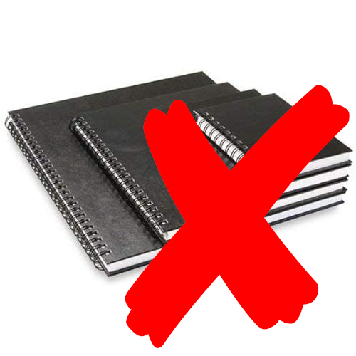
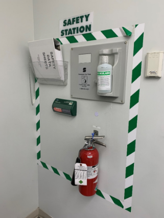
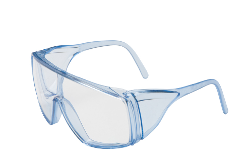

# Lab Instructions

Seneca Polytechnic 
SES250 Electromagnatics

## Objectives
- Master the use of fundamental laboratory equipment
- Master the basic techniques of conducting experiments and taking measurement
- Experimentally verify the theory and concept studied in lectures

## Materials/Equipment required by each student
- Safety Glasses
- Bound Notebook
- Lab Electronics Kit (Details TBA)

More details on where you can purchase them can be found in the [Lab Supplies](supplies.md) page.

## Each student is expected to
1. Maintain a **bound** (ie. No loose sheets) laboratory/engineering notebook. The notebook shall include all preparations work and documentation of all work done during the laboratory. You are not required to have a new notebook. You can continue using one you already have or share it with another course.
    - Always write in pen, never in pencil, and never use white-out in the notebook. If a mistake needs to be corrected, it shall be neatly crossed out with a single line and corrections shall be added.
    - Always prepare for the laboratory experiment by writing a brief description of the experimental procedures in your own words and copying any graphs and tables to be used for documentation during the experiment into the notebook.
    - Update the notebook continually during each experiment and include all measured data, tables, graphs, and details of relevant measurement techniques, computations, and conclusions.
    
    | Bound Notebook | Ring Notebook |
    | --- | --- |
    |  |  |

1. Arrive on time and be well-prepared for each laboratory session. A complete preparation includes, aside from a description of the procedures, the completion of the preparatory assignment for the experiment.
1. Finish all parts of the experiment on time. Thorough preparatory work is critical.

## Laboratory Code of Behavior
1. Students are expected to conduct themselves in a professional and safe manner at all times.
1. Know where is the nearest fire extinguisher and the location of the safety station.

    

1. **No food or drink** at any time inside the laboratory
1. Safety glasses are **mandatory** when the <u>power is **ON**</u>

    

1. Other precautionary safety equipment will be used or worn when necessary. No open-toed shoes or sandals. Long hair must be tied back.
1. All laboratory equipment brought into the laboratory must be CSA approved and in good working order
1. Vandalism of any kind will not be tolerated. Please note that security cameras are in place for the protection of college property and occupant safety. Offenders will be subject to the terms of the College’s Student Rights and Responsibilities Policy.
1. Wash hands after soldering.
1. Failure to comply with the Electronics Laboratory Code of Behavior will result in a lab grade of zero (0) and you’ll be asked to leave the laboratory.

## Other guidelines
1. AGAIN: **No food or drink** inside the laboratory
1. Keep the laboratory neat and clean, and return items to their original locations at the completion of each lab session.