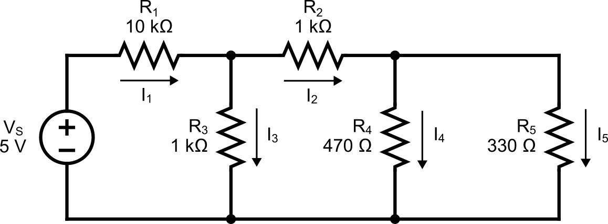

# Bnous Lab : More Resistor Circuit

Seneca College 
SES250 Electromagnatics

## Objectives
- To understand and verify Kirchhoff's Law

## Purpose
- Assemble electronic components onto a breadboard and measure current and voltage using a DMM

## Important Rules for this Lab

<ol>
<li>Any signal (voltage, current) must be adjusted to the specified value (amplitude and/or frequency) <strong>before</strong> applying them to a circuit.</li>
<li>An instrument must be set up for the required mode of operation <strong>before</strong> it is connected to a circuit.</li>
<li>The power supply must be switched off <strong>before</strong> making any changes to the circuit.</li>
</ol>

## Description

Kirchhoff's current law (KCL), Kirchhoff's first law, or Kirchhoff's junction rule, states that, for any node (junction) in an electrical circuit, the sum of currents flowing into that node is equal to the sum of currents flowing out of that node; or equivalently: the algebraic sum of currents in a network of conductors meeting at a point is zero:

$$
\displaystyle\sum_{k=1}^{n} I_i = \sum_{k=1}^{n} {{V_k} \over {R_k}} = 0
$$

***Figure B.1 The current entering any junction is equal to the current leaving that junction. \(i_2 + i_3 = i_1 + i_4\)***

Kirchhoff's voltage law (KVL), Kirchhoff's second law, or Kirchhoff's loop rule, states the following: The directed sum of the potential differences (voltages) around any closed loop is zero.

$$
\displaystyle\sum_{k=1}^{n} V_k = \sum_{k=1}^{n} {{i} {R_k}} = 0
$$

where \(i\) is the loop current.

***Figure B.2 The sum of all the voltages around a loop is equal to zero.
\(v_1 + v_2 + v_3 + v_4 = 0\)***

Source: [Wikipedia: Kirchhoff's circuit laws](https://en.wikipedia.org/wiki/Kirchhoff%27s_circuit_laws)

## Materials
- (1x) 330Ω or similar value resistor
- (1x) 470Ω or similar value resistor
- (2x) 1kΩ or similar value resistor
- (1x) 10kΩ or similar value resistor
- Breadboard
- Jumper wires

## Preparation

> **Lab Preparation Question:**
>
> 1. Using the circuit shown in Step 3 of the lab, along with R1 = 10kΩ, R2 = 1kΩ, R3 = 1kΩ, R4 = 470Ω, and R5 = 330kΩ, calculate the votlage across and current through each resistor using Kirchhoff's Current Law or Kirchhoff's Voltage Law.
>
> 1. Sketch the breadboard below onto your notebook then draw how the components will be connected to the breadboard according to the circuit shown in Step 3. Clearly show which tie point will the wire, resistor and power supply be attached to.
>
    >    
>
> 1. Repeat the previous step for as many times as required to sketch the breadboard connection diagram for using the DMMs to measure the votlage across and current through each resistor.
>
> 1. Copy the resistance, voltage, and current recording tables found in the lab into your notebook.
>

## Procedures

In this part of the lab, we will be exploring resistors in parallel and series configurations.

1. Obtain the necessary resistors, a breadboard and a few jumper wires. If a resistor value is not available, use resistors of similar value.

1. Turn on the DMM at your workbench and turn it to the “Ω 2W” resistance measurement mode. Measure and record the resistance of each resistor.

    > **Lab Question 1:** Record the resistance (at least 3 S.F.) of each resistor in the table below:
    >
    > ||R1 (10kΩ)|R2 (1kΩ)|R3 (1kΩ)|R4 (470Ω)|R5 (330kΩ)
    > |---|---|---|---|---|---|
    > |Measured Resistance [kΩ]||||||

1. Assemble the circuit shown below then measure the following as per the circuit and connection diagram you prepared in the pre-lab:
    - the voltage across and current through R1, R2, R3, R4, and R5

    **REMEMBER:** To measure voltage, the digital multimeter needs to be in DC voltage mode (DCV) to act as a voltmeter. A voltmeter needs to be connected in parallel with a resistor to measure the voltage across.

    **REMEMBER:** To measure current, the digital multimeter needs to be in DC current mode (DCI) to act as an ammeter. An ammeter needs to be connected in series with a resistor to measure the current.
    
    

    ***Figure B.3***

    > **Lab Question 2:** Record the measured values in the table below.
    >
    > ||R1 (\(V_1\))|R2 (\(V_2\))|R3 (\(V_3\))|R4 (\(V_4\))|R5 (\(V_5\))|
    > |---|---|---|---|---|---|
    > |Voltage across resistors||||||
    >
    > ||R1 (\(I_1\))|R2 (\(I_2\))|R3 (\(I_3\))|R4 (\(I_4\))|R5 (\(I_5\))|
    > |---|---|---|---|---|---|
    > |Current through resistors||||||
    >
    > **Lab Question 3:** Does the measured value agree with the value you calculated in the pre-lab? What is the percentage error? Is it within the tolerance of the resistor?

Once you've completed all the above steps, ask the lab professor or instructor over and demostrate you've completed the lab and written down all your observation. You might be asked to explain some of the concepts you've learned in this lab.

## Post-Lab

1. There is no post-lab exercise for this lab.