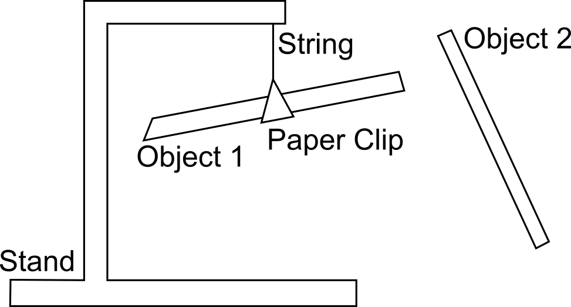

# Lab 1: Electrostatics and Triboelectric Series

Seneca Polytechnic 
SES250 Electromagnetics

## Purposes
- To demonstrate that there are two types of electric charges in nature
- To become familiar with scientific experimental techniques
- To use experimental observation and apply logical reasoning to build a triboelectric series

## Objectives
- Perform qualitative observations of the following:
    - The separation of electric charges by friction
    - The existence of two types of charges
    - The existence of electrostatic forces between charged objects

## Description

Objects are usually electrically neutral. The number of positive and negative charges is typically equal. Neutral objects neither attract nor repel each other electrically. This balance of charge can be disrupted by rubbing an object against another, as further explained in [Chapter 5.1 of University Physics Vol 2](https://openstax.org/books/university-physics-volume-2/pages/5-1-electric-charge), or by the presence of another nearby charged object, as further explained in [Chapter 5.2](https://openstax.org/books/university-physics-volume-2/pages/5-2-conductors-insulators-and-charging-by-induction).

In this lab, the attractive and/or repulsive electrostatic force between charged objects will be observed using a setup shown in Figure 1.1. You will confirm the presence of electric charges and the forces exerted by these charges.

***Figure 1.1** Lab 1 Setup*

### Triboelectric Series

>"The triboelectric series ranks various materials according to their tendency to gain or lose electrons, which reflects the natural physical property of materials. Static electricity occurs when there is an excess of positive or negative charges on an object’s surface by rubbing certain materials together. The position of the material in the triboelectric series determines how effectively the charges will be exchanged. Normally, the build-up of static electricity would be undesirable because it can result in product failure or a serious safety hazard caused by electrostatic discharge and/or electrostatic attraction. This series can be used to select materials that will minimize static charging to prevent electrostatic discharge or electrostatic attraction."
>
>Source: [Quantifying the triboelectric series by Zou et al.](https://www.nature.com/articles/s41467-019-09461-x)

## Materials
- A stand
- String or fishing line
- Paper clip
- Plastic straw (Polypropylene)
- Plastic wrap
- Wool cloth
- Glass rod
- Steel rod
- Wooden rod / dowel
- Silk cloth or cotton cloth
- Plastic rod (Acrylic)

## Preparation

Answer all the lab preparation questions at the end of this document in your lab notebook **BEFORE** your lab session. Students who do not complete the lab preparation will be asked not to join the lab and will receive a grade of ZERO (0) for the lab.

Lab preparation must be done individually in the lab notebook.

> ### Lab Preparation Questions
> 
> 1. Summarize the steps for this lab in your notebook as the computer in the lab room will NOT be available for this lab.
> 2. Describe how you can neutralize your hand from electric charges in the lab room using the technique mentioned in the lab manual.
> 3. Copy and fill in the following observation table in your notebook (except for the observation column):
    >
    >    |Step|Object 1|Rubbed with|Object 2|Rubbed with|Observation (Attract/Repel)|
    >    |---|---|---|---|---|---|
    >    |6|Plastic Straw|Wool|Plastic Straw|Wool||
    >    |8|Plastic Straw|Wool||||
    >    |9|Plastic Straw|||||
    >    |12||||||
    >    |13||||||

## Procedures

1. If not enough stands are available, work in groups of 2. All questions in the lab must be answered individually, and every member must individually demonstrate completion of the lab.
2. Place and secure the stand on the table. Attach a paper clip to a string, then hang the paper clip about 5 cm below the end hook of the stand. The paper clip is used to hold the plastic straw.
3. Carefully secure a plastic straw onto the paper clip so it evenly sits on the paper clip and is free to rotate on the stand.
    
    **NOTE:** In some instances, it might be beneficial to hang the stand off the side of the table to allow full rotation of the straw once it is attached to the paper clip.

4. Technique and attention to detail are key to this lab and in any of your future labs. Remove the plastic straw from the paper clip, then rub both ends of a plastic straw with the wool cloth. **ONLY** handle the middle of the straw as handling the ends you’ve charged will alter its charge.
5. Once charged, carefully suspend the plastic straw from the stand using the paper clip. **ONLY** handle the middle of the straw. What you’ve done is charge the plastic straw **NEGATIVELY** (free electrons from the wool cloth are transferred onto the surface of the plastic straw).

    **Note:** If your hand touches the charged portion of the straw, your hand will discharge the straw, causing the charged portion to return to neutral.

6. Next, rub one end of a second plastic straw in the same way, then hold it close to the first plastic straw _(without touching)_. Remember, do not hold the straw on the side that you’ve charged. Observe the (attractive or repulsive) force exerted on the first plastic straw suspended from the stand.

    > **Lab Question 1:** What interaction between the straws do you observe? Write it down into the observation table you created in the pre-lab.

    > **Lab Question 2:** Which electrostatic law have you confirmed? Explain your answer by specifying the charge in each plastic straw.

7. Ensure your hand is not charged by placing your palm on the metal surface or the rubber mat on the workbench. Then discharge the second plastic straw by slowly touching it (not rubbing) with your hand, then neutralize your hand. Repeat this a few times until the second straw no longer exerts any force on the first straw.

    **Note:** Technique is critical. You should often discharge yourself by placing your palm on the metal surface or the rubber mat of the workbench. We can assume they are connected to the ground (earth) and are electrically neutral.

8. Recharge the second (now neutral) plastic straw by rubbing it with the plastic wrap. Hold it close to the first wool-charged plastic straw and observe the nature of the force.

    > **Lab Question 3:** What interaction between the straws do you observe? Write it down into the observation table you created in the pre-lab.

    > **Lab Question 4:** Use your observation to predict what type of charge is on the plastic wrap-rubbed straw (positive or negative). i.e., Did the plastic wrap-rubbed straw gain/lose electrons?
    
    **Remember:** It was previously stated that the wool-rubbed straw is charged negatively.

9. Discharge the second plastic straw. Take a glass rod and charge it using the wool cloth. Hold it close to the first wool-charged plastic straw.

    > **WARNING! The glass rod is fragile! Handle with care!**

    > **Lab Question 5:** What interaction between the straw and the rod do you observe? Write it down into the observation table you created in the pre-lab. Use your observation to predict what type of charge is on the wool-rubbed glass rod (positive or negative). i.e., Did the wool-rubbed glass rod gain/lose electrons?

10. Discharge the glass rod.

    > **WARNING! The glass rod is fragile! Handle with care!**
    
    > **Lab Question 6:** From the results in your observation table, which materials (plastic straw, wool, plastic wrap, glass rod) do you think will most likely gain electrons and which will most likely lose electrons?

    For example: We defined the straw as negatively charged when rubbed with wool. Therefore, the straw is more likely to gain electrons than the wool.

    _The steps above demonstrate the triboelectric effects and electrostatic force between two charged objects. In the next steps, you will observe the force between a charged object and a neutral object._

11. Touch a metal surface on the workbench to ensure your hand is not charged. Discharge the plastic straw on the stand and the glass rod with your hand until there is no electrostatic force between them when holding them near one another.
12. Leaving the plastic straw neutral, charge the glass rod with the wool cloth. Hold the glass rod close to the plastic straw.

    > **Lab Question 7:** What interaction between the rod and the straw do you observe? Write it down into the observation table you created in the pre-lab. Why is the neutral plastic straw attracted to the glass rod? Explain the phenomenon and discuss how this can draw you to the wrong conclusion regarding the charge on each object. Refer to [Chapter 5.2 in the University Physics Volume 2 textbook](https://openstax.org/books/university-physics-volume-2/pages/5-2-conductors-insulators-and-charging-by-induction) if required.

    _The steps above demonstrate transferring charges on the surface of insulators. In the next step, you will observe what will happen when charging a conducting object._

13. Leaving the neutral plastic straw suspended, rub one end of a steel rod with the wool cloth, then hold it near the neutral plastic straw.

    > **Lab Question 8:** What interaction between the rod and the straw do you observe? Write it down into the observation table you created in the pre-lab. Explain the phenomenon. Refer to [Chapter 5.2 in the University Physics Volume 2 textbook](https://openstax.org/books/university-physics-volume-2/pages/5-2-conductors-insulators-and-charging-by-induction) if required.

Once you've completed all the above steps, ask the lab professor or instructor to come over and demonstrate that you've completed the lab and written down all your observations. You might be asked to explain some of the concepts you've learned in this lab.

## Bonus

1. Using the concept you've acquired from the steps above, extend your observation table and determine where the Plastic Rod, Silk or Cotton Cloth, or Wooden Rod / Dowel is on the triboelectric series in Question 6. (5% of Lab Work mark for each material). You must show your experimental steps and observations.

> Read the following cases to understand the logic:
> 
>   **Case 1: Plastic Wrap**
>
>   If Material-A is rubbed with Plastic Wrap, Material-A is positively charged (loses electrons) because the Plastic Wrap is more negative (gains electrons).
>
>   **Case 2:**
>
>   If Material-A rubbed with Material-B is attracted to Material-C rubbed with Material-B, then we know the charge on Material-A is opposite to the charge on Material-C. However, to determine which one is positively charged and which one is negatively charged, we must know the properties of Material-B relative to Material-A and Material-C. As a result, always start your experiment with the known material (Plastic Wrap).

Once you've completed all the above steps, ask the lab professor or instructor to come over and demonstrate that you've completed the lab and written down all your observations. You might be asked to explain some of the concepts you've learned in this lab.