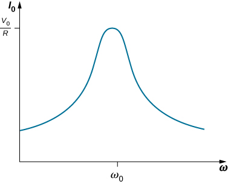
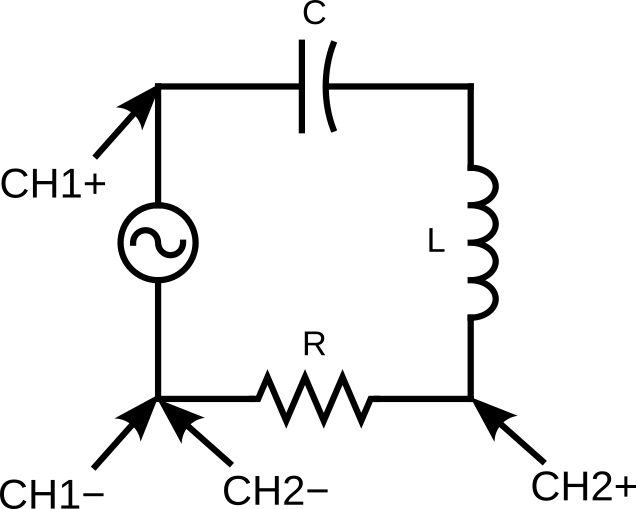

# Lab 10: RLC Circuit Resonance

Seneca Polytechnic 
SES250 Electromagnetics

## Purposes
- To examine the AC response of an RLC circuit and find the resonance frequency.

## Objectives
- Assemble electronic components onto a breadboard.
- Set up a function generator to output an AC sine wave.
- Build an RLC circuit for resonant frequency measurement.

## Description

An RLC circuit is an electrical circuit consisting of a resistor (R), an inductor (L), and a capacitor (C), connected in series or parallel. The circuit forms a harmonic oscillator for current and resonates in a manner similar to an LC circuit. Introducing the resistor increases the decay of these oscillations, which is also known as damping. The resistor also reduces the peak resonant frequency.

In such circuit, the current amplitude is:

$$ I_{0} = { V_{0} \over \sqrt { R^2 + ( \omega L − 1 / \omega C )^2 } } $$

An important property of this circuit is its ability to resonate at a specific frequency, known as the resonance frequency, \(f_{0}\). Its angular frequency alternative, \(\omega_{0}\), is given as:

$$ \omega_{0} = 2 \pi f_0 $$

The resonant frequency is defined as the frequency at which the impedance of the circuit is at a minimum. Equivalently, it can be defined as the frequency at which the impedance is purely real (i.e., purely resistive). This occurs because the impedances of the inductor and capacitor at resonance are equal but of opposite sign and cancel each other out. The resonant frequency for an RLC circuit is:

$$ \omega_{0} = \frac{1}{\sqrt{LC}} $$

If we can vary the frequency of the AC source while keeping the amplitude of its output voltage constant, then the current changes accordingly. A plot of \(I_{0}\) versus \(\omega\) is shown in Figure 10.1.

***Figure 10.1** At an RLC circuit’s resonant frequency, \(\omega_{0}=\sqrt{1/LC}\), the current amplitude is at its maximum value.*

Source:

- [University Physic Vol 2: 15.5 Resonance in an AC Circuit](https://openstax.org/books/university-physics-volume-2/pages/15-5-resonance-in-an-ac-circuit)
- [Wikipedia: RLC circuit](https://en.wikipedia.org/wiki/RLC_circuit)

### Reference
- [Series RLC Circuit Impedance Calculator](https://www.translatorscafe.com/unit-converter/en-US/calculator/series-rlc-impedance/)

## Materials
- Safety glasses (PPE)
- [Lab Supplies](supplies.md)
    - Breadboard
    - Jumper wires
    - (1x) 10kΩ resistor (brown-black-orange)
    - (1x) 100nF ceramic capacitor
    - (1x) 100μH drum inductor

## Preparation

> **Lab Preparation Questions:**
>
> 1. Read and summarize the lab as necessary.
> 1. Sketch a breadboard diagram of Figure 10.2 in your notebook.
> 1. Copy observation Table 1 from this lab into your notebook.
> 1. Calculate the theoretical phase shift for each of the frequency in Table 1 for a series RLC circuit in AC with a 10kΩ resistor, 100nF capacitor, and 100μH inductor. Show the calculation for at least one value. Fill in the theoretical phase shift column in Table 1.
> 1. Calculate the theoretical resonant frequency for a series RLC circuit in AC with a 10kΩ resistor, 100nF capacitor, and 100μH inductor. Show all calculations.

## Procedures

In this lab, we'll observe the AC response of an RLC circuit and the relationship between the voltage \(V(t)\) and the current \(I(t)\) using an oscilloscope. Since we cannot measure \(I(t)\) directly with an oscilloscope, we'll measure the voltage across the resistor \(V_R(t)\), as the current and voltage are always in phase at the resistor.

***Figure 10.2***

1. Set up the circuit in Figure 10.2 using a 10kΩ resistor, a 100nF ceramic capacitor, and a 100μH.
    

    
<strong>DO NOT USE A POLARIZED CAPACITOR!</strong>

    

2. Ensure that the function generator’s output is off, then set the output of the function generator to High-Z.
3. Set the output waveform to a sine wave, then set the output amplitude to 6 Vpp and the frequency to 10.0 Hz. Leave offset voltage and phase at 0.
4. Turn on the oscilloscope, then connect CH1 and CH2 to the circuit per the circuit diagram.

    **NOTE:** The ground (black cable) for both CH1 and CH2 is connected to the negative (black) node of the function generator.

5. Turn on the function generator output and observe the relationship between CH1 and CH2. Adjust the voltage and time division to display about two periods on the screen.

6. From the two signals, find time difference \( \Delta t \) using a zero crossing (or peak) from CH1 (measuring \(V(t)\)) and the closest zero crossing (or peak) from CH2 (measuring \(V_R(t) \propto I(t)\)). You may use the horizontal position knob to move one of the signals to the center for easier measurement. Also write down the \(V_R\) peak-to-peak into Table 1.

    > **Lab Question 1:** Convert this time difference to the phase angle difference using the formula below. Does it agree with the phase angle difference you calculated in your pre-lab? Write your result in Table 1.
    >
    > $$ \phi = 2 \pi {\Delta t \over T} $$
    > $$ \phi = 360° {\Delta t \over T} $$
    >
    > **NOTE:** If \(I(t)\) is leading, the time difference will be negative. Also, the time difference might be in [ms] and the phase angle difference might be in [RAD] depending on your setting.
    >
    > **Table 1:**  
    > 
    > | Frequency | Theoretical \( \phi \) | \( \Delta t \) | \( \phi \) | \( V_{R_{pp}} \) | \( \|I\| \) | \( \|Z_T\| \) |
    > | --- | --- | --- | --- | --- | --- | --- |
    > | 10 Hz |  |  |  |  |  |  |
    > | 500 Hz |  |  |  |  |  |  |
    > | 1 kHz |  |  |  |  |  |  |
    > | 5 kHz |  |  |  |  |  |  |
    > | 10 kHz |  |  |  |  |  |  |
    > | 50 kHz |  |  |  |  |  |  |
    > | 100 kHz |  |  |  |  |  |  |
    > | 200 kHz |  |  |  |  |  |  |
    > | 500 kHz |  |  |  |  |  |  |
    > | 1 MHz |  |  |  |  |  |  |
    > | ... |  |  |  |  |  |  |
    >
    > Leave extra lines for additional data points.

7. Using the measured peak-to-peak \(V_R\), calculate the magnitude of the current \( \|I\| \) and the magnitude of the total impedance \( \|Z_T\| \).
    
    > **Lab Question 2:** Calculate the magnitude of the current and the magnitude of the total impedance and record your answers in Table 1.
    >
    > $$ \|I\| = \frac{V_R}{R} $$
    > $$ \|Z_T\| = \frac{V_S}{\|I\|} $$

8. Open a spreadsheet software and plot the data.
    
    > **Lab Question 3:** Using the data from Table 1, open a spreadsheet software (Excel, Sheet, or similar) and plot the following against frequency (x-axis):
    >
    > - Series 1: Phase Shift \( \phi \)
    > - Series 2: Magnitude of the Current \( \|I\| \)
    > - Series 3: Magnitude of the Total Impedance \( \|Z_T\| \)

9. Repeat the measurements at more frequencies until a minimum phase shift is found.

    > **Lab Question 4:** Using the additional data you recorded in Table 1 and your plots, what do you observe regarding to \( \|I\| \) and \( \|Z_T\| \) when the phase shift is at it's minimum, \( \phi \approx 0 \)?

Once you've completed all the above steps, ask the lab professor or instructor over and demostrate that you've completed the lab and written down all your observations. You might be asked to explain some of the concepts you've learned in this lab.