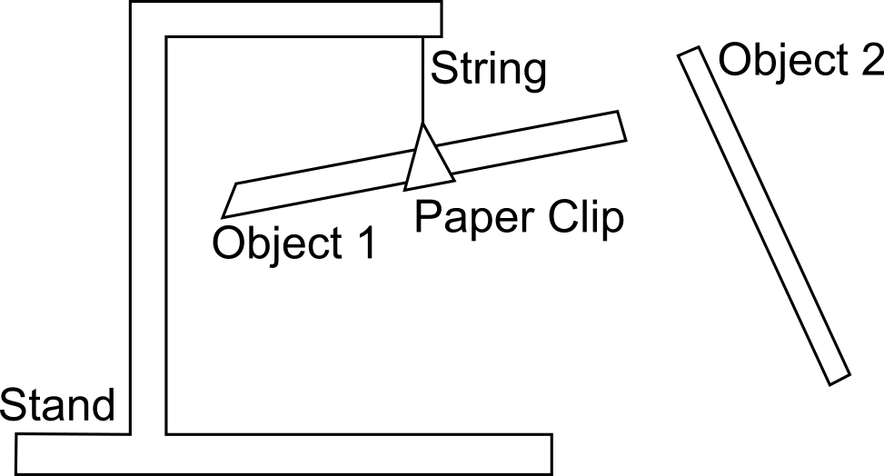

# Lab 2 Triboelectric Series

Seneca College 
SES250 Electromagnatics

## Objectives
- To compare the electrostatic properties of various insulating and conducting materials
- To be familiar with scientific experimental techniques
- Use experimental observation and apply logical reasoning to build a triboelectric series

## Purpose
- Perform qualitative observation between various charged materials
- Categorization of materials based on the triboelectric effect

## Description

>"The triboelectric series ranks various materials according to their tendency to gain or lose electrons, which reflects the natural physical property of materials. Static electricity occurs when there is an excess of positive or negative charges on an object’s surface by rubbing certain materials together. The position of the material in the triboelectric series determines how effectively the charges will be exchanged. Normally, the build-up of static electricity would be undesirable because it can result in product failure or a serious safety hazard11,12 caused by electrostatic discharge and/or electrostatic attraction. This series can be used to select materials that will minimize static charging to prevent the electrostatic discharge or electrostatic attraction."
>
>Source: [Quantifying the triboelectric series by Zou et. al.](https://www.nature.com/articles/s41467-019-09461-x)

In this lab, similar to [Lab 1](lab1.md), the attractive and/or repulsive electrostatic force between charged objects will be observed using a setup shown in Figure 2.1.

***Figure 2.1** Lab 2 Setup*

You will use the technique and experimental method you acquired in Lab 1 to rank four materials (Plastic Wrap, Plastic Rod, Silk Cloth or Cotton Cloth and Wooden Dowel) into a triboelectric series.

## Materials
- A stand
- String or fishing line
- Paper clip
- Plastic Wrap
- Wooden Rod / Dowel
- Silk Cloth or Cotton Cloth
- Plastic Rod (Acrylic)

## Preparation

Answer all the lab preparation questions at the end of this document in your lab notebook BEFORE your lab session. Students who did not complete the lab preparation will be asked not to join the lab and receive a grade of ZERO (0) for the lab.

Lab preparation must be done individually in the lab notebook.

There are four materials: Plastic Wrap, Plastic Rod, Silk Cloth or Cotton Cloth and Wooden Dowel, available to you in this lab. Only the plastic rod and wood dowel can be carefully suspended (and balanced) using the paper clip.

> ### Lab Preparation Question
>
> Design an experiment to develop a triboelectric series similar to [Lab 1](lab1.md). Your experiment should be a series of tests that use soft materials to charge hard objects and then observe if the hard objects attract or repel. You'll also need to use logical reasoning (similar to a Seduko puzzle) to draw your conclusion.
>
> 1. Copy the following observation table in your notebook. To help you get started, note the following:
>     - a suggested Test #1 is given
>     - Plastic Wrap is the most negative on the triboelectric series out of the four materials
>
>     |Test|Object 1|Rubbed with|Object 2|Rubbed with|Observation (Attract/Repel)|Conclusion|
>     |---|---|---|---|---|---|---|
>     |1|Plastic Rod|Plastic Wrap|Plastic Rod|Silk|||
>     |2|||||||
>     |3|||||||
>     |...|||||||
>
> 1. Add more tests to the table above as necessary. One approach is to test all possible combinations but keep in mind that only a soft material can rub a hard object.
> 1. Read the following cases to understand the logic:
> 
>     **Case 1: Plastic Wrap**
>
>     If Material-A is rubbed with Plastic Wrap, Material-A is positively charged (lose electrons) because the Plastic Wrap is more negative (gain electrons).
>
>     **Case 2:**
>
>     If Material-A rubbed with Material-B is attracted to Material-C rubbed with Material-B, then we know the charge on Material-A is opposite to the charge on Material-C. However, to determine which one is positively charged and which on is negatively charged, we must know the properties of Material-B relative to Material-A and Material-C. As a result, always start your experiment with the known material (Plastic Wrap).

## Procedures

1. If not enough stands are available, work in groups of 2. All questions in the lab must be answered individually and every member must individually demostrate completion of the lab.
1. Place and secure the stand on the table. Attach a paper clip onto a strong then hang the paper clip about 5cm below the end hook of the stand. The paper clip is used to hold the plastic rod or wooden dowel.
1. Carefully secure a plastic rod or wooden dowel (as per your experiment) onto the paper clip so it evenly sits on the paper clip and it's free to rotate on the stand.
    
    **NOTE:** In some instant, it might be beneficial to hang the stand off the side of the table to allow full rotation of the straw once it's attached to the paper clip.

1. Perform the procedure(s) you've defined in your pre-lab.

Once you've completed all the above steps, ask the lab professor or instructor over and demostrate you've completed the lab and written down all your observation. You might be asked to explain some of the concepts you've learned in this lab.

## Post-Lab

1. Using the skills and knowledge acquired from this lab, answer the post-lab question(s) on blackboard. Due one week after the lab.