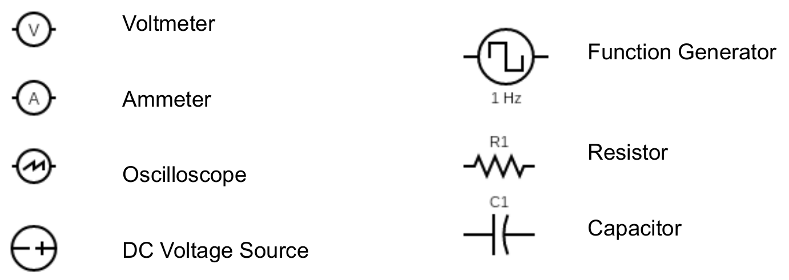
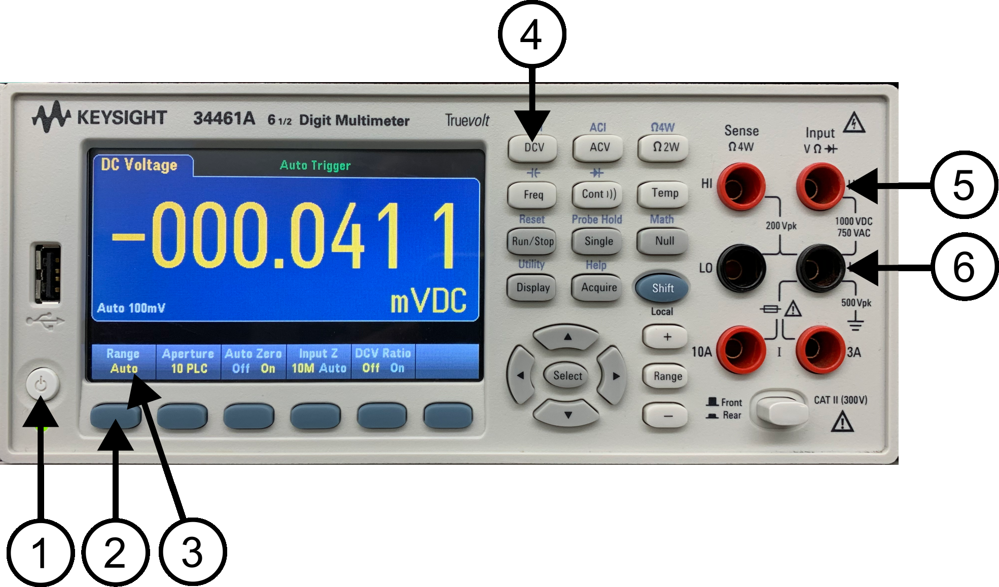
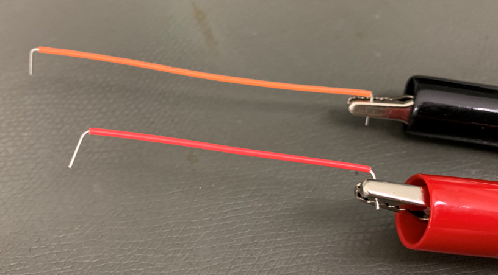

# Lab 2 : Digital Multimeter, Power Supply, and Ohm's Law

Seneca Polytechnic 
SES250 Electromagnatics

## Purposes
- To learn how to operate the power supply and digital multimeter (DMM)
- To become familiar with measurement techniques of direct current (DC)
- To study the relationship between voltage, resistance, and current
- To verify Ohm's Law

## Objectives
- Operate a DC power supply
- Setup and read measurements from a digital multimeter (DMM)
- Assemble electronic components onto a breadboard
- Measure voltage from a breadboard using a digital multimeter (DMM)

## Important Rules for this Lab

<ol>
<li>Any signal (voltage, current) must be adjusted to the specified value (amplitude and/or frequency) <strong>before</strong> applying them to a circuit.</li>
<li>An instrument must be set up for the required mode of operation <strong>before</strong> it is connected to a circuit.</li>
<li>The power supply must be switched off <strong>before</strong> making any changes to the circuit.</li>
</ol>

## Description

### Direct Current (DC)

Direct current (DC) is the one-directional flow of electric charge. An electrochemical cell is a prime example of DC power. Direct current may flow through a conductor such as a wire, but can also flow through semiconductors, insulators, or even through a vacuum as in electron or ion beams. The electric current flows in a constant direction, distinguishing it from alternating current (AC).

Source: [Wikipedia: Direct Current](https://en.wikipedia.org/wiki/Direct_current)

### Digital Multimeter (DMM)
A multimeter is a measuring instrument that can measure multiple electrical properties. A typical multimeter can measure voltage, resistance, and current. However, some multimeters, such as the one in the electronics lab, can also measure capacitance. Digital multimeters (DMM) have numeric displays and have made analog multimeters obsolete as they are cheaper, more precise, and more physically robust than analog multimeters.

Source: [Wikipedia: Multimeter](https://en.wikipedia.org/wiki/Multimeter)

***Figure 2.1** Keysight 34461A Digital Multimeter*

In the electronics lab, you will be using a Keysight 34461A (or similar) Digital Multimeter. Its manual can be found here: [DMM Manual](lab2-DMM-manual.pdf)

Reference Video: [How to Use A KEYSIGHT E34461A DMM to Measure Voltage](https://youtu.be/z1FmB-j7_MA)

### Direct Current (DC) Power Supply

An adjustable DC power supply converts electricity from the power grid to a specified voltage and current and then provides them at its output connector.

***Figure 2.2** Agilent E3632A DC Power Supply*

In the electronics lab, you will be using an Agilent E3632A (or E3631A or similar) DC Power Supply. Its manual can be found here: [DC Power Supply Manual](lab2-PS-manual.pdf)

Reference Video: [How to Use A KEYSIGHT E3631A Bench Power Supply](https://youtu.be/Qnx48eTvcR0)

### Resistor

A resistor is a passive two-terminal electrical component that implements electrical resistance as a circuit element. In electronic circuits, resistors are used to reduce current flow, adjust signal levels, divide voltages, bias active elements, and terminate transmission lines, among other uses. A resistor’s resistance is specified by a colour code on the resistor as per Figure 2.3.

Source: [Wikipedia: Resistor](https://en.wikipedia.org/wiki/Resistor)

***Figure 2.3** Resistor Band Colour*

### Breadboard

An electronics breadboard is a solderless circuit prototyping board. They are great for making temporary circuits and prototyping, and they require no soldering.

Source: [SparkFun: How to User a Breadboard](https://learn.sparkfun.com/tutorials/how-to-use-a-breadboard/all)

The internal conductive strip of the breadboard is assembly such a way that:

- all tie points of the top power rail (labelled red) are inter-connected
- all tie points of the top ground rail (labelled blue) are inter-connected
- all tie points of the bottom power rail (labelled red) are inter-connected
- all tie points of the bottom ground rail (labelled blue) are inter-connected
- each row (1-63) from column “a” to “e” are inter-connected
- each row (1-63) from column “f” to “j” are inter-connected

Figures 2.4 and 2.5 are photos of a full-size breadboard and a half-size breadboard. Note how the tie points are connected by the metal strips. Only one component connection should connect to each tie-point. Figure 2.6 shows an electrical connection sketch of a half-size breadboard.

***Figure 2.4** Full-Size 830 Tie Points Breadboard*

***Figure 2.5** Half-Size 400 Tie Points Breadboard and Showing of Internal Conductive Strips*

***Figure 2.6** Half-Size 400 Tie Points Breadboard Electrical Sketch*

### Circuit Symbols

When expressing an electronic circuit in a diagram, circuit symbols are used. Below are some of the circuit symbols that you'll see in the lab.

***Figure 2.7** Circuit Symbols*

## Materials
- Safety glasses (PPE)
- [Lab Supplies](supplies.md)
    - Breadboard
    - Jumper Wires
    - 1kΩ Resistor (brown-black-red)

## Preparation

Answer all the lab preparation questions at the end of this document in your lab notebook BEFORE your lab session. Students who did not complete the lab preparation will be asked not to join the lab and receive a grade of ZERO (0) for the lab.

Lab preparation must be done individually in the lab notebook.

> **Lab Preparation Question:**
>
> READ OVER ALL THE LAB BACKGROUND AND LAB STEPS.
>
> 1. Copy the following observation table in your notebook for this lab:
>
    >   **Table 1:**
    >
    >   ||Output: +1V|Output: +2V|Output: +5V|Output: +10V|
    >   |---|---|---|---|---|
    >   |Range: 100mV||||||
    >   |Range: 1V||||||
    >   |Range: 10V||||||
    >   |Range: 100V||||||
    >   |Range: 1000V||||||
>
> 1. Copy Figure 2.13 (with the power supply and resistor symbol) into your notebook then add a voltmeter (symobl) and its connection into the diagram according to the circuit in Figure 2.14.
> 1. Research: Besides voltage, resistance, and current, list two other electronics-related properties a modem DMM can measure.
> 1. In your words, explain the difference between the two ON/OFF settings (Power ON/OFF and Output ON/OFF) of the DC power supply we use in this lab.
> 1. Using Ohm's Law: \(V = IR\), calculate the current through a 1kΩ resistor if 5V of potential difference is applied across the resistor.

## Procedures

### Part 1: Safety

1. Ensure that you are wearing your safety glasses, not wearing open-toe shoes, and any long hair must be tied up.

1. At the top of your workbench, you’ll see a red “Emergency Stop” button (shown in Figure 2.8). At any time when the button is in the pressed position, your workbench will be disconnected from the power source. Press this button if there are any issues with your equipment or circuit (such as unusual heat, unusual smell, smoke, spark, or fire). To release the button, twist it as per the symbol on the button and the button will no longer be pressed.

    

    ***Figure 2.8** Emergency Stop Button*

1. Ensure the Emergency Stop button is in the released position.

### Part 2: Digital Multimeter (DMM) and DC Voltage Measurement

1. Assemble the 1kΩ resistor (brown-black-red) from the lab materials onto the breadboard as shown in Figure 2.9. Ensure the two leads of the resistor are on different rows on the breadboard so they are not electrically connected (shorted). The exact tie-point to use within the column doesn't matter are they are electrically connected.

    

    ***Figure 2.9***

1. Identify the digital multimeter (DMM) at your workbench. If there are two DMMs, use the one on the left-hand side. Disconnect any cables that are plugged into it so the DMM is as shown in Figure 2.10 below.

    

    ***Figure 2.10***

1. Set the DMM to DC voltage measurement mode as follows: If the DMM is not already powered on, push the power button (1). Once the DMM is ON, push the DC voltage (DCV) measurement mode button (4). If the “Range” indicator (3) is not showing “Auto”, press the menu button under “Range” (2) and change it to “Auto”.

1. Identify the two cables that are next to the DMM with a banana connector on one end and an alligator clip on the other end.

1. Connect the banana connector from the red cable to the red terminal labelled with “HI” under “Input VΩ►|” (5).

1. Connect the banana connector from the black cable to the black terminal labelled with “LO” under “Input VΩ►|” (6)

    

    ***Figure 2.11***

1. Verify the cables are connected as shown in Figure 2.5 above. At this point, your DMM is set up to measure direct current (DC) voltage. We’ll be discussing direct current voltage during class. Remember this configuration for future labs and careers as measuring DC voltage is a very important skill for working with electronics.

1. Identify the DC power supply at your workbench. If there are two DC power supplies, use the one that's most similar to the one shown. Disconnect any cables that are plugged in so it is as shown in Figure 2.11 below.

    

    ***Figure 2.12***

1. Turn on the DC power supply (1) and then press the “Display Limit” button (2).

1. Select the appropriate output voltage range (10) and use the lowest possible setting for a 5V output. In Figure 2.6 above, the lowest setting is "15V, 7A", however, the lowest output range varies between different models of power supply.

1. Adjust the voltage output to +5.000V (9) using the digit selector (6) and the adjustment knob (7). Depending on the model of the power supply, the number of significant figures of the voltage output might be different.

1. Identify the black cable with two leads that are next to the DC power supply with a banana connector on one end and an alligator clip on the other end.

1. Connect the red banana connector from the cable to the red “Output” terminal labelled with “+” (9)

    **NOTE:** In some models of power supply, there might be multiple output terminals. connect to the appropriate output terminal depending on the output range you selected earlier.

1. Connect the black banana connector from the cable to the black “Output” terminal labelled with “-“ (10)

1. You’ve now set up the power supply for DC output.

1. Attach a jumper cable to each of the alligator clips as shown in Figure 2.12. It can be jumper wire of any type and colour.

    

    ***Figure 2.12***

    
<strong>SHORT CIRCUIT WARNING:</strong> Ensure the exposed portion of the red alligator clip or wire is NOT touching the exposed portion of the black alligator clip or wire.

1. Connect the jumper wire from the red cable of the power supply to the same row as the first resistor lead. Then connect the jumper wire from the black cable of the power supply to the same row as the second resistor lead to assemble the circuit below.

    

    ***Figure 2.13***

1. Connect the jumper wire from the red cable of the DMM to the same row as the first resistor lead. Then connect the jumper wire from the black cable of the DMM to the same row as the second resistor lead.

    

    ***Figure 2.14***

    

    ***Figure 2.15***

1. Press the "Display Limit" button (2) on the power supply again and verify the voltage is adjusted to +5.000V and the banana cables are connected. Also, verify that the exposed portion of the red alligator clip is NOT touching the exposed portion of the black alligator clip.

1. Turn on the power supply output by pressing the Output On/Off button (8).

    

    NOTE: There is a difference between the power supply being ON/OF and the power supply OUTPUT being ON/OFF. The power supply can be ON with its power output OFF.
    

1. Notice that the DMM should now read about +5V, similar to as shown in Figure 2.15. Make a note of the range value beside the “Auto” on the DMM display.

    

    ***Figure 2.16***

1. With the power supply output ON, adjust the output voltage to +13V. **Note:** If the output range does not allow you to go to 13V, switch the output range (10) and terminals as necessary.

    > **Lab Question 1:** What happened to the Range setting on the DMM? If you don't notice the change, decrease the output voltage back to 5V and try again.

1. Afterward, decrease the voltage of the DC power supply slowly to 5V.

    > **Lab Question 2:** At what power supply voltage did the DMM change back to “Auto 10V”? How are the number of digits and decimal places the same or different when the voltage range changes? What does that mean for the accuracy of the readings?

1. Using the DMM reading only, adjust the output voltage of the DC power supply so the reading on the DMM will display +1.000V. **Note:** Switch the output range and terminal as necessary.

    > **Lab Question 3:** What is the output voltage of the DC power supply? Do they agree exactly with each other? If not, which one is higher and **what is the percentage difference?** /( % diff = diff / expected value /)

1. Adjust the DC power supply output voltage to +1.000V then change the voltage Range on the DMM from "Auto" to "100mV" using the Range selection button. The DMM should display "OVERLOAD" because the 1V output from the power supply is higher than the maximum 100mV range that can be measured.

1. Manually change the DMM "Range" setting and power supply voltage output according to the table below. Then record the voltage reading on the DMM in the and do this for DC output voltage of +1V, +2V, +5V, and +10V.

    **NOTE:** The reading might fluctuate but record at least 4 significant digits to the best of your ability in estimating **AND record all LEADING ZEROS**.

    >    **Table 2:**
    >
    >    ||Output: +1V|Output: +2V|Output: +5V|Output: +10V|
    >    |---|---|---|---|---|
    >    |Range: 100mV|OVERLOAD|||||
    >    |Range: 1V||||||
    >    |Range: 10V||||||
    >    |Range: 100V||||||
    >    |Range: 1000V||||||
    >
    > **Lab Question 4:** If we want the most precise reading, what is the best setting for each DC output voltage in the table? Circle the most precise reading for each voltage output in the table above.

1. Change the DMM "Range" setting back to Auto then set the power supply output back to 5V. Take a look at the current output value (Figure 2.11 (8)) from the power supply.

    > **Lab Question 5:** Does this value agree with the Ohm's law calculation you made earlier in the pre-lab?

1. DO NOT DISASSEMBLE YOUR CIRCUIT UNTIL YOUR LAB HAS BEEN MARKED BY THE INSTRUCTOR.

1. Turn off the DC power supply and disconnect the alligator clips.

Once you've completed all the above steps, ask the lab professor or instructor over and demostrate that you've completed the lab and written down all your observations. You might be asked to explain some of the concepts you've learned in this lab.