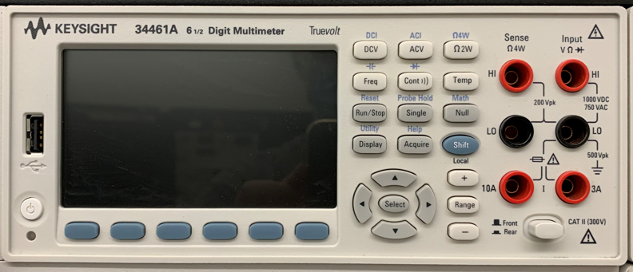

# Lab 3

Seneca College 
SES250 Electromagnatics

## Objectives
- To learn how to operate the power supply and digital multimeter (DMM)
- To become familiar with measurement techniques of direct current (DC)

## Purpose
- Operate a DC power supply
- Setup and read measurement from a digital multimeter (DMM)

## Description

### Digital Multimeter (DMM)
A multimeter is a measuring instrument that can measure multiple electrical properties. A typical multimeter can measure voltage, resistance, and current. However, some multimeters, such as the one in the electronics lab, can also measure capacitance. Digital multimeters (DMM) have numeric displays and have made analog multimeters obsolete as they are cheaper, more precise, and more physically robust than analog multimeters.

Source: [Wikipedia: Multimeter](https://en.wikipedia.org/wiki/Multimeter)

***Figure 3.1** Keysight 34461A Digital Multimeter*

In the electronics lab, you will be using a Keysight 34461A (or similar) Digital Multimeter. Its manual can be found here: [DMM Manual](lab3-DMM-manual.pdf)

### Direct Current (DC) Power Supply

An adjustable DC power supply converts electricity from the power grid to a specified voltage and current then provide them at it output connector.

***Figure 3.1** Agilent E3632A DC Power Supply*

In the electronics lab, you will be using an Agilent E3632A (or E3631A or similar) DC Power Supply. Its manual can be found here: [DC Power Supply Manual](lab3-PS-manual.pdf)

## Materials
- Safety Glasses (PPE)

## Preparation

Answer all the lab preparation questions at the end of this document in your lab notebook BEFORE your lab session. Students who did not complete the lab preparation will be asked not to join the lab and receive a grade of ZERO (0) for the lab.

Lab preparation must be done individually in the lab notebook.

> **Lab Preparation Question:**

## Procedures

Once you've completed all the above steps, ask the lab professor or instructor over and demostrate you've completed the lab and written down all your observation. You might be asked to explain some of the concepts you've learned in this lab.

## Post-Lab

1. Using the skills and knowledge acquired from this lab, answer the post-lab question(s) on blackboard. Due one week after the lab.