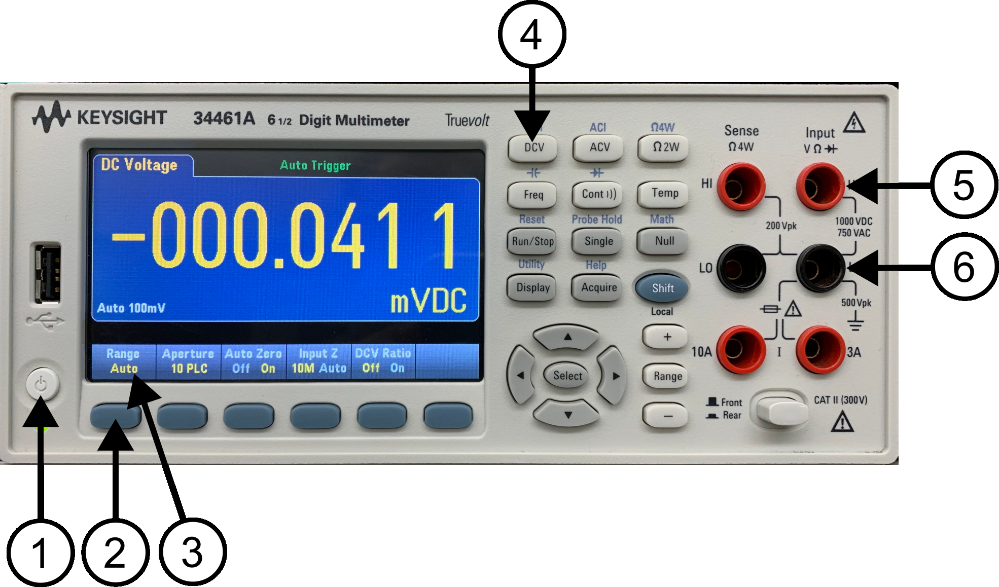

# Lab 3

Seneca College 
SES250 Electromagnatics

## Objectives
- To learn how to operate the power supply and digital multimeter (DMM)
- To become familiar with measurement techniques of direct current (DC)

## Purpose
- Operate a DC power supply
- Setup and read measurement from a digital multimeter (DMM)

## Important Rules for this Lab

<ol>
<li>Any signal (voltage current) must be adjusted to the specified value (amplitude and/or frequency) <strong>before</strong> applying them to a circuit.</li>
<li>An instrument must be set up for the required mode of operation <strong>before</strong> it is connected to a circuit.</li>
<li>The power supply must be switched off <strong>before</strong> making any changes to the circuit.</li>

## Description

### Digital Multimeter (DMM)
A multimeter is a measuring instrument that can measure multiple electrical properties. A typical multimeter can measure voltage, resistance, and current. However, some multimeters, such as the one in the electronics lab, can also measure capacitance. Digital multimeters (DMM) have numeric displays and have made analog multimeters obsolete as they are cheaper, more precise, and more physically robust than analog multimeters.

Source: [Wikipedia: Multimeter](https://en.wikipedia.org/wiki/Multimeter)

***Figure 3.1** Keysight 34461A Digital Multimeter*

In the electronics lab, you will be using a Keysight 34461A (or similar) Digital Multimeter. Its manual can be found here: [DMM Manual](lab3-DMM-manual.pdf)

### Direct Current (DC) Power Supply

An adjustable DC power supply converts electricity from the power grid to a specified voltage and current then provide them at it output connector.

***Figure 3.2** Agilent E3632A DC Power Supply*

In the electronics lab, you will be using an Agilent E3632A (or E3631A or similar) DC Power Supply. Its manual can be found here: [DC Power Supply Manual](lab3-PS-manual.pdf)

## Materials
- Safety Glasses (PPE)

## Preparation

Answer all the lab preparation questions at the end of this document in your lab notebook BEFORE your lab session. Students who did not complete the lab preparation will be asked not to join the lab and receive a grade of ZERO (0) for the lab.

Lab preparation must be done individually in the lab notebook.

> **Lab Preparation Question:**

## Procedures

### Part 1: Safety

1. Ensure that you are wearing your safety glasses, not wearing open-toe shoes, and any long hair must be tied-up.
1. At the top of your workbench, you’ll see a red “Emergency Stop” button (shown in Figure 3.3). At any time when the button is in the pressed position, your workbench will be disconnected from the power source. Press this button if there are any issues with your equipment or circuit (such as unusual heat, unusual smell, smoke, spark, or fire). To release the button, twist it as per the symbol on the button and the button will no longer be pressed.

    

    ***Figure 3.3** Emergency Stop Button*

1. Ensure the Emergency Stop button is in the released position.

### Part 2: Digital Multimeter (DMM) and DC Voltage Measurement

1. Identify the digital multimeter (DMM) at your workbench. If there are two DMMs, use the one on the left-hand side. Disconnect any cables that are plugged into it so the DMM is as shown below in Figure 3.4.

    

    ***Figure 3.4***

1. Set the DMM to DC voltage measurement mode as follows: If the DMM is not already powered on, push the power button (1). Once the DMM is ON, push the DC voltage (DCV)measurement mode button (4). If the “Range” indicator (3) is not showing “Auto”, press the menu button under “Range” (2) and change it to “Auto”.

1. Identify the two cables that are next to the DMM with a banana connector on one end and an alligator clip on the other end.

1. Connect the banana connector from the red cable to the red terminal labelled with “HI” under “Input VΩ►|” (5).

1. Connect the banana connector from the black cable to the black terminal labelled with “LO” under “Input VΩ►|” (6)

    

    ***Figure 3.5***

1. Verify the cables are connected as per shown in Figure 3.5 above. At this point, your DMM is set up to measure direct current (DC) voltage. We’ll be discussing direct current voltage during class. Remember this configuration for future labs and careers as measuring DC voltage is a very important skill for working with electronics.

1. Identify the DC power supply at your workbench. If there are two DC power supplies, use the one on the left-hand side. Disconnect any cable plug into it so it is as shown below.

1. Ensure the DC power supply is OFF. If not, press the power button (7) to ensure the DC power supply is off.
    7. Turn on the DC power supply (7). Then press the “Display Limit” button. Select the appropriate output voltage range and use the lowest possible setting (16) for a 5V output. In the photo above, the lowest setting is 15V, 7A, however, the lowest output range varies between different models of power supply. Adjust the voltage output to +5.0000V (14) using the digit selector (13) and the adjustment knob (12).
    8. Identify the black cable with two leads that are next to the DC power supply with a banana connector on one end and an alligator clip on the other end.
        a. Connect the red banana connector from the cable to the red “Output” terminal labelled with “+” (9) NOTE: connect to the appropriate output terminal depending on the output range you selected earlier.
        b. Connect the black banana connector from the cable to the black “Output” terminal labelled with “-“ (10)
    9. You’ve now set up the power supply for DC output.
    10. Connect the two red alligator clips (one from the DMM and one from the power supply) and connect the two black alligator clips. Your setup should look like the photo below. The second DMM, oscilloscope, and function can be in the OFF state. WARNING: Ensure the exposed portion of the red alligator clip is NOT touching the exposed portion of the black alligator clip.

 

    11. Once the voltage is adjusted to +5.0000V and the banana cables are connected, turn on the power supply output by pressing the Output On/Off button (8).
    12. Notice that the DMM should now read about +5V. Make a note of the range value beside the “Auto” on the DMM display.

    13. Adjust the output voltage of the DC power supply to +13V. Note: If the output range you are on is below 13V, switch the output range and terminal as necessary. [Question] What happened to the Range setting on the DMM?
    14. Afterward, decrease the voltage of the DC power supply slowly to 5V. [Question] At what, power supply voltage did the DMM change back “Auto 10V”?
    15. Adjust the output voltage of the DC power supply so the reading on the DMM will display +1.000V. Note: Switch the output range and terminal as necessary. [Question] What is the output voltage of the DC power supply? Do they agree with each other? If not, what is the percentage difference?
    16. Adjust the DC power supply output voltage to +1.0000V then change the voltage Range on the DMM from Auto to the various other range and record the observed values in the table below. Repeat this step for DV output voltage of +2V, +5V, and +10V. Some output might give you an error or warning. Record such error or warning. The reading might fluctuate but record at least 4 significant digits to the best of your ability in estimating.

DC Output: +1V
DC Output: +2V
DC Output: +5V
DC Output: +10V
Range: 100mV

Range: 1V

Range: 10V

Range: 100V

Range: 1000V

[Question] If we want the most precise reading, what is the best setting for each DC output voltage in the table?

    17. Turn off the DC power supply and disconnect the alligator clips.

Once you've completed all the above steps, ask the lab professor or instructor over and demostrate you've completed the lab and written down all your observation. You might be asked to explain some of the concepts you've learned in this lab.

## Post-Lab

1. Using the skills and knowledge acquired from this lab, answer the post-lab question(s) on blackboard. Due one week after the lab.