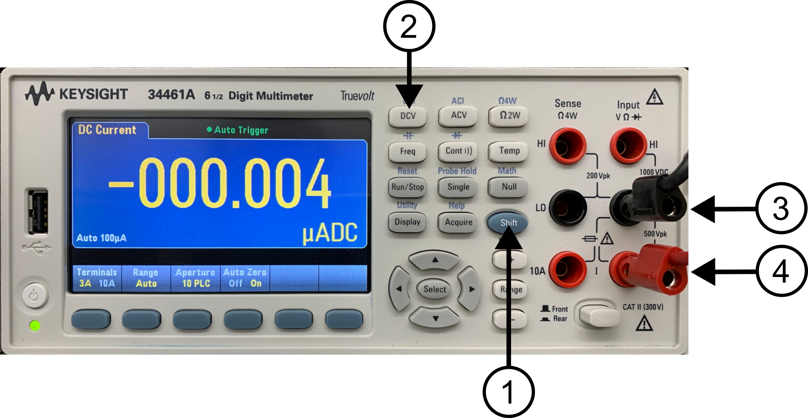
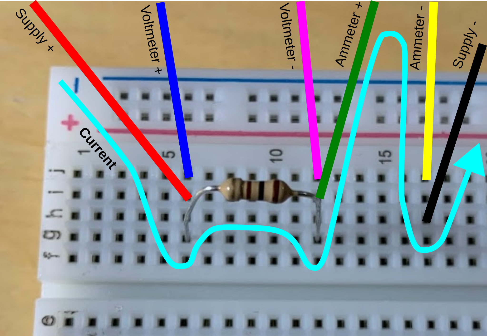

# Lab 3: Series and Parallel Resistive Circuit

Seneca Polytechnic 
SES250 Electromagnetics

## Purposes
- To become familiar with measurement techniques for direct current (DC)
- To study the relationship between voltage, resistance, and current
- To verify Ohm's Law

## Objectives
- Assemble electronic components onto a breadboard
- Measure voltage and current from a breadboard using a digital multimeter (DMM)

## Important Rules for this Lab

<ol>
<li>Any signal (voltage, current) must be adjusted to the specified value (amplitude and/or frequency) <strong>before</strong> applying them to a circuit.</li>
<li>An instrument must be set up for the required mode of operation <strong>before</strong> it is connected to a circuit.</li>
<li>The power supply must be switched off <strong>before</strong> making any changes to the circuit.</li>
</ol>

## Description

If you don't remember how to operate the DMM and read the resistor color band, refer to the description section of [Lab 2](lab2.md).

### Voltage Measurement

In Lab 2, we used the DMM as a voltmeter to measure voltage (or the potential difference) across two nodes in a circuit. When measuring voltage, the DMM is connected in **_parallel_** with the circuit, as shown in Figure 2.14a from [Lab 2](lab2.md). An ideal voltmeter has infinite resistance, so energy will not be dissipated by the test equipment. In practice, the internal resistance of a voltmeter is in the MΩ range.

Reference Video: [How to Use A KEYSIGHT E34461A DMM to Measure Voltage](https://youtu.be/z1FmB-j7_MA)

### Current Measurement

Most modern DMMs are capable of being used as an ammeter for measuring current through a circuit. Differing from voltage measurement, current measurement is made by connecting the DMM in **_series_** with the circuit, as shown in Figure 3.1. An ideal ammeter has zero resistance, so energy will not be dissipated by the test equipment. In practice, the internal resistance of a voltmeter is in the Ω range.

***Figure 3.1* Current Measuring Circuit**

Reference Video: [How to Use A KEYSIGHT E34461A DMM to Measure Current](https://youtu.be/VoejUrgtZMo)

### Resistance Measurement

Most modern DMMs are also capable of measuring the resistance through a circuit. This feature, however, is most often used to measure the resistance of a single resistor. To measure resistance, put the DMM in resistance measuring mode, then connect the DMM in **_parallel_** with the circuit.

Reference Video: [How to Use A KEYSIGHT E34461A DMM to Measure Resistance](https://youtu.be/CGlQ2-TJ5EY)

### TinkerCAD Breadboard Simulator

There are many breadboard simulators available online. In particular, [TinkerCAD Circuit](https://www.tinkercad.com/) is a nice tool that you can use to practice assembling a circuit with a virtual breadboard. See the diagram below as an example. Use this tool to help you prepare for this and future labs.

***Figure 3.2* TinkerCAD Circuit Simulation Tool**

## Materials
- Safety glasses (PPE)
- [Lab Supplies](supplies.md)
    - Breadboard
    - Jumper Wires
    - 1kΩ Resistor (brown-black-red)
    - 10kΩ Resistor (brown-black-orange)

## Preparation

> **Lab Preparation Question:**
>
> 1. Read and summarize the lab as necessary.
> 2. Copy two (2x) of the following Table 1 into your notebook for this lab:
>
    >    **Table 1:**
    >
    >    |Resistor #|First Band|Second Band|Multiplier|Nominal Ω|Measured Ω|
    >    |---|---|---|---|---|---|
    >    |Colour||||Total||
    >    |Value|||x 10 ^|||
>
> 3. Sketch the breadboard layout below in your notebook and then draw how the components (voltage source, resistor, voltmeter, and ammeter) will be connected on the breadboard according to the circuit in Figures 3.5, 3.6, and 3.7 (Three breadboard diagram in total). Clearly show which tie points the wire, resistor, DMM, and power supply should be attached to. Use [TinkerCAD Circuit](https://www.tinkercad.com/) to help with your understanding of breadboard and component wiring. You may also simulate all the steps as preparation for the lab. Refer to [Lab 2](lab2.md) Figure 2.13 for a breadboard diagram example.
>
    >    
    >
>
> 4. Copy the table in Lab Questions 3, 4, and 5 into your notebook.
> 5. Calculate the theoretical reading of the voltmeter and ammeter for the circuit in Figures 3.6 and 3.7 at supply voltages of 1V, 2V, 5V, and 10V. 

## Procedures

### Part 1: Resistance Measurement

1. Take out a 1kΩ resistor and a 10kΩ resistor from your lab kit.

    > **Lab Question 1:** Write down the color code of each resistor then determine their resistance value using the resistor color chart in [Lab 2](lab2.md). Use the table below to help you determine the resistance value of each resistor. Leave the "Measured Ω" blank.
    >
    > **Example:**
    >
    > ||1st Band|2nd Band|Multiplier|Nominal Ω|Measured Ω| % Error |
    > |---|---|---|---|---|---|---|
    > |Colour|Brown|Black|Red|Total|-|-|
    > |Value|1|0|x 10 ^ 2|1 kΩ|1.013 kΩ|1.3%|

2. Turn on one of the DMMs at your workbench and set it to the “Ω 2W” (1) resistance measurement mode. Ensure the banana plugs are connected to the resistance input terminals as shown in Figure 3.3 (2)(3).

    

    ***Figure 3.3* DMM Resistance Mode**

3. Connect the red alligator clip of the DMM to one lead of a resistor and the black alligator clip to the other lead of the resistor.

    > **Lab Question 2:** Write down the measured resistance (at least 3 significant figures) in the "Measured Ω" column of the table you created in the pre-lab. Does this value agree with the nominal resistor value according to the color band? What is the % error? Is the error within the tolerance of the resistor (indicated by the tolerance band)?

4. Repeat step 3 for the second resistor, then disconnect the DMM from the resistor.

### Part 2: Voltage and Current Measurement

1. Ensure the DC power supply is OFF. Locate its red and black cables, then attach jumper wires to the alligator clips as shown in Figure 2.12 from [Lab 2](lab2.md).

2. Set up one of the DMMs to voltage mode (refer to [Lab 2](lab2.md) if you don't remember the procedure) and ensure the banana cables are connected properly to the DMM for voltage measurement. Connect jumper wires to each of the alligator clips.

3. Set up the other DMM at your workbench to the current mode (DCI) by holding the "SHIFT" button (1) and the "DCV" button (2). Afterward, ensure the banana cable is connected properly to the DMM for voltage measurement by connecting the black banana cable to the "LO" input (3) and the red banana cable to the "3A" input (4) as shown in Figure 3.4. Then connect jumper wires to each of the alligator clips.

    

    ***Figure 3.4***

4. Next, insert one of the resistors onto a breadboard the same way as shown in Figure 2.9 from [Lab 2](lab2.md), then connect the jumper wires from the DMMs and the power supply to form the following circuit. Notice the voltmeter (DMM in DC voltage mode (DCV)) is connected in parallel with the resistor and the ammeter (DMM in DC current mode (DCI)) is connected in series with the circuit. A small example of some of the connections is shown.

    

    

    ***Figure 3.5***

5. Double-check that the circuit is assembled properly and that there is no short circuit. **Tips:** Follow the flow of the current in your physical circuit from the positive (+) terminal of the power supply to the resistor, then to the ammeter, then to the negative terminal of the power supply to verify proper connections.

6. Turn on the DC power supply and set the output to 5V, then turn on the output. Verify the voltage reading on the DMM agrees with the output of the DC power supply, then **turn it off**. If you are not seeing 5VDC at the DMM, verify your wiring and that you are using the correct output channel of the power supply. 

    >
    > **Lab Question 3:** Adjust the power supply output to 1V, 2V, 5V, and 10V to complete the table below. Do the measurements agree with Ohm's Law?
    >
    > |Power Supply Voltage [V]|1V|2V|5V|10V|
    > |---|---|---|---|---|
    > |Current Using 1kΩ Resistor [A]|||||
    > |Current Using 10kΩ Resistor [A]|||||

7. Turn off the DC power supply output.

### Part 3: Series and Parallel Resistive Circuit

1. Next, we’ll assemble the following series resistive circuit using the 1kΩ and 10kΩ resistors on a breadboard. The power supply will act as the DC voltage source. 

    

    ***Figure 3.6***

2. Set the DC power supply to 1V output, then turn on the output. Verify the voltage reading on the DMM agrees with the output of the DC power supply, then **turn it off**. If you are not seeing 0.09VDC at the DMM, verify your wiring and that you are using the correct output channel of the power supply. 

    >
    > **Lab Question 4:** Adjust the power supply output to 1V, 2V, 5V, and 10V to complete the table below. Do the measurements agree with the estimate you made in the pre-lab?
    >
    > |Power Supply Voltage [V]|1V|2V|5V|10V|
    > |---|---|---|---|---|
    > |Voltmeter Reading [V]|||||
    > |Ammeter Reading [A]|||||

3. Lastly, we’ll assemble the following parallel resistive circuit using the 1kΩ and 10kΩ resistors on a breadboard. The power supply will act as the DC voltage source.

    

    ***Figure 3.7***

4. Set the DC power supply to 1V output, then turn on the output. Verify the voltage reading on the DMM agrees with the output of the DC power supply, then **turn it off**. If you are not seeing 1VDC at the DMM, verify your wiring and that you are using the correct output channel of the power supply. 

    >
    > **Lab Question 5:** Adjust the power supply output to 1V, 2V, 5V, and 10V to complete the table below. Do the measurements agree with the estimate you made in the pre-lab?
    >
    > |Power Supply Voltage [V]|1V|2V|5V|10V|
    > |---|---|---|---|---|
    > |Voltmeter Reading [V]|||||
    > |Ammeter Reading [A]|||||

5. DO NOT DISASSEMBLE YOUR CIRCUIT UNTIL YOUR LAB HAS BEEN MARKED BY THE INSTRUCTOR.

6. Turn off the DC power supply output.

Once you've completed all the above steps, ask the lab professor or instructor to demonstrate that you've completed the lab and written down all your observations. You might be asked to explain some of the concepts you've learned in this lab.