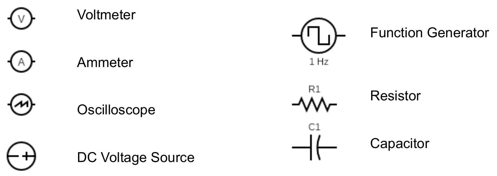
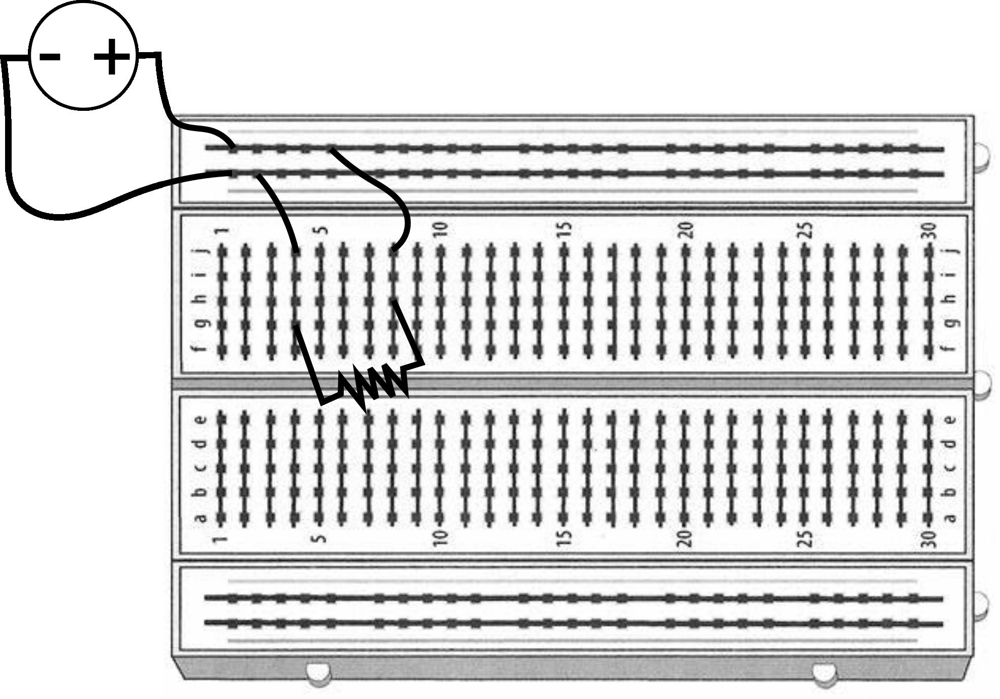
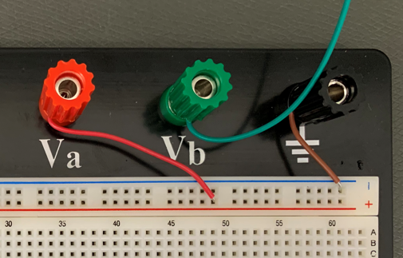
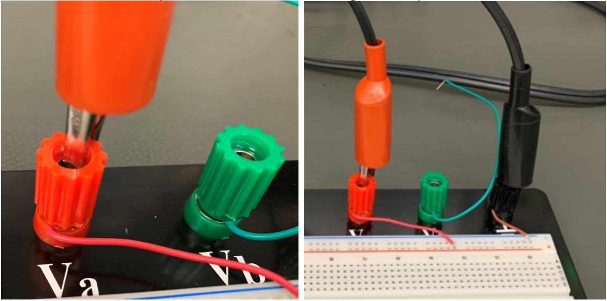
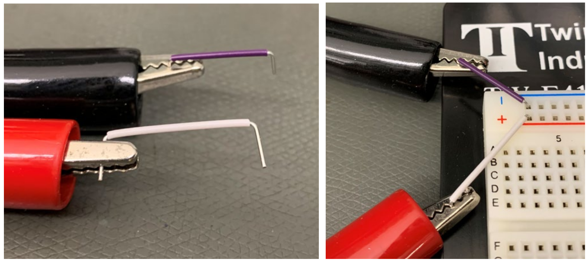
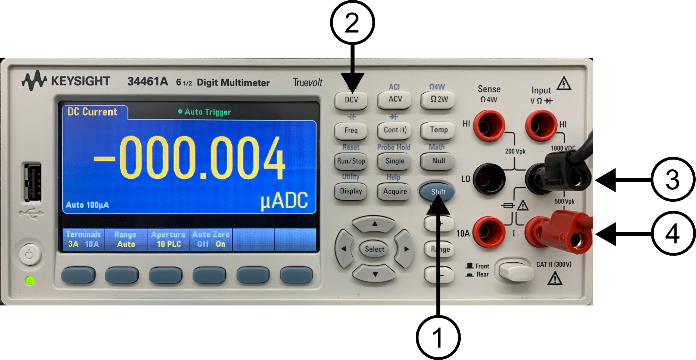
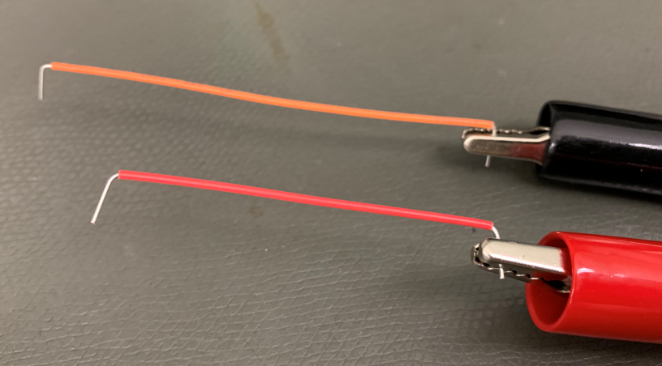
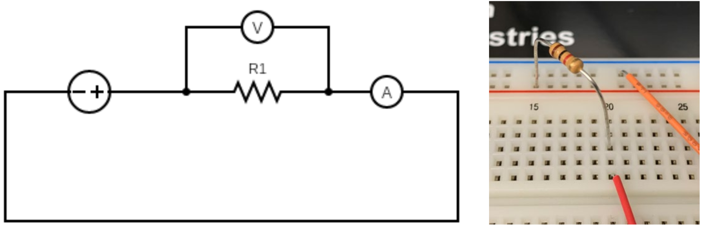

# Lab 4

Seneca College 
SES250 Electromagnatics

## Objectives
- To study the relationship between voltage, resistance, and current
- To explore direct current (DC)
- To verify Ohm's Law

## Purpose
- Assemble electronic components onto a breadboard
- Measurements voltage from a breadboard using a digital multimeter (DMM)

## Important Rules for this Lab

<ol>
<li>Any signal (voltage, current) must be adjusted to the specified value (amplitude and/or frequency) <strong>before</strong> applying them to a circuit.</li>
<li>An instrument must be set up for the required mode of operation <strong>before</strong> it is connected to a circuit.</li>
<li>The power supply must be switched off <strong>before</strong> making any changes to the circuit.</li>
</ol>

## Description

Direct current (DC) is the one-directional flow of electric charge. An electrochemical cell is a prime example of DC power. Direct current may flow through a conductor such as a wire, but can also flow through semiconductors, insulators, or even through a vacuum as in electron or ion beams. The electric current flows in a constant direction, distinguishing it from alternating current (AC).

Source: [Wikipedia: Direct Current](https://en.wikipedia.org/wiki/Direct_current)

A resistor is a passive two-terminal electrical component that implements electrical resistance as a circuit element. In electronic circuits, resistors are used to reduce current flow, adjust signal levels, divide voltages, bias active elements, and terminate transmission lines, among other uses. A resistor’s resistance is specified by a colour code on the resistor as per Figure 4.1.

Source: [Wikipedia: Resistor](https://en.wikipedia.org/wiki/Resistor)

***Figure 4.1** Resistor Band Colour*

An electronics breadboard is a solderless circuit prototyping board. They are great for making temporary circuits and prototyping, and they require no soldering.

Source: [SparkFun: How to User a Breadboard](https://learn.sparkfun.com/tutorials/how-to-use-a-breadboard/all)

The internal conductive strip of the breadboard is assembly such a way that:

- all tie points of the top power rail (labelled red) are inter-connected
- all tie points of the top ground rail (labelled blue) are inter-connected
- all tie points of the bottom power rail (labelled red) are inter-connected
- all tie points of the bottom ground rail (labelled blue) are inter-connected
- each row (1-63) from column “a” to “e” are inter-connected
- each row (1-63) from column “f” to “j” are inter-connected

Figures 4.2 and 4.3 are photos of a full-size breadboard and a half-size breadboard. Note how the tie-points are connected together by the metal strips. Only one component connection should connect to each tie-point.

***Figure 4.2** Full-Size 830 Tie Points Breadboard*

***Figure 4.3** Half-Size 400 Tie Points Breadboard and Showing of Internal Conductive Strips*

When expressing an electronic circuit in a diagram, circuit symbols are used. Below are some of the circuit symbols that you'll see in the lab.

***Figure 4.4** Circuit Symbols*

## Materials
- 1kΩ or similar value resistor
- 10kΩ or similar value resistor
- Breadboard
- Jumper wires

_Optional:_ If you want to purchase the lab supplies for this lab, details can be found in the [Lab Supplies](supplies.md) page.

## Preparation

> **Lab Preparation Question:**
>
> 1. Sketch the breadboard below onto your notebook then draw how the components will be connected to the breadboard according to the circuit shown in Step 10. Clearly show which tie point will the wire, resistor, DMM, and power supply be attached to. Use [TinkerCAD Circuit](https://www.tinkercad.com/) as an aid if necessary.
>
    >    
    >    Example:
    >    
    >    Note how the tie-points are connected together by the straight lines.
>
> 1. Copy two (2x) of the following Table 1 into your notebook for this lab:
>
    >    Table 1
    >
    >    |Resistor #|First Band|Second Band|Multiplier|Nonimal Ω|Measured Ω|
    >    |---|---|---|---|---|---|
    >    |Colour||||Total||
    >    |Value|||x 10 ^|||
>
> 1. If the voltage source in Step 10 is 5V and R1 is 1kΩ, calculate the current of the circuit.
> 1. Repeat the calculation above for a 10kΩ resistor.
> 1. Copy the following Table 2 into your notebook for this lab:
>
    >    Table 2
    >
    >    ||Measured Voltage|Measured Current|Calculated Resistance|
    >    |---|---|---|---|
    >    |Resistor #1||||
    >    |Resistor #2||||

## Procedures

1. Obtain a 1kΩ resistor, a 10kΩ resistor, a breadboard and a few jumper wires. If the resistor value is not available, use resistors of similar value.

    > **Lab Question 1:** Write down the colour code of each resistor then determine their resistance value using the resistor colour chart. Use the table below to help you determine the resistance value of each resistor. Fill in the "Measured Ω" in the next step.
    >
    > (Example)
    >
    > |Resistor #|First Band|Second Band|Multiplier|Nonimal Ω|Measured Ω|
    > |---|---|---|---|---|---|
    > |Colour|Brown|Black|Red|Total||
    > |Value|1|0|x 10 ^ 2|1 kΩ|1.013 kΩ|

1. Turn on the one of DMM at your workbench and turn it into the “Ω 2W” resistance measurement mode. Connect the red alligator clip of the DMM to one lead of one of the resistors and the black alligator clip to the other lead of the resistor.

    > **Lab Question 2:** Write down the measured resistance (at least 3 significant figures) in the "Measured Ω" column of the table you created in the pre-lab. Does this value agree with the colour band value? What is the % error? Is the error within the tolerance of the resistor (indicated by the tolerance band)?

1. Repeat steps 1 and 2 for the second resistor then disconnect the DMM from the resistor.

1. Place the breadboard on the workbench and ensure one jumper wire (any colour) is connected to the “Va” banana post and one jumper wire (any colour) is connected to the “GND” banana post.

    

    ***Figure 4.5***

1. Ensure the DC power supply is OFF. Locate the cable from the DC power supply. Clip the red alligator clip to the red banana post and the black alligator clip to the black banana post.

    

    ***Figure 4.6***

1. Set up one of the DMM for voltage measurement (Review Lab 2 for procedure). Connect one jumper cable to each of the alligator clips then connect the black wire with its jumper wire to the blue (-) rail and the red wire with its jumper wire to the red (+) rail of the breadboard.

    

    ***Figure 4.7***

1. Turn on the DC power supply and set the output to 5V then turn on the output. Verify the voltage reading on the DMM agrees with the output of the DC power supply then **turn it off**. If you are not seeing 5VDC at the DMM, verify your wiring and that you are using the correct output channel of the power supply.

1. Next, we’ll set up **a second DMM** for the current measurement. For this, we’ll connect the black banana cable to the “LO” Input (3) and the red banana cable to the “3A” Input (4). Afterward, press the “SHIFT” button (1) and the “DCV” button (2) together to enter DC current mode. 

    

    ***Figure 4.8***

1. Once the DMM is in DC current mode, connect a jumper wire to each of the DMM’s alligator clips.

    

    ***Figure 4.9***

1. Next, we’ll assemble the following circuit using the breadboard and one of the resistors from earlier. Notice the voltmeter (DMM in DC voltage mode) is connected in parallel with the resistor and the Ammeter (DMM in DC current mode) is connected in series with the circuit. An example of some of the connections is shown.

    

    ***Figure 4.10***

    [TinkerCAD Circuit](https://www.tinkercad.com/) is a nice tool that you can use to practice assembling the circuit using a virtual breadboard.

    

    ***Figure 4.11***

1. Double-verify that the circuit is assembled properly and that there is no short circuit. **Tips:** Follow the flow of current from the positive (+) terminal of the power supply to the resistor, then to the ammeter, then to the negative terminal of the power supply to verify proper connections.

1. Turn on the output of the power supply and ensure the output is at 5V.

    > **Lab Question 3:** What value do you see on the voltmeter (DMM in DC voltage mode) and the Ammeter (DMM in DC current mode)? Record the measured voltage and measured current in Table 2 then use Ohm’s law to calculate the resistance. Does the calculated resistance agree more with the resistance value provided by the manufacturer or with the resistance you measured earlier?
    
1. Repeat steps 10-12 for the second resistor.

1. Turn off the DC power supply. Disconnect the resistors from the breadboard and the voltmeter from its jumper wire.

Once you've completed all the above steps, ask the lab professor or instructor over and demostrate you've completed the lab and written down all your observation. You might be asked to explain some of the concepts you've learned in this lab.

## Post-Lab

1. Using the skills and knowledge acquired from this lab, answer the post-lab question(s) on blackboard. Due one week after the lab.