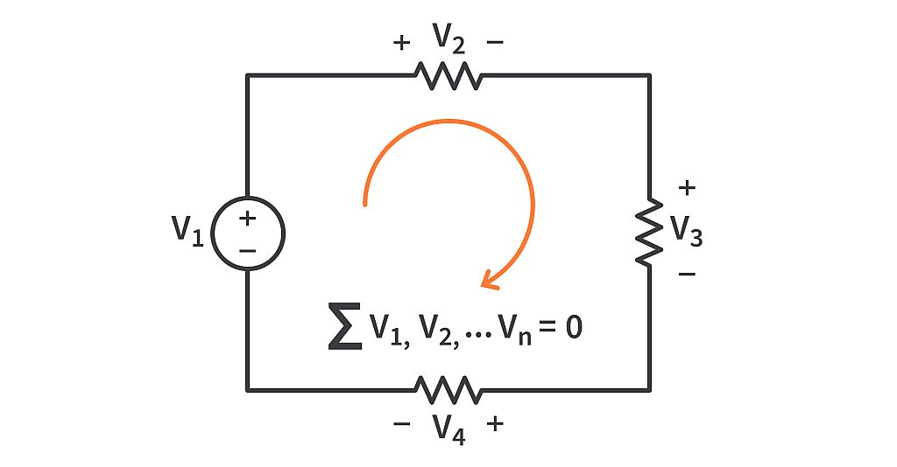

# Lab 4 : Kirchhoff's Laws

Seneca Polytechnic 
SES250 Electromagnatics

## Purposes
- To become familiar with measurement techniques of direct current (DC)
- To study the relationship between voltage, resistance, and current
- To understand and verify Kirchhoff's Laws
- To understand and verify Thévenin Theorem

## Objectives
- Assemble electronic components onto a breadboard
- Measure voltage and current from a breadboard using a digital multimeter (DMM)

## Important Rules for this Lab

<ol>
<li>Any signal (voltage, current) must be adjusted to the specified value (amplitude and/or frequency) <strong>before</strong> applying them to a circuit.</li>
<li>An instrument must be set up for the required mode of operation <strong>before</strong> it is connected to a circuit.</li>
<li>The power supply must be switched off <strong>before</strong> making any changes to the circuit.</li>
</ol>

## Description

If you don't remember how to operate the DMM and read the resistor colour band, refer to the description section of [Lab 2](lab2.md).

### Kirchhoff's Current Law (KCL)

When analyzing electronic circuits, a method often used is Kirchhoff's current law (KCL). KCL, Kirchhoff's first law, or Kirchhoff's junction rule, states that, for any node (junction) in an electrical circuit, the sum of currents flowing into that node is equal to the sum of currents flowing out of that node; or equivalently: the algebraic sum of currents in a network of conductors meeting at a point is zero:

$$
\displaystyle\sum_{i=1}^{n} I_i = \sum_{i=1}^{n} {{V_i} \over {R_i}} = 0
$$

***Figure 4.1** The current entering any junction is equal to the current leaving that junction. i2 + i3 = i1 + i4*

### Kirchhoff's Voltage Law (KVL)

KVL, Kirchhoff's second law, or Kirchhoff's loop rule, states that the directed sum of the potential differences (voltages) around any closed loop is zero. Similarly to Kirchhoff's current law, the voltage law can be stated as:

$$
\displaystyle\sum_{i=1}^{n} V_i = \sum_{i=1}^{n} {{I_i} {R_i}} = 0
$$

***Figure 4.2** The voltages around any closed loop are zero*

Source: [Wikipedia: Kirchhoff's circuit laws](https://en.wikipedia.org/wiki/Kirchhoff%27s_circuit_laws)

### TinkerCAD Breadboard Simulator

There are many breadboard simulators available online. In particular, [TinkerCAD Circuit](https://www.tinkercad.com/) is a nice tool that you can use to practice assembling a circuit with a virtual breadboard. See the diagram below as an example. Use this tool to help you prepare for this and future labs.

***Figure 4.3* TinkerCAD Circuit Simulation Tool**

## Materials
- Safety glasses (PPE)
- [Lab Supplies](supplies.md)
    - Breadboard
    - Jumper Wires
    - (2x) 100Ω Resistor (brown-black-brown)
    - (2x) 330Ω Resistor (orange-orange-brown)
    - (2x) 1kΩ Resistor (brown-black-red)
    - (1x) 4.7kΩ Resistor (yellow-purple-red)
    - (2x) 10kΩ resistor (brown-black-orange)

## Preparation

> **Lab Preparation Question:**
>
> 1. Read and summarize the lab as necessary.
> 1. Copy observation table 1 into your notebook.
> 1. Sketch the breadboard diagram below onto your notebook then draw how the components (voltage source, resistor, voltmeter, and ammeter) will be connected on the breadboard according to the circuit in Figure 4.4 for measuring:
    >
    >   - \(I_1\)
    >   - \(I_2\)
    >   - \(I_L\)
    >   - \(V_a\)
    >   - \(V_b\)
    >
    >
    >   Clearly show which tie point the wire, resistor, DMM, and power supply be attached to. Use [TinkerCAD Circuit](https://www.tinkercad.com/) to help with your understanding of breadboard and component wiring. You may also simulate all the steps as preparation for the lab. Refer the [Lab 2](lab2.md) Figure 2.13 for a breadboard diagram example.
    >
    >   
    >
>
> 1. Use KCL or KVL to calculate the estimated (therotical) values for \(I_1\), \(I_2\), \(I_L\), \(V_a\)and \(V_b\) in Figure 4.4 then fill in the appropriate cell in the observation table 1. Use 1kΩ for \(R_L\) and show all calculation.

## Procedures

### Current and Voltage Measurement

For this lab, below is the circuit that you'll be working with. You'll need to add voltmeter and ammeter into the circuit to measure the branch current and node voltage. Remember, **current measurement needs to be in <u>series</u>** with the branch.

***Figure 4.4***

1. Assemble the above circuit shown onto your breadboard as how you prepared during your pre-lab for measuring current \(I_1\). Use 1kΩ for \(R_L\).
1. Turn on the power supplies and set the DMM for the appropriate measurement then write down your measurement into the observation table.

    > **Lab Question 1:** Write down the measured current into the appropriate cell in the table below.
    >
    > **Tabel 1: Observation Table:**
    >
    > ||\(I_1\)|\(I_2\)|\(I_L\)|\(V_a\)|\(V_b\)|
    > |---|---|---|---|---|---|
    > |Estimated Value||||||
    > |Measured Value||||||
    > |% Error||||||

1. Turn off the output of the power supplies.
1. Modify the circuit on your breadboard for measuring current \(I_2\) and \(I_L\) as how you prepared during your pre-lab. You may use both DMM.
1. Turn on the power supplies then write down your measurement into the observation table.

    > **Lab Question 2:** Write down the measured current into the appropriate cell in the observation table.

1. Repeat the above steps for the measurement of voltage measurement \(V_a\) and \(V_b\). You may use both DMM.

    > **Lab Question 3:** Does all the % error falls within the tolarance of the resistors?

1. DO NOT DISASSEMBLE YOUR CIRCUIT UNTIL YOUR LAB HAS BENN MARKED BY THE INSTRUCTOR.

1. You can keep your circuit assembled for Lab 5.

Once you've completed all the above steps, ask the lab professor or instructor over and demostrate that you've completed the lab and written down all your observations. You might be asked to explain some of the concepts you've learned in this lab.