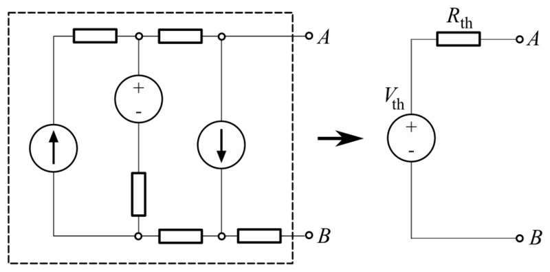

# Lab 4 : Kirchhoff's Laws and Thévenin Theorem

Seneca College 
SES250 Electromagnatics

## Purposes
- To become familiar with measurement techniques of direct current (DC)
- To study the relationship between voltage, resistance, and current
- To understand and verify Kirchhoff's Laws
- To understand and verify Thévenin Theorem

## Objectives
- Assemble electronic components onto a breadboard
- Measure voltage and current from a breadboard using a digital multimeter (DMM)

## Important Rules for this Lab

<ol>
<li>Any signal (voltage, current) must be adjusted to the specified value (amplitude and/or frequency) <strong>before</strong> applying them to a circuit.</li>
<li>An instrument must be set up for the required mode of operation <strong>before</strong> it is connected to a circuit.</li>
<li>The power supply must be switched off <strong>before</strong> making any changes to the circuit.</li>
</ol>

## Description

If you don't remember how to operate the DMM and read the resistor colour band, refer to the description section of [Lab 2](lab2.md).

### Kirchhoff's Current Law (KCL)

When analyzing electronic circuits, a method often used is Kirchhoff's current law (KCL). KCL, Kirchhoff's first law, or Kirchhoff's junction rule, states that, for any node (junction) in an electrical circuit, the sum of currents flowing into that node is equal to the sum of currents flowing out of that node; or equivalently: the algebraic sum of currents in a network of conductors meeting at a point is zero:

$$
\displaystyle\sum_{i=1}^{n} I_i = \sum_{i=1}^{n} {{V_i} \over {R_i}} = 0
$$

***Figure 4.1** The current entering any junction is equal to the current leaving that junction. i2 + i3 = i1 + i4*

### Kirchhoff's Voltage Law (KVL)

KVL, Kirchhoff's second law, or Kirchhoff's loop rule, states that the directed sum of the potential differences (voltages) around any closed loop is zero. Similarly to Kirchhoff's current law, the voltage law can be stated as:

$$
\displaystyle\sum_{i=1}^{n} V_i = \sum_{i=1}^{n} {{I_i} {R_i}} = 0
$$

***Figure 4.2** The voltages around any closed loop are zero*

Source: [Wikipedia: Kirchhoff's circuit laws](https://en.wikipedia.org/wiki/Kirchhoff%27s_circuit_laws)

### Thévenin Theorem

Thévenin theorem is a method often used to simplify circuit analysis from a complex circuit to a simpler one with only a Thévenin voltage source in series with a Thévenin resistor.

Any linear electrical network containing only voltage sources, current sources and resistances can be replaced at terminals A–B by an equivalent combination of a voltage source \(V_{th}\) in a series connection with a resistance \(R_{th}\).

***Figure 4.3** Thévenin equivalent circuit*

1. The equivalent voltage \(V_{th}\) is the voltage obtained at terminals A–B of the network with terminals A–B open-circuited.
1. The equivalent resistance \(R_{th}\) is the resistance that the circuit between terminals A and B would have if all ideal voltage sources in the circuit were replaced by a short circuit and all ideal current sources were replaced by an open circuit.
1. If terminals A and B are connected to one another, the current flowing from A and B will be \(V_{th} over R_{th}\). This means that \(R_{th}\) could alternatively be calculated as \(V_{th}\) divided by the short-circuit current between A and B when they are connected together.

Source: [Wikipedia: Thévenin's theorem](https://en.wikipedia.org/wiki/Th%C3%A9venin%27s_theorem)

### TinkerCAD Breadboard Simulator

There are many breadboard simulators available online. In particular, [TinkerCAD Circuit](https://www.tinkercad.com/) is a nice tool that you can use to practice assembling a circuit with a virtual breadboard. See the diagram below as an example. Use this tool to help you prepare for this and future labs.

***Figure 4.4* TinkerCAD Circuit Simulation Tool**

## Materials
- Safety glasses (PPE)
- [Lab Supplies](supplies.md)
    - Breadboard
    - Jumper Wires
    - (2x) 100Ω Resistor (brown-black-brown)
    - (2x) 330Ω Resistor (orange-orange-brown)
    - (2x) 1kΩ Resistor (brown-black-red)
    - (1x) 4.7kΩ Resistor (yellow-purple-red)
    - (2x) 10kΩ resistor (brown-black-orange)

## Preparation

> **Lab Preparation Question:**
>
> 1. Read and summarize the lab as necessary.
> 1. Copy the three (3x) observation tables of this lab into your notebook.
> 1. Sketch the breadboard diagram below onto your notebook then draw how the components (voltage source, resistor, voltmeter, and ammeter) will be connected on the breadboard according to the circuit in Figure 4.5 for measuring:
    >
    >   - \(I_1\)
    >   - \(I_2\)
    >   - \(I_L\)
    >   - \(V_a\) and \(V_b\)
    >
    >
    >   Clearly show which tie point the wire, resistor, DMM, and power supply be attached to. Use [TinkerCAD Circuit](https://www.tinkercad.com/) to help with your understanding of breadboard and component wiring. You may also simulate all the steps as preparation for the lab. Refer the [Lab 2](lab2.md) Figure 2.13 for a breadboard diagram example.
    >
    >   
    >
>
> 1. Repeat the above breadboard sketch for measuring \(I_L\) and \(V_{ab}\) in Figure 4.5 and Figure 4.6.
> 1. Use KCL or KVL to calculate the estimated values for \(I_1\), \(I_2\), \(I_L\), \(V_a\)and \(V_b\) in Figure 4.5 then fill in the appropriate cell in the observation table 1. Use 1kΩ for \(R_L\).
> 1. Use KCL or KVL to calculate the estimated values for \(I_L\), \(V_{ab}\) in Figure 4.5 for vthe arious \(R_L\) value given in part 2 then fill in the appropriate cell in the observation table 2.
> 1. Find the Thévenin equivalent circuit for Figure 4.5 then choose the closest resistor you have to \(R_{th}\) for Part 3 of the lab.
> 1. Use Thévenin Theorem to calculate the estimated values for \(I_L\) in Figure 4.5 for each of the \(R_L\) values in Part 3 then fill in the appropriate cell in the observation table 3.

## Procedures

### Part 1: Current and Voltage Measurement

For this lab, below is the circuit that you'll be working with. However, do NOT assemble the circuit as shown onto your breadboard. You'll need to add voltmeter and ammeter into the circuit. Remember, **current measurement needs to be in <u>series</u>** with the branch.

***Figure 4.5***

1. Assemble the above circuit shown onto your breadboard as how you prepared during your pre-lab for measuring current \(I_1\). Use 1kΩ for \(R_L\).
1. Turn on the power supplies and set the DMM for the appropriate measurement then write down your measurement into the observation table.

    > **Lab Question 1:** Write down the measured current into the appropriate cell in the table below.
    >
    > **Tabel 1: Observation Table:**
    >
    > ||\(I_1\)|\(I_2\)|\(I_L\)|\(V_a\)|\(V_b\)|
    > |---|---|---|---|---|---|
    > |Estimated Value||||||
    > |Measured Value||||||
    > |% Error||||||

1. Turn off the output of the power supplies.
1. Modify the circuit on your breadboard for measuring current \(I_2\) and \(I_L\) as how you prepared during your pre-lab. You may use both DMM.
1. Turn on the power supplies then write down your measurement into the observation table.

    > **Lab Question 2:** Write down the measured current into the appropriate cell in the observation table.

1. Repeat the above steps for the measurement of voltage measurement \(V_a\) and \(V_b\). You may use both DMM.

    > **Lab Question 3:** Does all the % error falls within the tolarance of the resistors?

### Part 2: \(I_L\) and \(V_{ab}\) for various \(R_L\)

1. Using the circuit from Part 1, replace the \(R_L\) resistor with the various value on the table below then measure current \(I_L\) and \(V_{ab}\) for each value.
1. Turn on the power supplies then write down your measurement into the observation table.

    > **Lab Question 4:** Write down the measured current into the appropriate cell in the table below.
    >
    > **Tabel 2: \(R_L\) Observation Table:**
    >
    > |\(R_L\)|Estimated \(I_L\)|Estimated \(V_{ab}\)|Measured \(I_L\)|Measured \(V_{ab}\)|
    > |---|---|---|---|---|
    > |100Ω|||||
    > |330Ω|||||
    > |1kΩ|||||
    > |10kΩ|||||

1. Turn off the output of the power supplies then repeat the measurement above for \(R_L\) of 100Ω and 10kΩ.

### Part 3: Thévenin Equivalent Circuit

1. Next, assemble the Thévenin circuit given below with the resistor value you calculate in the pre-lab.

    

    ***Figure 4.6***

1. Apply the Thévenin voltage you calculated from the pre-lab then turn on the power supplies. Write down your measurement in the observation table.

    > **Lab Question 5:** Write down the measured current into the appropriate cell in the table below.
    >
    > **Table 3: Thévenin Circuit Observation Table:**
    >
    > |\(R_L\)|Measured \(I_L\)|Measured \(V_{ab}\)|Power Dissipated|
    > |---|---|---|---|
    > |100Ω||||
    > |330Ω||||
    > |1kΩ||||
    > |10kΩ||||

1. Turn off the output of the power supplies then repeat the measurement above for \(R_L\) of 100Ω and 10kΩ.

    > **Lab Question 6:** Does the value agree closely with the original circuit? Note that the \(R_{th}\) you've chosen might not exactly match the theoretical \(R_{th}\).

    > **Lab Question 7:** Calculate the power dissipation \(P = IV\) by the load resistor in each case. Which resistor dissipated the most power?

Once you've completed all the above steps, ask the lab professor or instructor over and demostrate that you've completed the lab and written down all your observations. You might be asked to explain some of the concepts you've learned in this lab.