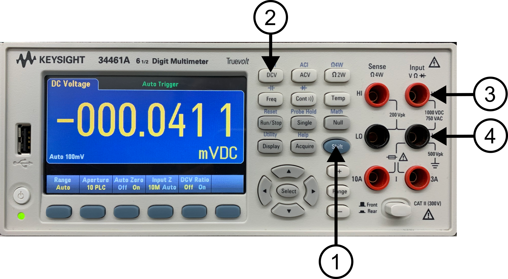
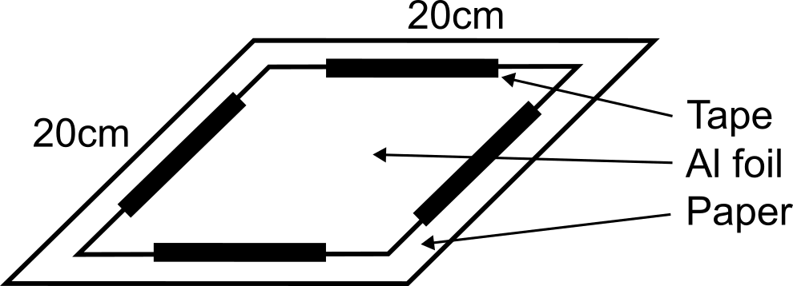
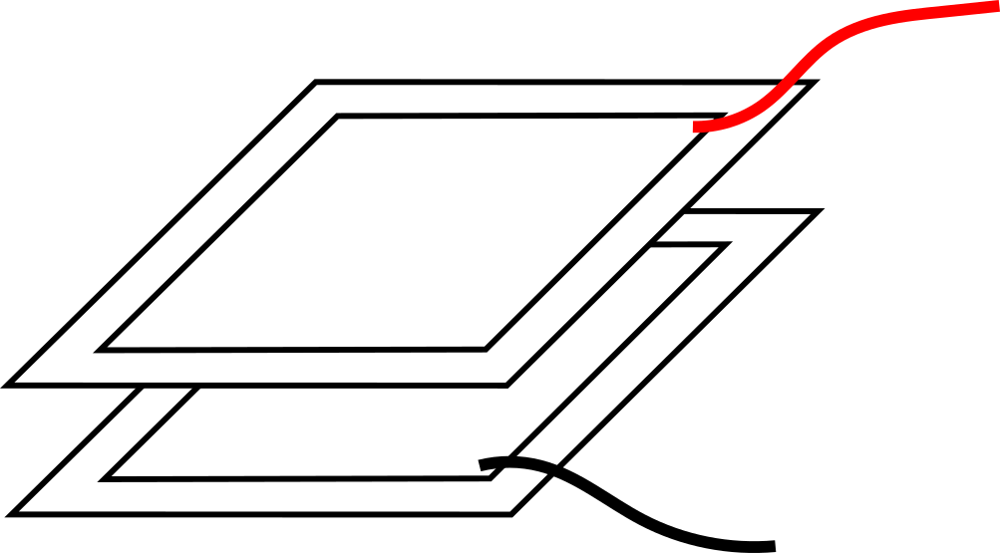
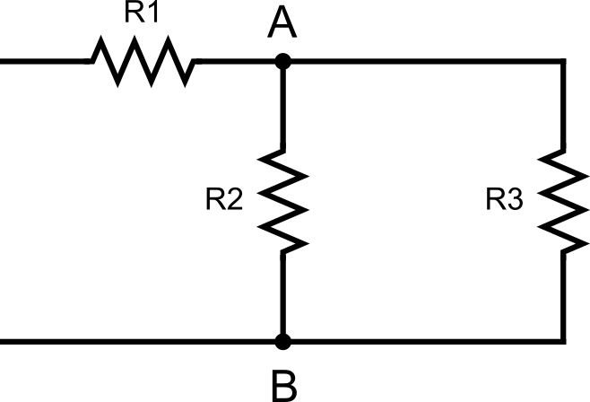
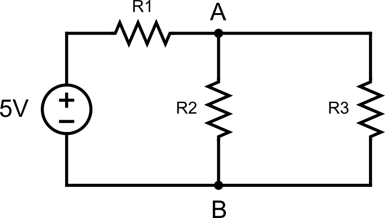

# Lab 5

Seneca College 
SES250 Electromagnatics

## Objectives
- To understand the relationship between the capacitance and the seperation distance of a parallel sheets capacitor
- To understand and verify Kirchhoff's Law

## Purpose
- Assemble electronic components onto a breadboard
- Measure capacitance of a capacitor using a digital multimeter (DMM)

## Important Rules for this Lab

<ol>
<li>Any signal (voltage, current) must be adjusted to the specified value (amplitude and/or frequency) <strong>before</strong> applying them to a circuit.</li>
<li>An instrument must be set up for the required mode of operation <strong>before</strong> it is connected to a circuit.</li>
<li>The power supply must be switched off <strong>before</strong> making any changes to the circuit.</li>
</ol>

## Description

A capacitor is an electronics device for storing electrical energy, consisting of two conductors in close proximity and insulated from each other. A simple example of such a storage device is the parallel-plate capacitor. If positive charges with total charge +Q are deposited on one of the conductors and an equal amount of negative charge −Q is deposited on the second conductor, the capacitor is said to have a charge Q.

Source: [Britannica: capacitor](https://www.britannica.com/technology/capacitor)

The capacitance of a parallel plate capacitor can be calculated using:

$$ C = {{\epsilon_0 A} \over {s}} $$

where \(\epsilon_0\) is the permittivity in vacuum and have a value of \(\epsilon_0 = {8.854 \times 10^{-12} {Nm^2 \over C^2}}\), \(A\) is the area of the plates, and \(s\) is the distance between the plates.

When analyzing electronics circuit, an often used methods is the Kirchhoff's current law (KCL). KCL or Kirchhoff's first law, or Kirchhoff's junction rule, states that, for any node (junction) in an electrical circuit, the sum of currents flowing into that node is equal to the sum of currents flowing out of that node; or equivalently: the algebraic sum of currents in a network of conductors meeting at a point is zero:

$$
\displaystyle\sum_{i=1}^{n} I_i = 0
$$

***Figure 5.1 The current entering any junction is equal to the current leaving that junction. i2 + i3 = i1 + i4***

Source: [Wikipedia: Kirchhoff's circuit laws](https://en.wikipedia.org/wiki/Kirchhoff%27s_circuit_laws)

## Materials
- Alumimum foils
- Letter size printer paper
- Tape
- 1kΩ or similar value resistor
- 10kΩ or similar value resistor
- Breadboard
- Jumper wires

## Preparation

> **Lab Preparation Question:**
>
> 1. Copy the following table with at least 10 trails into your notebook for Part 1 of this lab:
>
    >    |Trial|# of sheet|Separation (mm)|Measured C [nF]|Foil C [nF]|
    >    |---|---|---|---|---|
    >    |1|||||
    >    |...|||||
>
> 1. Using the circuit shown in Part 2 Step 4 along with R1 = 1kΩ, R2 = R3 = 10kΩ. Calculate \(V_AB\), \(I_1\), \(I_2\), \(I_3\) using Kirchhoff's Current Laws
>
> 1. Sketch the breadboard below onto your notebook then draw how the components will be connected to the breadboard according to the circuit shown in Part 2 Step 4. Clearly show which tie point will the wire, resistor and power supply be attached to.
>
    >    
>
> 1. Repeat the previous step three times to sketch the breadboard connection diagram for each of the following:
    >
    >    - Include a DMM as a voltmeter to measure the voltage between note A and note B
    >    - Include a DMM as a ammeter to measure the current through R1
    >    - Include a DMM as a ammeter to measure the current through R2
    >    - Include a DMM as a ammeter to measure the current through R3

## Procedures

### Part 1: Parallel Plate Capacitor

In this part the lab, we will be exploring the capacitance of a parallel plate capacitor.

1. Turn on a DMM and set it to capacitance mode by pressing the SHIFT (1) + Freq (2) button (to access the -||- mode). Ensure the alligator clips are connected to the termainl labelled “HI” under “Input VΩ►|” (3) and “LO” under “Input VΩ►|” (4).

    

    ***Figure 5.2***

    > **Lab Question 1:** Record the capacitance with the alligator clip not connected to anything. This is the capacitance due to just the cable.

1. Obtain two pieces of aluminum foils of at about 20cm x 20xm in size and obtain several sheets of paper that are larger than the aluminum foil. Record the size of each aluminum foil.

    > **Lab Question 2:** Record the size of the capacitor.

1. Tape each aluminum foil to a piece of paper with the corners not taped for an alligator clip connection.

    

    ***Figure 5.3***

1. Connect the red alligator clip from the DMM to one corner of the first aluminum foils and the black alligator clip to another corner of the second aluminum foil as shown in Figure 5.4.

    

    ***Figure 5.4***

1. Arrange the aluminum foil and papers as per the figure below to create a parallel plate capacitor. Use a flat weight (ie. a textbook) to keep the capacitor in place.

    **NOTE:** It is very important to ensure the two aluminum foils are not touching and isolated by the paper. Also, ensure the aluminum foils and papers stack is as close to each other as possible with no air gap in between.

1. Record the capacitance then repeat the test for other thicknesses by increasing the number of sheets of paper in between the aluminum foil. Increment in multiple of 3-5 sheets. Each sheet of 20lbs paper is about 0.097mm.

    **NOTE: It is important to ensure the weight apply and its application is the same throughout the entire experiment. Also, as the weight settles onto the aluminum foils and papers stack, it will continuously press the parallel foils closer. Just choose a consistent settling time for each step when recording the capacitance value because we cannot wait until the weight completely settle.**

1. Conduct at least 10 trials of various thicknesses or until a change in capacitance can no longer be observed.

    > **Lab Question 3:** Record your observation in the table below. Foil Capacitance = Measured Capacitance - Cable Capacitance, \(C_{foil} = C_{total} - C_{cable}\).
    >
    > |Trial|# of seperating sheet|Separation (mm)|Measured C [nF]|Foil C [nF]|
    > |---|---|---|---|---|
    > |1|||||
    > |...|||||
    >
    > **Note:** the capacitor setup already have one sheet as seperation
    >
    > **Lab Question 4 (Post-Lab):** Using the area of the aluminum foils you measured and the separation distance of each step from your experiment into the relationship. Plot your results (Capacitance along the y-axis and separation distance along the x-axis) then draw the trend line. This can be done by hand or software. **Hint:** It's not a linear relationship.
    >
    > **Lab Question 5 (Post-Lab):** Calculate the coefficient for the trend line? Does it agree with the theoretical value of \(\epsilon_0\)? Explain why do you think it is the same or not the same as the theoretical (other than human measurement error).

1. Disconnect the DMM and return the aluminim foil once you are done.

### Part 2: Resistors in Parallel and in Series

In this part the lab, we will be exploring resistor in parallel and in series configuration.

1. Obtain a 1kΩ resistor, two 10kΩ resistors, a breadboard and a few jumper wires. If the resistor value is not available, use resistors of similar value.

1. Use the DMM at your workbench and turn it to the “Ω 2W” resistance measurement mode. Measure and record the resistance of each resistor.

    > **Lab Question 6:** Record the resistance (at least 3 S.F.) of each resistor into the table below:
    >
    > ||R1 (1kΩ)|R2 (10kΩ)|R3 (10kΩ)|
    > |---|---|---|---|
    > |Measured Resistance [kΩ]||||

1. Assemble the circuit shown below then measure the resistance between note A and note B.

    

    ***Figure 5.5***

    > **Lab Question 6:** Does the measured resistance agree with the value you calculated in the pre-lab? What is the percentage error? Is it within the tolerance of the resistor?

1. Assemble the circuit shown below then measure the following as per the circuit and connection diagram you prepared in the pre-lab:
    - the voltage between note A and note B
    - the current through R1, R2, R3

    

    ***Figure 5.6***

    > **Lab Question 7:** Record the measured values into the table below.
    >
    > ||Voltage A-B (\(V_{AB}\))|Current of R1 (\(I_1\))|Current of R1 (\(I_2\))|Current of R1 (\(I_3\))|
    > |---|---|---|---|---|
    > |Measured Value|||||
    >
    > **Lab Question 8:** Does the measured value agree with the value you calculated in the pre-lab? What is the percentage error? Is it within the tolerance of the resistor?

Once you've completed all the above steps, ask the lab professor or instructor over and demostrate you've completed the lab and written down all your observation. You might be asked to explain some of the concepts you've learned in this lab.

## Post-Lab

1. Using the skills and knowledge acquired from this lab, answer the post-lab question(s) on blackboard. Due one week after the lab.