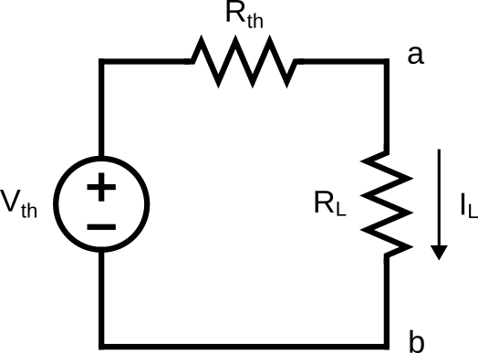

# Lab 5 : Thévenin Circuit

Seneca Polytechnic 
SES250 Electromagnatics

## Purposes
- To become familiar with measurement techniques of direct current (DC)
- To study the relationship between voltage, resistance, and current
- To understand and verify Thévenin Theorem

## Objectives
- Assemble electronic components onto a breadboard
- Measure voltage and current from a breadboard using a digital multimeter (DMM)

## Important Rules for this Lab

<ol>
<li>Any signal (voltage, current) must be adjusted to the specified value (amplitude and/or frequency) <strong>before</strong> applying them to a circuit.</li>
<li>An instrument must be set up for the required mode of operation <strong>before</strong> it is connected to a circuit.</li>
<li>The power supply must be switched off <strong>before</strong> making any changes to the circuit.</li>
</ol>

## Description

If you don't remember how to operate the DMM and read the resistor colour band, refer to the description section of [Lab 2](lab2.md).

### Thévenin Theorem

Thévenin theorem is a method often used to simplify circuit analysis from a complex circuit to a simpler one with only a Thévenin voltage source in series with a Thévenin resistor.

Any linear electrical network containing only voltage sources, current sources and resistances can be replaced at terminals A–B by an equivalent combination of a voltage source \(V_{th}\) in a series connection with a resistance \(R_{th}\).

***Figure 5.1** Thévenin equivalent circuit*

1. The equivalent voltage \(V_{th}\) is the voltage obtained at terminals A–B of the network with terminals A–B open-circuited.
1. The equivalent resistance \(R_{th}\) is the resistance that the circuit between terminals A and B would have if all ideal voltage sources in the circuit were replaced by a short circuit and all ideal current sources were replaced by an open circuit.
1. If terminals A and B are connected to one another, the current flowing from A and B will be \(V_{th} over R_{th}\). This means that \(R_{th}\) could alternatively be calculated as \(V_{th}\) divided by the short-circuit current between A and B when they are connected together.

Source: [Wikipedia: Thévenin's theorem](https://en.wikipedia.org/wiki/Th%C3%A9venin%27s_theorem)

## Materials
- Safety glasses (PPE)
- [Lab Supplies](supplies.md)
    - Breadboard
    - Jumper Wires
    - (2x) 100Ω Resistor (brown-black-brown)
    - (2x) 330Ω Resistor (orange-orange-brown)
    - (2x) 1kΩ Resistor (brown-black-red)
    - (1x) 4.7kΩ Resistor (yellow-purple-red)
    - (2x) 10kΩ resistor (brown-black-orange)

## Preparation

> **Lab Preparation Question:**
>
> 1. Read and summarize the lab as necessary.
> 1. Copy observation table 1 and 2 of this lab into your notebook.
> 1. Sketch a breadboard diagram of Figure 5.2 and Figure 5.3 onto your notebook for measuring:
    >
    >   - \(I_L\)
    >   - \(V_{ab}\) (or the potential difference between \(V_a\) and \(V_b\))
    >
>
> 1. Use KCL or KVL to calculate the estimated values for \(I_L\), \(V_{ab}\) in Figure 5.2 then fill in the appropriate cell in the observation table 1. Perform the calculation using 100Ω, 330Ω, 1kΩ, and 10kΩ for \(R_L\).
> 1. Find the Thévenin equivalent circuit for Figure 5.2 then choose the closest resistor you have to \(R_{th}\) for Part 2 of the lab.
> 1. Use Thévenin Theorem to calculate the estimated values for \(I_L\) in Figure 5.3 for each of the \(R_L\) values in Part 1 then fill in the appropriate cell in the observation table 2.

## Procedures

For this lab, you'll be using the same circuit as the one from Lab 4 but you'll be varying the value of the load resistor to understand the concept of Thévenin Circuit. Use 1kΩ for \(R_L\).

***Figure 5.2***

### Part 1: \(I_L\) and \(V_{ab}\) for various \(R_L\)

1. Assemble the circuit above as how you've prepare in your pre-lab. Replace the \(R_L\) resistor with the various value on the table below then measure current \(I_L\) and \(V_{ab}\) for each value.
1. Turn on the power supplies then write down your measurement into the observation table.

    > **Lab Question 1:** Write down the measured current into the appropriate cell in the table below.
    >
    > **Tabel 1: \(R_L\) Observation Table:**
    >
    > |\(R_L\)|Estimated \(I_L\)|Estimated \(V_{ab}\)|Measured \(I_L\)|Measured \(V_{ab}\)|
    > |---|---|---|---|---|
    > |100Ω|||||
    > |330Ω|||||
    > |1kΩ|||||
    > |10kΩ|||||

1. Turn off the output of the power supplies then repeat the measurement above for all \(R_L\) values.

1. DO NOT disassemble the circuit.

### Part 2: Thévenin Equivalent Circuit

1. Next, assemble the Thévenin circuit given below with the resistor value you calculate in the pre-lab. Start with 1kΩ for \(R_L\). Assemble it beside the circuit from Part 1.

    

    ***Figure 5.3***

1. Apply the Thévenin voltage you calculated from the pre-lab then turn on the power supplies. Write down your measurement in the observation table.

    > **Lab Question 2:** Write down the measured current into the appropriate cell in the table below.
    >
    > **Table 2: Thévenin Circuit Observation Table:**
    >
    > |\(R_L\)|Measured \(I_L\)|Measured \(V_{ab}\)|Power Dissipated|
    > |---|---|---|---|
    > |100Ω||||
    > |330Ω||||
    > |1kΩ||||
    > |10kΩ||||

1. Turn off the output of the power supplies then repeat the measurement above for all \(R_L\) values.

    > **Lab Question 3:** Does the value agree closely with the original circuit? Note that the \(R_{th}\) you've chosen might not exactly match the theoretical \(R_{th}\).

    > **Lab Question 4:** Calculate the power dissipation \(P = IV\) by the load resistor in each case. Which resistor dissipated the most power? This is the load resistor value that allow for the maximum amount of power to be transferred from the voltage source to the load (Maxium Power Transferred).

1. DO NOT DISASSEMBLE YOUR CIRCUIT UNTIL YOUR LAB HAS BENN MARKED BY THE INSTRUCTOR.

Once you've completed all the above steps, ask the lab professor or instructor over and demostrate that you've completed the lab and written down all your observations. You might be asked to explain some of the concepts you've learned in this lab.