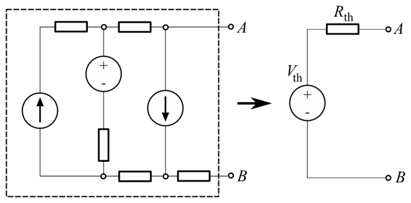
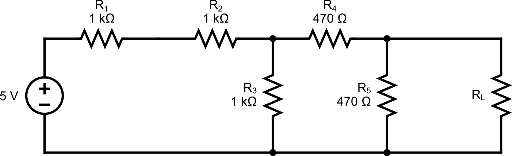

# Lab 6 : Thévenin Circuit

Seneca College 
SES250 Electromagnatics

## Objectives
- To understand and verify Thévenin's theorem

## Purpose
- Assemble electronic components onto a breadboard and measure current and voltage using a DMM

## Important Rules for this Lab

<ol>
<li>Any signal (voltage, current) must be adjusted to the specified value (amplitude and/or frequency) <strong>before</strong> applying them to a circuit.</li>
<li>An instrument must be set up for the required mode of operation <strong>before</strong> it is connected to a circuit.</li>
<li>The power supply must be switched off <strong>before</strong> making any changes to the circuit.</li>
</ol>

## Description

Thévenin theorem is a method often used to simplify circuit analysis from a complex circuit to a simple with only a Thévenin voltage source in series with a Thévenin resistor.

Any linear electrical network containing only voltage sources, current sources and resistances can be replaced at terminals A–B by an equivalent combination of a voltage source \(V_{th}\) in a series connection with a resistance \(R_{th}\).

Source: [Wikipedia: Thévenin's theorem](https://en.wikipedia.org/wiki/Th%C3%A9venin%27s_theorem)

1. The equivalent voltage \(V_{th}\) is the voltage obtained at terminals A–B of the network with terminals A–B open-circuited.
1. The equivalent resistance \(R_{th}\) is the resistance that the circuit between terminals A and B would have if all ideal voltage sources in the circuit were replaced by a short circuit and all ideal current sources were replaced by an open circuit.
1. If terminals A and B are connected to one another, the current flowing from A and B will be \(V_{th} over R_{th}\). This means that \(R_{th}\) could alternatively be calculated as \(V_{th}\) divided by the short-circuit current between A and B when they are connected together.

## Materials

- (1x) 330Ω
- (2x) 470Ω
- (4x) 1kΩ
    - or (3x) 1kΩ and (1x) 2kΩ
- Breadboard
- Jumper wires

## Preparation

> **Lab Preparation Question:**
>
> 1. Using the circuit shown in Figure 6.2, calculate the Thevenin voltage \(V_{th}\) and resistance \(R_{th}\) of the circuit by removing \(R_L\).
>
> 1. Sketch the breadboard below onto your notebook then draw how the components will be connected to the breadboard according to the circuit shown in Figures 6.2 and 6.3. Clearly show which tie point will the wire, resistor and power supply be attached to.
>
    >    
>
> 1. Copy the observation tables found in this lab into your notebook.
>

## Procedures

In this part of the lab, we will be exploring resistors in parallel and series configurations.

1. Obtain the necessary resistors, a breadboard and a few jumper wires. If a resistor value is not available, use resistors of very similar value.
    - If a 2 kΩ resistor is available, \(R_1\) and \(R_2\) can be combined and replaced with the 2 kΩ resistor.

1. Turn on the DMM at your workbench and turn it to the “Ω 2W” resistance measurement mode. Measure and record the resistance of each resistor.

    > **Lab Question 1:** Record the resistance (at least 3 S.F.) of each resistor in the table below:
    >
    > ||\(R_1\) (1kΩ)|\(R_2\) (1kΩ)|\(R_3\) (1kΩ)|\(R_4\) (470Ω)|\(R_5\) (470Ω)|\(R_L\) (1kΩ)|
    > |---|---|---|---|---|---|---|
    > |Measured Resistance [Ω]|||||||

1. Assemble the circuit shown below then measure the current through the load resistor.

    **REMEMBER:** To measure current, the digital multimeter needs to be in DC current mode (DCI) to act as an ammeter. An ammeter needs to be connected in series with a resistor to measure the current.
    
    

    ***Figure 6.2***

    > **Lab Question 2:** Record the measured values in the table below by supplying the circuit with 5V.
    >
    > ||\(I_{R_L}\)|
    > |---|---|
    > |Current through resistors||
    >
    > **Lab Question 3:** Does the measured value agree with the value you calculated in the pre-lab? What is the percentage error? Is it within the tolerance of the resistor?

1. From the pre-lab, you should've calculated the \(V_{th}\) and \(R_{th}\) for the circuit above. Obtain a resistor that's very close to the \(R_{th}\) value you calculated.

    > **Lab Question 4:** Record the resistance (at least 3 S.F.) of each resistor in the table below:
    >
    > ||\(R_{th}\)|
    > |---|---|
    > |Measured Resistance [Ω]||

1. Assemble the Thevenin circuit shown below.

    **REMEMBER:** To measure current, the digital multimeter needs to be in DC current mode (DCI) to act as an ammeter. An ammeter needs to be connected in series with a resistor to measure the current.
    
    

    ***Figure 6.3***

1. Set the DC power supply to the \(V_{th}\) value you calculated in the pre-lab then turn it on to measure the current through the load resistor.

    > **Lab Question 5:** Record the measured values in the table below by supplying the circuit with \(V_{th}\).
    >
    > ||\(I_{R_L}\)|
    > |---|---|
    > |Current through resistors||
    >
    > **Lab Question 6:** Does the measured value agree with the value you calculated in the pre-lab and the value you obtained earlier? What is the percentage error?

Once you've completed all the above steps, ask the lab professor or instructor over and demostrate you've completed the lab and written down all your observation. You might be asked to explain some of the concepts you've learned in this lab.

## Post-Lab

1. Using the skills and knowledge acquired from this lab, answer the post-lab question(s) on blackboard. Due one week after the lab.