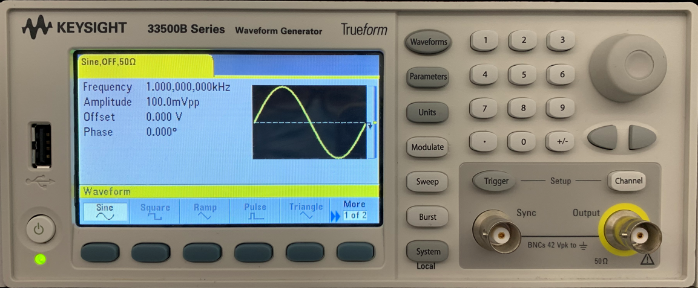
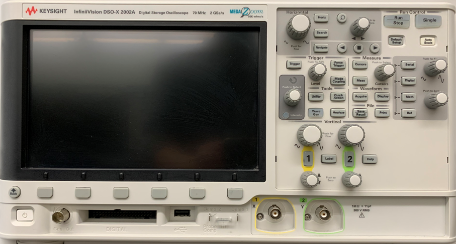
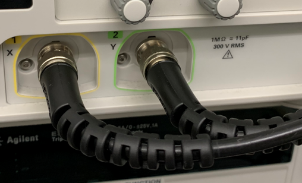
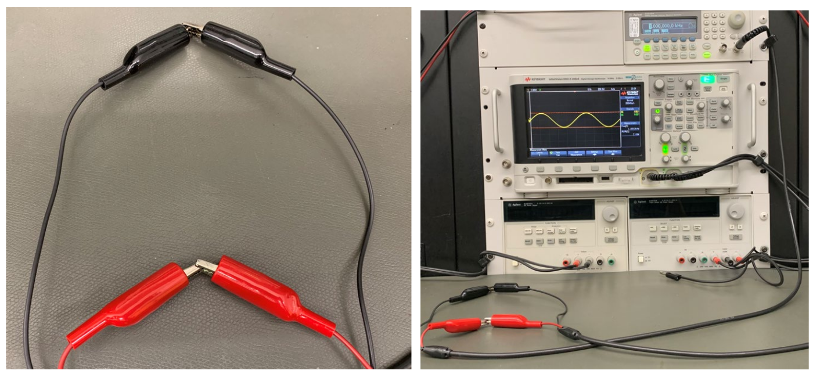
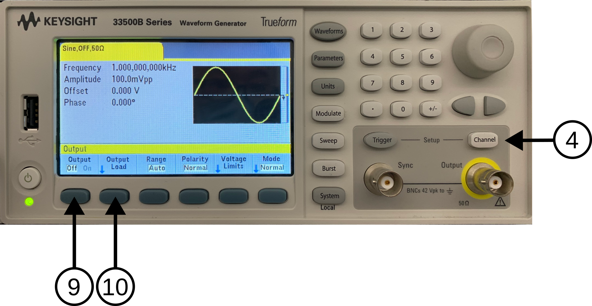
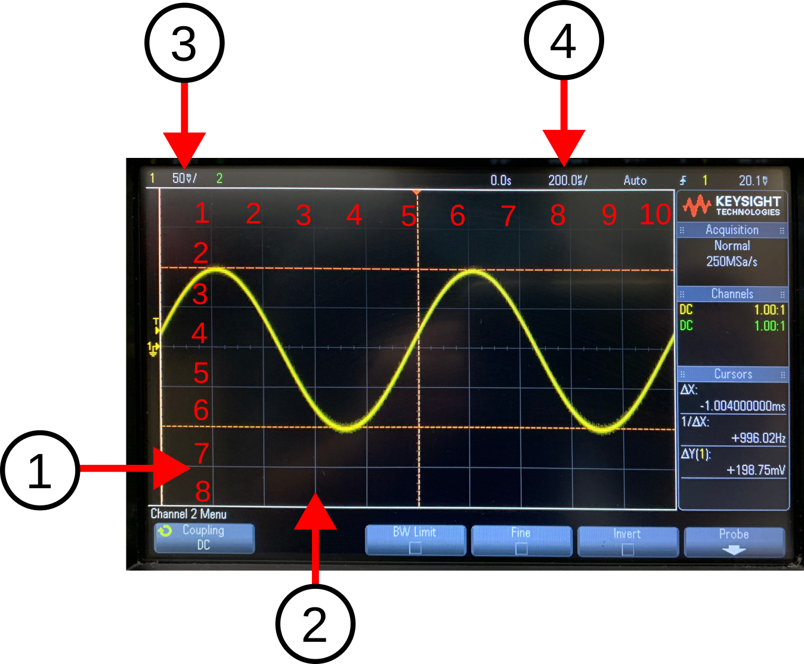

# Lab 6 : Digital Storage Oscilloscope (DSO)

Seneca Polytechnic 
SES250 Electromagnatics

## Purpose
- To learn how to operate the function generator and digital storage oscilloscope (DSO)

## Objectives
- Generate waveform using a function generator
- Measure waveform using a digital storage oscilloscope (DSO)

## Important Rules for this Lab

<ol>
<li>Any signal (voltage, current) must be adjusted to the specified value (amplitude and/or frequency) <strong>before</strong> applying them to a circuit.</li>
<li>An instrument must be set up for the required mode of operation <strong>before</strong> it is connected to a circuit.</li>
<li>The power supply and/or the function generator must be switched off <strong>before</strong> making any changes to the circuit.</li>
</ol>

## Description

### Function Generator

A function generator is a piece of electronic test equipment or software used to generate different types of electrical waveforms over a wide range of frequencies. Some of the most common waveforms produced by the function generator are the sine wave, square wave, triangular wave, and sawtooth shapes. These waveforms can be either repetitive or single shots.

***Figure 6.1** Keysight 33500B Function Generator*

In the electronics lab, you will be using a Keysight 33500B (or similar) Function Generator. Its manual can be found here: [Function Generator Manual](lab6-FG-manual.pdf)

Source: [Wikipedia: Function Generator](https://en.wikipedia.org/wiki/Function_generator)

Reference Video: [How to Use A KEYSIGHT E33220A Function Generator to Generate A Sine Wave](https://youtu.be/nHpp30vARBY)

### Digital Storage Oscilloscope (DSO)

An oscilloscope, or DSO (for the more modern digital storage oscilloscope), is a type of electronic test instrument that graphically displays varying signal voltages, usually as a calibrated two-dimensional plot of one or more signals as a function of time. The displayed waveform can then be analyzed for properties such as amplitude, frequency, rise time, time interval, distortion, and others. Originally, the calculation of these values required manually measuring the waveform against the scales built into the screen of the instrument. Modern digital instruments may calculate and display these properties directly.

***Figure 6.2** Keysight 33500B Function Generator*

In the electronics lab, you will be using a Keysight DSO-X 2002A (or similar) Digital Storage Oscilloscope. Its manual can be found here: [DSO Manual](lab6-DSO-manual.pdf)

Source: [Wikipedia: Oscilloscope](https://en.wikipedia.org/wiki/Oscilloscope)

## Materials

## Preparation

> **Lab Preparation Question:**
>
> 1. List 5 waveform that can be generated by the function generator used in this lab.
> 1. Read through the lab manual and list the button(s) that you need to press to turn the output of the function generator on and off.
> 1. In your own word, explain the difference between the 50Ω and High-Z output mode of the function generator used in this lab.

## Procedures

1. Identify the Digital Oscilloscope at your workbench. Disconnect any cable plugged into it so it is as shown below.

    

    ***Figure 6.3***

1. Turn on the oscilloscope with the power button (8.3-1) if it is not already on.
1. Identify the two cables with a BNC connector beside the oscilloscope. Connect the BNC cables to the CH1 (8.3-4) and CH2 connectors of the oscilloscope as shown.

    

    ***Figure 6.4***

1. Press the **CH1** On/Off button (6.3-6) so CH1 is on (button lights up green).
1. Press the **CH2** On/Off button so CH2 is off (no light showing at the button). The bright lines on the DSO display the waveform of the signal as a function of time. When there is no signal, the waveform is a flat line. If you don't see a flat line, that means your DSO is displaying amplified electronic noise from the environment. Don't worry if you don't see a flat line for this step of the lab.

    > **Lab Question 1:** How many signal line(s) (6.3-13, bright solid horizontal line) do you see on the display? What is the colour of the line(s)?

1. Press the **CH2** On/Off button to turn CH2 on (button lights up green) then press the Auto Scale button (6.3-9) again.

    > **Lab Question 2:** How many signal line(s) do you see on the display? What is the colour of the line(s)?

1. You can adjust the vertical position of those signal lines for measurement or display purposes. Turn the CH1 vertical position knob (6.3-5) until the CH1 signal line is reasonably lined up vertically centred on the display.
1. Try changing the vertical position of the CH2 signal line as well. Afterward, line up both signal lines vertically centred on the display. One line will be on top of the other line.
1. Modern DSOs are complex test instruments with a lot of functionality. It is a very useful tool once you understand how to use it. The more you use and play with the tool, the more familiar you'll get. Turn off CH2.
1. Identify the Function Generator at your workbench. Disconnect any cable plug into it so it is as shown below.

    

    ***Figure 6.5***

1. Identify the cable with a BNC connector beside the function generator and connect it to the Output of the function generator (6.5-3). Afterward, push the power button (6.5-1) to turn on the function generator.
1. After the function generator is turned on, we'll set up a 1kHz Sine wave, press the Waveforms button (6.5-7) and select Sine waveform mode from button menus (6.5-2).
1. Then press the Parameters button (6.5-8) and use the keypad, digit selector buttons (6.5-5), and the adjustment knob (8.5-6) to set the following:
    - **Frequency:** 1.000 kHz (**Note: pay attention to the number of 0s in kHz** You can adjust the Units as necessary.)
    - **Amplitude:** 100.0 mVpp (default setting)
    - **Offset:** 0.000 V (default setting)
    - **Phase:** 0° (default setting)
1. Identify the cable connected to the function generator and the alligator clips at the end of the cable connected to **CH1** of the oscilloscope. Connect the two red alligator clips together and connect the two black alligator clips together.

    
WARNING: Ensure the exposed portion of the red alligator clip is NOT touching the exposed portion of the black alligator clip.

    

    ***Figure 6.6***

1. Once the cables are connected and the waveform is set, push the channel button on the function generator (6.7-4) then turn the output to “On” (6.7-9).

    

    ***Figure 6.7***

1. You should now see some signal on the DSO. If not, push the Auto Scale button on the oscilloscope (8.3-9). You should see a waveform that is similar to that shown in the figure below.

    

    ***Figure 6.8***

1. Turn the time division knob (6.3-12) and the horizontal position knob (6.3-11) a few ticks clockwise then counter-clockwise.

    > **Lab Question 3:** What effect do the time division knob and the horizontal position knob have on the waveform?

1. The grey-white vertical lines (6.8-2) on the oscilloscope chart are called time division lines and the top right of the display shows the time divisor (6.8-4). In the figure above, the time divisor is set to 200.0μs/ which means each time division line represents 200.0μs in the time domain. The are a total of 10 time divisions in the display.

    > **Lab Question 4:** Find two peaks in the signal waveform then count the number of time divisions in each period of the sine wave. Afterward, calculate the frequency of the sine wave using: \(f = 1 / T\) where \(f\) is the frequency in [Hz] and \(T\) is the period in [s]. Does it agree with the output of the function generator? You can adjust the horizontal position of the sine wave with the horizontal position knob to help with counting if necessary.

1. Change the output of the function generator to a different frequency such as 500Hz and another waveform such as square and triangle then see how it is displayed on the oscilloscope. Afterward, put the function generator back to a sine wave at 1kHz.

1. Press the Measurement (Meas) button (6.3-8) on the oscilloscope. In the measurement menu that shows up, use the menu buttons (6.3-2) and menu selector knob (6.3-3) to clear all measurements with the Clear Meas option. Then, add Frequency (Freq) and peak-to-peak voltage (Pk-Pk) for measurement. Ensure the Source channel is set to 1 at the lower left corner of the menu. The two measurements should now show up in the measurement list on the right-hand side. If a mistake is made, press Clear Meas to remove a measurement.

    > **Lab Question 5:** Does the frequency measurement agree with your calculation above?

1. Turn the time division knob slowly so the waveform expands and compresses horizontally. Turn it from 10 periods to only a portion of the waveform shown.

    > **Lab Question 6:** At what time divisor does the measurement starts to become invalid? How many periods of the waveform are shown when it becomes invalid? What comment can you make on how the oscilloscope calculates the freq measurement (in terms of the waveform required to be displayed on the screen)?

1. The grey-white horizontal line (6.8-1) on the oscilloscope display is called a voltage division line and at the top left of the display shows the voltage divisor (6.8-3). In the figure above, 50.0mV/ means each line represents 50.0mV in the voltage range. The are a total of 8 voltage divisions in the display.

    > **Lab Question 7:** Find the peak and the trough of the signal waveform. Count the number of voltage divisions from the peak to the trough of the sine wave then calculate the peak-to-peak voltage of the sine wave. Does it agree with the peak-to-peak voltage (Pk-Pk) value in the measurement list?

    > **Lab Question 8:** Is this peak-to-peak voltage (Pk-Pk) value the same or different from the peak-to-peak voltage amplitude (Vpp) value you set at the function generator earlier? Describe how are they the same or different.

1. Turn off the output of the function generator. Reminder: Press the Channel button then Output Off.
1. Afterward, press the Output Load button (6.7-10) and change the setting to "High-Z". If you are using the 33220A, the High-Z setting is in Utility > Output Setting.
1. Then change the amplitude of the Sine wave to 3 Vpp. Reminder: press “Parameters” to access the settings. Keep the Offset and Phase at 0.
1. Turn on the output of the function generator.
1. You should now see a 3 V peak-to-peak signal on the oscilloscope. Adjust the voltage division knob (6.3-7) so the sine wave will fit into the screen again.

    > **Lab Question 9:** What is the voltage divisor value used to achieve this? Then, count the number of voltage divisions or read from the measurement list to find the peak-to-peak voltage of the signal. How does your result compare to the result in the measurements list and to the output setting of the function generator?
    
    [Read here](https://edadocs.software.keysight.com/kkbopen/why-your-function-generator-outputs-twice-the-programmed-voltage-589745012.html) for an explanation of why there's a difference in output value when using difference output mode.
    
    **NOTE:** Press the CH1 button (6.3-6) and ensure the “Coupling” setting on the oscilloscope at the lower left corner of the display is set as “DC” and the “Probe” setting at the lower right corner is selected as “1X” If not, correct them by pressing and selecting the respective settings and change them with the selector knob (6.3-3). The knob can be turned and pressed.

1. Adjust the settings so that at least three but no more than ten periods are showing on the DSO display and at least four voltage divisions of peak-to-peak voltage. Change the output parameters of the function generator and repeat the scaling process so you are competent with manually scaling an oscilloscope.

    > **Lab Question 10: (During-Lab)** Demostrate to the lab professor or instructor that you are competent in generating a wave signal from the function generator and manually scaling (non-using auto scale) the display of an oscilloscope to view such signal.

1. Turn off the function generator and disconnect the alligator clips.

Once you've completed all the above steps, ask the lab professor or instructor over and demostrate you've completed the lab and written down all your observation. You might be asked to explain some of the concepts you've learned in this lab.