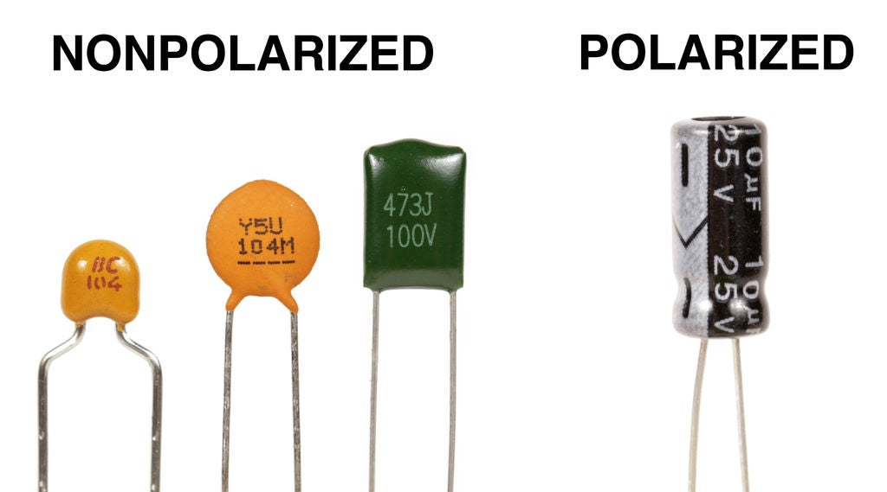
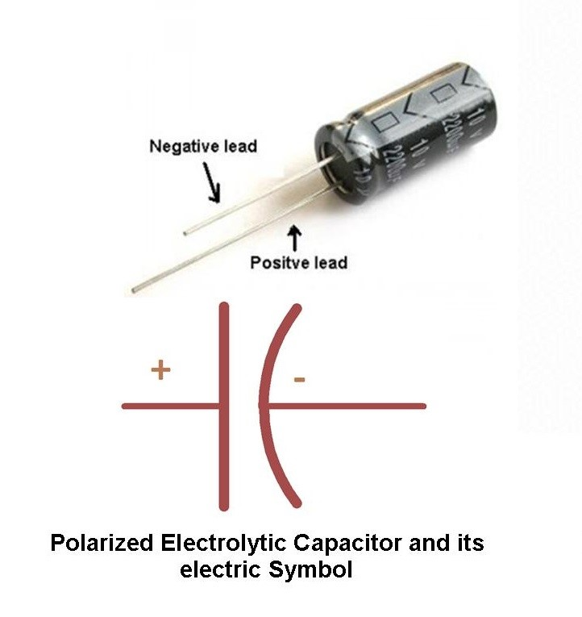
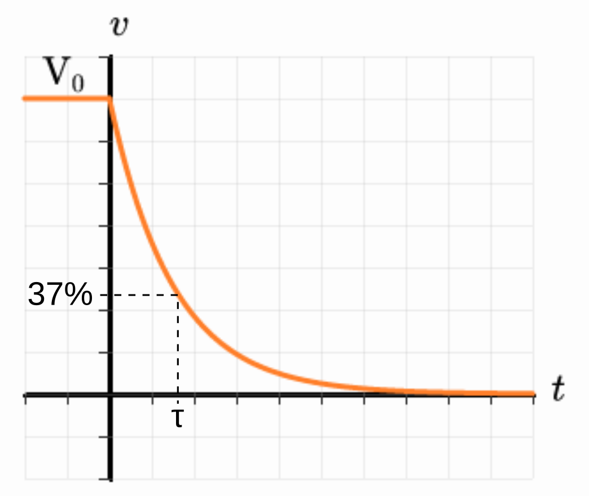
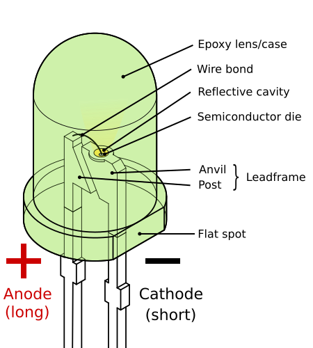
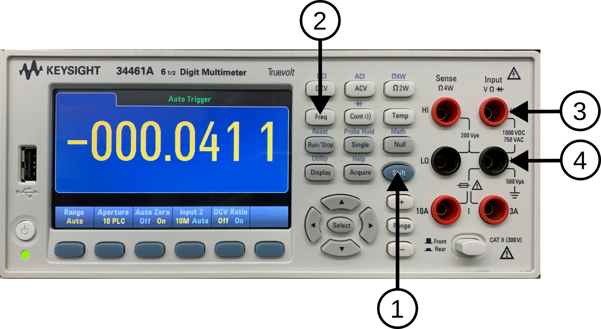
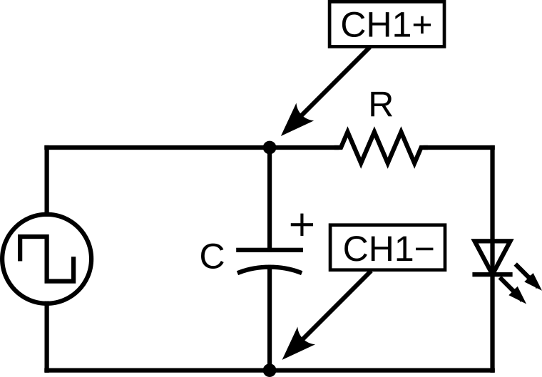
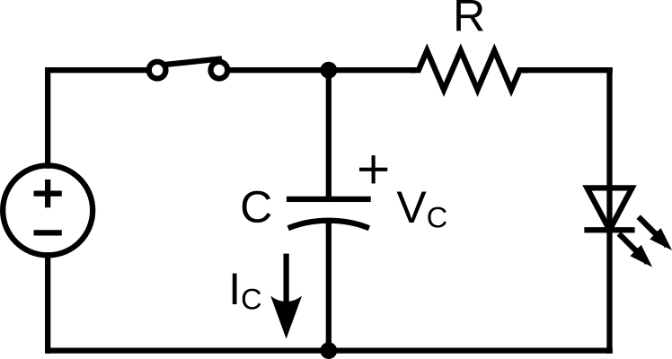
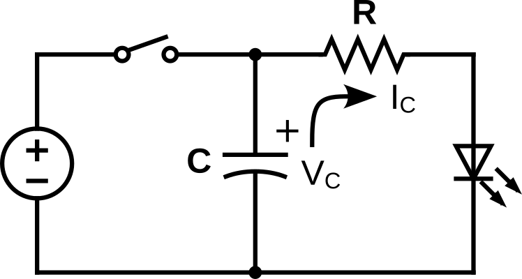

# Lab 7 : Capacitor and RC Circuit

Seneca Polytechnic 
SES250 Electromagnatics

## Purposes
- To understand the relationship between the voltage and capacitance of a capacitor
- To understand the discharging and charging of a capacitor

## Objectives
- Assemble electronic components onto a breadboard
- Measure the capacitance of a capacitor using a digital multimeter (DMM)
- Measure the response of an RC circuit using a Digital Storage Oscilloscope (DSO)

## Important Rules for this Lab

<ol>
<li>Any signal (voltage, current) must be adjusted to the specified value (amplitude and/or frequency) <strong>before</strong> applying them to a circuit.</li>
<li>An instrument must be set up for the required mode of operation <strong>before</strong> it is connected to a circuit.</li>
<li>The power supply must be switched off <strong>before</strong> making any changes to the circuit.</li>
</ol>

## Description

### Capacitor

A capacitor is an electronic device for storing electrical energy, consisting of two conductors in close proximity and insulated from each other. A simple example of such a storage device is the parallel-plate capacitor. If positive charges with total charge +Q are deposited on one of the conductors and an equal amount of negative charge −Q is deposited on the second conductor, the capacitor is said to have a charge Q.

Source: [Britannica: capacitor](https://www.britannica.com/technology/capacitor)

The capacitance of a parallel plate capacitor can be calculated using:

$$ C = {{\epsilon_0 A} \over {s}} $$

where \(\epsilon_0\) is the permittivity in vacuum and have a value of \(\epsilon_0 = {8.854 \times 10^{-12} {Nm^2 \over C^2}}\), \(A\) is the area of the plates, and \(s\) is the distance between the plates.

Similar to resistors, capacitors use special markings to indicate their values. Since the amount of area for markings on a capacitor is limited, there is also a set of rules for specifying the capacitance value of a capacitor. Manufacturers often use two separate lines for their capacitor markings and these have the following meanings:

- First line: capacitance (in pF or μF) [and tolerance (J=5%, K=10%, M=20%)]
- Second line: rated DC voltage [and code for the dielectric material]

For a ceramic capacitor, often only a three-digit code is given. The first two digits correspond to the first two digits of the value whilst the third digit is a multiplier which gives the number of zeros to be added to give the value in pF. For example, 104 means 10 x 104 pF = 100nF.

Furthermore, some capacitors such as electrolytic capacitors are marked with symbols (“+” and “-”) to indicate the correct polarity. **Failure to observe these markings when connecting a capacitor to a circuit can be catastrophic!**

***Figure 7.1 Various Capacitor Markings***

***Figure 7.2 Non-polarized vs Polarized Capacitor***

***Figure 7.3 Polarized Capacitor Leads***

Source: [Capacitor Markings](https://www.matrixtsl.com/courses/ecc/index.php?n=Capacitors.CapacitorMarkings)

Source: [What Is Non-polarized Capacitor](https://www.jakelectronics.com/blog/what-is-non-polarized-capacitor)

Reference Video: [How to Use A KEYSIGHT E34461A DMM to Measure Capacitance](https://youtu.be/Wf_aqRgdtww)

### RC Circuit

A resistor-capacitor circuit (RC circuit), RC filter or RC network, is an electric circuit composed of resistors and capacitors. It may be driven by a voltage or current source and these will produce different responses. A first-order RC circuit is composed of one resistor and one capacitor and is the simplest type of RC circuit.

***Figure 7.4 Series RC circuit***

A series RC circuit with a capacitor that is initially charged to \(V_0 = {Q_0 \over C}\) and then allowed to discharge through a resistor \(R\) will exhibit the following relationship for the voltage across the capacitor over some time:

$$ V_C(t) = V_0 e^{(-{t \over {RC}})} $$

where \(V_0\) is the capacitor voltage at \(t = 0\)

The time required for the voltage to fall to \(V_0 e^{-1}\) or about 37% (roughly 1/3 of \(V_0\)) is called the RC time constant and is given by:

$$ \tau = RC $$

where \(\tau\) is measured in seconds, \(R\) in ohms and \(C\) in farads.

The chart below shows a typical curve of the voltage across the capacitor during discharge in an RC circuit.

***Figure 7.5 Voltage curve of a capacitor during discharge in an RC circuit***

Source: [Wikipedia: RC Circuit](https://en.wikipedia.org/wiki/RC_circuit)

## Light-emitting diode (LED)

A light-emitting diode (LED) is a semiconductor device that emits light when current flows through it. Electrons in the semiconductor recombine with electron holes, releasing energy in the form of photons. The color of the light (corresponding to the energy of the photons) is determined by the energy required for electrons to cross the band gap of the semiconductor.White light is obtained by using multiple semiconductors or a layer of light-emitting phosphor on the semiconductor device.

 

***Figure 7.6 Left: The flat spot of the LED indicate the Cathode (-) lead. Right: LED Electronic Symbol.***

Source: [Wikipedia: Light-emitting diode](https://en.wikipedia.org/wiki/Light-emitting_diode)

## Materials
- Safety glasses (PPE)
- [Lab Supplies](supplies.md)
    - Breadboard
    - Jumper Wires
    - (1x) 1kΩ Resistor (brown-black-red)
    - (1x) 10kΩ resistor (brown-black-orange)
    - (1x) 100nF Ceramic Capacitor (usually orange with 104 marking)
    - (1x) 10μF Electrolytic Capacitor (usually blue or black with 10μF marking)
    - (1x) 100μF Electrolytic Capacitor (usually blue or black with 100μF marking)

## Preparation

> **Lab Preparation Question:**
>
> 1. Read and summarize the lab as necessary.
> 1. Copy observation tables 1, 2 and 3 of this lab into your notebook.
> 1. Sketch a breadboard diagram of Figure 7.8 onto your notebook.
> 1. Calculate the theoretical RC time constant (τ) for each combination of R-C in Table 2.
> 1. Calculate the voltage at τ if the initial voltage of an R-C circuit is 1V. Show all calculations.
> 1. Derive the formula for the current through the resistor in an RC circuit.

## Procedures

### Part 1: Measuring Capacitance

In this part of the lab, we will be exploring the capacitance of a capacitor.

1. Turn on a DMM and set it to capacitance mode by pressing the SHIFT (1) + Freq (2) button (to access the -||- mode) then release. Ensure the alligator clips are connected to the terminals labelled “HI” under “Input VΩ►|” (3) and “LO” under “Input VΩ►|” (4).

    

    ***Figure 7.7***

    > **Lab Question 1:** Without connecting the cable to anything, record the capacitance with the alligator clip not connected to anything. This is the capacitance due to just the cable (open circuit capacitance).
    >
    > **Table 1**
    >
    > |Capacitor #|Cable Capacitance (μF)|Marked C (μF)|Measured C with Cable (μF)|Measured C (μF)|
    > |---|---|---|---|---|
    > |1|||||
    > |2|||||
    > |3|||||
    >
    > Marked C (μF) = marking on the capacitor
    > Measured C (μF) = Measured C with Cable (μF) - Cable Capacitance (μF)

1. Acquire a 100nF Capacitor (usually small and orange with marking 104 for 10 x 10^4 pF) then connect the two leads of the capacitor to the DMM.

    > **Lab Question 2:** Record the capacitance. Remember, this is the capacitance with the cable.
    >
    > **Lab Question 3:** Subtract the cable capacitance from the value to get the capacitor capacitance. Record this into the table 1.

1. Acquire a 10μF Capacitor (usually round cylindrical with marking 10μF) then connect the two leads of the capacitor to the DMM per the polarity of the capacitor. The red clip is connected to the (+) lead and the black clip is connected to the (-) lead.

    

    
<strong>INCORRECT CONNECTION AGAINST THE POLARIZATION OF THE CAPACITOR CAN BE CATASTROPHIC!</strong>

    

    > **Lab Question 4:** Record the capacitance into the table 1. Repeat for a 100μF Capacitor.

1. Disconnect the DMM and the capacitor.

### Part 2: RC Circuit

In this part of the lab, we will be exploring the transient response (discharging and charging) of an RC circuit. A function generator set to square wave output will act as the closing and opening of the circuit.

***Figure 7.8***

When the function generator's output is positive relative to the negative terminal (similar to the DC circuit below with the switch CLOSED), it is charging the capacitor. During this period, the voltage across the capacitor will raise to the same voltage as the output of the function generator.

***Figure 7.9***

When the function generator's output is the same relative to the negative terminal (similar to the DC circuit below with the switch OPEN), no more current is supplied by the function generator. During this period, the voltage across the capacitor will drop as it is discharging by the series RC circuit with the LED.

***Figure 7.10***

1. Obtain a 1kΩ resistor, 10kΩ resistors, a breadboard, a LED and a few jumper wires. You should also have the capacitor you worked with earlier.

    > **Lab Question 5:** Measure the resistance value of your resistor and record it in Table 2. Refer to [Lab 2](lab2.md) if you don't remember how to measure resistance. Copy your measured capacitor value from above and insert it into Table 2 as well.
    >
    > **Table 2**
    >
    > |Resistor|Capacitor|Measured R (kΩ)|Measured C (μF)|RC Constant (τ) (ms)|
    > |---|---|---|---|---|
    > |1kΩ|10μF||||
    > |1kΩ|100nF||||
    > |10kΩ|100nF||||
    >
    > **Lab Question 6:** Calculate the RC time constant τ = RC for each of the configuration above.

1. Set up your circuit as per Figure 7.8 using a 1kΩ resistor and a 10μF capacitor on a breadboard with CH1 of the DSO measuring the voltage across the capacitor. Pay attention to the direction / polarity of the LED. The transient current through can only be estimated using the voltage across the capacitor in this configuration. However, the current can also be observed using the LED as it will light up when there are current. Additionally, the LED also act as a reverse current protection for the polarized capacitor.

    

    
<strong>INCORRECT CONNECTION AGAINST THE POLARIZATION OF THE CAPACITOR CAN BE CATASTROPHIC!</strong>

    

1. Turn on the function generator and set the output to **High-Z output mode**. Afterward, set the output to a 3Vpp square wave at 10Hz **with a 3V DC Offset**. Leave all other settings as default. Refer to [Lab 6](lab6.md) if you don't remember how to use a function generator.

    

    
<strong>Ensure the function generator is in High-Z mode and set to 3V DC offset</strong>

    

1. Turn on the DSO and adjust the settings to zoom into the falling edge of the square wave so you'll see a single period of the RC waveform similar to Figure 7.5. Remember, the function generator is simulating the closing and opening of the circuit at 10Hz. Refer to [Lab 6](lab6.md) if you don't remember how to use a function generator.

    > **Lab Question 7:** Using the grid line or the measurement tool, find the time it takes for the voltage to drop 67% from the maximum and record it as the measured RC time constant.
    >
    > **Table 3**
    >
    > |Resistor|Capacitor|Calculated τ (ms)|Measured τ (ms)|% Error|
    > |---|---|---|---|---|
    > |1kΩ|10μF||||
    > |1kΩ|100nF||||
    > |10kΩ|100nF||||
    >
    > **Lab Question 8:** Calculate the percentage error of the estimated and measured RC time constant.

1. Repeat step 2 with the various values of resistors and capacitors. Adjust the period (by adjust the frequency) of the function generator output so it is about 5-10x the RC time constant for best result in measurement.

    > **Lab Question 9:** What do you observe regarding the RC time constant as the resistor and the capacitor value increase and decrease?

    > **Lab Question 10:** What do you observe from the LED in term of the charging / discharging cycle of the capacitor? Remember, where there are current, the LED will turn on.

1. DO NOT DISASSEMBLE YOUR CIRCUIT UNTIL YOUR LAB HAS BENN MARKED BY THE INSTRUCTOR.

Once you've completed all the above steps, ask the lab professor or instructor over and demostrate that you've completed the lab and written down all your observations. You might be asked to explain some of the concepts you've learned in this lab.