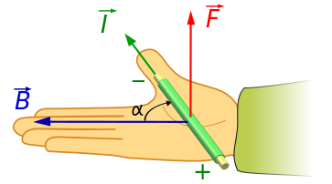
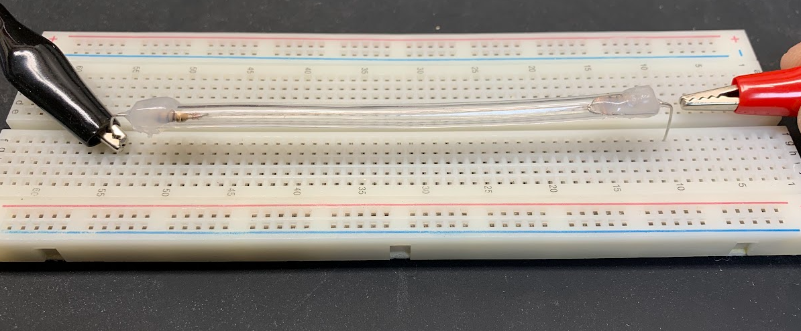

# Lab 7 : Magnetic Force

Seneca College 
SES250 Electromagnatics

## Objectives
- To observe the magnetic force on a current-carrying conductor
- To observe the magnetic force created by a solenoid

## Purpose
- Perform qualitative observation on the force created by a magnetic field on a currency
- Measure the force created by a solenoid with an applied current

## Important Rules for this Lab

<ol>
<li>Some of the tools used in this lab are VERY FRAGILE! Do not touch any thin wires as they can break easily.</li>
<li>Do NOT connect any coil or solenoid for a prolonged period as they can get hot and burnt.</li>
<li>The power supply must be switched off <strong>before</strong> making any changes to the circuit.</li>
</ol>

## Description

Moving charges experience a force in a magnetic field. If these moving charges are in a wire — that is, if the wire is carrying a current — the wire [will] also experience a force.

Source: [University Physics Volume 2: Chapter 11.4](https://openstax.org/books/university-physics-volume-2/pages/11-4-magnetic-force-on-a-current-carrying-conductor)

The force on a length of a wire is:

$$ \vec F = l \vec I \times \vec B $$

where \(l\) is the length of the wire section, \(\vec I\) is the current, and \(\vec B\) is the magnetic field.

In this lab, the magnetic force on the small section of magnetic wire used is difficult to measure. As a result, you'll only be observing the effect of the magnetic force qualitatively using right-hand rules.

***Figure 7.1** Right-hand rule for a current-carrying wire in a magnetic field B*

Source: [Wikipedia: Lorentz force](https://en.wikipedia.org/wiki/Lorentz_force)

A solenoid is a type of electromagnet formed by a helical coil of wire whose length is substantially greater than its diameter, which generates a controlled magnetic field.

The magnetic field produced by a solenoid can be estimated by:

$$ B = {\mu_0 n I} $$

where:

- \(B\) is the magnetic field (T)
- \(\mu_0\) is a constant (\(4 \pi \times 10^{-7}\))
- \(n\) is the number of turns per unit length

And

$$ n = {N \over L} $$

where:

- \(N\) is the number of turns in the coil
- \(L\) is the length of coil

Source: [Wikipedia: Solenoid](https://en.wikipedia.org/wiki/Solenoid)

An electromagnet is a type of magnet in which the magnetic field is produced by an electric current. Electromagnets usually consist of wire wound into a coil. A current through the wire creates a magnetic field which is concentrated in the hole in the center of the coil. The magnetic field disappears when the current is turned off. The wire turns are often wound around a magnetic core made from a ferromagnetic or ferrimagnetic material such as iron; the magnetic core concentrates the magnetic flux and makes a more powerful magnet.

Source: [Wikipedia: Electromagnet](https://en.wikipedia.org/wiki/Electromagnet)

The force produced by a solenoid can be estimated by:

$$ F = {c A (nI)^2 \over {2d^2}} $$

where:

- \(F\) is the force (newtons)
- \(n\) is the number of turns per unit length
- \(I\) is the current (amps)
- \(c\) is a constant (\(12.566 \times 10^{-7}\))
- \(A\) is the area (m^2)
- \(d\) is the distance between the solenoid and the metal

Source: [Solenoid Force Calculator](https://calculator.academy/solenoid-force-calculator/)

## Materials

- Breadboard
- Custom-made magnetic wire apparatus
- Magnet
- Solenoid wrapped around ferrous material
- Paper clips or other small ferrous materials as mass

## Preparation

> **Lab Preparation Question:**
>
> 1. Copy the observation tables found in this lab into your notebook.

## Procedures

Part 1 and Part 2 does not have to be completed sequentially. If the materials for Part 1 are not available, Part 2 can be conducted first.

### Part 1: Magnetic Force on a Current-Carrying Wire

<strong>WARNING: the apparatus is VERY FRAGILE! Do not bench the apparatus as it can break easily.</strong>

The custom apparatus for Part 1 of this lab consists of a thin wire in a silicon tube connected with two 100Ω resistors in series to limit the current flow. The silicon tube is used to protect the thin magnetic wire. When using the apparatus, do NOT clip both ends of the apparatus with an alligator clip. Only attach one alligator clip to one of the connection lead and manually use the second alligator to touch the other connection lead.

1. Obtain a breadboard, a custom-made magnetic wire apparatus, and a magnet.
1. Carefully place the custom-made magnetic wire apparatus on a breadboard and a magnet with the black side up under the wire (between the apparatus and the breadboard) (magnet not shown in the figure below).

    

    ***Figure 7.2***

1. Set up a power supply as described below but do **NOT** connect it to the circuit and do **NOT** turn on the output.
    - Use the “Display Limit” button to see the power supply settings
    - Set the voltage output to 5.0V
    - Set the current output limit to 100mA
1. Connect one alligator clip from the power supply to one of the connection leads of the apparatus.
    

    <strong>Do NOT connect the second alligator clip. Hold onto the second alligator clip from the power supply then turn on the power supply output.</strong>
    

    
    **NOTE: In the next step, the output of the power supply will drop to zero because we are effectively shorting the power supply with the magnetic wire.**

    **NOTE: If there is doubt that the magnetic wire might be broken, the continuity of the apparatus can be verified by measuring the resistance between the two leads. If there is resistance, the wire is still connecting the two resistors.**

1. Quickly touch then remove the second alligator that you are holding to the second alligator clip. Observe the thin wire closely, it should move slightly from its normal position. If a movement cannot be observed, observe more closely as the movement is very small. If movement still cannot be observed, carefully hold the board firmly against the workbench to reduce vibration, increment the current limit by 25mA then try again. Do not exceed 300mA.

    > **Lab Question 1:** Draw a diagram of the apparatus set up (wire and magnet) in your notebook with the current flow direction and the thin wire movement direction.
    
1. Carefully remove, then flip, and re-place the magnet under the magnetic wire so the red tape side of the magnet is facing up.
1. Repeat steps 5 with the flipped magnet.
1. Disconnect the alligator clip from the apparatus and switch it with the second alligator clip so the current flow in the opposite direction.
1. Repeat steps 5 to 7 with the opposite current.

    > **Lab Question 2:** Comment on your observation and use it to determine the polarity (which end is the north pole and which end is the south pole) of the magnet. The magnetic field line for a magnet is shown below.

### Part 2: Magnetic Force of a Solenoid

There are various custom-made solenoids wrapped around a ferrous core for Part 2 of the lab. Ferrous materials have magnetic properties that allow for magnetic attraction. When a solenoid is wrapped around a ferrous core that is naturally non-magnetic, an electromagnet is created when an electric current flow through the coil to produce a magnetic field.

1. Obtain a custom solenoid for Part 2 of this lab, a magnet, and a few paper clips or ferrous materials to be used as mass.

    > **Lab Question 3:** Estimate the turns per unit length for the solenoid by counting and filling in the table below:
    >
    > ||Length, L|# of turns, N|n = N / L|
    > |---|---|---|---|
    > |Solenoid||||

1. Set up the power supply as described below but do **NOT** connect it to the circuit and do **NOT** turn on the output.
    - Use the “Display Limit” button to see the power supply settings
    - Set the voltage output to 10.0V
    - Set the current output limit to 0.1A
1. Connect one alligator clip to one lead of the solenoid and the other alligator clip to the other lead of the solenoid.

    

    ***Figure 7.3***

1. Turn on the output of the power supply then try to lift a paper clip using the head side of the bolt as shown above. Slowly increase or decrease the current limit until just one paper clip can be lifted. Record the current in the table below. Stop the power output and let the coil cool down between trials.

    **NOTE: At the end of each trial, use the permanent magnet to remove any residual magnetism from the electromagnet. Attach the permanent magnet to the electro-magnet then repeat a few times with a revised polarity.**

    > **Lab Question 4:** Repeat step 5 but try to lift two paperclips then three and so on. Always add a paperclip to the first paperclip. Stop the experiment when the current limit is at 3A or 10 paper clip is lifted. Afterward, calculate the magnetic field and force using the formula in the lab description at each step:
    >
    > |# of paperclip lifted|Current (< 3A)|Magnetic Field|Magnetic Force|
    > |---|---|---|---|
    > |1||||
    > |2||||
    > |3||||
    > |...||||
    >
    > **Lab Question 5:** Comment on the mathematic relationship between the number of paperclips lifted (force of an electromagnet and the magnetic field).
    > **Lab Question 6: (Post-Lab)** Plot both magnetic field and force vs the number of paperclips lifted then calculate the coefficient for the trend line. Does it agree with the nature of the mathematic relationship?

Once you've completed all the above steps, ask the lab professor or instructor over and demostrate you've completed the lab and written down all your observation. You might be asked to explain some of the concepts you've learned in this lab.

## Post-Lab

1. Using the skills and knowledge acquired from this lab, answer the post-lab question(s) on blackboard. Due one week after the lab.