# Lab 8 : RL Circuit and Filters

Seneca Polytechnic 
SES250 Electromagnatics

## Purposes
- To understand the relationship between the voltage and inductance of an inductor
- To understand the de-energize and energize of an inductor

## Objectives
- Assemble electronic components onto a breadboard
- Measure the response of an RL circuit using a Digital Storage Oscilloscope (DSO)
- Estimate the inductance of an inductor using its RL transient response

## Important Rules for this Lab

<ol>
<li>Any signal (voltage, current) must be adjusted to the specified value (amplitude and/or frequency) <strong>before</strong> applying them to a circuit.</li>
<li>An instrument must be set up for the required mode of operation <strong>before</strong> it is connected to a circuit.</li>
<li>The power supply must be switched off <strong>before</strong> making any changes to the circuit.</li>
</ol>

## Description

### Inductor

An inductor, also called a coil, choke, or reactor, is a passive two-terminal electrical component that stores energy in a magnetic field when electric current flows through it. An inductor typically consists of an insulated wire wound into a coil.

When the current flowing through the coil changes, the time-varying magnetic field induces an electromotive force (emf) (voltage) in the conductor, described by Faraday's law of induction. According to Lenz's law, the induced voltage has a polarity (direction) which opposes the change in current that created it. As a result, inductors oppose any changes in current through them.

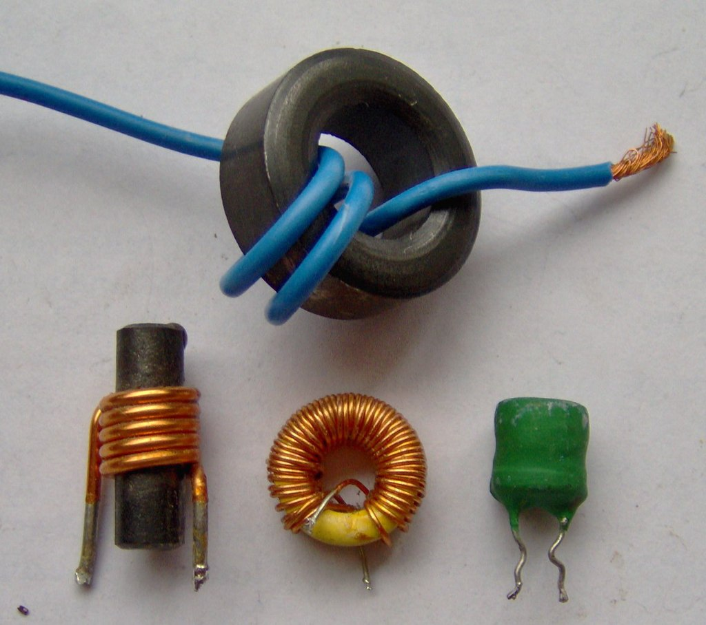

***Figure 8.1 Inductors***

Source: [Wikipedia: Inductor](https://en.wikipedia.org/wiki/Inductor)

The inductance of a coil-type inductor can be calculated using:

$$ L = {{\mu_0 \pi N^2 R^2} \over {l}} $$

where:

- \(\mu_0\) is the permeability in vacuum and have a value of \(\mu_0 = {4 \pi \times 10^{-7} {H \over m}}\)
- \(N\) is the number of loops in the coil
- \(R\) is the radius of the coil
- \(l\) is the length of the coil (not the length of the wire)

Similar to capacitors, the vast majority of inductors use written markings to indicate values, working current, and tolerance. The most usual method of marking ferrite-cored inductors involves quoting the value (in mH or μH), the tolerance (often either 5% or 10%), and the maximum working current (where appropriate). The marking scheme follows a similar convention to that used with small capacitors:

- First line: Inductance (in mH or μH) and tolerance (J=5%, K=10%, M=20%).
- Second line: rated d.c. current (where specified).

A three-digit code is often used to mark small inductors. The first two digits correspond to the first two digits of the value whilst the third digit is a multiplier which gives the number of zeros to be added to give the value in μH.

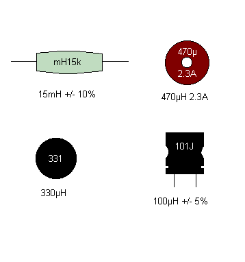

***Figure 8.2 Various Inductor Markings***

Source: [Inductor Markings](https://www.matrixtsl.com/courses/ecc/index.php?n=Inductors.InductorMarkings)

### RL Circuit

A resistor–inductor circuit (RL circuit), RL filter or RL network, is an electric circuit composed of resistors and inductors driven by a voltage or current source. A first-order RL circuit is composed of one resistor and one inductor, either in series driven by a voltage source or in parallel driven by a current source. It is one of the simplest analogue infinite impulse response electronic filters.

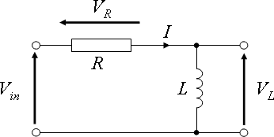

***Figure 8.3 Series RL circuit***

A series RL circuit with an inductor that is initially energized to \(I_0 = {V_in \over R}\) and then allowed to de-energized through a resistor \(R\) will exhibit the following relationship for the current through the inductor over some time:

$$ I_L(t) = I_0 e^{(-{R \over L} t)} $$

where \(I_0\) is the inductor current at \(t = 0\)

The time required for the current to fall to \(I_0 e^{-1}\) or about 37% (roughly 1/3 of \(I_0\)) is called the RL time constant and is given by:

$$ \tau = {L \over R} $$

where \(\tau\) is measured in seconds, \(R\) in ohms and \(L\) in henry.

Since the current through an inductor is often difficult to measure directly, voltage measurements are often used to study the transient response of an RL circuit by using the following relationship:

$$ V_in(t) = V_L(t) + V_R(t) $$

where:

$$ V_L(t) = V_0 e^{(-{R \over L} t)} $$
$$ V_R(t) = V_0 ( 1 - e^{(-{R \over L} t)} ) $$

The chart below shows a typical curve of the voltage across the inductor and resistor during energizing in an RL circuit.

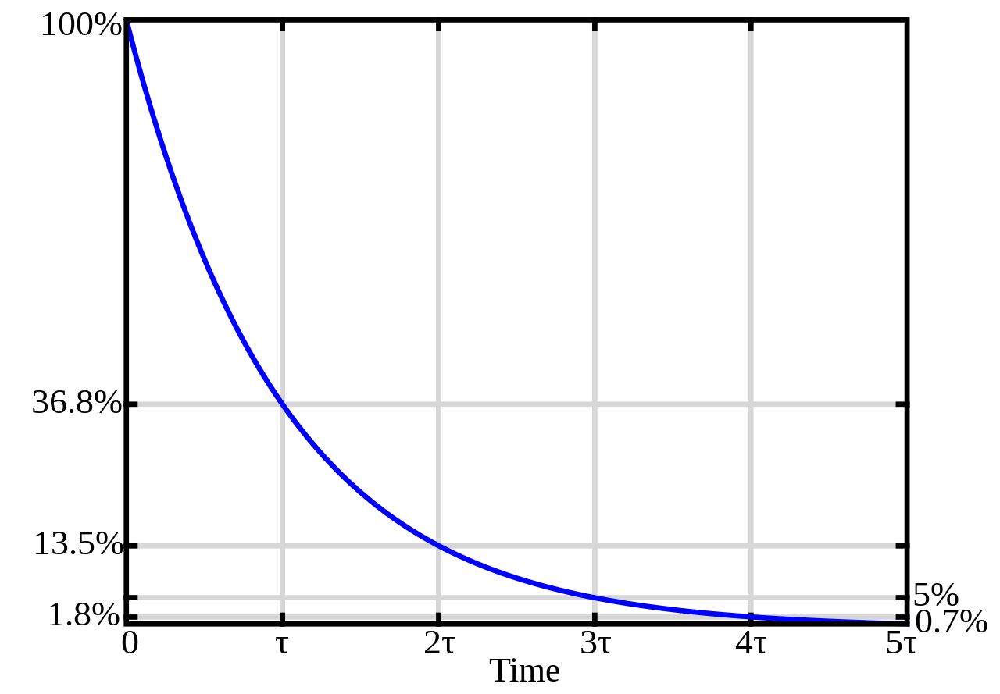

***Figure 8.4 Voltage curve of an inductor during energizing in an RL circuit***

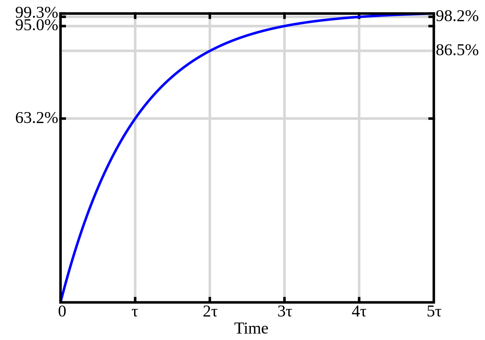

***Figure 8.5 Voltage curve of a resistor during energizing in an RL circuit***

Source: [Wikipedia: RL Circuit](https://en.wikipedia.org/wiki/RL_circuit)

### Low-pass Filters

A low-pass filter is a circuit offering easy passage to low-frequency signals and difficult passage to high-frequency signals. There are two basic kinds of circuits capable of accomplishing this objective, and many variations of each one: The inductive low-pass filter in (Figure 8.6 Left) and the capacitive low-pass filter in (Figure 8.6 Right).

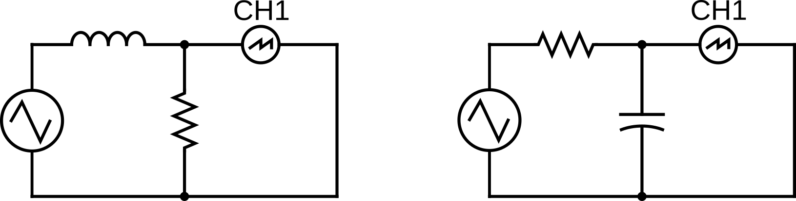

***Figure 8.6 (Left) Inductive Low-Pass Filter, (Right) Capacitive Low-Pass Filter***

In an inductive low-pass filter, the inductor’s impedance increases with increasing frequency. This high impedance in series tends to block high-frequency signals from getting to the load.

In a capacitive low-pass filter, the capacitor’s impedance decreases with increasing frequency. This low impedance tends to short out high-frequency signals, dropping most of the voltage across series resistor R.

All low-pass filters are rated at a certain cutoff frequency. That is the frequency above which the output voltage falls below 70.7% of the input voltage.

The cutoff frequency [Hz] for an inductive low-pass filter is:

$$ f_c = {R \over {2 \pi L}} $$

The cutoff frequency [Hz] for a capacitive low-pass filter is:

$$ f_c = {1 \over {2 \pi R C}} $$

Source: [All About Circuits: Low-pass Filters](https://www.allaboutcircuits.com/textbook/alternating-current/chpt-8/low-pass-filters/)

## Potentiometer

A potentiometer is a three-terminal resistor with a sliding or rotating contact that forms an adjustable voltage divider.[1] If only two terminals are used, one end and the wiper, it acts as a variable resistor or rheostat. The measuring instrument called a potentiometer is essentially a voltage divider used for measuring electric potential (voltage); the component is an implementation of the same principle, hence its name.

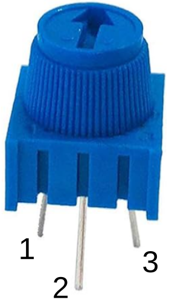 

***Figure 8.7 (Left) Potentiometer with leg indication, (Right) Potentiometer Electronics Symbol***

Source: [Wikipedia: Potentiometer](https://en.wikipedia.org/wiki/Potentiometer)

## Materials
- Safety glasses (PPE)
- [Lab Supplies](supplies.md)
    - Breadboard
    - Jumper Wires
    - (1x) 100Ω Resistor (brown-black-brown)
    - (1x) 330Ω Resistor (orange-orange-brown)
    - (1x) 1kΩ Resistor (brown-black-red)
    - (1x) 4.7kΩ resistor (yellow-violet-red)
    - (1x) 10kΩ resistor (brown-black-orange)
    - (1x) 100μH drum inductor
    - (1x) 10kΩ Potentiometer (Blue Trimpot)

## Preparation

> **Lab Preparation Question:**
>
> 1. Read and summarize the lab as necessary.
> 1. Copy observation tables 1, and 2 of this lab into your notebook.
> 1. Sketch three breadboard diagram, one for each of Figure 8.8, Figure 8.10 and Figure 8.12 onto your notebook.
> 1. Derive a formula to find the inductance of an inductor from the RL response formula.
> 1. If we need to reduce a 200kHz noise to at least 70.7% of it's original value with an RL low-pass filter. Which resistor from our lab material should we if you are using the 100μH inductor?

## Procedures

### Part 1: RL Circuit

In this part of the lab, we will be exploring the transient response (de-energizing and energizing) of an RL circuit. A function generator set to square wave output will act as the closing and opening of the circuit.

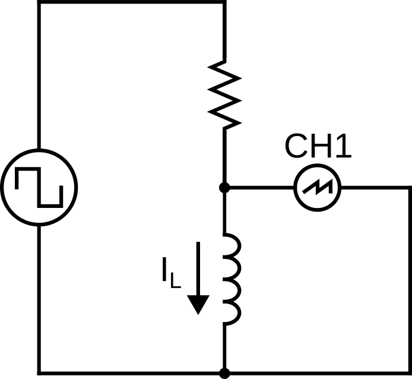

***Figure 8.8***

1. Obtain a 100μH inductor. The inductance of an inductor cannot be easily measured using the DMM we have in the lab. As a result, in addition to observing the RL response, you'll also be estimating the inductance of the inductor.

1. Select a resistor value that will give you an RL time constant, \(\tau = {L \over R}\), of about 1μs. You'll also need a breadboard and a few jumper wires.

    > **Lab Question 1:** Measure the resistance value of your resistor and record it in Table 1. Refer to [Lab 2](lab2.md) if you don't remember how to measure resistance.
    >
    > **Table 1**
    >
    > | | Value |
    > |---|---|
    > | Measured Resistance (R) [Ω] ||
    > | Marked Inductance (L) [H] ||
    > | Theoretical RL Constant (\(\tau = {L \over R}\)) [s] ||
    > | Measured τ [s] ||
    > | Estimated Inductance [H] ||
    > | % Error Inductance ||
    >
    > **Lab Question 2:** Calculate the theoretical RL time constant using the measured resistance value and the marked inductance value.

1. Set up your circuit as per Figure 8.8 with CH1 of the DSO measuring the voltage across the inductor. The transient current through the inductor can only be estimated using the voltage across.

1. Turn on the function generator and set the output to a 3Vpp square wave at 100kHz **with a 3V DC Offset at High-Z output mode**. Leave all other settings as default. Refer to [Lab 6](lab6.md) if you don't remember how to use a function generator.

1. Turn on the DSO and adjust the settings so you'll see a single period of the RL waveform similar to Figure 8.4. Remember, the function generator is simulating the closing and opening of the circuit at 100kHz. You should see something similar to Figure 8.8 below if you setup your circuit properly. If not, verify your connection. Refer to [Lab 6](lab6.md) if you don't remember how to use a function generator.

    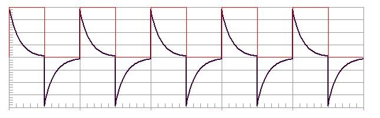

    ***Figure 8.9 Series RL Circuit Voltage Curve: (Red) Voltage Source, (Black) Voltage Across Inductor***

    > **Lab Question 3:** Using the grid line or the measurement tool, find the time it takes for the voltage to drop 67% from the maximum and record it as the measured RL time constant.
    >
    > **Lab Question 4:** Estimate the inductance of the inductor using the equation you derived during the pre-lab. What is the # error between your estimated inductance and the marked inductance by the manufacturer?

### Part 2: RL Low-pass Filters

In this part of the lab, we'll explore a simple filter circuit using a resistor and an inductor called an inductive low-pass filter. You'll be exploring another simple filter circuit called the capacitive low-pass filter as part of the course project. A triangular (saw) wave from a signal generator will be used to simulate noise.

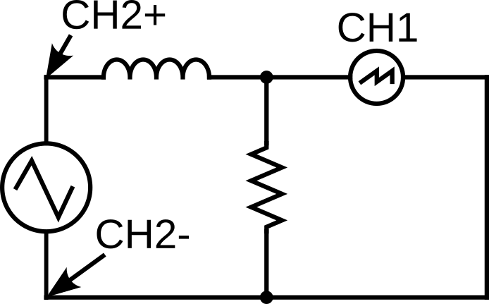

***Figure 8.10***

1. Using the 100μH inductor from Part 1, calculate the cutoff frequency for an inductive low-pass filter for the various resistor values in Table 2.

    > **Lab Question 5:** Calculate the cutoff frequency for an inductive low-pass filter for various resistor values and record it in Table 2.
    >
    > **Table 2**
    >
    > | Resistor Value | Cutoff Frequency |
    > |---|---|
    > | 33Ω ||
    > | 50Ω ||
    > | 100Ω ||

1. Set up your circuit as per Figure 8.10 with CH1 of the DSO measuring the voltage between the inductor and the resistor (the output of the RL low-pass filter) and CH2 connected to the output of the function generator (raw signal). Use a combination of series and parallel resistors from your kit to product the above resistor. Start from the largest resistor.

1. Turn on the function generator and set the output to a 3Vpp triangular (saw with 50% symmetry) wave at 200kHz **with a 3V DC Offset at High-Z output mode**. Leave all other settings as default. Refer to [Lab 6](lab6.md) if you don't remember how to use a function generator. This will simulate a signal at 3V with noise at 200kHz.

1. Turn on the output of the function generator and observe the difference between the raw signal (3VDC 200kHz signal) and the filtered signal. You should see something (but not exactly) in Figure 8.11 with the centre at 3V instead of 0V.

    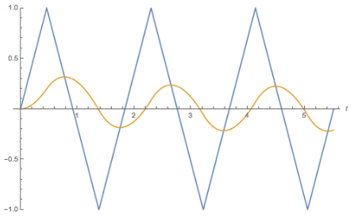

    ***Figure 8.11 (Blue Line) Raw signal, (Orange Line) Filtered signal***

1. Take a photo or make a sketch of your observation then repeat for all the resistor values.

    > **Lab Question 6:** At which resistor value do you start to see significant improvement in filtering out (smoothing off) the 200kHz noise? What is the cutoff frequency?

### Part 3: RL Low-pass Filters using Potentiometer

Lastly, we are going to using a potentiometer so we can fine adjust the RL filter parameter.

1. Set up your circuit using a 1kΩ resistor, a 10kΩ Potentiometer as per Figure 8.12 with CH1 and CH2 of the DSO measuring the voltage between the inductor and the resistor (the output of the RL low-pass filter) and CH2 connected to the output of the function generator (raw signal).

    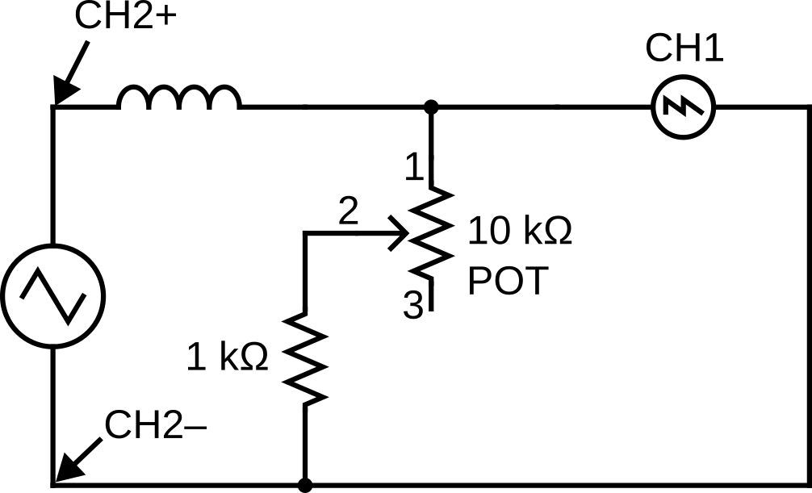

    ***Figure 8.12***

1. Turn the potentiometer to see the filtering effect at various resistance value.

1. DO NOT DISASSEMBLE YOUR CIRCUIT UNTIL YOUR LAB HAS BENN MARKED BY THE INSTRUCTOR.

Once you've completed all the above steps, ask the lab professor or instructor over and demostrate that you've completed the lab and written down all your observations. You might be asked to explain some of the concepts you've learned in this lab.