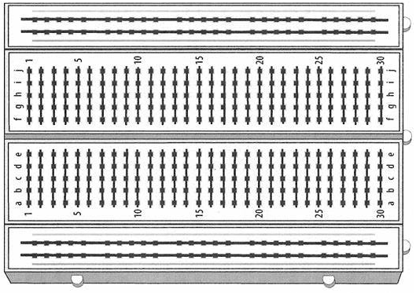
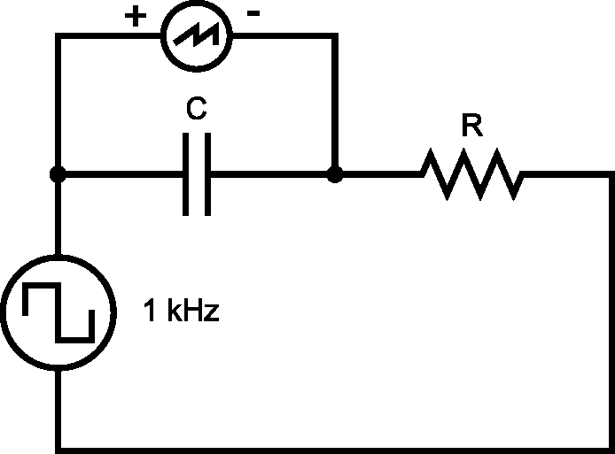
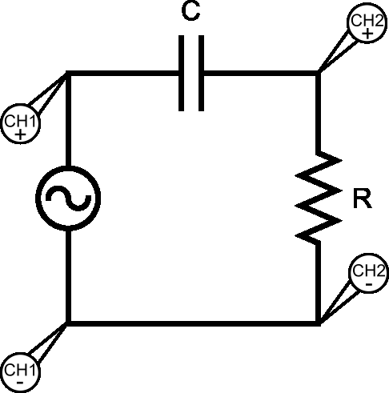

# Lab 9 : RC in DC and AC Circuits

Seneca College 
SES250 Electromagnatics

## Objectives
- To observe the charging and discharging of a capacitor in an RC circuit
- To learn how to measure the frequency and the period of a periodic signal using an oscilloscope
- To observe the phase shift of an RC circuit in AC

## Purpose
- Generate an impulse signal to an RC circuit
- Measure the rise time (or time constant) of an RC circuit using a Digital Storage Oscilloscope (DSO)
- Measure the phase shift of an RC circuit using a DSO

## Description

### Capacitor

### Alternating Current

Alternating current (AC) is an electric current which periodically reverses direction and changes its magnitude continuously with time, in contrast to direct current (DC), which flows only in one direction.

The usual waveform of alternating current in most electric power circuits is a sine wave, whose positive half-period corresponds with the positive direction of the current and vice versa (the full period is called a cycle). In certain applications, different waveforms are used, such as triangular waves or square waves.

***Figure 9.4 Various AC Waveforms. From Left to Right and Top to Bottom: Sine, Square, Sawtooth or Ramp, Triangular***

Source: [Wikipedia: Alternating current](https://en.wikipedia.org/wiki/Alternating_current)

Source: [Circuit Digest: AC Circuit Theory (Part 2)](https://circuitdigest.com/tutorial/ac-circuit-theory-2-waveforms-and-their-properties)

A Capacitive Circuit that consists of R and C in series exhibits a timing difference between the peak amplitude of the current and voltage. This timing difference is called Phase Shift. As the Capacitor opposes a change in Voltage and stores energy from the Power Supply in the form of an Electric Field, the Capacitor Voltage vC lags the Capacitor Current iC by 90° and lags the Power Supply Voltage v by a Phase Angle Φ.

This phase shift between voltage and current can be calculated by:

$$ \Phi = tan^{-1} {\left({-1} \over {2 \pi fRC}\right)} $$

where \(f\) is AC frequency in Hz, \(R\) in ohms and \(C\) in farads.

***Figure 9.5 V-I Relationship of the Circuits RC***

Source: [CMM: Phase Shift](https://www.cmm.gov.mo/eng/exhibition/secondfloor/moreinfo/2_4_4_PhaseShift.html)

<!-- ### Root Mean Square (RMS)

For alternating electric current, RMS is equal to the value of the constant direct current that would produce the same power dissipation in a resistive load.

Electrical engineers often need to know the power, P, dissipated by electrical resistance, R. It is easy to do the calculation when there is a constant current, I, through the resistance. However, if the current is a time-varying function, I(t), this formula must be extended to reflect the fact that the current (and thus the instantaneous power) is varying over time. If the function is periodic (such as household AC power), it is still meaningful to discuss the average power dissipated over time.

When measuring AC using a DMM, often time, you are not measuring the maximum amplitude of the current and voltage but \(1 \over \sqrt{2}\) of the amplitude. This is the root-mean-square (rms) value of a sine waveform: \(V_{rms}\) and \(I_{rms}\).

$$ V_{rms} = {V_0 \over \sqrt{2}} $$
$$ I_{rms} = {I_0 \over \sqrt{2}} $$ -->

## Materials
- Resistors: 10kΩ or similar value resistor
- Capacitors: 10nF or similar value capacitor
- Breadboard
- Jumper wires

## Preparation

> **Lab Preparation Question:**
>
> 1. Using a resistor value of 10kΩ and a capacitor value of 10nF, find the RC time constant.
>
> 1. Sketch the breadboard below onto your notebook then draw how the components will be connected to the breadboard according to the circuit shown in Figures 9.6 and 9.7. Clearly show which tie point will the wire, resistor, capacitor, function generator and oscilloscope channel(s) be attached to.
>
    >    
>
> 1. Using a resistor value of 10kΩ and a capacitor value of 10nF, find the theoretical phase shift between voltage and current for an RC circuit in a 1kHz AC signal. Repeat the calculation for a 500Hz AC signal.
>
> 1. Copy the observation tables found in this lab into your notebook.

## Procedures

### Part 1 : RC Circuit in DC

To observe the transient response of an RC circuit, the circuit will be driven with a periodic square wave to simulate the opening and closing of a switch. The period of the square wave should be much longer than the time constant, \(\tau = RC\), of the circuit to allow the circuit to reach a steady state.

1. Acquire a 10kΩ or similar value resistor, a 10nF or similar value capacitor, a breadboard, and some jumper wires.

    > **Lab Question 1:** Measure the resistance and capacitance of the resistor and capacitor respectively and write down the values in Table 1.
    >
    > **Lab Question 2:** Calculate the time constant \(\tau = RC\) of the RC circuit and write down the values in Table 1. The time constant should be around 0.1ms.
    >
    >   **Table 1:**
    >
    >   |Measured Resistance|Measured Capacitance|Calculated \(\tau = RC\)|Measured \(\tau\)|
    >   |---|---|---|---|
    >   |||||

1. Assemble the circuit shown below then measure the current through the load resistor.

    **REMEMBER:** Refer to [Lab 4](lab4.md) for circuit component symbols.
    
    

    ***Figure 9.6***

1. Set the function generator to a 1kHz (or 500Hz if the capacitor doesn't fully discharge) square wave and 3Vpp as the amplitude with no offset.

    **REMEMBER:** The output should be set to High-Z.

1. Check your circuit to ensure there is no short circuit then turn on the function generator.
1. A RC response curve should show up on the DSO. Adjust the time and voltage division (using the adjustment knobs) as well as the position of the signal so one discharge period (similar to Figure 9.3 above) can be seen on the DSO.
1. Use the measurement tool, cursor on the oscilloscope, or the division lines, to estimate the time it takes for the voltage across the capacitor to drop ~63%.

    > **Lab Question 3:** Does it agree with the time constant you calculated earlier?
    >
    > **Lab Question 4: (During-Lab)** Demostrate to the lab professor or instructor your RC response observation on the display of the oscilloscope.

1. Keep the RC circuit intact for Part 2 of this lab.

### Part 2 : RC Circuit in AC

The next part of this lab is to observe the AC response of an RC Circuit and the relationship between the voltage \(V(t)\) and the current \(I(t)\) using an oscilloscope. Since we cannot measure \(I(t)\) directly using an oscilloscope, we'll be measuring the voltage of the resistor \(V_R(t)\) since the current and voltage is always in phase at the resistor.

1. Using a 10kΩ or similar value resistor and 10nF or similar capacitor, assemble the circuit shown below if it's not assembled already.

    

    ***Figure 9.7***

1. Ensure that the function generator’s output is off then set the output of the function generator to high Z (Channel > Load Z > High Z).
1. This time, set the output waveform to be a sine wave then set the output amplitude to 6 Vpp and the frequency to 1.00 kHz. Leave offset voltage and phase at 0.
1. Turn on the oscilloscope then connect CH1 and CH2 to the circuit per the circuit diagram.

    **NOTE:** The ground (black cable) for both CH1 and CH2 is connected to the negative (black) node of the function generator.

1. Turn on the function generator output and observe the relationship between CH1 and CH2. Adjust the voltage and time division as necessary.

1. From the two signals that you see, find a peak from CH1 (measuring \(V(t)\)) and the closest peak from CH2 (measuring \(V_R(t) = I(t)\)).

    > **Lab Question 5:** Which signal is leading? Does it agree with the observation you expect from an RC circuit?
    >
    > **Lab Question 6:** Find the time difference between the two signals. You may use the horizontal position knob to move one of the signals to the centre for easier measurement. Afterward, convert this time difference you found to the phase angle difference by using the formula below. Does it agree with the phase angle difference you calculated in your pre-lab? Write your result in Table 2.
    >
    > $$ \Phi = 2 \pi {\Delta t \over T} $$
    >
    > **NOTE:** The time difference might be in ms and the phase angle difference might be in RAD depending on your setting.
    >
    >   **Table 2:**
    >
    >   ||Measured Resistance|Measured Capacitance|Measured Time Diff|Measured Phase Shift|
    >   |---|---|---|---|---|
    >   |1 kHz|||||
    >   |500 Hz|||||

1. Replace Steps 5 to 9 for a frequency of 500 Hz.

Once you've completed all the above steps, ask the lab professor or instructor over and demostrate you've completed the lab and written down all your observation. You might be asked to explain some of the concepts you've learned in this lab.

## Post-Lab

1. Using the skills and knowledge acquired from this lab, answer the post-lab question(s) on blackboard. Due one week after the lab.