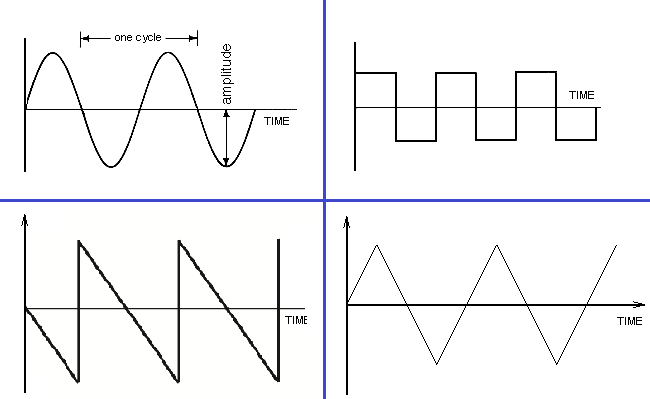
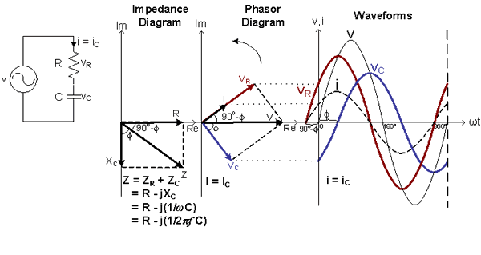
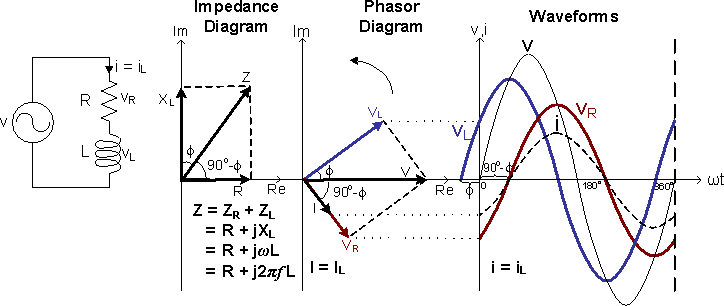
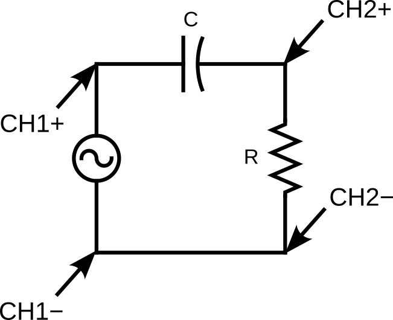
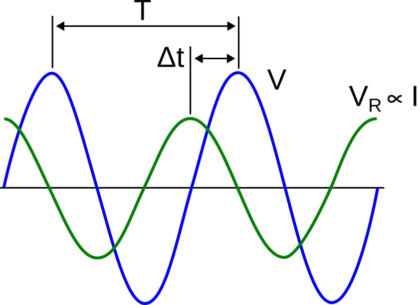
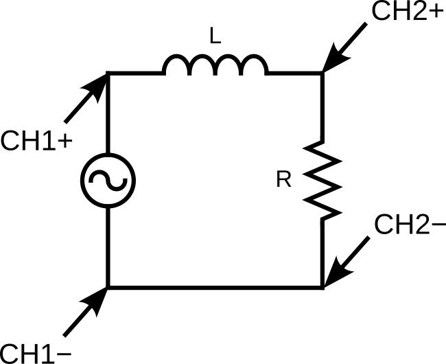

# Lab 9 : RC and RL Circuit in AC

Seneca Polytechnic 
SES250 Electromagnatics

## Purposes
- To understand the concept of frequency and period of an alternating current
- To observe the phase shift of an RC and RL circuit in AC

## Objectives
- Assemble electronic components onto a breadboard
- Setup function generator to output AC sine wave
- Measure the frequency and the period of a periodic signal using a Digital Storage Oscilloscope (DSO)
- Measure the phase shift of an RC and RL circuit using a DSO

## Description

### Alternating Current

Alternating current (AC) is an electric current which periodically reverses direction and changes its magnitude continuously with time, in contrast to direct current (DC), which flows only in one direction.

The usual waveform of alternating current in most electric power circuits is a sine wave, whose positive half-period corresponds with the positive direction of the current and vice versa (the full period is called a cycle). In certain applications, different waveforms are used, such as triangular waves or square waves.

***Figure 9.1 Various AC Waveforms. From Left to Right and Top to Bottom: Sine, Square, Sawtooth or Ramp, Triangular***

Source: [Wikipedia: Alternating current](https://en.wikipedia.org/wiki/Alternating_current)

Source: [Circuit Digest: AC Circuit Theory (Part 2)](https://circuitdigest.com/tutorial/ac-circuit-theory-2-waveforms-and-their-properties)

### Root Mean Square (RMS)

For alternating electric current, RMS is equal to the value of the constant direct current that would produce the same power dissipation in a resistive load.

Electrical engineers often need to know the power, P, dissipated by electrical resistance, R. It is easy to do the calculation when there is a constant current, I, through the resistance. However, if the current is a time-varying function, I(t), this formula must be extended to reflect the fact that the current (and thus the instantaneous power) is varying over time. If the function is periodic (such as household AC power), it is still meaningful to discuss the average power dissipated over time.

When measuring AC using a DMM, oftentimes, you are not measuring the maximum amplitude of the current and voltage but \(1 \over \sqrt{2}\) of the amplitude. This is the root-mean-square (rms) value of a sine waveform: \(V_{rms}\) and \(I_{rms}\).

$$ V_{rms} = {V_0 \over \sqrt{2}} $$
$$ I_{rms} = {I_0 \over \sqrt{2}} $$

***Figure 9.2 AC Waveforms showing the difference between \(V_{rms}\), \(V_{pk} = V_0\), and \(V_{pp}\)***

Source: [Circuit Digest: RMS Voltage](https://circuitdigest.com/tutorial/ac-circuit-theory-2-waveforms-and-their-properties)

**Note:** Keep in mind that \(V_{rms}\) calculation uses \(V_{0}\), not \(V_{pp}\).

### RC Circuit Phase Shift

A Capacitive Circuit that consists of R and C in series exhibits a timing difference between the peak amplitude of the current and voltage. This timing difference is called Phase Shift. As the Capacitor opposes a change in Voltage and stores energy from the Power Supply in the form of an Electric Field, the Capacitor Voltage \(V_{C}\) lags the Capacitor Current \(I_{C}\) by 90° and lags the Power Supply Voltage V by a Phase Angle \(\phi\).

This phase shift [RAD] between voltage and current can be calculated by:

$$ \phi = tan^{-1} {\left({-1} \over {2 \pi fRC}\right)} $$

where \(f\) is AC frequency in Hz, \(R\) in Ohms and \(C\) in Farads.

***Figure 9.3 V-I Relationship of the Series RC Circuit***

### RL Circuit Phase Shift

An Inductive Circuit that consists of R and L in series. As the Inductor opposes a change in Current and stores energy from the Power Supply in the form of a Magnetic Field, the Inductor Voltage \(V_{L}\) leads the Inductor Current \(I_{L}\) by 90° and leads the Power Supply Voltage V by a Phase Angle \(\phi\).

This phase shift [RAD] between voltage and current can be calculated by:

$$ \phi = tan^{-1} {\left({2 \pi fL} \over {R}\right)} $$

where \(f\) is AC frequency in Hz, \(R\) in Ohms and \(L\) in Henry.

***Figure 9.4 V-I Relationship of the Series RL Circuit***

Source: [CMM: Phase Shift](https://www.cmm.gov.mo/eng/exhibition/secondfloor/moreinfo/2_4_4_PhaseShift.html)

### Reference
- [Series RC Circuit Impedance Calculator](https://www.translatorscafe.com/unit-converter/en-US/calculator/series-rc-impedance/)
- [Series RL Circuit Impedance Calculator](https://www.translatorscafe.com/unit-converter/en-US/calculator/series-rl-impedance/)

## Materials
- Safety glasses (PPE)
- [Lab Supplies](supplies.md)
    - Breadboard
    - Jumper Wires
    - (1x) 100Ω Resistor (brown-black-brown)
    - (1x) 330Ω Resistor (orange-orange-brown)
    - (1x) 1kΩ resistor (brown-black-red)
    - (1x) 10kΩ resistor (brown-black-orange)
    - (1x) 100nF Ceramic Capacitor
    - (1x) 100μH drum inductor

## Preparation

> **Lab Preparation Question:**
>
> 1. Read and summarize the lab as necessary.
> 1. Copy observation Tables 1, and 2 of this lab into your notebook.
> 1. Sketch a breadboard diagram of Figure 9.5 and Figure 9.7 onto your notebook.
> 1. Calculate the \(V_{rms}\) for a \(3 V_{pp}\) (Not \(V_{0}\)) sine signal.
> 1. Calculate the phase difference [°] between voltage and current of an RC series circuit with a the following:
>
    > - 10kΩ resistors and 100nF capacitor at 1kHz
    > - 1kΩ resistors and 100nF capacitor at 1kHz
    > - 1kΩ resistors and 100nF capacitor at 500Hz
    > - 10kΩ resistors and 100nF capacitor at 500Hz
    >
    > Show all calculations and fill them into the Theoretical Phase Shift column of Table 1.
>
> 1. Calculate the phase difference [°] between the voltage and current of an RL series circuit with a 100Ω, 330Ω resistors, 100μH inductor, and at 100kHz and 200kHz. Show all calculations and fill them into the Theoretical Phase Shift column of Table 2.
>
    > - 100Ω resistors and 100μH inductor at 100kHz
    > - 330Ω resistors and 100μH inductor at 100kHz
    > - 330Ω resistors and 100μH inductor at 200kHz
    > - 100Ω resistors and 100μH inductor at 200kHz
    >
    > Show all calculations and fill them into the Theoretical Phase Shift column of Table 2.

## Procedures

### Part 1 : AC Waveform and RMS Voltage

This part of the lab is to re-familiarize with generating a waveform using a function generator and AC measurement using an oscilloscope and a digital multimeter (DMM). Refer to [Lab 6](lab6.md) if you don't remember how to use a function generator.

1. Turn on the function generator, the DMM, and the oscilloscope.
1. Ensure the function generator output is off. Set the function generator to **High-Z output mode** then set it to a 1kHz sine wave with 3Vpp as the amplitude. Leave DC offset and phase shift to zero (0).
1. Connect the output of the function generator to CH1 of the oscilloscope. The red alligator clip of the function generator output should connect to the red alligator clip of the oscilloscope input and the same for the black alligator clip.
1. Connect the DMM to the output of the function generator while keeping the oscilloscope connected. All three red clips connected togehter then three black connected together or use breadboard and jumper wires.
1. Adjust the DSO so that about two periods are showing on the display. Make note of the TIME/DIV and VOLT/DIV and verify if align with the setting you provided to the function generator.
1. Set up the DMM to measure in AC voltage mode (VAC).

    > **Lab Question 1:** Does the reading from the DMM agree with the setting from the function generator and the DSO?
    >
    > **Lab Question 2:** Your DMM should give you a reading that is not 3V, why do you think that is the case?

1. Turn off the output from the function generator.

### Part 2 : RC Circuit in AC

The next part of this lab is to observe the AC response of an RC Circuit and the relationship between the voltage \(V(t)\) and the current \(I(t)\) using an oscilloscope. Since we cannot measure \(I(t)\) directly using an oscilloscope, we'll be measuring the voltage across the resistor \(V_R(t)\) since the current and voltage are always in phase at the resistor.

***Figure 9.5***

1. Set up the circuit in Figure 9.7 using a 10kΩ resistor and a 100nF ceramic capacitor.
    

    
<strong>DO NOT USE A POLARIZED CAPACITOR!</strong>

    

1. Ensure that the function generator’s output is off then set the output of the function generator to **High-Z**.
1. Set the output waveform to be a sine wave then set the output amplitude to 3 Vpp and the frequency to 1.00 kHz. Leave offset voltage and phase at 0.
1. Turn on the oscilloscope then connect CH1 and CH2 to the circuit per the circuit diagram.

    **NOTE:** The ground (black cable) for both CH1 and CH2 is connected to the negative (black) node of the function generator.

1. Turn on the function generator output and observe the relationship between CH1 and CH2. Adjust the voltage and time division to see about two periods on the display.

1. You should see two waveforms ressembling \(V\) and \(V_R\) in Figure 9.3. From the two signals that you see, find a peak from CH1 (measuring \(V(t)\)) and the closest peak from CH2 (measuring \(V_R(t) = I(t)\)). CH2 (\(I(t)\)) should be leading CH1 (\(V(t)\)).

    > **Lab Question 3:** Which signal is leading? Does it agree with what you expect from a series RC circuit?
    >
    > **Lab Question 4:** Find the time difference between the two signals. You may use the horizontal position knob to move one of the signals to the centre for easier measurement. Afterward, convert this time difference you found to the phase angle difference by using the formula below. Does it agree with the phase angle difference you calculated in your pre-lab? Write your result in Table 2.
    >
    > $$ \phi = 2 \pi {\Delta t \over T} \text{ or } \phi = 360° {\Delta t \over T} $$
    >
    > where \(\Delta t\) is the time difference and \(T\) is the period.
    >
    > **NOTE:** \(I(t)\) leading means the time difference is a negative time. Also, the time difference might be in [ms] and the phase angle difference might be in [RAD] depending on your setting.
    >
    >   **Table 1:**
    >
    >   |Freq|R|C|Theoretical Phase Shift [°]|Time Diff|Phase Shift [°]|
    >   |---|---|---|---|---|---|
    >   |1 kHz|10 kΩ|100 nF|||
    >   |1 kHz|1 kΩ|100 nF|||
    >   |500 Hz|1 kΩ|100 nF|||
    >   |500 Hz|10 kΩ|100 nF|||

***Figure 9.6***

1. Repeat the measurement with various resistor values and frequencies to complete Table 1 to understand their relationships.

### Part 3 : RL Circuit in AC

The next part of this lab is to observe the AC response of an RL Circuit and the relationship between the voltage \(V(t)\) and the current \(I(t)\) using an oscilloscope. Since we cannot measure \(I(t)\) directly using an oscilloscope, we'll be measuring the voltage across the resistor \(V_R(t)\) since the current and voltage are always in phase at the resistor.

***Figure 9.7***

1. Set up the circuit in Figure 9.6 using a 100 Ω resistor and 100 μH.
1. Ensure that the function generator’s output is off then set the output of the function generator to **High-Z**.
1. Set the output waveform to be a sine wave then set the output amplitude to 3 Vpp and the frequency to 100 kHz. Leave offset voltage and phase at 0.
1. Turn on the oscilloscope then connect CH1 and CH2 to the circuit per the circuit diagram.

    **NOTE:** The ground (black cable) for both CH1 and CH2 is connected to the negative (black) node of the function generator.

1. Turn on the function generator output and observe the relationship between CH1 and CH2. Adjust the voltage and time division to see about two periods on the display.

1. You should see two waveforms ressembling \(V\) and \(V_R\) in Figure 9.4. From the two signals that you see, find a peak from CH1 (measuring \(V(t)\)) and the closest peak from CH2 (measuring \(V_R(t) = I(t)\)). CH2 (\(I(t)\)) should be lagging CH1 (\(V(t)\)).

    > **Lab Question 5:** Which signal is leading? Does it agree with what you expect from a series RL circuit?
    >
    > **Lab Question 6:** Find the time difference between the two signals. You may use the horizontal position knob to move one of the signals to the centre for easier measurement. Afterward, convert this time difference you found to the phase angle difference by using the formula below. Does it agree with the phase angle difference you calculated in your pre-lab? Write your result in Table 2.
    >
    > $$ \phi = 2 \pi {\Delta t \over T} \text{ or } \phi = 360° {\Delta t \over T} $$
    >
    > **NOTE:** \(I(t)\) lagging means the time difference is a positive time. Also, the time difference might be in [ms] and the phase angle difference might be in [RAD] depending on your setting.
    >
    >   **Table 2:**
    >
    >   |Freq|R|L|Theoretical Phase Shift [°]|Time Diff|Phase Shift [°]|
    >   |---|---|---|---|---|---|
    >   |100 kHz|100 Ω|100 μH|||
    >   |100 kHz|330 Ω|100 μH|||
    >   |200 kHz|330 Ω|100 μH|||
    >   |200 kHz|100 Ω|100 μH|||

1. Repeat the measurement with various resistor values and frequencies to complete Table 2 to understand their relationships.

Once you've completed all the above steps, ask the lab professor or instructor over and demostrate that you've completed the lab and written down all your observations. You might be asked to explain some of the concepts you've learned in this lab.