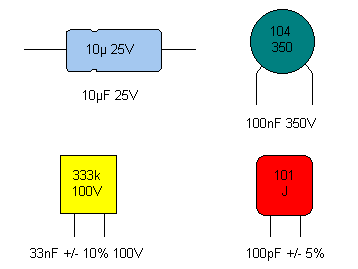

# Lab 9 : RC in DC and AC Circuits

Seneca College 
SES250 Electromagnatics

## Objectives
- To observe the charging and discharging of a capacitor in an RC circuit
- To learn how to measure the frequency and the period of a periodic signal using an oscilloscope
- To observe the phase shift of a R-C and a R-L circuit in AC

## Purpose
- Generate an inpulse signal to a RC circuit
- Measure the raise time (or time constant) of an RC circuit using a Digital Storage Oscilloscope (DSO)
- Measure the phase shift of an RC and RL circuit using a DSO

## Description

### Capacitor

Similar to a Resistor, Capacitor use special marking to indicate their values. Since the amount of area for markings on a capacitor is limited, there are also a set of rules for specifying the capacitance value of a capacitor. Manufacturers often use two separate lines for their capacitor markings and these have the following meanings:
- First line: capacitance (in pF or μF) [and tolerance (J=5%, K=10%, M=20%)]
- Second line: rated DC voltage [and code for the dielectric material]

For a ceramic capacitor, often only a three-digit code is given. The first two digits correspond to the first two digits of the value whilst the third digit is a multiplier which gives the number of zeros to be added to give the value in pF. For example, 104 means 10 x 104 pF = 100nF.

Furthermore, some capacitors such as electrolytic capacitors are marked with symbols (“+” and “-”) to indicate the correct polarity - failure to observe these markings when connecting a capacitor to a circuit can be catastrophic!

***Figure 9.1 Various Capacitor Markings***

Source: [Capacitor Markings](https://www.matrixtsl.com/courses/ecc/index.php?n=Capacitors.CapacitorMarkings)

### RC circuit

A resistor-capacitor circuit (RC circuit), or RC filter or RC network, is an electric circuit composed of resistors and capacitors. It may be driven by a voltage or current source and these will produce different responses. A first order RC circuit is composed of one resistor and one capacitor and is the simplest type of RC circuit.

***Figure 9.2 Series RC circuit***

A series RC circuit with a capacitor that is initially charged to \(V_0 = {Q_0 \over C}\) then allowed to discharge through a resistor \(R\) will exhibit the following relationship for the voltage across the capacitor over a period of time:

$$ V_C(t) = V_0 e^{(-{t \over {RC}})} $$

where \(V_0\) is the capacitor voltage at \(t = 0\)

The time required for the voltage to fall to \(V_0 \over e\) or about 37% or 1/3 of \(V_0\) is called the RC time constant and is given by:

$$ \tau = RC $$

where \(\tau\) is measured in seconds, \(R\) in ohms and \(C\) in farads.

The chart below shows a typical curve of the voltage across the capacitor during discharge in a RC circuit.

***Figure 9.3 Voltage curve of a capacitor during discharge in a RC circuit***

Source: [Wikipedia: RC Circuit](https://en.wikipedia.org/wiki/RC_circuit)

## Materials
- Resistors: 10kΩ or similar value resistor
- Capacitors: 10nF or similar value capacitor
- Breadboard
- Jumper wires

## Preparation

> **Lab Preparation Question:**

## Procedures

### Part 1 : RC Circuit in DC

To observe the transient response of an RC circuit, the circuit will be driven with a periodic square wave to simulate the opening and closing of a switch. The period of the square wave should be much longer than the time constant, \(\tau = RC\), of the circuit to allow the circuit to reach steady state.

1. Acquire a 10kΩ or similar value resistor, a 10nF or similar value capacitor, a breadboard, and some jumper wires.

    > **Lab Question 1:** Measure the resistance and capacitance of the resistor and capacitor respectively and write down the values in Table 1.
    
    > **Lab Question 2:** Calculate the time constant \(\tau = RC\) of the RC circuit and write down the values in Table 1. The time constant should be around 0.1ms.

>   **Table 1:**
>
>   |Measued Resistance|Measued Capacitance|Calculated \(\tau = RC\)|Measured \(\tau\)|
>   |---|---|---|---|
>   |||||
>   |||||

1. Assemble the circuit shown below then measure the current through the load resistor.

    **REMEMBER:** Refer to [Lab 4](lab4.md) for circuit component symbols.
    
    

    ***Figure 9.4***

1. Set the function generator to a 1kHz (or 500Hz if the capacitor doesn't fully discharge) square wave and 3Vpp as the amplitude with no offset.

    **REMEMBER:** The output should be set to High-Z.

1. Check your circuit to ensure there is no short circuit then turn on the function generator.
1. A RC response curve should show up on the DSO. Adjust the time and voltage division (using the adjustment knobs) as well as the position of the signal so one discharge period (similar to the Figure 9.3 above) can be seen on the DSO.
1. Use the measurement tool, cursor on the oscilloscope, or the division lines, to estimate the time it takes for the voltage across the capacitor to drop ~63%.

    > **Lab Question 3:** Does it agree with the time constant you calculated earlier?

    > **Lab Question 4: (During-Lab)** Demostrate to the lab professor or instructor that you observed RC response on the display of the oscilloscope.

1. Keep the RC circuit intact for Part 2 of this lab.

Once you've completed all the above steps, ask the lab professor or instructor over and demostrate you've completed the lab and written down all your observation. You might be asked to explain some of the concepts you've learned in this lab.

## Post-Lab

1. Using the skills and knowledge acquired from this lab, answer the post-lab question(s) on blackboard. Due one week after the lab.