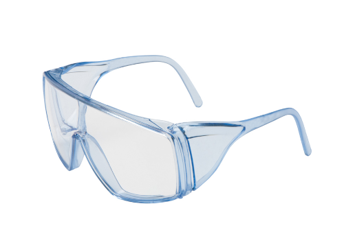

# Lab Supplies

Seneca College 
SES250 Electromagnatics

You are not required to purchase the lab items from the store/supplier suggested here. You may purchase them from anywhere of your choice as long as they meet the lab requirement.

## Mandatory Items for SE250 Labs

1. Safety Glasses

    

    The safety glasses must have side shields and a top shield. ([CCOHS Reference](https://www.ccohs.ca/oshanswers/prevention/ppe/glasses.html))

    **Where to Buy:** A similar version can be purchased from the Seneca Campus Store: [Temp Lite Series Clear Safety Glasses](https://www.bkstr.com/senecacollegestore/product/temp-lite-series-clear-safety-glasses-615167-1).

1. Bound Lab Notebook

    | Bound Notebook | Ring Notebook |
    | --- | --- |
    |  |  |

    **Where to Buy:** A similar version can be purchased from the Seneca Campus Store: [Lab Notes 200 Pages](https://www.bkstr.com/senecacollegestore/product/lab-notes-200-pages-110015-1).

## Optional Items for SES250 Labs

The optional lab items are highly recommended but not mandatory for this course. They are common in the field of Electronics / Electrical Engineering are some of them will be used in future classes.

Also included on the list are some of the places you can purchase the items. They can also be purchased from other major online retailers but links will not be provided as their product listing is very dynamic.

| Item | [Canada Robotix](https://www.canadarobotix.com/) | [Creatron](https://www.creatroninc.com/) | [Sayal](https://sayal.com/) |
| --- | --- | --- | --- |
| (1x) Full-size Breadboard | [Breadboard](https://www.canadarobotix.com/products/160) | [Breadboard](https://www.creatroninc.com/product/full-size-breadboard-white/) | [Breadboard with Jumper Wire](https://secure.sayal.com/STORE4/prodetails.php?SKU=162075) |
| (20x) Jumper Wires | [Jumper Wire Kit](https://www.canadarobotix.com/products/158) | [Jumper Wire Kit](https://www.creatroninc.com/product/22awg-hookup-wire-box-140pcs/) | [Breadboard with Jumper Wire](https://secure.sayal.com/STORE4/prodetails.php?SKU=162075) |
| (5x) 100Ω 1/4W 5% Resistor | [5 pcs](https://www.canadarobotix.com/products/2677)| | |
| (5x) 330Ω 1/4W 5% Resistor | [5 pcs](https://www.canadarobotix.com/products/707) | | |
| (5x) 1kΩ 1/4W 5% Resistor | [5 pcs](https://www.canadarobotix.com/products/708) | | |
| (5x) 4.7kΩ 1/4W 5% Resistor | | | |
| (5x) 10kΩ 1/4W 5% Resistor | [5 pcs](https://www.canadarobotix.com/products/918) | | |
| (2x) 100nF 50V 20% Ceramic Capacitor | [2 pcs](https://www.canadarobotix.com/products/905) | | |
| (2x) 10μF 50V 20% Electrolytic Capacitor | [2 pcs](https://www.canadarobotix.com/products/960) | | |
| (2x) 100μF 50C 20% Electrolytic Capacitor | [2 pcs](https://www.canadarobotix.com/products/1087) | | |